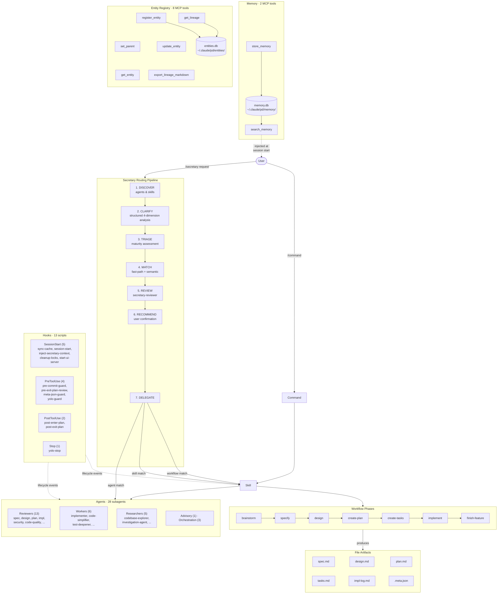

# Developer Guide

This repo uses a git-flow branching model with automated releases via conventional commits.

## Branch Structure

| Branch | Purpose |
|--------|---------|
| `main` | Stable releases only (tagged versions) |
| `develop` | Integration branch (default for development) |
| `feature/*` | Feature branches (created by pd workflow) |

## Single-Plugin Model

One plugin, branch-based separation:

| Branch | Purpose | Version Format |
|--------|---------|----------------|
| `develop` | Active development (dogfood) | X.Y.Z-dev |
| `main` | Stable releases | X.Y.Z |

All plugin code lives in `plugins/pd/`. Development happens on `develop`, releases merge to `main` with a version tag.

## Development Workflow

1. Create feature branch from `develop`
2. Use conventional commits (`feat:`, `fix:`, `BREAKING CHANGE:`)
3. Merge to `develop` via `/pd:finish-feature` or PR
4. Release when ready using the release script

## Version Bump Logic

Version bumps are calculated automatically based on code change volume:

| Change % | Bump | Example |
|----------|------|---------|
| ≤3% | Patch | 1.0.0 → 1.0.1 |
| 3-10% | Minor | 1.0.0 → 1.1.0 |
| >10% | Major | 1.0.0 → 2.0.0 |

The script calculates: `(lines added + lines deleted) / total codebase lines`

## Release Process

### Option 1: GitHub Actions (Recommended)

Trigger from GitHub Actions UI or CLI:

```bash
# Dry run - verify what would happen
gh workflow run release.yml --ref develop -f dry_run=true

# Real release
gh workflow run release.yml --ref develop -f dry_run=false
```

### Option 2: Local Release

From the develop branch with a clean working tree:

```bash
./scripts/release.sh
```

### What the Release Script Does

1. Validate preconditions (on develop, clean tree, has origin)
2. Calculate version from code change percentage since last tag
3. Strip `-dev` suffix from plugin.json and marketplace.json
4. Promote CHANGELOG [Unreleased] entries
5. Commit on develop, push
6. Merge develop → main (no-ff), tag, push
7. Bump develop to next `-dev` version

## Local Development Setup

Clone the repository and install the development plugin:

```bash
git clone https://github.com/clthuang/pedantic-drip.git
cd pedantic-drip
claude
```

In Claude Code:

```
/plugin marketplace add .claude-plugin/marketplace.json
/plugin install pd@my-local-plugins
```

After making changes to plugin files, sync the cache:

```
/pd:sync-cache
```

## For Public Users

To install the released version:

```
/plugin marketplace add clthuang/pedantic-drip
/plugin install pd
```

## Key Files

| File | Purpose |
|------|---------|
| `scripts/release.sh` | Release automation script |
| `.github/workflows/release.yml` | CI release workflow |
| `.claude-plugin/marketplace.json` | Marketplace configuration |
| `plugins/pd/.claude-plugin/plugin.json` | Plugin manifest with version |

---

## Architecture

Commands invoke Skills; Skills spawn Agents; Hooks fire at lifecycle points. The secretary command adds an intelligent routing layer — a 7-step pipeline (DISCOVER → CLARIFY → TRIAGE → MATCH → REVIEW → RECOMMEND → DELEGATE) that discovers available agents and skills, interprets the request, and delegates to the best match.




## Design Principles

| Principle | Meaning |
|-----------|---------|
| **Everything is prompts** | Skills and agents are just instructions Claude follows |
| **Files are truth** | Artifacts persist in files; any session can resume |
| **Humans unblock** | When stuck, Claude asks—never spins endlessly |
| **Composable > Rigid** | Phases work independently; combine as needed |

## Skills

Skills are instructions Claude follows for specific development practices. Located in `plugins/pd/skills/{name}/SKILL.md`.

### Workflow Phases
| Skill | Purpose |
|-------|---------|
| `brainstorming` | Guides 6-stage process producing evidence-backed PRDs with advisory team analysis and structured problem-solving |
| `structured-problem-solving` | Applies SCQA framing and type-specific decomposition to problems during brainstorming |
| `specifying` | Creates precise specifications with acceptance criteria |
| `designing` | Creates design.md with architecture and contracts |
| `decomposing` | Orchestrates project decomposition pipeline (AI decomposition, review, feature creation) |
| `planning` | Produces plan.md with dependencies and ordering |
| `breaking-down-tasks` | Breaks plans into small, actionable tasks with dependency tracking |
| `implementing` | Dispatches per-task implementer agents with selective context loading; produces implementation-log.md |
| `finishing-branch` | Guides branch completion with PR or merge options |

### Quality & Review
| Skill | Purpose |
|-------|---------|
| `promptimize` | Reviews plugin prompts against best practices guidelines and returns scored assessment with improved version |
| `reviewing-artifacts` | Comprehensive quality criteria for PRD, spec, design, plan, and tasks |
| `implementing-with-tdd` | Enforces RED-GREEN-REFACTOR cycle with rationalization prevention |
| `workflow-state` | Defines phase sequence and validates transitions |
| `workflow-transitions` | Shared workflow boilerplate for phase commands (validation, branch check, commit, state update) |

### Investigation
| Skill | Purpose |
|-------|---------|
| `systematic-debugging` | Guides four-phase root cause investigation |
| `root-cause-analysis` | Structured 6-phase process for finding ALL contributing causes |

### Domain Knowledge
| Skill | Purpose |
|-------|---------|
| `game-design` | Game design frameworks, engagement/retention analysis, aesthetic direction, and feasibility evaluation |
| `crypto-analysis` | Crypto/Web3 frameworks for protocol comparison, DeFi taxonomy, tokenomics, trading strategies, MEV classification, market structure, and risk assessment |
| `data-science-analysis` | Data science frameworks for methodology assessment, pitfall analysis, and modeling approach recommendations (brainstorming domain) |
| `writing-ds-python` | Clean DS Python code: anti-patterns, pipeline rules, type hints, testing strategy, dependency management |
| `structuring-ds-projects` | Cookiecutter v2 project layout, notebook conventions, data immutability, the 3-use rule |
| `spotting-ds-analysis-pitfalls` | 15 common statistical pitfalls with diagnostic decision tree and mitigation checklists |
| `choosing-ds-modeling-approach` | Predictive vs causal modeling, method selection flowchart, Rubin/Pearl frameworks, hybrid approaches |

### Specialist Teams
| Skill | Purpose |
|-------|---------|
| `creating-specialist-teams` | Creates ephemeral specialist teams via template injection into generic-worker |

### Maintenance
| Skill | Purpose |
|-------|---------|
| `retrospecting` | Runs data-driven AORTA retrospective using retro-facilitator agent; reads implementation-log.md; validates knowledge bank entries |
| `updating-docs` | Automatically updates documentation using agents |
| `writing-skills` | Applies TDD approach to skill documentation |
| `detecting-kanban` | Detects Vibe-Kanban and provides TodoWrite fallback |
| `capturing-learnings` | Guides model-initiated learning capture with configurable modes |

## Commands

Commands are user-invoked entry points. Located in `plugins/pd/commands/{name}.md`. See [README.md](README.md) for the full list. Notable utility commands:

| Command | Purpose |
|---------|---------|
| `generate-docs` | Generate three-tier documentation scaffold or update existing docs |
| `promptimize` | Review a plugin prompt against best practices and return an improved version |
| `refresh-prompt-guidelines` | Scout latest prompt engineering best practices and update the guidelines document |
| `show-lineage` | Display entity lineage tree for a given entity (ancestors or descendants) |

## Agents

Agents are isolated subprocesses spawned by the workflow. Located in `plugins/pd/agents/{name}.md`.

**Reviewers (13):**
- `brainstorm-reviewer` — Reviews brainstorm artifacts with universal + type-specific criteria before promotion
- `code-quality-reviewer` — Reviews implementation quality after spec compliance is confirmed
- `design-reviewer` — Challenges design assumptions and finds gaps
- `implementation-reviewer` — Validates implementation against full requirements chain (Tasks → Spec → Design → PRD); uses WebSearch + Context7 for external claim verification
- `phase-reviewer` — Validates artifact completeness for next phase transition; receives Domain Reviewer Outcome from upstream reviewer
- `plan-reviewer` — Skeptically reviews plans for failure modes and feasibility
- `prd-reviewer` — Critically reviews PRD drafts for quality and completeness
- `project-decomposition-reviewer` — Validates project decomposition quality (coverage, sizing, dependencies)
- `spec-reviewer` — Reviews spec.md for testability, assumptions, and scope discipline
- `security-reviewer` — Reviews implementation for security vulnerabilities; uses WebSearch + Context7 for external claim verification
- `task-reviewer` — Validates task breakdown quality for immediate executability
- `ds-analysis-reviewer` — Reviews data analysis for statistical pitfalls, methodology issues, and conclusion validity; uses WebSearch + Context7
- `ds-code-reviewer` — Reviews DS Python code for anti-patterns, pipeline quality, and best practices; uses Context7 for API verification

**Workers (6):**
- `implementer` — Implements tasks with TDD and self-review discipline
- `project-decomposer` — Decomposes project PRD into ordered features with dependencies and milestones
- `generic-worker` — General-purpose implementation agent for mixed-domain tasks
- `documentation-writer` — Writes and updates documentation based on research findings
- `code-simplifier` — Identifies unnecessary complexity and suggests simplifications
- `test-deepener` — Systematically deepens test coverage after TDD scaffolding with spec-driven adversarial testing

**Advisory (1):**
- `advisor` — Applies strategic or domain advisory lens to brainstorm problems via template injection

**Researchers (5):**
- `codebase-explorer` — Analyzes codebase to find relevant patterns and constraints
- `documentation-researcher` — Researches documentation state and identifies update needs
- `internet-researcher` — Searches web for best practices, standards, and prior art
- `investigation-agent` — Read-only research agent for context gathering
- `skill-searcher` — Finds relevant existing skills for a given topic

**Orchestration (3):**
- `secretary-reviewer` — Validates secretary routing recommendations before presenting to user
- `rca-investigator` — Finds all root causes through 6-phase systematic investigation
- `retro-facilitator` — Runs data-driven AORTA retrospective with full intermediate context

### Advisory Team Architecture
The brainstorm skill dispatches advisory agents alongside research agents in Stage 2.
Advisors are `.advisor.md` template files in `skills/brainstorming/references/advisors/`.
The secretary classifies problems by archetype (from `references/archetypes.md`) and assembles
an advisory team of 2-5 advisors. Domain advisors reference existing domain skill reference files.
New advisors are added by creating a `.advisor.md` file and listing it in the archetypes inventory.

## Hooks

Hooks execute automatically at lifecycle points.

| Hook | Trigger | Purpose |
|------|---------|---------|
| `sync-cache` | SessionStart (startup\|resume\|clear) | Syncs plugin source to Claude cache |
| `cleanup-locks` | SessionStart (startup\|resume\|clear) | Removes stale lock files |
| `session-start` | SessionStart (startup\|resume\|clear) | Injects active feature context and knowledge bank memory |
| `inject-secretary-context` | SessionStart (startup\|resume\|clear) | Injects available agent/command context for secretary |
| `start-ui-server` | SessionStart (startup\|resume\|clear) | Auto-starts UI server (Kanban board) in background |
| `cleanup-sandbox` | (utility) | Cleans up agent_sandbox/ temporary files |
| `pre-commit-guard` | PreToolUse (Bash) | Branch protection and pd directory protection |
| `meta-json-guard` | PreToolUse (Write\|Edit) | Protects .meta.json files from unauthorized modifications |
| `yolo-guard` | PreToolUse (.*) | Enforces YOLO mode safety boundaries on all tool calls |
| `post-enter-plan` | PostToolUse (EnterPlanMode) | Injects plan review instructions before approval |
| `post-exit-plan` | PostToolUse (ExitPlanMode) | Injects task breakdown and implementation workflow |
| `pre-exit-plan-review` | PreToolUse (ExitPlanMode) | Gates ExitPlanMode behind plan-reviewer dispatch; denies first call with instructions, allows second. YOLO mode skips the gate entirely. |
| `yolo-stop` | Stop | Detects YOLO mode stop events and chains to next phase |

SessionStart hooks match `startup|resume|clear` only -- they do not fire on `compact` events, preserving context window savings from compaction.

Defined in `plugins/pd/hooks/hooks.json`.

### Hook Protection

The `pre-commit-guard` hook warns when committing to protected branches (main/master) and reminds about running tests.

## Workflow Details

### Create-Tasks Workflow

The `/create-tasks` command uses a two-stage review process:

1. **Task Breakdown**: `breaking-down-tasks` skill produces `tasks.md` with:
   - Mermaid dependency graph
   - Parallel execution groups
   - Detailed task specifications (files, steps, tests, done criteria)

2. **Task Review**: `task-reviewer` validates (up to 3 iterations):
   - Plan fidelity (every plan item has tasks)
   - Task executability (any engineer can start immediately)
   - Task size (5-15 min each)
   - Dependency accuracy (parallel groups correct)
   - Testability (binary done criteria)

3. **Phase Review**: `phase-reviewer` validates readiness for implementation phase

4. **Completion**: Prompts user to start `/implement`

### Implement Workflow

The `/implement` command uses a per-task dispatch architecture.

Hard prerequisites: spec.md AND tasks.md must pass 4-level validation before implementation begins.

1. **Per-task dispatch loop**: Each task in `tasks.md` gets its own `implementer` agent call with selectively scoped context:
   - Parses `Why/Source` traceability fields to extract only referenced `design.md`/`plan.md` sections
   - Falls back to full artifact loading when traceability fields are absent or unparseable
   - Includes project context block (~200-500 tokens) for project-linked features
   - Produces `implementation-log.md` with per-task decisions, deviations, and concerns
2. **Simplification**: `code-simplifier` removes unnecessary complexity
3. **Test Deepening**: `test-deepener` generates spec-driven test outlines (Phase A) then writes executable tests (Phase B), reporting spec divergences
4. **Review** (iterative, up to 5 iterations): `implementation-reviewer` -> `code-quality-reviewer` -> `security-reviewer`. Only failed reviewers re-run in intermediate iterations. When all three have individually passed, a mandatory final validation round runs all three reviewers regardless.
5. **Completion**: Prompts user to run `/finish-feature`

The `implementation-log.md` artifact is read by the retro skill during `/finish-feature` and then deleted alongside `.review-history.md`.

## YOLO Mode (Autonomous Workflow)

The secretary command supports a `[YOLO_MODE]` flag that enables fully autonomous feature development.

### How It Works

1. User sets mode: `/secretary mode yolo`
2. User invokes: `/secretary build X`
3. Secretary command reads `.claude/pd.local.md`, detects `activation_mode: yolo`
4. Command performs routing inline (discover agents and skills, match patterns, select best route)
5. YOLO overrides skip clarification, reviewer gate, and user confirmation
6. Workflow patterns redirect to orchestrate subcommand which chains phases via Skill
7. Each command auto-selects through AskUserQuestion prompts and chains to the next command
8. The `[YOLO_MODE]` flag propagates through args at every phase transition

### Flag Propagation

Each phase command includes `[YOLO_MODE]` in the args when invoking the next command. This ensures the flag survives context compaction (it appears in the most recent Skill invocation args rather than only in early conversation messages).

### What Gets Bypassed

- User confirmation at phase transitions
- Interactive Q&A in brainstorm Stage 1
- Manual spec review loop (auto-selects "Looks good" on first draft)
- Research findings review in design Stage 0
- Mode selection prompts (auto-selects "Standard")
- Self-generation confirmation (auto-creates when no specialist matches)

### What Still Runs

- All reviewer subagents (spec-reviewer, design-reviewer, plan-reviewer, etc.)
- All phase-reviewer handoff gates
- Implementation 3-reviewer validation (implementation, quality, security)
- Pre-merge validation checks
- Research stages in brainstorm (internet-researcher, codebase-explorer, skill-searcher)

### Hard Stop Points

YOLO mode stops and reports to user (does not force through):
1. Implementation circuit breaker — 5 review iterations without approval
2. Git merge conflict — cannot auto-resolve
3. Pre-merge validation failure — 3 fix attempts exhausted
4. Hard prerequisite failures — design.md (for create-plan), plan.md (for create-tasks), spec.md or tasks.md (for implement) missing/invalid
5. Git push failure — network or auth issues

### Files Modified for YOLO Support

| File | Change |
|------|--------|
| `skills/workflow-transitions/SKILL.md` | YOLO overrides for shared validateAndSetup |
| `skills/brainstorming/SKILL.md` | Skip Q&A, auto-select promote/mode |
| `skills/specifying/SKILL.md` | Auto-select "Looks good", infer requirements |
| `skills/workflow-state/SKILL.md` | Planned→Active auto-selection |
| `commands/create-feature.md` | Auto-select conflict resolution and mode |
| `commands/specify.md` | Auto-select feature, auto-chain to design |
| `commands/design.md` | Auto-proceed research, auto-chain to create-plan |
| `commands/create-plan.md` | Auto-chain to create-tasks |
| `commands/create-tasks.md` | Auto-chain to implement |
| `commands/implement.md` | Circuit breaker STOP, auto-chain to finish-feature |
| `commands/abandon-feature.md` | Skip confirmation prompt |
| `commands/finish-feature.md` | Auto-continue, auto-merge, STOP on conflict |
| `agents/secretary-reviewer.md` | Validates routing before user sees recommendation |
| `commands/secretary.md` | Full routing logic (agent and skill discovery, matching with skill fast-paths, recommendation) + orchestrate subcommand + [YOLO_MODE] prefix |
| `commands/create-specialist-team.md` | Ephemeral specialist teams via template injection |
| `hooks/inject-secretary-context.sh` | Yolo mode session context |

## Knowledge Bank

Learnings accumulate in `docs/knowledge-bank/`:

- **constitution.md** — Core principles (KISS, YAGNI, etc.)
- **patterns.md** — Approaches that worked
- **anti-patterns.md** — Things to avoid
- **heuristics.md** — Decision guides

Updated via `/pd:retrospect` after feature completion.

### Cross-Project Memory

Universal entries are promoted to a global store at `~/.claude/pd/memory/` during retrospectives. The `session-start` hook injects top entries (project-local + global, deduplicated) into every session.

**Semantic Retrieval:** Memory uses embedding-based retrieval with cosine similarity and hybrid ranking. SQLite database (`memory.db`) stores embeddings for semantic search. Legacy fallback (observation-count ranking) activates when semantic memory is disabled or no API key is set.

**MCP Tools:** Two MCP tools are exposed via `plugins/pd/mcp/memory_server.py`:
- `store_memory` -- Save a learning (name, description, reasoning, category, references) to long-term memory with automatic embedding generation. Optional `confidence` parameter (high/medium/low, defaults to medium) controls retrieval ranking weight.
- `search_memory` -- Search long-term memory for relevant learnings using hybrid retrieval (vector similarity + BM25 keyword search)

**Setup:**
1. Install dependencies: `cd plugins/pd && uv sync --extra gemini`
2. Add API key to `.env` in project root: `GEMINI_API_KEY=your-key`
3. Memory is enabled by default — no config changes needed

Without an API key, memory still works via FTS5 keyword search and prominence ranking (no vector search).

**Alternative Providers:**
- **OpenAI:** `uv sync --extra openai`, add `OPENAI_API_KEY=your-key` to `.env`, set `memory_embedding_provider: openai` and `memory_embedding_model: text-embedding-3-small`
- **Ollama (local):** `uv sync --extra ollama`, run `ollama pull nomic-embed-text`, set `memory_embedding_provider: ollama` and `memory_embedding_model: nomic-embed-text` (no API key needed)
- **Voyage:** `uv sync --extra voyage`, add `VOYAGE_API_KEY=your-key` to `.env`, set `memory_embedding_provider: voyage` and `memory_embedding_model: voyage-3`

**Configuration** (in `.claude/pd.local.md`):
- `plan_mode_review` — Enable plan review hooks for Claude Code plan mode (default: true)
- `memory_semantic_enabled` — Enable semantic retrieval (default: true)
- `memory_embedding_provider` — Provider for embeddings (default: gemini)
- `memory_embedding_model` — Model for embeddings (default: gemini-embedding-001)
- `memory_model_capture_mode` — Model-initiated learning capture mode: ask-first, silent, or off (default: ask-first)
- `memory_silent_capture_budget` — Max silent captures per session before switching to ask-first (default: 5)
- `memory_injection_enabled` — Enable memory injection at session start (default: true)
- `memory_injection_limit` — Max entries to inject per session (default: 20)
- `max_concurrent_agents` — Max parallel Task dispatches across skills and commands (default: 5)

## Entity Registry

The entity registry tracks the lineage of pd artifacts (backlog items, brainstorms, projects, features) and their parent-child relationships in a SQLite database.

**Database:** `~/.claude/pd/entities/entities.db`

**MCP Server:** `plugins/pd/mcp/entity_server.py` (bootstrapped via `plugins/pd/mcp/run-entity-server.sh`)

**MCP Tools (9):**
- `register_entity` -- Register a new entity (backlog, brainstorm, project, or feature) with optional parent link and metadata
- `set_parent` -- Set or change the parent of an entity (with circular reference detection)
- `get_entity` -- Retrieve a single entity by type_id
- `get_lineage` -- Traverse the entity hierarchy upward (toward root) or downward (toward leaves) with depth limiting
- `update_entity` -- Update mutable fields (name, status, artifact_path, metadata) of an existing entity
- `export_lineage_markdown` -- Export entity lineage as a markdown tree, optionally writing to a file
- `search_entities` -- Search entities by name, type, status, or metadata
- `export_entities` -- Export all entities as structured data
- `create_key_result` -- Create a key_result entity with parent link, metric_type, and optional weight

**Metadata Module:** `plugins/pd/hooks/lib/entity_registry/metadata.py` — centralized `parse_metadata()` (returns `{}` for None/invalid, never `None`) and `validate_metadata()` (warn-only schema checks per entity type). All entity_registry and workflow_engine modules import from here instead of hand-rolling `json.loads` patterns.

**Batch Registration:** `EntityDatabase.register_entities_batch()` registers multiple entities in a single transaction (~7x faster). Supports intra-batch parent references (parent must appear earlier in the list).

**Backfill Scanner:** `plugins/pd/hooks/lib/entity_registry/backfill.py` scans existing artifact directories (features/, brainstorms/, projects/, backlog.md) and registers entities in topological order (backlog -> brainstorm -> project -> feature). Runs once on first server start; subsequent runs are skipped via a `backfill_complete` metadata marker.

**Command:** `/pd:show-lineage` displays the entity lineage tree for a given entity, showing ancestors or descendants with Unicode box-drawing formatting.

## Workflow Engine

The workflow engine manages feature lifecycle state, phase transitions, and drift reconciliation via a SQLite-backed state machine.

**MCP Server:** `plugins/pd/mcp/workflow_state_server.py` (bootstrapped via `plugins/pd/mcp/run-workflow-server.sh`)

**MCP Tools (15):**
- `get_phase` -- Get current workflow phase for a feature
- `transition_phase` -- Transition a feature to the next workflow phase
- `complete_phase` -- Mark the current phase as complete
- `validate_prerequisites` -- Check if prerequisites are met for a target phase
- `list_features_by_phase` -- List all features currently in a given phase
- `list_features_by_status` -- List all features with a given status
- `reconcile_check` -- Check for drift between state file and artifacts
- `reconcile_apply` -- Apply reconciliation fixes for detected drift
- `reconcile_frontmatter` -- Sync frontmatter metadata across feature artifacts
- `reconcile_status` -- Get overall reconciliation status summary
- `init_feature_state` -- Initialize workflow state for a new feature
- `init_project_state` -- Initialize workflow state for a new project
- `activate_feature` -- Activate a planned feature for development
- `init_entity_workflow` -- Initialize entity workflow tracking
- `transition_entity_phase` -- Transition an entity to a new workflow phase

## Creating Components

See [Component Authoring Guide](./docs/dev_guides/component-authoring.md).

All components are created in the `plugins/pd/` directory:

**Skills:** `plugins/pd/skills/{name}/SKILL.md` — Instructions Claude follows
**Agents:** `plugins/pd/agents/{name}.md` — Isolated workers with specific focus
**Commands:** `plugins/pd/commands/{name}.md` — User-invocable entry points
**Hooks:** `plugins/pd/hooks/` — Lifecycle automation scripts

## Validation

```bash
./validate.sh    # Check all components
```

## Error Recovery

When something fails:

1. **Auto-retry** for transient issues
2. **Fresh approach** if retry fails
3. **Ask human** with clear options

**Principle:** Never spin endlessly. Never fail silently. Ask.

## Contributing

1. Fork the repository
2. Create feature branch
3. Run `./validate.sh`
4. Submit PR

## References

- [Component Authoring Guide](./docs/dev_guides/component-authoring.md)
