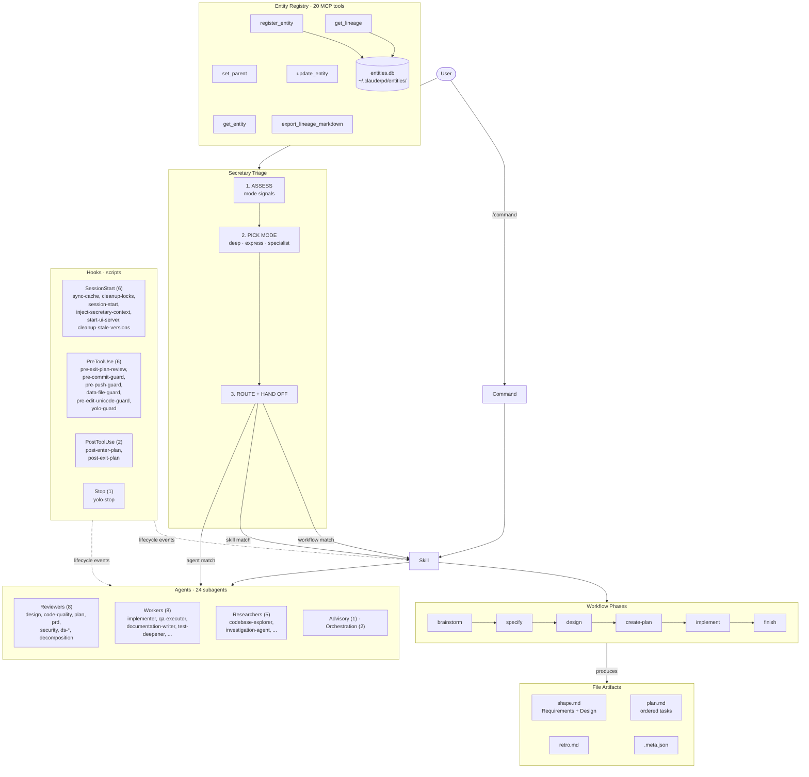

# Developer Guide

This repo uses a git-flow branching model with automated releases via conventional commits.

## Branch Structure

| Branch | Purpose |
|--------|---------|
| `main` | Stable releases only (tagged versions) |
| `develop` | Integration branch (default for development) |
| `feature/*` | Feature branches (created by pd workflow) |

## Single-Plugin Model

One plugin, branch-based separation:

| Branch | Purpose | Version Format |
|--------|---------|----------------|
| `develop` | Active development (dogfood) | X.Y.Z-dev |
| `main` | Stable releases | X.Y.Z |

All plugin code lives in `plugins/pd/`. Development happens on `develop`, releases merge to `main` with a version tag.

## Development Workflow

1. Create feature branch from `develop`
2. Use conventional commits (`feat:`, `fix:`, `BREAKING CHANGE:`)
3. Merge to `develop` via `/pd:finish-feature` or PR
4. Release when ready using the release script

## Version Bump Logic

Version bumps are calculated automatically based on code change volume:

| Change % | Bump | Example |
|----------|------|---------|
| ≤3% | Patch | 1.0.0 → 1.0.1 |
| 3-10% | Minor | 1.0.0 → 1.1.0 |
| >10% | Major | 1.0.0 → 2.0.0 |

The script calculates: `(lines added + lines deleted) / total codebase lines`

## Release Process

### Option 1: GitHub Actions (Recommended)

Trigger from GitHub Actions UI or CLI:

```bash
# Dry run - verify what would happen
gh workflow run release.yml --ref develop -f dry_run=true

# Real release
gh workflow run release.yml --ref develop -f dry_run=false
```

### Option 2: Local Release

From the develop branch with a clean working tree:

```bash
./scripts/release.sh
```

### What the Release Script Does

1. Validate preconditions (on develop, clean tree, has origin)
2. Calculate version from code change percentage since last tag
3. Strip `-dev` suffix from plugin.json and marketplace.json
4. Promote CHANGELOG [Unreleased] entries
5. Commit on develop, push
6. Merge develop → main (no-ff), tag, push
7. Bump develop to next `-dev` version

## Local Development Setup

Clone the repository and install the development plugin:

```bash
git clone https://github.com/clthuang/pedantic-drip.git
cd pedantic-drip
claude
```

In Claude Code:

```
/plugin marketplace add .claude-plugin/marketplace.json
/plugin install pd@pedantic-drip-marketplace
```

After making changes to plugin files, sync the cache:

```
/pd:sync-cache
```

## For Public Users

To install the released version:

```
/plugin marketplace add clthuang/pedantic-drip
/plugin install pd
```

## Key Files

| File | Purpose |
|------|---------|
| `scripts/release.sh` | Release automation script |
| `.github/workflows/release.yml` | CI release workflow |
| `.claude-plugin/marketplace.json` | Marketplace configuration |
| `plugins/pd/.claude-plugin/plugin.json` | Plugin manifest with version |

---

## Architecture

Commands invoke Skills; Skills spawn Agents; Hooks fire at lifecycle points. The secretary command is a triage layer, not a pipeline: it picks a mode (deep, express, or specialist fast-path), states the rationale, routes, and hands off. Triage never mutates state — the routed command owns all entity work.


```mermaid
flowchart TD
    U([User]) -->|"/command"| CMD[Command]
    U -->|"/secretary request"| SEC

    subgraph SEC["Secretary Triage"]
        direction TB
        S1["1. ASSESS<br/>mode signals"] --> S2["2. PICK MODE<br/>deep · express · specialist"]
        S2 --> S7["3. ROUTE + HAND OFF"]
    end

    CMD --> SK[Skill]
    S7 -->|"workflow match"| SK
    S7 -->|"agent match"| AG
    S7 -->|"skill match"| SK

    subgraph WORKFLOW["Workflow Phases"]
        direction LR
        WF1[brainstorm] --> WF2[specify] --> WF3[design]
        WF3 --> WF4[create-plan] --> WF5[implement]
        WF5 --> WF6[finish]
    end

    SK --> WORKFLOW
    SK --> AG

    subgraph AG["Agents · 24 subagents"]
        direction TB
        A1["Reviewers (8)<br/>design, code-quality, plan, prd,<br/>security, ds-*, decomposition"]
        A2["Workers (8)<br/>implementer, qa-executor,<br/>documentation-writer, test-deepener, ..."]
        A3["Researchers (5)<br/>codebase-explorer,<br/>investigation-agent, ..."]
        A4["Advisory (1) · Orchestration (2)"]
    end

    WORKFLOW -->|"produces"| ART

    subgraph ART["File Artifacts"]
        F1["shape.md<br/>Requirements + Design"] ~~~ F2["plan.md<br/>ordered tasks"]
        F3[retro.md] ~~~ F4[.meta.json]
    end

    subgraph HOOKS["Hooks · scripts"]
        H1["SessionStart (6)<br/>sync-cache, cleanup-locks,<br/>session-start,<br/>inject-secretary-context,<br/>start-ui-server,<br/>cleanup-stale-versions"]
        H2["PreToolUse (6)<br/>pre-exit-plan-review,<br/>pre-commit-guard,<br/>pre-push-guard,<br/>data-file-guard,<br/>pre-edit-unicode-guard,<br/>yolo-guard"]
        H3["PostToolUse (2)<br/>post-enter-plan,<br/>post-exit-plan"]
        H4["Stop (1)<br/>yolo-stop"]
    end

    HOOKS -.->|"lifecycle events"| SK
    HOOKS -.->|"lifecycle events"| AG

    subgraph ENT["Entity Registry · 20 MCP tools"]
        direction TB
        ET1[register_entity] ~~~ ET2[set_parent] ~~~ ET3[get_entity]
        ET4[get_lineage] ~~~ ET5[update_entity] ~~~ ET6[export_lineage_markdown]
        ET1 --> EB[("entities.db<br/>~/.claude/pd/entities/")]
        ET4 --> EB
    end
```

## Design Principles

| Principle | Meaning |
|-----------|---------|
| **Everything is prompts** | Skills and agents are just instructions Claude follows |
| **Files are truth** | Artifacts persist in files; any session can resume |
| **Humans unblock** | When stuck, Claude asks—never spins endlessly |
| **Composable > Rigid** | Phases work independently; combine as needed |

## Skills

Skills are instructions Claude follows for specific development practices. Located in `plugins/pd/skills/{name}/SKILL.md`.

### Workflow Phases
| Skill | Purpose |
|-------|---------|
| `brainstorming` | Guides 6-stage process producing evidence-backed PRDs with advisory team analysis and structured problem-solving |
| `structured-problem-solving` | Applies SCQA framing and type-specific decomposition to problems during brainstorming |
| `specifying` | Creates precise specifications with acceptance criteria |
| `designing` | Creates design.md with architecture and contracts |
| `decomposing` | Orchestrates project decomposition pipeline (AI decomposition, review, feature creation) |
| `planning` | Produces plan.md with dependencies and ordering |
| `implementing` | Execution mechanics for the implement phase — inline vs worktree-isolated task dispatch, merge-back |
| `finishing-branch` | Guides branch completion with PR or merge options |

### Quality & Review
| Skill | Purpose |
|-------|---------|
| `promptimize` | Reviews plugin prompts against best practices guidelines and returns scored assessment with improved version |
| `implementing-with-tdd` | Enforces RED-GREEN-REFACTOR cycle with rationalization prevention |
| `workflow-state` | Defines phase sequence and validates transitions |
| `workflow-transitions` | Shared phase-transition contract (engine entry/exit, global YOLO rule, review gate, dispatch hygiene) |

### Investigation
| Skill | Purpose |
|-------|---------|
| `systematic-debugging` | Guides four-phase root cause investigation |
| `root-cause-analysis` | Structured 6-phase process for finding ALL contributing causes |

### Research & Synthesis
| Skill | Purpose |
|-------|---------|
| `researching` | Orchestrates parallel research, analysis, and synthesis into decision-ready summaries |

### Domain Knowledge
| Skill | Purpose |
|-------|---------|
| `game-design` | Game design frameworks, engagement/retention analysis, aesthetic direction, and feasibility evaluation |
| `crypto-analysis` | Crypto/Web3 frameworks for protocol comparison, DeFi taxonomy, tokenomics, trading strategies, MEV classification, market structure, and risk assessment |
| `data-science-analysis` | Data science frameworks for methodology assessment, pitfall analysis, and modeling approach recommendations (brainstorming domain) |
| `writing-ds-python` | Clean DS Python code: anti-patterns, pipeline rules, type hints, testing strategy, dependency management |
| `structuring-ds-projects` | Cookiecutter v2 project layout, notebook conventions, data immutability, the 3-use rule |
| `spotting-ds-analysis-pitfalls` | 15 common statistical pitfalls with diagnostic decision tree and mitigation checklists |
| `choosing-ds-modeling-approach` | Predictive vs causal modeling, method selection flowchart, Rubin/Pearl frameworks, hybrid approaches |

### Specialist Teams
| Skill | Purpose |
|-------|---------|
| `creating-specialist-teams` | Creates ephemeral specialist teams via template injection into generic-worker |

### Maintenance
| Skill | Purpose |
|-------|---------|
| `retrospecting` | Runs data-driven AORTA retrospective using retro-facilitator agent; writes plain-markdown retro.md |
| `updating-docs` | Automatically updates documentation using agents |
| `writing-skills` | Applies TDD approach to skill documentation |
| `detecting-kanban` | Detects Vibe-Kanban and provides TodoWrite fallback |

## Commands

Commands are user-invoked entry points. Located in `plugins/pd/commands/{name}.md`. See [README.md](README.md) for the full list. Notable utility commands:

| Command | Purpose |
|---------|---------|
| `generate-docs` | Generate three-tier documentation scaffold or update existing docs |
| `subagent-ras` | Research, analyze, and summarize any topic using parallel agents |
| `promptimize` | Review a plugin prompt against best practices and return an improved version |
| `refresh-prompt-guidelines` | Scout latest prompt engineering best practices and update the guidelines document |
| `show-lineage` | Display entity lineage tree for a given entity (ancestors or descendants) |
| `doctor` | Run data consistency checks across entity DB, workflow state, and filesystem. Supports `--fix` for auto-repair of safe issues. |

### Scheduled Doctor Runs

The `doctor` command can be scheduled to run automatically via Claude Code's native `CronCreate` tool. Configure in `.claude/pd.local.md`:

```yaml
# Cron expression for scheduled doctor runs (desktop tier only). Empty to disable.
doctor_schedule: "0 */4 * * *"   # Every 4 hours
```

**Behavior:**
- When `doctor_schedule` is non-empty, `session-start` emits a `CronCreate` instruction that schedules `/pd:doctor` at the configured cadence.
- When `doctor_schedule` is empty (default), no scheduling instruction is emitted — doctor runs only at session start and on explicit invocation.

**Prerequisites:**
- Requires the `CronCreate` tool, which is available only on the **desktop scheduling tier** (local file access). Cloud-tier Claude Code sessions lack the filesystem access doctor needs.
- If `CronCreate` is unavailable (e.g., `CLAUDE_CODE_DISABLE_CRON=1` or the tool is not exposed), the scheduling instruction is skipped silently and doctor continues to run only at session start.

**Example cron expressions:**
- `"0 */4 * * *"` — every 4 hours
- `"0 9 * * *"` — once daily at 09:00
- `"0 9 * * 1-5"` — weekday mornings at 09:00

## Agents

Agents are isolated subprocesses spawned by the workflow. Located in `plugins/pd/agents/{name}.md`.

**Reviewers (8):** — only `design-reviewer` and `code-quality-reviewer` sit on the feature workflow's two review moments; the rest are on-demand or non-feature paths.
- `design-reviewer` — Challenges design assumptions and finds gaps (review moment 1 of 2, `/pd:design`)
- `code-quality-reviewer` — Adversarially reviews the branch diff for correctness and maintainability (review moment 2 of 2, `/pd:implement`)
- `security-reviewer` — Reviews implementation for security vulnerabilities; dispatched from `/pd:finish-feature` on security-surface changes. Always an Anthropic-model Task, never routed to Codex
- `plan-reviewer` — Skeptically reviews plans for failure modes and feasibility (Claude Code plan mode, pasted plans)
- `prd-reviewer` — Critically reviews PRD drafts for quality and completeness
- `project-decomposition-reviewer` — Validates project decomposition quality (coverage, sizing, dependencies)
- `ds-analysis-reviewer` — Reviews data analysis for statistical pitfalls, methodology issues, and conclusion validity; uses WebSearch + Context7
- `ds-code-reviewer` — Reviews DS Python code for anti-patterns, pipeline quality, and best practices; uses Context7 for API verification

**Workers (8):**
- `implementer` — Implements tasks with TDD and self-review discipline
- `qa-executor` — Execution-grounded QA: runs the test battery and drives affected flows, returning commands plus output as evidence. Fixes nothing
- `project-decomposer` — Decomposes project PRD into ordered features with dependencies and milestones
- `generic-worker` — General-purpose implementation agent for mixed-domain tasks
- `documentation-writer` — Writes and updates documentation based on research findings
- `ras-synthesizer` — Synthesizes multi-source research findings into thematic analysis with confidence calibration
- `relevance-verifier` — Verifies artifact chain coherence (`shape.md` → `plan.md` → code)
- `test-deepener` — Systematically deepens test coverage after TDD scaffolding with spec-driven adversarial testing

**Advisory (1):**
- `advisor` — Applies strategic or domain advisory lens to brainstorm problems via template injection

**Researchers (5):**
- `codebase-explorer` — Analyzes codebase to find relevant patterns and constraints
- `documentation-researcher` — Researches documentation state and identifies update needs
- `internet-researcher` — Searches web for best practices, standards, and prior art
- `investigation-agent` — Read-only research agent for context gathering
- `skill-searcher` — Finds relevant existing skills for a given topic

**Orchestration (2):**
- `rca-investigator` — Finds all root causes through 6-phase systematic investigation
- `retro-facilitator` — Runs data-driven AORTA retrospective with full intermediate context

### Advisory Team Architecture
The brainstorm skill dispatches advisory agents alongside research agents in Stage 2.
Advisors are `.advisor.md` template files in `skills/brainstorming/references/advisors/`.
The secretary classifies problems by archetype (from `references/archetypes.md`) and assembles
an advisory team of 2-5 advisors. Domain advisors reference existing domain skill reference files.
New advisors are added by creating a `.advisor.md` file and listing it in the archetypes inventory.

## Hooks

Hooks execute automatically at lifecycle points.

| Hook | Trigger | Purpose |
|------|---------|---------|
| `sync-cache` | SessionStart (startup\|resume\|clear) | Syncs plugin source to Claude cache |
| `cleanup-locks` | SessionStart (startup\|resume\|clear) | Removes stale lock files |
| `session-start` | SessionStart (startup\|resume\|clear) | Injects active feature context and runs doctor auto-fix |
| `inject-secretary-context` | SessionStart (startup\|resume\|clear) | Injects available agent/command context for secretary |
| `start-ui-server` | SessionStart (startup\|resume\|clear) | Auto-starts UI server (Kanban board) in background |
| `cleanup-stale-versions` | SessionStart (startup\|resume\|clear) | Deletes cached pd plugin versions older than the active one |
| `pre-exit-plan-review` | PreToolUse (ExitPlanMode) | Gates ExitPlanMode behind plan-reviewer dispatch; denies first call with instructions, allows second. YOLO mode skips the gate entirely. |
| `pre-commit-guard` | PreToolUse (Bash) | Branch protection and pd directory protection |
| `pre-push-guard` | PreToolUse (Bash) | Validates .meta.json consistency before git push |
| `data-file-guard` | PreToolUse (Write\|Edit) | Config-driven dispatcher protecting pd data files (`.meta.json` and other guarded paths) from unauthorized modifications |
| `pre-edit-unicode-guard` | PreToolUse (Write\|Edit) | Non-blocking warning for risky Unicode codepoints in edits |
| `yolo-guard` | PreToolUse (.*) | Enforces YOLO mode safety boundaries on all tool calls |
| `post-enter-plan` | PostToolUse (EnterPlanMode) | Injects plan review instructions before approval |
| `post-exit-plan` | PostToolUse (ExitPlanMode) | Injects task breakdown and implementation workflow |
| `yolo-stop` | Stop | Detects YOLO mode stop events and chains to next phase |
| `cleanup-sandbox` | (utility, unregistered) | Cleans up agent_sandbox/ temporary files |

`pre-edit-unicode-guard.sh` delegates to `pre-edit-unicode-guard.py` — a worker module invoked by the wrapper, not separately registered.

SessionStart hooks match `startup|resume|clear` only -- they do not fire on `compact` events, preserving context window savings from compaction.

Defined in `plugins/pd/hooks/hooks.json`.

### Hook Protection

The `pre-commit-guard` hook warns when committing to protected branches (main/master) and reminds about running tests.

## Workflow Mechanics

Each phase command in `plugins/pd/commands/` is a short **contract** — purpose, inputs, output, steps, constraints — and is the source of truth for its own phase. Read the command file before this section; what follows is only the shared machinery.

**Engine-validated transitions.** The workflow engine (MCP workflow-state tools) is the only state-holder. A phase command opens with `transition_phase(...)` and closes with `complete_phase(...)`; a rejection envelope is the stop signal and is surfaced verbatim, never re-derived. `.meta.json` is a read-only projection. The shared contract lives in the `workflow-transitions` skill; commands never restate phase sequences or status vocabularies.

**Artifact inventory.** Two artifacts carry a feature, plus the retro:

| Artifact | Written by | Contains |
|----------|-----------|----------|
| `shape.md` | `/pd:specify`, then `/pd:design` | `## Requirements` (mechanically checkable success criteria, scope, edge cases), then `## Design` |
| `plan.md` | `/pd:create-plan` | `## Plan` — ordered tasks, each with files touched and the command that proves it done; parallel-safe tasks flagged |
| `retro.md` | `/pd:finish-feature` | AORTA retrospective, written before branch cleanup |

There is no `spec.md`, no `tasks.md`, and no implementation log. Tasks are derived from `plan.md` at dispatch time by the `implementing` skill, which runs parallel-safe tasks as `implementer` agents in `.pd-worktrees/task-{N}` worktrees and merges them back in plan order.

**Mechanical gates (tier 1).** `scripts/phase-gate.sh <phase> <feature-dir>` runs at every phase boundary with zero dispatch: artifact existence, required sections, duplicate fenced contract blocks across the artifact set, and uncommitted artifacts at implement entry. Each failure prints one line; exit 0 means pass.

**Review moments (tier 2).** Exactly two LLM reviews per deep feature — `pd:design-reviewer` after the design gate, and `pd:code-quality-reviewer` on the full branch diff during implement. Each is one pass plus at most one fix round; still-open blockers escalate to the user rather than looping to a cap. Alongside them, `pd:qa-executor` supplies execution-grounded evidence during implement (runs the suites, drives affected flows, reports without fixing), and `pd:security-reviewer` runs from `/pd:finish-feature` when the branch touches a security surface. Implement carries one circuit breaker for the whole phase: 3 fix cycles total.

**Express mode.** `/pd:create-feature --express` records an inline mini-spec as a `mini_spec` phase event, passes `skipped_phases=["brainstorm","specify","design","create-plan"]` to the engine, and hands straight to `/pd:implement`, where QA and review collapse into one combined pass. `/pd:secretary` picks the lane: any of security surface, schema/data migration, multi-file blast radius, novel domain, or non-mechanical success criteria forces deep mode.

## YOLO Mode (Autonomous Workflow)

A `[YOLO_MODE]` flag in context enables fully autonomous feature development. The rule is defined once, in the `workflow-transitions` skill; no command restates it.

### How It Works

1. User enables it: `/pd:yolo on`, or `activation_mode: yolo` in `.claude/pd.local.md`
2. Every command that sees `[YOLO_MODE]` auto-selects each prompt's recommended option and keeps going through recoverable errors
3. The flag propagates into every dispatched command, skill, and agent prompt

### Flag Propagation

Each phase command includes `[YOLO_MODE]` in the args when invoking the next command. This ensures the flag survives context compaction (it appears in the most recent Skill invocation args rather than only in early conversation messages).

### What Gets Bypassed

Only user prompts. Every `AskUserQuestion` auto-selects its recommended option, and phase transitions chain without confirmation.

### What Still Runs

Every gate: engine prerequisite validation, `scripts/phase-gate.sh` on each boundary, both review moments, `qa-executor`, `security-reviewer` when the surface warrants it, and the finish-phase QA battery.

### Hard Stop Points

YOLO stops and reports rather than forcing through (enforced by `yolo-guard.sh`):

1. Engine transition rejection — surfaced verbatim
2. Git merge conflict — cannot auto-resolve
3. A review gate still failing after its one fix round
4. Implement circuit breaker — 3 fix cycles for the phase
5. Safety keywords — force-push, data deletion, secrets

## Knowledge Bank

Inert reference markdown lives in `docs/knowledge-bank/`:

- **constitution.md** — Core principles (KISS, YAGNI, etc.)
- **patterns.md** — Approaches that worked
- **anti-patterns.md** — Things to avoid
- **heuristics.md** — Decision guides

These files are preserved as plain documentation. Memory capture and recall are delegated to Claude Code's native memory or an external memory plugin — pd no longer owns any memory subsystem.

**Configuration** (in `.claude/pd.local.md`):
- `plan_mode_review` — Enable plan review hooks for Claude Code plan mode (default: true)
- `max_concurrent_agents` — Max parallel Task dispatches across skills and commands (default: 5)

## Entity Registry

The entity registry tracks the lineage of pd artifacts (backlog items, brainstorms, projects, features) and their parent-child relationships in a SQLite database.

**Database:** `~/.claude/pd/entities/entities.db`

**MCP Server:** `plugins/pd/mcp/entity_server.py` (bootstrapped via `plugins/pd/mcp/run-entity-server.sh`)

**MCP Tools (20):**
- `register_entity` -- Register a new entity (backlog, brainstorm, project, or feature) with optional parent link and metadata
- `allocate_entity_id` -- Atomically allocate the next `{seq:03d}-{slug}` id for an entity type, before any filesystem or DB write
- `issue_spawn` -- Spawn a new issue entity (kind='bug' or 'task') linked to a parent
- `set_parent` -- Set or change the parent of an entity (with circular reference detection)
- `get_entity` -- Retrieve a single entity by type_id or ref
- `get_lineage` -- Traverse the entity hierarchy upward (toward root) or downward (toward leaves) with depth limiting
- `update_entity` -- Update mutable fields (name, status, artifact_path, metadata) of an existing entity
- `export_lineage_markdown` -- Export entity lineage as a markdown tree, optionally writing to a file
- `search_entities` -- Full-text search across all entities
- `export_entities` -- Export all entities (or a filtered subset) as structured JSON
- `delete_entity` -- Delete an entity and all associated data (FTS, workflow_phases)
- `add_entity_tag` -- Add a tag to an entity
- `get_entity_tags` -- Get all tags for an entity
- `add_dependency` -- Add a dependency: entity is blocked by another entity
- `remove_dependency` -- Remove a dependency between two entities
- `add_okr_alignment` -- Link an entity to a key result for lateral OKR alignment
- `get_okr_alignments` -- Get all key results aligned to an entity
- `create_key_result` -- Create a key_result entity with parent link, metric_type, and optional weight
- `update_kr_score` -- Manually update score for a baseline_target (or binary-no-children) key result
- `list_projects` -- List all known projects in the entity registry

**Metadata Module:** `plugins/pd/hooks/lib/entity_registry/metadata.py` — centralized `parse_metadata()` (returns `{}` for None/invalid, never `None`) and `validate_metadata()` (warn-only schema checks per entity type). All entity_registry and workflow_engine modules import from here instead of hand-rolling `json.loads` patterns.

**Batch Registration:** `EntityDatabase.register_entities_batch()` registers multiple entities in one transaction. Each item names its parent by the `parent_uuid` of an entity that is already registered; items cannot reference each other, and an item key the method does not read is refused with `TypeError`.

**Backfill Scanner:** `plugins/pd/hooks/lib/entity_registry/backfill.py` scans existing artifact directories (features/, brainstorms/, projects/, backlog.md) and registers entities in topological order (backlog -> brainstorm -> project -> feature). Runs once on first server start; subsequent runs are skipped via a `backfill_complete` metadata marker.

**Command:** `/pd:show-lineage` displays the entity lineage tree for a given entity, showing ancestors or descendants with Unicode box-drawing formatting.

## Workflow Engine

The workflow engine manages feature lifecycle state, phase transitions, and drift reconciliation via a SQLite-backed state machine.

**MCP Server:** `plugins/pd/mcp/workflow_state_server.py` (bootstrapped via `plugins/pd/mcp/run-workflow-server.sh`)

**MCP Tools (22):**
- `get_phase` -- Get current workflow phase for a feature
- `transition_phase` -- Transition a feature to the next workflow phase (dual-writes to `phase_events`)
- `complete_phase` -- Mark the current phase as complete (dual-writes to `phase_events`)
- `validate_prerequisites` -- Check if prerequisites are met for a target phase
- `reproject_meta_json` -- Re-render a feature's `.meta.json` from DB state (direct writes to it are denied)
- `list_features_by_phase` -- List all features currently in a given phase
- `list_features_by_status` -- List all features with a given status
- `reconcile_check` -- Check for drift between state file and artifacts
- `reconcile_apply` -- Apply reconciliation fixes for detected drift
- `reconcile_frontmatter` -- Sync frontmatter metadata across feature artifacts
- `reconcile_status` -- Get overall reconciliation status summary
- `init_feature_state` -- Initialize workflow state for a new feature
- `init_project_state` -- Initialize workflow state for a new project
- `activate_feature` -- Activate a planned feature for development
- `init_entity_workflow` -- Initialize entity workflow tracking
- `transition_entity_phase` -- Transition an entity to a new workflow phase
- `get_notifications` -- Drain pending notifications for the current project
- `promote_task` -- Promote a task from plan.md to a tracked task entity
- `query_ready_tasks` -- List task entities ready for execution
- `get_progress_view` -- Get cross-level progress view for an entity's ancestor chain
- `record_backward_event` -- Record a backward phase transition event for analytics
- `query_phase_analytics` -- Query structured phase execution data (phase_duration, iteration_summary, backward_frequency, raw_events)

**Phase Events Table:** `phase_events` (migration 10) stores structured workflow execution data as an append-only event log. Every `transition_phase` and `complete_phase` call dual-writes to both the metadata JSON blob and this table. Use `query_phase_analytics` MCP tool to query cross-feature analytics (phase durations, review iteration counts, backward transition frequency).

## Creating Components

See [Component Authoring Guide](./docs/dev_guides/component-authoring.md).

All components are created in the `plugins/pd/` directory:

**Skills:** `plugins/pd/skills/{name}/SKILL.md` — Instructions Claude follows
**Agents:** `plugins/pd/agents/{name}.md` — Isolated workers with specific focus
**Commands:** `plugins/pd/commands/{name}.md` — User-invocable entry points
**Hooks:** `plugins/pd/hooks/` — Lifecycle automation scripts

## Validation

```bash
./validate.sh    # Check all components
```

## Error Recovery

When something fails:

1. **Auto-retry** for transient issues
2. **Fresh approach** if retry fails
3. **Ask human** with clear options

**Principle:** Never spin endlessly. Never fail silently. Ask.

## Contributing

1. Fork the repository
2. Create feature branch
3. Run `./validate.sh`
4. Submit PR

## References

- [Component Authoring Guide](./docs/dev_guides/component-authoring.md)
