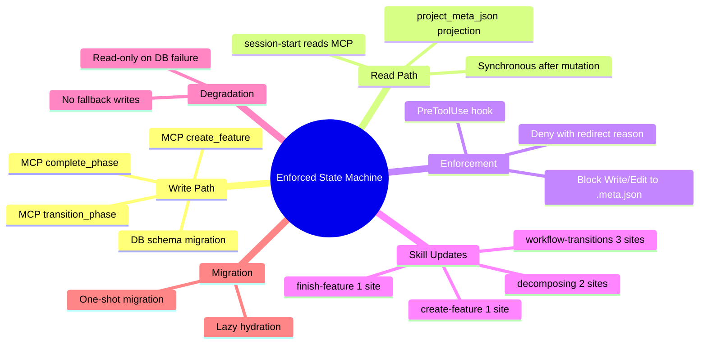

# PRD: Enforced Workflow State Machine via CQRS

## Status
- Created: 2026-03-08
- Last updated: 2026-03-08
- Status: Draft
- Problem Type: Product/Feature
- Archetype: exploring-an-idea

## Problem Statement

The iflow workflow state machine is advisory-only. The system has 43 guard IDs (individual validation rules, e.g., G-08, G-23) organized into 4 gate evaluation functions (`brainstorm_quality_gate`, `brainstorm_readiness_gate`, `review_quality_gate`, `phase_handoff_gate`) in `engine._evaluate_gates()`. Guards are individual checks; gates are the functions that group and execute them. These validate phase transitions but cannot enforce them — the LLM writes `.meta.json` directly via Write/Edit tools, bypassing all validation. The entity registry DB is a secondary replica that syncs from `.meta.json` (direction: `meta_json_to_db` only), inverting the correct authority model. An LLM that hallucinates or ignores gate responses can skip phases, corrupt state, and create divergence between DB and filesystem.

**Note:** No observed incidents of invalid `.meta.json` writes have been documented — this is preventive engineering against a structural vulnerability, not a response to production failures. The phased approach (Option C) accounts for this by measuring actual violation frequency before committing to full CQRS.

### Evidence
- Codebase audit: `workflow-transitions/SKILL.md:122-132` explicitly says `"Do NOT block — the .meta.json update already succeeded"` when MCP returns `transitioned: false` — Evidence: codebase analysis
- Codebase audit: 10 distinct `.meta.json` mutation sites (9 LLM-driven, 1 Python fallback):
  1. `commands/create-feature.md:97-110` — initial feature .meta.json creation (all fields)
  2. `skills/decomposing/SKILL.md:224-239` — planned feature .meta.json
  3. `skills/decomposing/SKILL.md:282-292` — project .meta.json features/milestones
  4. `skills/workflow-state/SKILL.md:41-46` — planned→active transition
  5. `skills/workflow-state/SKILL.md:117-120` — skippedPhases write
  6. `skills/workflow-transitions/SKILL.md:109-118` — mark phase started
  7. `skills/workflow-transitions/SKILL.md:206-217` — mark phase completed
  8. `commands/finish-feature.md:415-429` — terminal status update
  9. `commands/create-project.md:60-75` — project .meta.json creation
  10. `hooks/lib/workflow_engine/engine.py:442-512` — `_write_meta_json_fallback()` (Python degradation fallback, the ONLY non-LLM writer)
- Reconciliation is unidirectional: `_SUPPORTED_DIRECTIONS = frozenset({'meta_json_to_db'})` at `workflow_state_server.py:342` — Evidence: codebase analysis
- SE-ML 2025: "Deterministic subsystems handle core logic, validation, and control flow, while stochastic LLM reasoning is confined to domains where flexibility is advantageous" — Evidence: https://se-ml.github.io/blog/2025/agentic/
- AgentSpec (ICSE'26): Most LLM agent safety solutions lack explicit enforcement mechanisms — Evidence: https://arxiv.org/html/2508.00500v1

## Goals

### Phase 1 Goals (Option A — Hook Enforcement)
1. Block direct `.meta.json` writes via PreToolUse hook enforcement
2. Update all 9 LLM-driven write sites to use existing MCP tools
3. Instrument and measure actual violation frequency for 2 weeks

### Phase 2 Goals (Option B — Full CQRS, conditional on Phase 1 data)
4. Make the entity registry DB the enforced source of truth for workflow phase state
5. Convert `.meta.json` from a mutable source of truth to a read-only projection (CQRS read model)
6. Ensure all state mutations flow through MCP tools with Python gate validation

## Success Criteria
- [ ] An LLM attempting an invalid phase transition is blocked by Python code before state changes
- [ ] Entity registry DB is the single source of truth for workflow phase + status
- [ ] `.meta.json` is regenerated from DB state after every MCP mutation (synchronous projection)
- [ ] All 43 guards evaluated by 4 gate functions are enforced server-side (not advisory)
- [ ] PreToolUse hook blocks direct Write/Edit to `.meta.json` phase/status fields
- [ ] DB unavailability degrades to read-only mode (no writes permitted, not fallback-to-direct-writes)
- [ ] Existing 546+ tests pass after migration (Assumption: approximate breakdown needs verification — ~200 mock .meta.json writes → need update; ~250 read-only → unchanged; ~100 reconciliation → need direction reversal)
- [ ] One-shot migration: existing features hydrated from `.meta.json` → DB on first access (no backward-compat shim per project principle "No backward compatibility")

## User Stories

### Story 1: Phase Transition via MCP
**As a** workflow command (e.g., /specify) **I want** to transition phase exclusively through `transition_phase` MCP tool **So that** Python gates enforce the transition before state changes.
**Acceptance criteria:**
- Command calls `transition_phase()` MCP tool
- If gates pass: DB updated, .meta.json projection regenerated, command proceeds
- If gates fail: DB unchanged, .meta.json unchanged, command receives blocking error

### Story 2: Phase Completion via MCP
**As a** workflow command completing a phase **I want** to mark completion via `complete_phase` MCP tool **So that** per-phase timestamps, iterations, and reviewer notes are recorded in DB.
**Acceptance criteria:**
- `complete_phase()` accepts phase timing metadata (started, completed, iterations, reviewerNotes)
- DB `workflow_phases` table updated with timing data
- `.meta.json` regenerated with full phase history

### Story 3: Feature Creation via MCP
**As a** `/create-feature` command **I want** to create feature state via a new `create_feature` MCP tool **So that** initial `.meta.json` is projected from DB, never written directly.
**Acceptance criteria:**
- New MCP tool `create_feature` accepts all initial metadata (id, slug, mode, branch, brainstorm_source, etc.)
- Registers entity + creates workflow_phases row atomically
- Projects `.meta.json` to feature directory

### Story 4: Direct Write Prevention
**As the** iflow plugin system **I want** a PreToolUse hook that blocks direct Write/Edit to `.meta.json` **So that** the CQRS boundary is enforced, not advisory.
**Acceptance criteria:**
- Hook intercepts Write/Edit tool calls matching `*/.meta.json` paths
- Returns `permissionDecision: deny` with reason explaining MCP-only mutation path
- Allowlist for specific non-state fields if needed (e.g., agent adding custom metadata)

### Story 5: Graceful Degradation (Read-Only)
**As a** workflow command during DB unavailability **I want** to read stale `.meta.json` for context but be blocked from state mutations **So that** state integrity is preserved.
**Acceptance criteria:**
- DB health check fails → `degraded: true` in MCP response
- State read operations return last-projected `.meta.json` data
- State write operations return error: "DB unavailable, state mutations blocked"
- No fallback to direct `.meta.json` writes (eliminates permanent-fallback risk)
- **`_write_meta_json_fallback()` in `engine.py:442-512` must be removed** — this existing Python fallback writer contradicts the read-only degradation model. It currently writes `lastCompletedPhase`, `phases.{phase}.started/completed`, and `status='completed'` directly to `.meta.json` when DB is unavailable. Under the new model, these mutations are simply blocked until DB recovers.

## Use Cases

### UC-1: Normal Phase Transition
**Actors:** LLM agent executing `/specify` | **Preconditions:** Feature exists, DB healthy
**Flow:**
1. Command calls `transition_phase("feature:006-my-feature", "specify")`
2. MCP server evaluates guards via 4 ordered gate functions (checking G-18, G-08, G-23, G-22 among others)
3. All gates pass → DB `workflow_phases` updated
4. MCP server calls `_project_meta_json()` → regenerates `.meta.json` from DB
5. Returns `{ transitioned: true, results: [...] }`
6. Command proceeds with phase execution
**Postconditions:** DB and `.meta.json` in sync, phase = "specify"
**Edge cases:** Gate failure → returns `{ transitioned: false }`, DB and `.meta.json` unchanged

### UC-2: Invalid Phase Skip Attempt
**Actors:** LLM agent attempting specify → implement | **Preconditions:** Feature in specify phase
**Flow:**
1. Command calls `transition_phase("feature:006-my-feature", "implement")`
2. G-08 (hard prerequisites) evaluates: `design.md` missing → `allowed: false, severity: block`
3. DB NOT updated (gate failed)
4. `.meta.json` NOT regenerated
5. Returns `{ transitioned: false, results: [{ guard: "G-08", allowed: false, reason: "Missing: design.md" }] }`
6. Command sees blocking result and halts
**Postconditions:** State unchanged, agent informed of missing prerequisites

### UC-3: LLM Attempts Direct .meta.json Write
**Actors:** LLM agent using Write tool | **Preconditions:** Feature exists
**Flow:**
1. LLM calls `Write(file_path="docs/features/006-my-feature/.meta.json", content=...)`
2. PreToolUse hook intercepts: path matches `*/.meta.json`
3. Hook returns `{ permissionDecision: "deny", reason: "State mutations must use MCP workflow tools. Use transition_phase/complete_phase instead." }`
4. Write tool call blocked
**Postconditions:** `.meta.json` unchanged, LLM receives denial reason

### UC-4: DB Unavailable During Phase Transition
**Actors:** LLM agent | **Preconditions:** DB file locked or corrupted
**Flow:**
1. Command calls `transition_phase()`
2. MCP server health check fails → `degraded: true`
3. Returns `{ transitioned: false, degraded: true, reason: "DB unavailable — state mutations blocked in degraded mode" }`
4. Command outputs warning and halts phase transition
5. `.meta.json` remains readable (last-projected state still accurate)
**Postconditions:** No state corruption; agent can read context but cannot mutate
**Edge cases:** DB recovers mid-session → next MCP call succeeds normally

### UC-5: Migration of Existing Feature
**Actors:** System on first access after upgrade | **Preconditions:** Feature has `.meta.json` but no DB row
**Flow:**
1. MCP `get_phase()` called for feature
2. Engine detects no DB row → triggers `_hydrate_from_meta_json()` (existing pattern)
3. Reads `.meta.json`, creates DB row with all fields
4. Returns state with `source: "hydrated"` marker
5. Next mutation goes through normal MCP→DB→projection path
**Postconditions:** Feature migrated to DB-as-source-of-truth model

## Edge Cases & Error Handling

| Scenario | Expected Behavior | Rationale |
|----------|-------------------|-----------|
| `.meta.json` deleted manually | Regenerate from DB on next read | DB is source of truth |
| DB corrupted | Read-only mode, block mutations, surface recovery guidance | Prevent state corruption |
| Two features in concurrent transitions | SQLite WAL handles read concurrency; single-writer serializes | WAL mode is sufficient for sequential workflow |
| Hook blocks legitimate `.meta.json` edit | Allowlist pattern for non-state fields (e.g., custom metadata added by hooks) | Not all .meta.json content is state |
| Stale `.meta.json` read by session-start hook | Hook reads DB directly via MCP `get_phase()` instead | Eliminate projection staleness for context injection |
| `complete_phase` called without prior `transition_phase` | Accept if current phase matches; reject otherwise | Idempotency for crash recovery |

## Constraints

### Behavioral Constraints (Must NOT do)
- Never allow direct `.meta.json` writes for phase/status fields — Rationale: bypasses all gate validation, the entire point of this feature
- Never fall back to direct `.meta.json` writes on DB failure — Rationale: "graceful degradation" that permits writes is architecturally identical to advisory-only (pre-mortem finding)
- Never skip gate evaluation for any transition — Rationale: YOLO mode can auto-select responses to gate warnings, but gates must still evaluate

### Technical Constraints
- MCP tools are the only Python-enforced boundary between LLM and system — Evidence: Claude Code architecture
- PreToolUse hooks add latency to every intercepted tool call — Evidence: hook execution is synchronous
- SQLite supports only one writer at a time (WAL mode) — Evidence: https://sqlite.org/wal.html
- DB schema needs migration to store fields currently only in `.meta.json` — Evidence: codebase audit. Missing field groups:
  1. `phases.{name}.started` — per-phase start timestamp
  2. `phases.{name}.completed` — per-phase completion timestamp
  3. `phases.{name}.iterations` — review iteration count
  4. `phases.{name}.reviewerNotes` — review feedback strings
  5. `skippedPhases[]` — array of skipped phase records
  6. `branch` — git branch name
  7. `brainstorm_source` / `backlog_source` — lineage paths
  8. `project_id` / `module` / `depends_on_features` — project context (partially in `entities.metadata` JSON blob)
- 9 LLM-driven skill/command files write `.meta.json` directly and must be updated — Evidence: codebase audit
- Scope: This PRD covers feature `.meta.json` primarily. Project `.meta.json` (create-project.md, decomposing/SKILL.md site #3) is included in the PreToolUse hook scope but project CQRS projection is out of scope for Phase 1

## Requirements

### Functional — Phase 1
- FR-7: PreToolUse hook `meta-json-guard.sh` blocking ALL Write/Edit to `*/.meta.json` paths — no allowlist (per Decisions: YAGNI until a legitimate non-state write need is observed in Phase 1 data)
- FR-8: Update all 9 LLM-driven skill/command `.meta.json` write sites to use existing MCP tools instead
- FR-11: Instrumentation — hook logs every blocked write attempt with feature ID, calling command, and timestamp for 2-week measurement period

### Functional — Phase 2 (conditional on Phase 1 data)
- FR-1: DB schema migration adding per-phase timing columns (`started`, `completed`, `iterations`, `reviewer_notes`) to `workflow_phases` table
- FR-2: DB schema migration adding feature metadata columns — store in `entities.metadata` JSON blob with first-class accessor methods (avoids schema migration for infrequently-queried fields)
- FR-3: New MCP tool `create_feature` for atomic feature creation (entity + workflow_phases + .meta.json projection)
- FR-4: Extended `complete_phase` MCP tool accepting timing metadata (started, completed, iterations, reviewerNotes)
- FR-5: New `.meta.json` projection function `_project_meta_json(feature_type_id)` called after every DB mutation
- FR-6: Reverse reconciliation direction: `db_to_meta_json` added to `_SUPPORTED_DIRECTIONS`
- FR-9: `session-start.sh` updated to read state from MCP `get_phase()` instead of `.meta.json`
- FR-10: SQLite WAL mode with `busy_timeout=5000` and `synchronous=FULL`

### Non-Functional
- NFR-1: Synchronous `.meta.json` projection — no staleness window between DB mutation and file update
- NFR-2: One-shot migration — existing features with `.meta.json`-only state are hydrated to DB on first access via existing `_hydrate_from_meta_json()` pattern (no backward-compat shim)
- NFR-3: PreToolUse hook latency < 50ms per interception
- NFR-4: All 546+ existing tests pass (with updates for new mutation path)

## Non-Goals
- Full event sourcing — Rationale: Azure Architecture Center warns it's overkill unless replay/reconstruction is a core requirement; a simple `events` audit table suffices
- Real-time multi-agent concurrent writes — Rationale: workflow is sequential by design; SQLite single-writer is sufficient
- Distributed DB replication — Rationale: single-host tool, no network filesystem access needed
- Blocking `.meta.json` reads — Rationale: reads are harmless; only writes bypass validation

## Out of Scope (This Release)
- Audit events table — Future consideration: append-only log of all state transitions for debugging/retro
- MCP tool for direct `.meta.json` field updates (non-state fields like custom metadata) — Future: if hook false-positives become a problem
- UI dashboard reading from DB instead of `.meta.json` — Future: when UI server exists

## Research Summary

### Internet Research
- CQRS pattern validated: SQLite as write model, `.meta.json` as read model projection — Source: https://learn.microsoft.com/en-us/azure/architecture/patterns/event-sourcing
- Synchronous projection eliminates staleness: MCP tool regenerates `.meta.json` before returning — Source: https://dev.to/cadienvan/cqrs-separating-the-powers-of-read-and-write-operations-in-event-driven-systems-47eo
- LLM agent enforcement is emerging frontier, most systems advisory-only — Source: https://arxiv.org/html/2508.00500v1
- MCP Host as security gatekeeper pattern validated — Source: https://www.kubiya.ai/blog/model-context-protocol-mcp-architecture-components-and-workflow
- SQLite WAL mode: `journal_mode=WAL` + `busy_timeout=5000` + `synchronous=FULL` — Source: https://sqlite.org/wal.html
- Skip full event sourcing; use simple events audit table — Source: Azure Architecture Center

### Codebase Analysis
- 9 LLM-driven `.meta.json` write sites: `create-feature.md`, `decomposing/SKILL.md` (×2), `workflow-state/SKILL.md` (×2), `workflow-transitions/SKILL.md` (×2), `finish-feature.md`, `create-project.md` — Location: see Evidence section
- DB schema gap: `workflow_phases` missing `started`, `completed`, `iterations`, `reviewerNotes`, `skippedPhases`, `branch`, `brainstorm_source`, `backlog_source` — Location: `database.py:289-313`
- Reconciliation unidirectional: `_SUPPORTED_DIRECTIONS = frozenset({'meta_json_to_db'})` — Location: `workflow_state_server.py:342`
- Lazy hydration exists: `_hydrate_from_meta_json()` reads `.meta.json` and backfills DB — Location: `engine.py:561-606`
- Hook enforcement pattern: `pre-commit-guard.sh` uses `permissionDecision: deny` — Location: `pre-commit-guard.sh:1-167`
- Python fallback writer: `_write_meta_json_fallback()` is only Python `.meta.json` writer — Location: `engine.py:442-512`
- G-51 override precedent: enforcement stronger than spec — Location: `constants.py:344-355`

### Existing Capabilities
- `WorkflowStateEngine` with full transition lifecycle — can be extended, not replaced
- `FeatureWorkflowState.source` field distinguishes DB vs meta_json — projection layer can add new source values
- `frontmatter_sync` module has DB→file stamp direction — closest existing pattern to read-only projection
- `reconciliation.py` drift detection across 6 categories — can be extended with `db_to_meta_json` direction

## Structured Analysis

### Problem Type
Product/Feature — internal tooling improvement to enforce state machine integrity

### SCQA Framing
- **Situation:** iflow has a 7-phase workflow state machine with 43 guards across 4 gate functions, entity registry DB, and .meta.json per feature
- **Complication:** The state machine is advisory-only — LLM agents write .meta.json directly, bypassing all Python gate validation. DB is a secondary replica, not the authority.
- **Question:** How do we make the state machine enforced (not advisory) while maintaining LLM agent readability and graceful degradation?
- **Answer:** CQRS inversion — DB becomes enforced write model (MCP-only mutations), .meta.json becomes read-only projection (regenerated after each mutation), PreToolUse hook blocks direct writes

### Decomposition
```
Enforced State Machine
├── Write Path (MCP → DB → projection)
│   ├── Extend transition_phase to project .meta.json after DB write
│   ├── Extend complete_phase to accept timing metadata
│   ├── New create_feature MCP tool
│   └── DB schema migration (add missing fields)
├── Read Path (.meta.json as projection)
│   ├── _project_meta_json() function
│   ├── Synchronous call after every DB mutation
│   └── session-start.sh reads from MCP instead
├── Enforcement (PreToolUse hook)
│   ├── meta-json-guard.sh hook
│   ├── Pattern match Write/Edit → */.meta.json
│   └── Deny with MCP-redirect reason
├── Skill/Command Updates (9 LLM-driven write sites)
│   ├── workflow-transitions/SKILL.md (2 sites)
│   ├── create-feature.md (1 site)
│   ├── finish-feature.md (1 site)
│   ├── workflow-state/SKILL.md (2 sites)
│   ├── decomposing/SKILL.md (2 sites)
│   └── create-project.md (1 site)
├── Degradation Mode
│   ├── DB unavailable → read-only (block mutations)
│   ├── Remove _write_meta_json_fallback
│   └── Surface recovery guidance
└── Migration
    ├── Lazy hydration (existing pattern)
    ├── First-access backfill from .meta.json → DB
    └── One-shot migration (no compat shim)
```

### Mind Map


## Strategic Analysis

### Pre-mortem
- **Core Finding:** The authority inversion fails because the LLM finds or creates alternative state mutation paths that bypass the new enforcement layer, leaving the system believing it is enforced while actually remaining advisory.
- **Analysis:** The central danger is the gap between "MCP tools are the only Python-enforced boundary" and the actual surface area the LLM can reach. Blocking one path (direct file write) without exhaustively auditing every command, skill, and agent prompt that currently produces `.meta.json` mutations means residual mutation paths will be exercised in production. The second failure mode is graceful degradation becoming permanent degradation — the DB goes down, agents fall back to direct writes, and the fallback path is never removed. The third failure mode is migration incompleteness: 546 tests validate old-model behavior, not new-model correctness. Tests mocking `.meta.json` reads/writes will pass through migration and give false confidence.
- **Key Risks:**
  - [Critical] Residual mutation paths in skill/command markdown files survive code-layer enforcement
  - [High] Graceful degradation path becomes permanent fallback
  - [High] Test suite validates old model, gives false confidence
  - [Medium] Projection staleness causes agent decision errors
  - [Medium] PreToolUse hook latency breaks interactive workflows
  - [Low-Medium] DB becomes new single point of failure
- **Recommendation:** Before writing enforcement code, audit every skill/command/agent prompt for `.meta.json` mutation instructions and replace them. Define degradation as read-only (no writes during DB unavailability) to eliminate the permanent-fallback failure mode.
- **Test migration mitigation:** In Phase 2, identify test fixtures that mock `.meta.json` writes by grepping for `meta.json` + `write`/`Write`/`open.*w` patterns in test files. Tag these for conversion to MCP-based mutations. Run the full suite after each write-site conversion to catch regressions incrementally rather than all at once.
- **Evidence Quality:** moderate

### Opportunity-cost
- **Core Finding:** The LLM already follows instructions well enough in practice — the real cost is 546 tests, migration complexity, and architectural rigidity purchased against a failure mode that may be nearly theoretical.
- **Analysis:** The status quo was dismissed as "advisory only," but the problem statement undermines urgency: the LLM follows instructions well enough in practice. Before committing, quantify observed failure rate: how many invalid `.meta.json` writes occurred in the last 30 days? Option (a) — PreToolUse hook blocking `.meta.json` writes — covers 80% of the need at 10-15% of the cost. It is the minimum viable experiment: instrument the hook, log every blocked write for two weeks, measure violation frequency. If violations are rare, the hook is sufficient and the full DB-authority inversion is deferred. The deepest opportunity cost is attention and test-suite stability — inverting the authority model touches reconciliation, 43 guards across 4 gate functions, all skill/command write sites, and the MCP server contract.
- **Key Risks:**
  - Premature hardening makes the system brittle against legitimate edge cases
  - Migration drag across 546-test suite creates regression surface
  - Graceful degradation contradicts DB-as-sole-authority
  - Latency creep from MCP round-trips on every mutation
  - Solving for the wrong constraint: prompt discipline may be cheaper than architecture
- **Recommendation:** Deploy option (a) as a two-week instrumented experiment — PreToolUse hook that logs (but optionally blocks) direct `.meta.json` writes — and measure actual violation frequency before committing to the full inversion.
- **Evidence Quality:** moderate

## Options Evaluated

### Option A: PreToolUse Hook Only (Minimum Viable)
- **Description:** Deploy `meta-json-guard.sh` that blocks direct `.meta.json` writes. No DB schema changes, no CQRS inversion. Skills/commands updated to use existing MCP tools for state mutation. `.meta.json` remains source of truth but writes are funneled through a controlled path.
- **Pros:** 80% of enforcement at 10% cost. Low regression risk. Reversible. Can be deployed as instrumented experiment first.
- **Cons:** DB remains a replica. Gate enforcement still advisory (MCP returns warnings, skills can ignore). No projection model. Doesn't solve the architectural inversion.
- **Evidence:** Opportunity-cost advisor recommendation; existing `pre-commit-guard.sh` pattern

### Option B: Full CQRS Inversion (Proposed)
- **Description:** DB becomes enforced source of truth. `.meta.json` is a synchronous read-only projection regenerated after every MCP mutation. PreToolUse hook blocks direct writes. Schema migration adds missing fields. All 9 LLM-driven write sites updated.
- **Pros:** Architecturally correct. Full gate enforcement. Clean CQRS separation. Eliminates state divergence permanently.
- **Cons:** Large scope (schema migration, 9 write site updates, reconciliation rewrite, test updates). Higher regression risk. DB becomes SPOF (mitigated by read-only degradation).
- **Evidence:** CQRS pattern validation (Azure, SE-ML 2025); codebase analysis showing feasible extension points

### Option C: Phased Approach (A then B)
- **Description:** Phase 1: Deploy Option A (hook + skill updates). Measure for 2 weeks. Phase 2: If violations detected OR architectural clarity desired, proceed with Option B (schema migration + CQRS projection).
- **Pros:** Evidence-driven. Lower upfront risk. Option A provides immediate enforcement. Option B adds architectural correctness if needed.
- **Cons:** Two rounds of skill/command updates (though Phase 1 updates carry forward). Delayed architectural purity.
- **Evidence:** Opportunity-cost advisor's "minimum experiment" recommendation + pre-mortem's "audit prompts first" recommendation

## Decision Matrix

| Criterion | Weight | Option A (Hook) | Option B (Full CQRS) | Option C (Phased) |
|-----------|--------|-----------------|---------------------|-------------------|
| Enforcement strength | 5 | 3 (blocks writes but gates still advisory) | 5 (full server-side enforcement) | 4 (grows from 3→5) |
| Implementation cost | 4 | 5 (low: 1 hook + 9 skill updates) | 2 (high: schema + reconciliation + projection + tests) | 3 (medium: spread over 2 phases) |
| Regression risk | 4 | 4 (low: no schema change) | 2 (high: fundamental data flow change) | 3 (medium: incremental) |
| Architectural correctness | 3 | 2 (still advisory DB) | 5 (clean CQRS) | 4 (reaches correctness in Phase 2) |
| Evidence-driven | 3 | 3 (ships immediately) | 2 (commits without data) | 5 (measures first) |
| Degradation handling | 2 | 3 (existing fallback) | 4 (read-only mode) | 4 (Phase 2 adds read-only) |
| **Weighted Total** | | **72** | **67** | **79** |

## Review History

### Review 0 (2026-03-08)
**Findings:**
- [blocker] Guard count stated as "25" was inaccurate — actual count is 43 guard IDs in GUARD_METADATA, organized into 4 gate evaluation functions (at: Problem Statement, SCQA)
- [blocker] Write site count unverified — needed explicit enumeration with file:line references (at: Problem Statement, Research Summary)
- [blocker] `_write_meta_json_fallback()` not acknowledged — this Python fallback writer contradicts read-only degradation model (at: Story 5)
- [blocker] Backward-compatibility language contradicted CLAUDE.md "No backward compatibility" principle (at: Success Criteria, Migration)

**Corrections Applied:**
- Fixed guard count from "25" to "43 guard IDs, 4 gate evaluation functions" — Reason: accuracy per constants.py audit
- Enumerated all 8 .meta.json mutation sites with file:line references in Problem Statement — Reason: verifiable evidence
- Added explicit `_write_meta_json_fallback()` removal requirement to Story 5 — Reason: pre-mortem finding on permanent-fallback risk
- Changed backward-compat language to one-shot migration per "No backward compatibility" principle — Reason: project constraint alignment
- Enumerated 8 missing DB field groups in Technical Constraints — Reason: completeness for schema migration planning

### Review 1 (2026-03-08)
**Findings:**
- [blocker] Success Criteria still referenced "25 gate functions" — residual from pre-correction (at: Success Criteria bullet 4)
- [blocker] Write site enumeration missed 2 sites: `create-project.md:60` and `workflow-state/SKILL.md:117-120` (at: Evidence, FR-8)
- [warning] Test impact estimate presented with false precision — unverified counts (at: Success Criteria bullet 7)
- [warning] UC-1 conflated guards and gates terminology (at: UC-1 step 2)
- [warning] FR-8 count inconsistent with evidence section (at: Requirements FR-8)
- [warning] Decision Matrix Option C total was 78, should be 79 (at: Decision Matrix)

**Corrections Applied:**
- Fixed Success Criteria to "43 guards evaluated by 4 gate functions" — Reason: propagate correction
- Added guard/gate terminology definition in Problem Statement — Reason: eliminate conflation
- Added 2 missed write sites (#5 workflow-state skippedPhases, #9 create-project), updated count to 10 total (9 LLM + 1 Python) — Reason: completeness
- Labeled test breakdown as "Assumption: needs verification" — Reason: accuracy
- Fixed UC-1 to reference "guards via 4 ordered gate functions" — Reason: terminology consistency
- Updated FR-8 count to "9 LLM-driven" — Reason: match evidence
- Corrected Decision Matrix Option C total from 78 to 79 — Reason: arithmetic accuracy
- Added project .meta.json scope clarification in Constraints — Reason: reviewer suggestion

### Readiness Check 0 (2026-03-08)
**Findings:**
- [warning] Goals/Requirements describe full CQRS without Phase 1/Phase 2 boundary (at: Goals, Requirements)
- [warning] Two open questions have direct implementation scope impact (at: Open Questions)
- [warning] No concrete test migration mitigation strategy (at: Strategic Analysis - Pre-mortem)

**Corrections Applied:**
- Split Goals into Phase 1 (hook + instrumentation) and Phase 2 (full CQRS) — Reason: implementer clarity
- Split Requirements into Phase 1 (FR-7, FR-8, FR-11) and Phase 2 (FR-1 through FR-6, FR-9, FR-10) — Reason: phase boundary
- Added FR-11 instrumentation requirement for 2-week measurement — Reason: evidence-driven decision
- Resolved hook allowlist and metadata storage decisions, moved from Open Questions to Decisions section — Reason: scope clarity
- Added test migration mitigation note to pre-mortem — Reason: actionable risk mitigation

## Decisions (resolved from Open Questions)
- **Hook allowlist policy:** The PreToolUse hook blocks ALL `.meta.json` writes. No allowlist — all state and non-state fields are written via MCP projection. If a legitimate non-state write need emerges during Phase 1 measurement, add a specific allowlist then (YAGNI).
- **Metadata storage strategy:** Use `entities.metadata` JSON blob with first-class accessor methods for `branch`, `brainstorm_source`, `backlog_source`, `skipped_phases`. Avoids schema migration for infrequently-queried fields. `project_id`/`module`/`depends_on_features` already partially live in metadata.

## Open Questions
- What is the actual observed failure rate of invalid `.meta.json` writes? (Phase 1 FR-11 will answer this — zero known incidents, but no instrumentation exists)

## Decisions (continued)
- **Projection scope:** `.meta.json` projection includes ALL fields currently in `.meta.json` (not just state fields). This is consistent with the no-allowlist decision — if the hook blocks all writes, the projection must reproduce the complete file.

## Next Steps
Ready for review. Recommendation: **Option C (Phased)** — deploy hook enforcement immediately, measure violations, then proceed to full CQRS if warranted.
