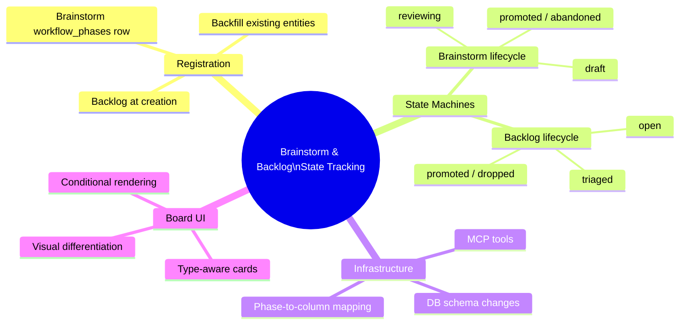

# PRD: Brainstorm & Backlog State Tracking

## Status
- Created: 2026-03-09
- Last updated: 2026-03-09
- Status: Draft
- Problem Type: Product/Feature
- Archetype: exploring-an-idea

## Problem Statement
Brainstorms and backlogs exist as second-class citizens in the iflow workflow system. Features have `.meta.json` state tracking, MCP workflow tools, hook enforcement, and meaningful kanban board placement. Brainstorms are loose `.prd.md` files with entity registration but no lifecycle tracking. Backlog items are rows in a flat markdown table with no entity registration at creation time. Neither entity type appears meaningfully on the kanban board because they lack `workflow_phases` rows in the entity registry DB.

### Evidence
- Codebase: `WorkflowStateEngine` is 100% feature-scoped — `_extract_slug()` strips `feature:` prefix and joins with `features/` directory to construct feature-specific paths, `FeatureWorkflowState` model is feature-specific — Evidence: `plugins/iflow/hooks/lib/workflow_engine/engine.py:311-336`
- Codebase: `add-to-backlog` command does zero entity registration — backlog items only reach the DB if a brainstorm later references them via `*Source: Backlog #NNNNN*` marker — Evidence: `plugins/iflow/commands/add-to-backlog.md`
- Codebase: `workflow_phases` table CHECK constraint limits `workflow_phase` to feature phase names or NULL — Evidence: `plugins/iflow/hooks/lib/entity_registry/database.py:290-313`
- Codebase: Board card template uses `workflow_phase` which is always NULL for non-feature entities — Evidence: `plugins/iflow/ui/templates/_card.html`
- Codebase: `backfill_workflow_phases()` already maps brainstorm/backlog statuses to kanban columns via `STATUS_TO_KANBAN` but this only runs during backfill, not at registration time — Evidence: `plugins/iflow/hooks/lib/entity_registry/backfill.py:145-238`

## Goals
1. Brainstorms and backlogs have defined lifecycles with state tracking
2. Both entity types appear on the kanban board with meaningful column placement
3. MCP workflow tools support state transitions for brainstorms and backlogs
4. The existing feature workflow remains completely unchanged

## Success Criteria
- [ ] Brainstorm entities have a defined state machine (e.g., draft → reviewing → promoted/abandoned)
- [ ] Backlog entities are registered at creation time (not deferred to brainstorm reference)
- [ ] Backlog entities have a defined state machine (e.g., open → triaged → promoted/dropped)
- [ ] Both entity types have `workflow_phases` rows created at registration time
- [ ] Kanban board displays brainstorm and backlog entities in appropriate columns
- [ ] Board cards render meaningful metadata for non-feature entities (not NULL phase badges)
- [ ] MCP tools exist to transition brainstorm/backlog state without direct DB manipulation
- [ ] Existing feature workflow tests (289 engine + 257 gate + 667 registry) pass without modification

## User Stories
### Story 1: Brainstorm Visibility
**As a** developer using iflow **I want** to see my brainstorms on the kanban board **So that** I can track which brainstorms are in progress, reviewed, or promoted to features

**Acceptance criteria:**
- Brainstorm appears in appropriate kanban column based on its lifecycle state
- Card shows brainstorm-specific metadata (not NULL feature phase badges)
- Promoted brainstorms link to their child feature entity

### Story 2: Backlog Registration
**As a** developer using iflow **I want** backlog items registered in the entity registry when I create them **So that** they are immediately visible on the kanban board and in entity search

**Acceptance criteria:**
- `/iflow:add-to-backlog` creates both the markdown row and an entity registry entry
- Entity has proper lineage tracking from creation

### Story 3: State Transitions
**As a** developer using iflow **I want** to advance brainstorm/backlog items through their lifecycle via MCP tools **So that** state changes are tracked, timestamped, and visible on the board

**Acceptance criteria:**
- MCP tool transitions brainstorm state (e.g., draft → reviewing)
- MCP tool transitions backlog state (e.g., open → triaged)
- Invalid transitions are rejected with clear error messages

## Use Cases
### UC-1: Brainstorm Lifecycle
**Actors:** Developer | **Preconditions:** `/iflow:brainstorm` command initiated
**Flow:**
1. User runs `/iflow:brainstorm <topic>`
2. Brainstorm entity registered with status `draft`, kanban column `wip`
3. PRD review stages advance status to `reviewing`
4. User promotes to feature → status becomes `promoted`, kanban column `completed`
5. Or user saves and exits → status remains `draft`, kanban column `wip`
**Postconditions:** Entity has full lifecycle audit trail
**Edge cases:** User abandons mid-brainstorm — entity stays in `draft` state

### UC-2: Backlog Item Lifecycle
**Actors:** Developer | **Preconditions:** Backlog file exists
**Flow:**
1. User runs `/iflow:add-to-backlog <description>`
2. Backlog entity registered with status `open`, kanban column `backlog`
3. When brainstorm references the item, status advances to `triaged`
4. When brainstorm promotes to feature, backlog status becomes `promoted`
**Postconditions:** Backlog item has lineage to brainstorm and feature
**Edge cases:** Backlog item dropped without brainstorm — needs explicit close mechanism

### UC-3: Kanban Board Display
**Actors:** Developer | **Preconditions:** Entities exist in DB
**Flow:**
1. User opens kanban board UI
2. Board shows features, brainstorms, and backlog items in appropriate columns
3. Cards are visually differentiated by entity type
4. Clicking a card shows entity detail with lineage
**Postconditions:** Unified view of all work items
**Edge cases:** Board with 100+ backlog items — may need pagination or filtering

## Edge Cases & Error Handling
| Scenario | Expected Behavior | Rationale |
|----------|-------------------|-----------|
| Brainstorm promoted but feature creation fails | Brainstorm stays in `reviewing` state, not `promoted` | State should reflect reality |
| Backlog item referenced by multiple brainstorms | First reference sets `triaged`, subsequent references are idempotent | Prevent duplicate transitions |
| Existing brainstorms without entity registration | Backfill creates entities with `draft` status | Backward migration support |
| Board with mixed entity types | Cards visually distinguished by type badge | Prevent confusion |
| MCP server unavailable | Graceful degradation — entity creation still works, state tracking deferred | Established pattern from features |

## Constraints
### Behavioral Constraints (Must NOT do)
- Must NOT modify the feature workflow engine (`WorkflowStateEngine`) — Rationale: feature state machine is battle-tested with 289+ tests; co-mingling risks regression
- Must NOT require per-brainstorm directories — Rationale: brainstorms are intentionally lightweight single-file artifacts
- Must NOT require per-backlog-item directories — Rationale: backlog is a flat file by design; per-item directories would be over-engineering

### Technical Constraints
- `workflow_phases.workflow_phase` CHECK constraint must be updated to allow brainstorm/backlog phase names. SQLite CHECK constraint changes require table recreation — leverage existing schema migration pattern in `database.py` — Evidence: `database.py:290-313`
- Entity registry schema allows only 4 entity types (`backlog`, `brainstorm`, `project`, `feature`) — no new types needed — Evidence: `database.py:46-57`
- Board card template (`_card.html`) currently renders feature-specific fields — needs conditional rendering — Evidence: `plugins/iflow/ui/templates/_card.html`

## Requirements
### Functional
- FR-1: Register backlog entities at creation time in `/iflow:add-to-backlog` command
- FR-2: Define brainstorm state machine: `draft` → `reviewing` → `promoted` | `abandoned`
- FR-3: Define backlog state machine: `open` → `triaged` → `promoted` | `dropped`
- FR-4: Create `workflow_phases` rows at entity registration time (not deferred to backfill)
- FR-5: Add MCP tools for brainstorm/backlog state transitions (separate from feature tools)
- FR-6: Update board card template to render entity-type-appropriate metadata
- FR-7: Update `workflow_phases` CHECK constraint to include brainstorm/backlog phase names
- FR-8: Map brainstorm/backlog phases to kanban columns using (entity_type, workflow_phase) pair mapping. Concrete mappings: **Brainstorm:** draft→wip, reviewing→agent_review, promoted→completed, abandoned→completed. **Backlog:** open→backlog, triaged→prioritised, promoted→completed, dropped→completed. Note: `promoted` appears in both brainstorm and backlog state machines — column mapping is unambiguous because it's keyed by (entity_type, phase) pair, not phase alone.
- FR-9: Update `backfill_workflow_phases()` to derive brainstorm/backlog phase from entity status using the phase-to-column mapping in FR-8
- FR-10: Brainstorm entity registration creates `workflow_phases` row with `kanban_column` = `wip`
- FR-11: Backlog entity registration creates `workflow_phases` row with `kanban_column` = `backlog`
- FR-12: `entities.status` and `workflow_phases.workflow_phase` are updated atomically by transition MCP tools — `entities.status` holds the lifecycle state, `workflow_phases.workflow_phase` mirrors it for kanban purposes
- FR-13: Existing feature workflow hooks must not fire on brainstorm/backlog entities — audit hook guard conditions for entity_type filtering to prevent accidental cross-type enforcement

### Non-Functional
- NFR-1: All existing feature workflow tests pass without modification
- NFR-2: Brainstorm/backlog state transitions complete in <100ms (same as feature transitions)
- NFR-3: Board rendering performance unaffected by additional entity types

## Non-Goals
- Full hook enforcement (PreToolUse deny) for brainstorm/backlog `.meta.json` — Rationale: these entities don't have `.meta.json` files; state is tracked in DB only
- Phase-gate reviews for brainstorms/backlogs — Rationale: their lifecycles are simple enough that gate enforcement adds friction without value
- Reconciliation/drift detection for brainstorm/backlog state — Rationale: no `.meta.json` to drift against; DB is sole source of truth

## Out of Scope (This Release)
- RCA entity state tracking — Future consideration: could follow same pattern once brainstorm/backlog pattern is proven
- Project entity state tracking — Future consideration: projects have their own lifecycle but it's less urgent
- Brainstorm-to-feature automatic state propagation — Future consideration: when a feature completes, should its parent brainstorm auto-complete?
- Board filtering by entity type — Future consideration: useful once board has many entity types

## Research Summary
### Internet Research
- Workflow registry pattern: each entity type declares its own state graph independently; engine routes to correct graph via registry lookup (Symfony Workflow) — Source: symfony.com/doc/current/workflow
- Column = abstract phase, state = concrete position: Jira maps multiple statuses across different types to shared board columns via "column mapping" — Source: help.jiraalign.com
- Linear's minimal required schema + optional enrichment: Issues require only title + status, all other properties optional — Source: linear.app/docs/conceptual-model
- Promotion as first-class state transition, not type change: entity stays the same record while active state machine definition swaps — Source: blogs.perficient.com
- Progressive disclosure: reveal only states and fields applicable to current entity maturity level — Source: nngroup.com

### Codebase Analysis
- `WorkflowStateEngine` is 100% feature-scoped — no code reuse possible for brainstorm/backlog without major refactoring — Location: `plugins/iflow/hooks/lib/workflow_engine/engine.py`
- `workflow_phases` table already supports brainstorm/backlog rows via backfill, just no code creates them at registration time — Location: `plugins/iflow/hooks/lib/entity_registry/backfill.py:145-238`
- Board route has no entity-type filter — will render brainstorms/backlogs once they have `workflow_phases` rows — Location: `plugins/iflow/ui/routes/board.py`
- Entity registry DB already has all 4 entity types in CHECK constraint — Location: `plugins/iflow/hooks/lib/entity_registry/database.py:46-57`
- `add-to-backlog` command does zero entity registration — Location: `plugins/iflow/commands/add-to-backlog.md`

### Existing Capabilities
- `workflow-state` skill: defines phase sequence and `.meta.json` schema — reusable pattern for defining brainstorm/backlog phases
- `workflow-transitions` skill: shared boilerplate for phase commands — pattern for brainstorm/backlog transition commands
- `detecting-kanban` skill: Vibe-Kanban detection with TodoWrite fallback — already entity-type-agnostic
- `brainstorming` skill: contains entity registration for brainstorm + backlog types — needs extension with `workflow_phases` row creation
- `decomposing` skill: register_entity pattern for features — reference implementation for entity type extension

## Structured Analysis

### Problem Type
Product/Feature — extending an existing state management system to cover additional entity types that currently lack lifecycle tracking

### SCQA Framing
- **Situation:** iflow has a mature state tracking system for features (`.meta.json`, MCP tools, hook enforcement, kanban board) and an entity registry that stores 4 entity types (feature, brainstorm, backlog, project)
- **Complication:** Brainstorms and backlogs are registered as entities but have no lifecycle state tracking — they lack `workflow_phases` rows, meaningful kanban placement, and MCP tools for state transitions
- **Question:** How do we bring brainstorms and backlogs into the state tracking system without over-engineering their simple lifecycles or breaking the existing feature workflow?
- **Answer:** Define lightweight state machines per entity type (3-4 states each), create `workflow_phases` rows at registration time, add thin MCP tools for transitions, and update the board card template for entity-type-aware rendering

### Decomposition
```
Brainstorm & Backlog State Tracking
├── Entity Registration Gap
│   ├── Backlog: no registration at creation
│   ├── Brainstorm: registered but no workflow_phases row
│   └── Fix: register + create workflow_phases at creation time
├── State Machine Definitions
│   ├── Brainstorm: draft → reviewing → promoted | abandoned
│   ├── Backlog: open → triaged → promoted | dropped
│   └── Separate from feature phase sequence
├── DB Schema Changes
│   ├── workflow_phases CHECK constraint expansion
│   └── Phase-to-column mapping per entity type
├── MCP Tool Extension
│   ├── transition_brainstorm_phase()
│   ├── transition_backlog_phase()
│   └── Reuse existing MCP server infrastructure
└── Board UI Updates
    ├── Entity-type-aware card rendering
    ├── Type badges on cards
    └── Conditional metadata display
```

### Mind Map


## Strategic Analysis

### Pre-mortem
- **Core Finding:** The project collapses under the weight of reusing the existing workflow engine, because that engine is architecturally fused to the `feature:` entity type, hardcoded artifact paths, and a 43-guard gate system that has no meaningful applicability to the loose, exploratory lifecycle of brainstorms and backlogs.
- **Analysis:** The existing workflow engine is not a general-purpose state machine. Every layer of it — `WorkflowStateEngine`, `FeatureWorkflowState`, `_extract_slug()`, `_iter_meta_jsons()`, and the `HARD_PREREQUISITES` map — encodes `features/*/` as the filesystem anchor and `feature:` as the entity type prefix. Attempting to extend this engine means either forking all its internals or grafting entity-type-awareness onto a codebase that was deliberately kept stateless and phase-pure. Either path multiplies complexity faster than it delivers kanban value.

  The second failure mode is the kanban integration itself becoming the goal rather than the symptom. Adding brainstorm/backlog entities to the board without genuine phase state means inventing pseudo-phases that must then be reflected in the entity registry schema, the MCP server tools, and the board column ordering. The planning fallacy fires here: the visible work (adding items to the board) is trivial; the invisible work (schema migration, MCP tool extension, reconciliation logic) is substantial.

  The 'I told you so' narrative: the developer starts by adding a brainstorm entity type to the registry, adds a three-state machine, and declares it done. Six weeks later, hooks that enforce the feature workflow accidentally fire on brainstorm entities because the guard system checks entity existence, not entity type. The reconciliation module drifts because `frontmatter_sync` was written to scan `features/*/` only. Each fix requires touching a different layer of the stack.
- **Key Risks:**
  - [Critical] `WorkflowStateEngine._extract_slug()` validates paths against `features/` — brainstorm entities will raise ValueError
  - [High] All 43 guards target feature phases — no applicable semantics for brainstorm/backlog
  - [High] `frontmatter_sync` and reconciliation scan `features/*/` only
  - [Medium] Kanban column semantics mismatch between feature phases and brainstorm/backlog states
  - [Medium] `.meta.json` schema divergence pressure if format is reused
- **Recommendation:** Do not extend the existing workflow engine. Build a thin, separate state tracker backed by lightweight entity types, and surface it on the kanban board via the existing `workflow_phases` table with entity-type-specific phase-to-column mapping.
- **Evidence Quality:** strong

### Opportunity-cost
- **Core Finding:** The entity registry already stores brainstorms and backlog items with `kanban_column` support — the kanban gap is a missing `workflow_phases` row, not a missing lifecycle system. Building full state machines may cost 3-5x more than simply writing `workflow_phases` rows on entity creation.
- **Analysis:** The existing system already does 80% of what the success criteria demands. The `workflow_phases` table and `kanban_column` column are entity-type-agnostic. The `backfill_workflow_phases()` function already maps brainstorm/backlog statuses to kanban columns. The board route has no entity-type filter — it will show brainstorms and backlogs the moment they have a `workflow_phases` row. The missing piece is narrow: no code creates that row when a brainstorm or backlog entity is registered.

  The proposed upgrade — MCP workflow tools, state machines, entity-type-aware cards — solves a visibility problem with infrastructure-level work. Adding a `workflow_phases` row at registration time (a ~5-line change) would immediately surface both entity types on the kanban board, satisfying the core visibility complaint. State-machine enforcement and MCP tools are a separate, additive concern that can be deferred.

  The cost of full scope includes: defining new state machines, adding MCP conventions for each type (currently brainstorms have no `.meta.json`; backlog items live in a flat markdown table with no per-item directory), and extending MCP tools to handle two new entity types. Each is genuinely useful — but conflating them with the kanban visibility problem risks shipping nothing while designing everything.
- **Key Risks:**
  - Designing full state machines before validating that kanban visibility alone solves the pain
  - Brainstorm files have no per-item directory — `.meta.json` adoption requires convention change
  - Backlog items are rows in a single markdown table — per-item `.meta.json` has no natural home
  - Full MCP tool extension adds surface area while brainstorm command currently bypasses MCP entirely
- **Recommendation:** Start with the minimum experiment — patch registration to emit `workflow_phases` rows with `kanban_column` derived from entity status, then validate whether the board becomes useful before building full state machines.
- **Evidence Quality:** strong

## Options Evaluated
### Option A: Minimum Viable — Registration-Time workflow_phases Rows Only
- **Description:** Patch entity registration to create `workflow_phases` rows at brainstorm/backlog creation time. No state machines, no MCP tools, no `.meta.json`. Board immediately shows all entity types.
- **Pros:** ~5-line change per entity type; immediate kanban visibility; zero risk to feature workflow; ships in hours
- **Cons:** No lifecycle tracking; kanban column is static (set at creation, never updates); no transition audit trail
- **Evidence:** `backfill_workflow_phases()` already has the mapping logic; board route is entity-type-agnostic

### Option B: Lightweight State Machines + MCP Tools (No `.meta.json`)
- **Description:** Define 3-4 state lifecycles per entity type, store state in DB only (no `.meta.json`), add thin MCP tools for transitions, update board cards for entity-type-aware rendering. DB is sole source of truth.
- **Pros:** Full lifecycle tracking; meaningful kanban column updates; MCP tools for programmatic transitions; no filesystem convention changes
- **Cons:** More work than Option A; DB-only state means no file-based state inspection; diverges from feature pattern (which uses `.meta.json` as read projection)
- **Evidence:** Pre-mortem advisor recommends avoiding `.meta.json` for non-feature entities; opportunity-cost advisor validates DB-only approach

### Option C: Full Parity With Features (`.meta.json` + State Machines + Hooks)
- **Description:** Mirror the feature workflow pattern — per-entity directories, `.meta.json`, hook enforcement, MCP tools, reconciliation. Full lifecycle management.
- **Pros:** Consistent architecture across all entity types; file-based state inspection; hook enforcement
- **Cons:** Massive scope; requires per-brainstorm directories (convention break); backlog items need filesystem restructure; over-engineers simple lifecycles; high risk of feature workflow regression
- **Evidence:** Pre-mortem advisor flags this as the primary failure mode; opportunity-cost advisor rates this as 3-5x the cost of Option B

## Decision Matrix
| Criterion | Weight | Option A (Min Viable) | Option B (Lightweight SM) | Option C (Full Parity) |
|-----------|--------|-----------------------|---------------------------|------------------------|
| Kanban visibility | 5 | 4 (static) | 5 (dynamic) | 5 (dynamic) |
| Lifecycle tracking | 4 | 1 (none) | 5 (full) | 5 (full) |
| Implementation risk | 4 | 5 (minimal) | 4 (moderate) | 1 (high) |
| Feature workflow safety | 5 | 5 (untouched) | 5 (separate code) | 2 (shared code) |
| Maintenance cost | 3 | 5 (trivial) | 4 (moderate) | 2 (high) |
| Future extensibility | 3 | 2 (dead end) | 5 (pattern for RCA/project) | 4 (over-specified) |
| **Weighted Total** | | **90** | **113** | **77** |

**Recommendation:** Option B scores highest. It delivers full lifecycle tracking and meaningful kanban integration without the filesystem convention changes or feature workflow regression risk of Option C, while avoiding the dead-end limitation of Option A.

## Review History
### Review 0 (2026-03-09)
**Findings:**
- [warning] `_extract_slug()` evidence description imprecise — strips prefix and joins, doesn't validate patterns (at: Problem Statement > Evidence)
- [warning] `promoted` phase shared by brainstorm and backlog — phase-to-column mapping must be keyed by (entity_type, phase) pair (at: FR-7, FR-8)
- [warning] No consolidated phase-to-column mapping table for new entity types (at: FR-8, FR-9)
- [warning] Relationship between `entities.status` and `workflow_phases.workflow_phase` unspecified for non-feature entities (at: Option B, Requirements)
- [warning] Pre-mortem hook collision risk has no corresponding requirement or mitigation (at: Strategic Analysis, Non-Goals)
- [suggestion] Decision matrix arithmetic errors (at: Decision Matrix)
- [suggestion] Open Question 1 impacts FR-2 scope — resolve before implementation (at: Open Questions)
- [suggestion] SQLite CHECK constraint change requires table recreation — note migration complexity (at: Technical Constraints, FR-7)

**Corrections Applied:**
- Clarified `_extract_slug()` description — Reason: imprecise evidence
- Added concrete phase-to-column mapping table in FR-8 with (entity_type, phase) keying — Reason: missing mapping + shared `promoted` phase
- Added FR-12 (atomic status/phase update) — Reason: unspecified status-to-phase relationship
- Added FR-13 (hook guard entity_type audit) — Reason: pre-mortem hook collision risk
- Fixed decision matrix totals (90/113/77) — Reason: arithmetic errors
- Added SQLite migration note in Technical Constraints — Reason: implementation complexity

### Readiness Check 0 (2026-03-09)
**Findings:**
- [blocker] Decision matrix inconsistency (FALSE POSITIVE — reviewer hallucinated a second set of scores; PRD has one consistent matrix with totals 90/113/77)
- [warning] Three open questions unresolved with scope impact (at: Open Questions)
- [suggestion] Strategic Analysis advisors don't reflect on final Option B choice (at: Strategic Analysis)

**Corrections Applied:**
- Resolved all 3 open questions with explicit decisions and rationale — Reason: scope-impacting questions block promotion
- Blocker dismissed as false positive — PRD verified to have single consistent decision matrix

## Open Questions
*All resolved during Stage 5 readiness check:*
- ~~Should the brainstorm state machine have an explicit `reviewing` state?~~ **Resolved: Yes.** FR-2 already includes `reviewing` in the state machine definition. The brainstorming skill's Stage 4/5 review stages map to this state. Closed.
- ~~Should backlog auto-transition to `triaged` when a brainstorm references it?~~ **Resolved: Yes.** UC-2 step 3 implies auto-transition. The brainstorming skill's entity registration (Stage 3) will trigger this transition via MCP tool. Closed.
- ~~Should the board have entity-type filter controls?~~ **Resolved: Out of Scope.** Explicitly listed in Out of Scope section. Removed from Open Questions. Closed.

## Next Steps
Ready for /iflow:create-feature to begin implementation.
