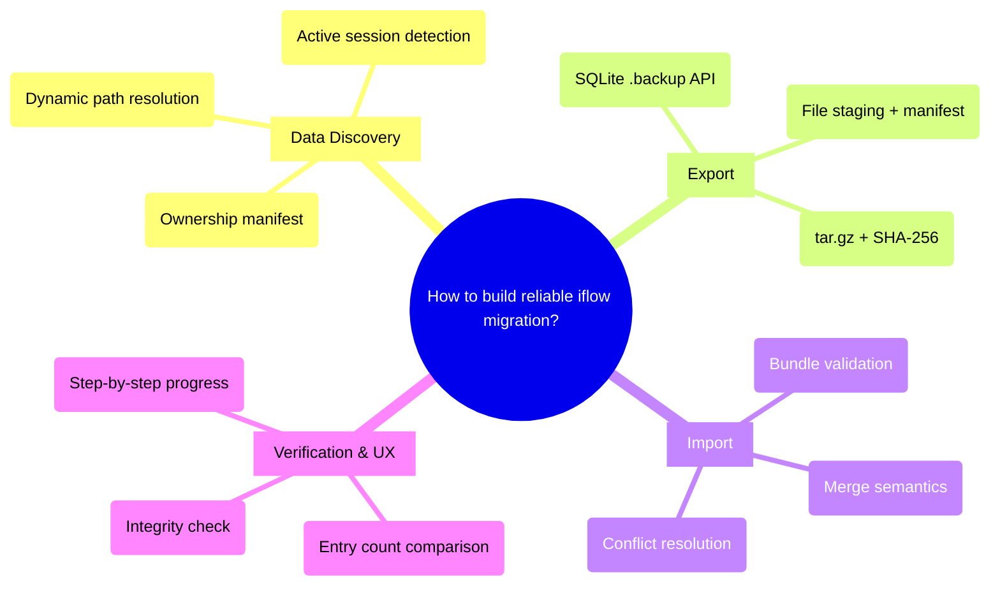

# PRD: iflow Migration Tool

## Status
- Created: 2026-03-16
- Last updated: 2026-03-16
- Status: Draft
- Problem Type: Product/Feature
- Archetype: exploring-an-idea

## Problem Statement
Moving iflow to a new computer requires manually locating and copying scattered data stores across multiple locations. No unified export/import mechanism exists, and naive file copy of live SQLite databases risks silent data corruption due to WAL mode.

### Evidence
- Codebase analysis: Data spread across `~/.claude/iflow/memory/` (semantic memory DB), `~/.claude/iflow/entities/` (entity registry DB), project-level `docs/knowledge-bank/`, and `.claude/iflow.local.md` configs -- Evidence: codebase exploration
- No existing export/backup/restore commands found in iflow -- Evidence: skill-searcher scan of commands, scripts, skills
- SQLite WAL mode means naive file copy produces silently truncated databases -- Evidence: https://sqlite.org/wal.html
- `setup.sh` exists for fresh installs but creates empty stores, not restored ones -- Evidence: plugins/iflow/scripts/setup.sh

## Goals
1. Enable reliable migration of all global iflow state to a new machine with a single export + import workflow
2. Guarantee SQLite database integrity during export (no silent corruption)
3. Provide clear UX with progress reporting, dry-run, and conflict handling

## Success Criteria
- [ ] `scripts/migrate.sh export` produces a portable `.tar.gz` bundle containing all global iflow state
- [ ] `scripts/migrate.sh import <bundle>` restores state on a new machine with merge semantics (no data loss on either side)
- [ ] SQLite databases are exported via `.backup` API (not raw file copy) ensuring WAL-safe snapshots
- [ ] Bundle includes a manifest.json with schema_version, plugin_version, timestamp, and file inventory with checksums
- [ ] `--dry-run` flag on import shows what would be restored without touching anything
- [ ] Post-import verification reports entry counts and integrity status
- [ ] `doctor.sh` passes on the destination machine after import

## User Stories

### Story 1: Machine Migration
**As a** developer setting up a new computer **I want** to export all my iflow knowledge and entity history from my old machine **So that** my new machine has full context from day one without manual file hunting.
**Acceptance criteria:**
- Single command produces a portable bundle file
- Bundle is self-contained (no external dependencies to restore)
- Import on new machine restores all global state

### Story 2: Backup Before Upgrade
**As a** developer upgrading iflow **I want** to snapshot my current state before a potentially breaking change **So that** I can roll back if the upgrade corrupts my data.
**Acceptance criteria:**
- Export works while no Claude session is active
- Bundle is timestamped for versioning
- Import can restore over a corrupted state

### Story 3: Partial Machine (Merge)
**As a** developer who started using the new machine before remembering to import **I want** import to merge with existing state **So that** neither old nor new entries are lost.
**Acceptance criteria:**
- Memory entries use source_hash deduplication (matching existing writer behavior; skip existing, add new)
- Entity records use INSERT OR IGNORE semantics
- Config files skip if already present (unless `--force`)

## Use Cases

### UC-1: Full Export
**Actors:** Developer | **Preconditions:** No active Claude session (MCP servers not running)
**Flow:**
1. Run `scripts/migrate.sh export [output-path]`
2. Script discovers all global data stores via data manifest
3. SQLite DBs backed up via `sqlite3 .backup` API
4. Markdown files and configs copied to staging directory
5. manifest.json generated with checksums
6. Staged directory compressed to `.tar.gz`
7. Summary printed: file count, total size, checksum
**Postconditions:** Portable bundle file exists at output path
**Edge cases:** Active Claude session detected -> warn and abort (or `--force` to proceed)

### UC-2: Full Import
**Actors:** Developer on new machine | **Preconditions:** iflow plugin installed, no active Claude session
**Flow:**
1. Run `scripts/migrate.sh import <bundle-path>`
2. Script validates bundle integrity (checksum, manifest version)
3. `--dry-run` mode: print what would be restored, exit
4. Create `~/.claude/iflow/` directory structure if absent
5. Restore SQLite DBs with merge semantics
6. Copy markdown memory files (skip existing by content hash)
7. Copy config files (skip if exists, unless `--force`)
8. Run post-import verification (entry counts, integrity check)
9. Print summary: N memory entries, M entity records, K files restored/skipped
**Postconditions:** Global iflow state restored; `doctor.sh` passes
**Edge cases:** Version mismatch between bundle schema and current iflow -> warn with migration guidance

### UC-3: Dry Run
**Actors:** Developer | **Preconditions:** Bundle file exists
**Flow:**
1. Run `scripts/migrate.sh import --dry-run <bundle-path>`
2. Script reads manifest, compares against current state
3. Prints: files to add, files to skip (already exist), DB entries to merge
4. No filesystem changes made
**Postconditions:** User has full visibility into what import would do

## Edge Cases & Error Handling
| Scenario | Expected Behavior | Rationale |
|----------|-------------------|-----------|
| Active Claude session during export | Detect MCP server processes, warn and abort (bypass with `--force`) | Live DB connections create race conditions |
| Bundle from newer iflow version | Reject with clear error: "Bundle requires iflow >= X.Y.Z" | Prevent schema incompatibility |
| Bundle from older iflow version | Accept with warning; schema migrations handle forward compat | Old data is a subset of new schema |
| Destination already has state | Merge semantics: add missing entries, skip duplicates | Zero data loss on both sides |
| Disk full during import | Abort cleanly, remove partial files, report what was and wasn't restored | Avoid half-migrated state |
| Corrupt bundle (checksum mismatch) | Reject with clear error before touching any files | Fail fast, fail safe |
| Different embedding provider on target | Warn: "Embeddings were generated with {provider}. Semantic search may degrade. Run backfill to regenerate." | Embeddings are model-tied |

## Constraints

### Behavioral Constraints (Must NOT do)
- Must NOT copy raw `.db` files without WAL checkpoint or `.backup` API -- Rationale: Silent data corruption
- Must NOT overwrite existing state without explicit `--force` flag -- Rationale: Protect new machine's work
- Must NOT export project-level `docs/` state -- Rationale: Already in git; creating a second copy causes divergence
- Must NOT require an active Claude session to run -- Rationale: Export/import should work standalone

### Technical Constraints
- SQLite `.backup` API requires Python `sqlite3` stdlib (available in venv) -- Evidence: https://sqlite.org/backup.html
- Bundle must be a single file for easy transfer (USB, email, cloud) -- Evidence: User input
- `entities.db` path is overridable via `ENTITY_DB_PATH` env var -- Evidence: plugins/iflow/mcp/entity_server.py:51-54
- Embedding vectors are tied to specific provider/model -- Evidence: plugins/iflow/hooks/lib/semantic_memory/database.py

## Requirements

### Functional
- FR-1: `scripts/migrate.sh export [output-path]` produces a versioned `.tar.gz` bundle
- FR-2: `scripts/migrate.sh import <bundle-path>` restores global state with merge semantics
- FR-3: `--dry-run` flag on import previews changes without modifying filesystem
- FR-4: `--force` flag on import overwrites existing files instead of skipping
- FR-5: Bundle manifest.json includes schema_version, plugin_version, export_timestamp, source_platform, and per-file SHA-256 checksums
- FR-6: SQLite databases exported via Python `sqlite3.Connection.backup()` API
- FR-7: Post-import verification: entry count comparison, `PRAGMA integrity_check` on restored DBs
- FR-8: Active session detection via `pgrep -f 'memory_server\|entity_server\|workflow_state_server'` before export; warn and abort if found (bypass with `--force`). Note: detection pattern should be verified against actual MCP server launch commands during implementation.
- FR-9: Embedding provider mismatch detection and warning on import
- FR-10: Data ownership manifest (JSON) listing all global data stores -- serves as canonical registry for what constitutes "iflow state"

### Data Inventory (FR-10 Detail)
The data ownership manifest (`data-manifest.json`) defines the complete set of global iflow state:

| Store | Path | Type | Export Method |
|-------|------|------|---------------|
| Semantic memory DB | `~/.claude/iflow/memory/memory.db` | SQLite (WAL) | `sqlite3.Connection.backup()` — path is hardcoded (no env override) |
| Entity registry DB | `~/.claude/iflow/entities/entities.db` | SQLite (WAL) | `sqlite3.Connection.backup()` — respects `ENTITY_DB_PATH` env override |
| Memory category files | `~/.claude/iflow/memory/*.md` | Markdown | File copy |

**Excluded from migration scope:**
- `~/.claude/iflow.local.md` — per-project config, auto-provisioned from template on first run. Not global state.
- `docs/knowledge-bank/` — project-level, travels via git.
- Plugin files (`~/.claude/plugins/cache/`) — installed by `setup.sh`, not user data.
- `.venv/` — recreated by `setup.sh`.

### Non-Functional
- NFR-1: Export completes in < 30 seconds for typical state sizes
- NFR-2: Bundle size < 50MB for typical usage (SQLite DBs + markdown files)
- NFR-3: No external dependencies beyond Python stdlib + iflow venv
- NFR-4: Step-by-step progress output ("Step 2/5: backing up entities database...")
- NFR-5: Respects NO_COLOR env var for plain output

## Non-Goals
- Cloud sync or continuous backup -- Rationale: Migration is a discrete event; sync is a separate concern
- Project-level state export -- Rationale: `docs/knowledge-bank/` and `.meta.json` files travel via git
- Encryption of bundle contents -- Rationale: Bundle is transferred by user on trusted media; encryption adds complexity
- GUI or interactive TUI -- Rationale: CLI script matches iflow's existing tool patterns

## Out of Scope (This Release)
- Selective per-project export -- Future consideration: `--project <path>` flag for project-scoped entities
- Incremental/delta export -- Future consideration: watermark-based export for frequent syncs
- Cross-platform support (Linux/Windows) -- Future consideration: macOS-only for now, matching user base
- Automatic embedding re-generation on import -- Future consideration: backfill integration after provider mismatch

## Research Summary

### Internet Research
- SQLite `.backup` API is the industry-standard for safe hot backup; no WAL checkpoint needed -- Source: https://sqlite.org/wal.html
- Homebrew Bundle uses declarative Brewfile + `brew bundle dump/install` pattern -- Source: https://docs.brew.sh/Brew-Bundle-and-Brewfile
- CLIG guidelines: `--dry-run` flag, progress to stderr, results to stdout, `--json` for machine-readable -- Source: https://clig.dev/
- tar.gz preferred for Unix portability; include SHA-256 checksum file alongside archive -- Source: https://www.luxa.org/blog/archive-formats-comparison
- Migration manifest should include schema_version, tool_version, export_timestamp, source_platform -- Source: https://www.schemastore.org/
- Evil Martians CLI UX: X-of-Y pattern for step-by-step operations; past tense on completion -- Source: https://evilmartians.com/chronicles/cli-ux-best-practices-3-patterns-for-improving-progress-displays
- Conflict resolution: offer `--overwrite`/`--skip`/`--merge` flags, default to safest option -- Source: https://clig.dev/

### Codebase Analysis
- Two SQLite databases: `memory.db` (semantic memory, schema v3) and `entities.db` (entity registry with workflow_phases) -- Location: plugins/iflow/hooks/lib/semantic_memory/database.py, plugins/iflow/hooks/lib/entity_registry/database.py
- Global store at `~/.claude/iflow/memory/` and `~/.claude/iflow/entities/` -- Location: plugins/iflow/mcp/memory_server.py:222, entity_server.py:52
- `entities.db` path overridable via `ENTITY_DB_PATH` env var -- Location: plugins/iflow/mcp/entity_server.py:51-54
- `setup.sh` handles fresh install (7-step interactive), `doctor.sh` handles health checks -- Location: plugins/iflow/scripts/
- `sync-cache.sh` syncs plugin files (not data) via rsync -- Location: plugins/iflow/hooks/sync-cache.sh
- `MarkdownImporter` can re-import knowledge bank markdown into semantic memory DB -- Location: plugins/iflow/hooks/lib/semantic_memory/importer.py
- Plugin venv excluded from sync (`--exclude='.venv'`); recreated by `setup.sh` -- Location: plugins/iflow/hooks/sync-cache.sh:32
- `.claude/iflow.local.md` per-project config auto-provisioned from template on first run -- Location: plugins/iflow/hooks/session-start.sh:344-349

### Existing Capabilities
- `setup.sh` -- Creates fresh iflow install with empty stores; could be extended to accept import bundle
- `doctor.sh` -- Health check validates all stores exist and are accessible; serves as post-import verification
- `sync-cache.sh` -- Plugin file sync; not relevant to data migration but shows rsync patterns
- `MarkdownImporter` -- Bulk imports knowledge bank markdown into semantic memory DB; relevant for re-importing after migration

## Structured Analysis

### Problem Type
Product/Feature -- A user-facing tool solving a concrete workflow gap (machine migration)

### SCQA Framing
- **Situation:** iflow stores knowledge, memories, entity registries, and configs across `~/.claude/iflow/` (global) and project-level directories. Users work across multiple machines.
- **Complication:** When migrating to a new computer, there's no unified way to export and restore this scattered global state. Manual file copying is error-prone and risks SQLite WAL corruption.
- **Question:** How should we build a migration tool that reliably captures and restores all iflow global state?
- **Answer:** A `scripts/migrate.sh` script with `export` and `import` subcommands, using SQLite `.backup` API for database integrity, tar.gz bundles with versioned manifests, and merge semantics on import.

### Decomposition
```
How to build reliable iflow migration?
+-- Data Discovery & Ownership
|   +-- Data ownership manifest (canonical list of global stores)
|   +-- Dynamic path resolution (ENTITY_DB_PATH override)
|   +-- Active session detection (MCP server lock check)
+-- Export Mechanism
|   +-- SQLite .backup API for DB integrity
|   +-- File staging + manifest generation
|   +-- tar.gz compression with SHA-256 checksum
+-- Import Mechanism
|   +-- Bundle validation (checksum, schema version)
|   +-- Merge semantics (INSERT OR IGNORE for DB, skip-existing for files)
|   +-- Conflict resolution (--force flag, --dry-run preview)
+-- Verification & UX
    +-- Post-import integrity check (PRAGMA integrity_check)
    +-- Entry count comparison (exported vs imported)
    +-- Step-by-step progress output (X-of-Y pattern)
```

### Mind Map


## Strategic Analysis

### First-principles
- **Core Finding:** The real problem is the absence of an explicit iflow data ownership model -- export/import is one consumer of that model, not the full solution.
- **Analysis:** Recursively asking "why" reveals: data is scattered because iflow grew organically for single-machine use. The migration problem is a symptom of having no canonical registry of what constitutes "complete iflow state." A key reframing: project-level `docs/knowledge-bank/` is already in git -- it needs no export. The actual migration scope reduces to `~/.claude/iflow/` only (two SQLite DBs + markdown memory files). The simplest irreducible solution is: checkpoint SQLite WAL, tar the directory, extract on the new machine. A dedicated command is a convenience wrapper. However, without a data ownership manifest, any export tool will silently become incomplete when new stores are added in future versions.
- **Key Risks:**
  - Building on the assumption we know all data locations without a formal manifest
  - SQLite WAL files must be checkpointed; all naive copy approaches skip this
  - Semantic embeddings are model-tied and not truly portable across providers
- **Recommendation:** Create a data ownership manifest (JSON) as the first deliverable. The export command derives from it trivially.
- **Evidence Quality:** moderate

### Vision-horizon
- **Core Finding:** This is a tactical fix optimized for the 6-month horizon, but a 5-line manifest JSON addition unlocks strategic 2-year value (backup, team onboarding, cloud sync, rollback).
- **Analysis:** The export/import capability, if designed with a versioned manifest, becomes reusable infrastructure beyond just migration. The 2-year risk is schema version drift -- if bundles don't embed a schema_version, any `entities.db` schema change silently breaks old bundles. Phase 1 (global state only, versioned manifest) solves migration. Phase 2 (project scope, incremental sync) becomes possible without breaking changes. SQLite `.dump` (text SQL) is the correct portability primitive -- schema-embedded, human-readable, transaction-safe.
- **Key Risks:**
  - No bundle format versioning means schema changes silently break exported bundles
  - Framing as full-state export (including global semantic memory) makes bundles unsafe for team-sharing
  - The "no backward compat" principle creates tension with a format that persists in users' hands
- **Recommendation:** Include `schema_version` and `plugin_version` in the manifest from day one. This is a 5-line JSON addition that preserves all future options.
- **Evidence Quality:** moderate

### Opportunity-cost
- **Core Finding:** ~80% of iflow state is already portable via git or plain file copy. The real gap is two SQLite databases, solvable with a 30-line script.
- **Analysis:** The dotfiles ecosystem (chezmoi, yadm) already solves this problem class but wasn't considered. Python's `sqlite3.Connection.backup()` provides integrity-safe hot backup with zero dependencies. Migration frequency is likely once per 1-2 years -- the ROI of a full brainstorm-spec-design-implement cycle is questionable relative to a simple `scripts/migrate.sh`. Munger inversion: doing nothing means one painful hour per migration; a documented checklist solves 95% of that at 1% of the build cost. The viable path: start with a shell script, promote to a full command only if the script reveals real complexity.
- **Key Risks:**
  - Over-investing in a full command lifecycle for a once-per-year event
  - Building a full export creates a maintenance obligation (every new store must update the manifest)
  - The simpler alternatives (chezmoi, cloud symlink, documented checklist) were dismissed too quickly
- **Recommendation:** Build `scripts/migrate.sh` as a standalone script (not a full iflow command). Validate on real hardware first. Promote to a command only if justified by discovered complexity.
- **Evidence Quality:** moderate

### Pre-mortem
- **Core Finding:** The most likely failure mode is silent data corruption -- the bundle appears complete on export and restores without errors, but SQLite databases are missing recent entries due to WAL sidecars not being included.
- **Analysis:** Prospective hindsight reveals three cascading failure modes: (1) SQLite WAL files not included in naive file copy -- the `.db` opens without error but is missing all transactions since the last checkpoint. Export during an active Claude session (MCP servers hold live connections) compounds this. (2) Hardcoded paths miss configurable `artifacts_root` -- a fixed-path exporter silently misses non-default configurations. (3) Restore is not transactional -- partial failure (permission denied on 4th file) leaves a silently broken state that starts up normally.
- **Key Risks:**
  - [HIGH/HIGH] SQLite WAL file not included in bundle -- requires `.backup` API or WAL checkpoint
  - [HIGH/MEDIUM] Export runs while MCP servers are active -- race conditions on live DB connections
  - [MEDIUM/HIGH] Hardcoded paths miss configurable `artifacts_root`
  - [MEDIUM/HIGH] Entity lineage references file paths in project repos that may not exist on target
  - [MEDIUM/MEDIUM] Embedding vectors not portable across providers/models
  - [LOW/HIGH] Import overwrites newer state without `--dry-run` or `--force` gate
- **Recommendation:** Define WAL-safe export strategy (`.backup` API) as a non-negotiable technical requirement. Detect active sessions and refuse to export by default.
- **Evidence Quality:** moderate

### Working Backwards
- **Press Release:** "iflow users can now migrate their entire workflow state to a new machine with a single command. `scripts/migrate.sh export` produces a portable bundle containing all semantic memory, entity history, and config -- with SQLite integrity guaranteed via the native `.backup` API. On the destination, `scripts/migrate.sh import bundle.tar.gz` restores everything with merge semantics. The user opens their new machine's terminal and their AI assistant already knows their history."
- **Analysis:** The press release is achievable with narrow scope: global iflow state only (`~/.claude/iflow/`). Project-level knowledge banks travel via git, not this tool. The crux design decision is the conflict model: "zero data loss" requires merge semantics (INSERT OR IGNORE for DB, skip-or-prompt for files), not replace semantics. A `--dry-run` flag is the single feature that converts a scary destructive operation into a trustworthy one.
- **Skeptical FAQ:**
  1. "What about project-level knowledge banks?" -- They're in git. Export scope is explicitly global state only.
  2. "Does import overwrite or merge?" -- Merge by default. `--force` to overwrite. `--dry-run` to preview.
  3. "Is the bundle safe to share?" -- It contains workflow history from private projects. Treat as sensitive. Warning printed at export time.
- **Minimum Viable Deliverable:** `export` (SQLite .backup + file copy + manifest + tar.gz), `import` (validate + merge + verify), `--dry-run` flag.
- **Recommendation:** Scope to global state. Define merge semantics explicitly. `--dry-run` is non-negotiable.
- **Evidence Quality:** moderate

## Options Evaluated

### Option 1: Standalone Shell Script (`scripts/migrate.sh`)
- **Description:** A self-contained bash/Python script in the scripts directory. Not an iflow command -- runs independently of Claude sessions.
- **Pros:** Minimal implementation effort (~1 day). No workflow ceremony. Works without Claude running. Easy to test manually. Follows opportunity-cost advisor's recommendation.
- **Cons:** Not discoverable via `/iflow:` commands. No integration with workflow state or entity registry.
- **Evidence:** Aligns with existing `setup.sh` and `doctor.sh` pattern in `scripts/`.

### Option 2: Full iflow Command (`/iflow:migrate`)
- **Description:** A new command + skill pair integrated into the iflow workflow. Discoverable, documented, testable via the standard iflow pipeline.
- **Pros:** Discoverable. Can leverage MCP tools for entity operations. Fits the plugin architecture.
- **Cons:** Higher implementation cost (5-10x). Requires Claude session to run (contradicts "works standalone" requirement). Maintenance burden for every new data store.
- **Evidence:** Conflicts with constraint that export should work without Claude running.

### Option 3: Documented Checklist Only
- **Description:** Add a migration section to `README_FOR_DEV.md` with step-by-step commands.
- **Pros:** Zero implementation cost. Immediately available. No maintenance burden.
- **Cons:** Manual and error-prone. No integrity guarantees. Relies on user not forgetting steps.
- **Evidence:** Opportunity-cost advisor identifies this as the 95%-solution at 1% cost.

## Decision Matrix
| Criterion | Weight | Option 1: Script | Option 2: Command | Option 3: Docs |
|-----------|--------|-------------------|-------------------|----------------|
| Implementation effort | 3 | 5 (low) | 2 (high) | 5 (none) |
| Data integrity guarantee | 5 | 5 (.backup API) | 5 (.backup API) | 2 (manual) |
| User experience | 4 | 4 (good CLI UX) | 5 (discoverable) | 2 (manual steps) |
| Maintenance burden | 3 | 4 (low) | 2 (high) | 5 (none) |
| Standalone operation | 4 | 5 (no Claude needed) | 1 (needs session) | 5 (no Claude needed) |
| **Weighted Total** | | **88** | **61** | **68** |

**Recommendation:** Option 1 (standalone script) wins decisively. It provides full data integrity with minimal cost and works independently of Claude sessions.

## Review History

### Review 1 (2026-03-16)
**Findings:**
- [blocker] Unresolved architectural decision (bash vs Python) left in Open Questions
- [blocker] No merge strategy specified for SQLite databases when destination has existing state
- [warning] No explicit Data Inventory section listing all global stores
- [warning] Session detection mechanism unspecified (just "check for running MCP server processes")
- [warning] Decision matrix weighted totals miscalculated (89 should be 88; others also off)
- [warning] iflow.local.md exclusion rationale missing
- [suggestion] Document that memory.db path is not overridable (unlike entities.db)
- [suggestion] Embeddings decision should be stated, not left as open question

**Corrections Applied:**
- Added Technical Approach section resolving bash+Python architecture — Reason: blocker on unresolved arch decision
- Added Merge Strategy subsection with empty-destination vs existing-state strategies — Reason: blocker on unspecified merge
- Added Data Inventory section detailing all stores and exclusions — Reason: warning on missing inventory
- Specified `pgrep -f` detection in FR-8 — Reason: warning on unspecified detection mechanism
- Recalculated decision matrix totals (88/61/68) — Reason: warning on math errors
- Clarified iflow.local.md exclusion in Data Inventory — Reason: warning on missing rationale
- Stated embeddings-included decision in Technical Approach — Reason: suggestion to resolve open question
- Removed resolved items from Open Questions — Reason: blockers/suggestions now addressed

### Review 2 (2026-03-16)
**Findings:**
- [blocker] Entity merge incorrectly attributed deduplication to uuid PK instead of type_id UNIQUE constraint
- [warning] Merge strategy missing workflow_phases table (FK dependency on entities)
- [warning] source_hash described as full SHA-256 but actual impl truncates to 16 hex chars
- [warning] memory.db path overridability not documented (asymmetry with entities.db)
- [suggestion] pgrep pattern may not match actual process names
- [suggestion] Open Questions are non-blocking future considerations

**Corrections Applied:**
- Rewrote entities.db merge to reference type_id UNIQUE constraint, destination-wins model — Reason: blocker on incorrect dedup mechanism
- Added workflow_phases handling to merge strategy (insert for new, skip for existing) — Reason: warning on missing dependent table
- Changed source_hash description to "matching existing writer behavior" — Reason: warning on imprecise implementation detail
- Added path override notes to Data Inventory table — Reason: warning on asymmetry
- Added implementation verification note to FR-8 — Reason: suggestion on pattern accuracy
- Labeled Open Questions as non-blocking — Reason: suggestion on blocking impression

## Technical Approach

**Architecture: Bash wrapper + Python for SQLite operations.**

The script uses bash for file operations, tar/gz, and CLI UX (matching `setup.sh`/`doctor.sh` patterns), and delegates to Python for all SQLite interactions via `sqlite3.Connection.backup()`. This avoids reimplementing CLI patterns in Python while leveraging Python's stdlib for WAL-safe database backup.

**Why not pure bash?** The `sqlite3` CLI `.backup` command exists but is less reliable than Python's `Connection.backup()` for WAL mode databases. The Python stdlib is already available via the iflow venv.

**Why not pure Python?** The existing scripts (`setup.sh`, `doctor.sh`) are bash. Consistency with the codebase matters more than language purity.

**Merge Strategy for SQLite Databases:**

| Scenario | Strategy | Rationale |
|----------|----------|-----------|
| Empty destination (fresh machine) | Direct `.backup` restore — copy exported DB as-is | No data to preserve; fastest path |
| Existing state (partial machine) | Row-by-row merge using existing Python APIs | Preserve both old and new entries |

Row-by-row merge details:
- **memory.db:** Query all rows from exported DB, insert into destination using `source_hash` deduplication (truncated SHA-256, 16 hex chars, matching existing writer behavior). Skip rows where `source_hash` already exists in destination.
- **entities.db:** Query all entity rows from exported DB. `INSERT OR IGNORE` deduplicates on the `UNIQUE type_id` constraint (not uuid PK — uuid is auto-generated per machine, so the same logical entity has different uuids on different machines). When both machines have the same entity (same type_id) with different state, the destination version is preserved (destination-wins model). For each successfully inserted entity, also insert its corresponding `workflow_phases` row. For skipped entities (type_id already exists), skip their workflow_phases rows too, preserving destination workflow state. Dry-run output should report N entities skipped due to type_id conflicts.

**Embeddings:** Included in the bundle as-is. On import, if the destination uses a different embedding provider, a warning is printed: "Embeddings generated with {provider}. Semantic search may degrade. Run backfill to regenerate." Stripping embeddings is not worth the complexity — bundle size is negligible (<50MB per NFR-2).

## Open Questions
Non-blocking, future considerations:
- What is the maximum acceptable bundle size before we need selective export?
- Should the manifest include a "data stores added since export" detection mechanism for future-proofing?

## Next Steps
Ready for /iflow:create-feature to begin implementation.
