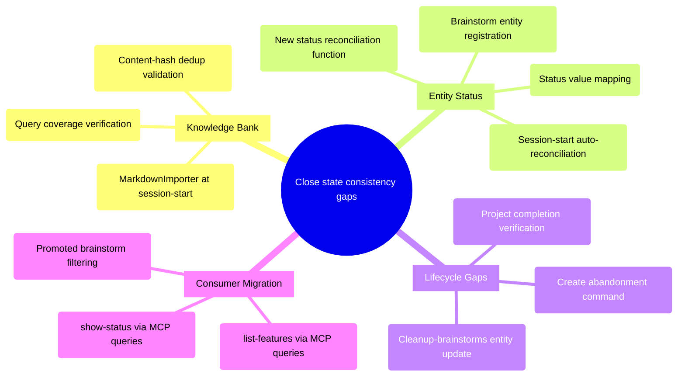

# PRD: State Consistency Consolidation

## Status
- Created: 2026-03-18
- Last updated: 2026-03-18 (Review 1 corrections applied)
- Status: Draft
- Problem Type: Product/Feature
- Archetype: exploring-an-idea
*Source: Backlog #00038*
*Source: Backlog #00040*

## Problem Statement
The iflow plugin has two state consistency gaps that degrade agent reliability:

1. **Knowledge bank divergence:** Markdown KB (`docs/knowledge-bank/`) has ~169 entries from retrospectives while the semantic memory DB (`~/.claude/iflow/memory/memory.db`) has ~417 entries from automated `store_memory` calls. Neither is a superset of the other. Queries for well-documented topics like "markdown migration", "hook development bash stderr", and "entity registry" return 0 DB hits despite being well-documented in markdown files. — Evidence: Backlog #00038

2. **Entity registry status drift:** Project completion doesn't update entity status (stays "active" while `.meta.json` says "completed"), abandoned features don't update the entity registry, `update_entity` MCP tool exists but is never called, and `cleanup-brainstorms` orphans entity registry rows. The result is stale data when querying entities for status, lineage, or lifecycle state. — Evidence: Backlog #00040

Both problems share a root cause: **dual write paths with no enforced single entry point**. The knowledge bank diverged because retros write both stores while session captures write DB only. The entity registry drifts because `.meta.json` mutations bypass the entity DB. — Evidence: Codebase analysis

### Evidence
- Backlog #00038: Knowledge bank markdown-to-DB sync gap documented with specific query failures
- Backlog #00040: Entity registry status tracking gaps identified via lifecycle audit
- Codebase analysis: The `update_entity` MCP tool is not invoked by any command/skill workflow. While `db.update_entity()` is called internally for completion (engine.py:173) and registration (workflow_state_server.py), non-completion lifecycle transitions (abandonment, archival) have no entity status update path
- Codebase analysis: `frontmatter_sync.py` `COMPARABLE_FIELD_MAP` operates on markdown frontmatter headers (entity_uuid, entity_type_id), not `.meta.json` JSON content — cannot be used for status sync
- Codebase analysis: `cleanup-brainstorms` deletes files with no entity registry update
- Codebase analysis: No abandonment command or flow exists — `abandoned` is a valid terminal status in workflow-state but no command transitions a feature to it

## Goals
1. Eliminate knowledge bank query blind spots — all curated knowledge findable regardless of entry origin
2. Close entity registry lifecycle gaps — entity status accurately reflects reality at all times
3. Leverage existing infrastructure — reconciliation tools, `MarkdownImporter`, `reconcile_apply` already exist
4. Minimal new coupling — avoid wiring entity DB updates into every lifecycle hook

## Success Criteria
- [ ] After MarkdownImporter runs, every markdown KB entry has a corresponding row in the semantic memory DB (verified by count comparison and spot-check queries for "markdown migration", "hook development bash stderr", "entity registry")
- [ ] Entity registry `status` field matches `.meta.json` `status` for all features and projects
- [ ] `show-status` and `list-features` can optionally query entity registry instead of scanning files
- [ ] Promoted brainstorms filtered from "Open Brainstorms" display (resolves Backlog #00039)
- [ ] No new dual-write paths introduced — each data domain has one authoritative write target

## User Stories
### Story 1: Agent queries knowledge bank
**As a** LLM agent executing a workflow phase **I want** `search_memory` to return relevant entries regardless of whether they came from retrospectives or session captures **So that** I have complete context for decision-making

**Acceptance criteria:**
- Query for "hook development" returns entries from both markdown KB and automated captures
- No duplicate entries in search results for topics covered by both stores

### Story 2: Agent checks entity status
**As a** the `show-status` command **I want** to query the entity registry for feature/brainstorm/project status **So that** I don't need to scan the filesystem and can filter promoted brainstorms

**Acceptance criteria:**
- Entity registry returns accurate status for completed, active, abandoned, and planned features
- Promoted brainstorms have status "promoted" in entity registry
- `show-status` can be implemented as MCP queries instead of file scanning

### Story 3: Developer abandons a feature
**As a** developer **I want** abandoning a feature to update the entity registry **So that** the entity's status is consistent across all stores

**Acceptance criteria:**
- Entity status set to "abandoned" in entity registry when feature is abandoned
- `.meta.json` and entity registry agree on status after abandonment

## Use Cases
### UC-1: Session-start reconciliation
**Actors:** Session-start hook | **Preconditions:** MCP servers available
**Flow:** 1. Hook triggers reconciliation 2. Reconciler reads all `.meta.json` files 3. Compares status with entity registry 4. Updates entity registry for any drift 5. Imports any new markdown KB entries to semantic DB
**Postconditions:** Entity registry and semantic DB are consistent with filesystem state
**Edge cases:** MCP unavailable → skip silently, reconcile on next session

### UC-2: Brainstorm cleanup with entity update
**Actors:** User running `/iflow:cleanup-brainstorms` | **Preconditions:** Brainstorm files exist
**Flow:** 1. User selects brainstorms to delete 2. Command deletes files 3. Command updates entity registry status to "archived" or removes entity
**Postconditions:** No orphaned entity registry rows for deleted brainstorms
**Edge cases:** Entity not in registry (old brainstorm) → skip entity update, delete file only

## Edge Cases & Error Handling
| Scenario | Expected Behavior | Rationale |
|----------|-------------------|-----------|
| MCP unavailable during reconciliation | Skip reconciliation, log warning | Fail-open pattern already established in workflow-transitions |
| Markdown KB entry with no DB equivalent | Import to DB via MarkdownImporter | Fills the blind spot for retro-sourced entries |
| DB entry with no markdown equivalent | Leave as-is (DB-only entries are by design) | Session captures are intentionally DB-only; not all knowledge needs curation |
| Entity in registry but .meta.json deleted | Mark entity status as "archived" | Prevents orphaned active entities |
| content_hash collision on import | Skip (already imported) | MarkdownImporter's existing dedup behavior |

## Constraints
### Behavioral Constraints (Must NOT do)
- Must NOT introduce bidirectional sync for knowledge bank — DB-only entries (session captures) are intentional, not a bug. Markdown → DB is the only sync direction needed. — Rationale: Pre-mortem analysis showed content_hash-based bidirectional sync inflates rather than converges
- Must NOT require agents to "remember" to call `update_entity` at every lifecycle point — Rationale: This is the current broken pattern; agents already forget
- Must NOT delete or modify markdown KB entries during sync — Rationale: Markdown files are version-controlled curated knowledge

### Technical Constraints
- Same SQLite file (`entities.db`) hosts both `entities` and `workflow_phases` tables — Evidence: database.py
- `frontmatter_sync.py` operates on markdown file frontmatter headers (entity_uuid, entity_type_id), not `.meta.json` JSON fields — it cannot be used for entity status sync — Evidence: frontmatter_sync.py:35-38, test_frontmatter_sync.py:72
- `MarkdownImporter` uses `content_hash(description)` as dedup key — any wording difference creates a new entry — Evidence: importer.py
- `complete_phase` updates entity registry status to "completed" via `db.update_entity()` when the finish phase completes (engine.py:172-173). The `.meta.json` status field is updated separately by the command flow. — Evidence: engine.py, workflow_state_server.py

## Requirements
### Functional
- FR-0: Run diagnostic queries before implementation: (a) `SELECT source, COUNT(*) FROM entries GROUP BY source` in memory.db to confirm KB source distribution; (b) count entity registry rows where status differs from `.meta.json` status. If drift is minimal, reduce scope to Phase 1 only.
- FR-1: Create a new status reconciliation function (separate from `frontmatter_sync`, which operates on markdown frontmatter headers, not `.meta.json` JSON content) that reads `.meta.json` `status` for all features/projects and calls `update_entity` to sync entity registry where drifted. Define explicit mapping: `.meta.json` status → entity registry status (active→active, completed→completed, abandoned→abandoned, planned→planned, promoted→promoted).
- FR-2: Wire the status reconciliation function and `MarkdownImporter` into session-start so both run automatically on each new session
- FR-3: Ensure `MarkdownImporter` runs on session-start to ingest any new markdown KB entries into semantic DB
- FR-4: Add entity registry update to `cleanup-brainstorms` command (mark deleted brainstorms as "archived")
- FR-5: Create a feature abandonment flow (e.g., an "Abandon" option in `finish-feature` or a new `/iflow:abandon-feature` command) that updates both `.meta.json` status to "abandoned" and entity registry status to "abandoned" atomically. Currently no abandonment command exists — `abandoned` is a valid terminal status but nothing transitions to it.
- FR-6: Refactor `show-status` to query entity registry + workflow engine MCP tools instead of scanning filesystem (resolves Backlog #00041). Preserve artifact-based fallback for MCP-unavailable scenarios.
- FR-7: Filter promoted brainstorms from "Open Brainstorms" by checking entity status != "promoted" (resolves Backlog #00039)
- FR-8: Add session-start reconciliation for brainstorm entities: scan `{artifacts_root}/brainstorms/` directory and register any unregistered brainstorm files as entities, so that `show-status` can query the entity registry for brainstorms instead of scanning files

### Non-Functional
- NFR-1: Session-start reconciliation (entity status sync + MarkdownImporter combined) must complete within 5 seconds for repos with <100 features. Budget allocation: ~2s entity reconciliation, ~3s KB import. MarkdownImporter should skip unchanged files (detected via file modification time) to stay within budget on subsequent runs. Add diagnostic logging that reports elapsed time per sub-operation.
- NFR-2: Reconciliation must be idempotent — safe to run multiple times with same result
- NFR-3: All reconciliation failures must be non-blocking (fail-open pattern)

## Non-Goals
- Full event sourcing for entity lifecycle — Rationale: Overkill for private tooling with <100 entities; append-only audit log adds complexity without proportional benefit
- Bidirectional knowledge bank sync (DB → markdown) — Rationale: Session captures are intentionally ephemeral; forcing them into curated markdown conflates two different knowledge tiers
- Real-time entity status updates via hooks at every lifecycle transition — Rationale: Session-start reconciliation achieves same correctness with less coupling
- Making `show-status` a standalone CLI tool — Rationale: It will remain a command file but backed by MCP queries instead of file scanning

## Out of Scope (This Release)
- Knowledge bank deduplication across stores (fuzzy matching of semantically similar entries) — Future consideration: Would require embedding comparison, significant complexity
- Entity registry garbage collection (removing entities for deleted features/projects) — Future consideration: "Archived" status preserves lineage history
- Migrating `show-status` to a Python script — Future consideration: MCP-backed command file is sufficient

## Research Summary
### Internet Research
- Single Source of Truth (SSOT) with one-way sync is the dominant pattern for file + DB hybrid systems — Source: Wikipedia SSOT, Confluent dual-write analysis
- Kubernetes reconciliation loop (desired state in files vs actual state in DB) is directly applicable — Source: Streamkap real-time sync guide
- The Dual Write Problem is the root cause of both issues — writing to two stores independently creates a failure window — Source: Confluent blog, AWS Transactional Outbox Pattern
- Knowledge base consolidation: treat markdown as SSOT, DB as derived index, sync via content hashing — Source: MindsDB, Gaianet docs
- Entity lifecycle tracking: Jira uses append-only history with validated state machine transitions — Source: Atlassian Community

### Codebase Analysis
- `update_entity` MCP tool exists but has zero call sites — Location: plugins/iflow/README.md:228
- `frontmatter_sync.py` operates on markdown frontmatter headers, not `.meta.json` JSON fields — cannot be used for status sync — Location: plugins/iflow/hooks/lib/entity_registry/frontmatter_sync.py
- `complete_phase` updates both DB and `.meta.json` atomically — already works for feature completion — Location: plugins/iflow/mcp/workflow_state_server.py
- `MarkdownImporter` exists in semantic_memory/importer.py — already bridges markdown → DB — Location: plugins/iflow/hooks/lib/semantic_memory/importer.py
- Reconciliation module fully implemented: `reconcile_check`, `reconcile_apply`, `reconcile_status`, `reconcile_frontmatter` — Location: plugins/iflow/mcp/workflow_state_server.py
- Same SQLite file hosts entities and workflow_phases tables — Location: plugins/iflow/hooks/lib/entity_registry/database.py
- `cleanup-brainstorms` deletes files with no entity registry update — Location: plugins/iflow/commands/cleanup-brainstorms.md
- No abandonment command exists — `abandoned` is a valid terminal status but no command transitions to it — Location: plugins/iflow/commands/finish-feature.md (no abandon flow), plugins/iflow/skills/workflow-state/SKILL.md (defines abandoned as terminal status)

### Existing Capabilities
- Reconciliation MCP tools (reconcile_check, reconcile_apply, reconcile_status, reconcile_frontmatter) — How it relates: Already detects and fixes .meta.json ↔ DB drift for workflow phases; can be extended for entity status
- MarkdownImporter — How it relates: Already imports markdown KB entries to semantic DB; needs to be wired into session-start
- frontmatter_sync module (detect_drift, stamp_header, scan_all) — How it relates: Handles markdown frontmatter header sync (entity_uuid, entity_type_id); NOT applicable for `.meta.json` status sync — a separate reconciliation function is needed
- workflow-transitions fail-open pattern — How it relates: Established precedent for non-blocking reconciliation with deferred recovery

## Structured Analysis

### Problem Type
Product/Feature — addressing internal tooling data consistency gaps that degrade agent reliability

### SCQA Framing
- **Situation:** iflow tracks entity lifecycle across three stores: `.meta.json` files (filesystem), `entities` table (SQLite), and `workflow_phases` table (SQLite). Knowledge is stored in both markdown files and a semantic memory DB. Reconciliation infrastructure exists but doesn't cover all drift vectors.
- **Complication:** Dual write paths cause silent divergence. Entity status drifts because `.meta.json` mutations bypass the entity DB. Knowledge queries miss entries because markdown KB and semantic DB are populated by different write paths. The `update_entity` tool was built but never wired in. `frontmatter_sync` deliberately excludes `status`. The result: agents get stale data, `show-status` shows promoted brainstorms, and lifecycle queries return incorrect state.
- **Question:** How should we close the state consistency gaps with minimal new coupling, leveraging existing reconciliation infrastructure?
- **Answer:** Extend the existing reconciliation loop rather than adding new write-path hooks. Create a new status reconciliation function (separate from `frontmatter_sync` which handles markdown headers), wire `MarkdownImporter` into session-start, create an abandonment command, and refactor `show-status` to query entity registry.

### Decomposition
```
How to close state consistency gaps with minimal coupling?
├── Knowledge Bank Sync
│   ├── Wire MarkdownImporter into session-start hook
│   ├── Verify content_hash dedup handles all markdown formats
│   └── Validate query coverage post-import
├── Entity Status Reconciliation
│   ├── New status reconciliation function (reads .meta.json, updates entity DB)
│   ├── Define .meta.json → entity status mapping
│   ├── Wire to session-start
│   ├── Brainstorm entity registration for unregistered files
│   └── Handle edge cases (missing .meta.json, archived entities)
├── Lifecycle Gap Closure
│   ├── Create abandonment command → updates .meta.json + entity registry
│   ├── Cleanup-brainstorms → update_entity(status="archived")
│   └── Project completion → verify complete_phase handles it
└── Consumer Migration
    ├── show-status → entity registry queries
    ├── list-features → entity registry queries
    └── Filter promoted brainstorms via entity status
```

### Mind Map


## Strategic Analysis

### Pre-mortem
- **Core Finding:** The consistency initiative fails because it treats two structurally different sync problems as one problem, picks bidirectional sync for the knowledge bank (the harder, more failure-prone design), and never enforces entity lifecycle transitions at the only reliable enforcement point — the hook layer.
- **Analysis:** The knowledge bank divergence (169 markdown vs 417 DB entries, neither a superset) signals the system already lived through the first failure mode once: automated `store_memory` calls wrote directly to the DB while humans wrote to markdown, and no reconciliation ever ran. Bidirectional sync using `content_hash(description)` as the primary key creates new records on any description edit — it inflates rather than converges. For the entity registry, the root problem is architectural: `update_entity` is an MCP tool that agents must remember to call, but it is never called. The `frontmatter_sync.py` `COMPARABLE_FIELD_MAP` excludes `status`, so existing sync infrastructure cannot close the gap even if invoked. The deeper overconfidence is that both problems are treated as sync problems when they are actually write-discipline problems. Sync is a recovery mechanism; it does not prevent re-divergence if the dual-write root cause remains.
- **Key Risks:**
  - Content-hash ID collision/fan-out if descriptions diverge between stores (HIGH likelihood)
  - No canonical conflict resolution strategy defined (HIGH likelihood)
  - Lifecycle transition hooks not wired to entity status (HIGH likelihood)
  - Re-divergence after first sync if dual write paths remain (MEDIUM likelihood)
  - `update_entity` MCP tool metadata parsing fragility (MEDIUM likelihood)
- **Recommendation:** Define one authoritative write path per data domain before designing sync. For knowledge bank, make markdown → DB unidirectional. For entity status, add a unidirectional reconciler that reads `.meta.json` and writes to DB.
- **Evidence Quality:** strong

### Opportunity-cost
- **Core Finding:** A `MarkdownImporter` that already bridges the KB divergence gap exists and runs — the real cost is not building new sync infrastructure but understanding why the importer's execution path doesn't cover all entries, and whether that gap matters in practice.
- **Analysis:** The two problems have very different opportunity-cost profiles. For the knowledge bank, `MarkdownImporter` already implements reconciliation logic: it parses markdown KB files and upserts into the semantic DB using content hashes. The 248-entry DB surplus is almost certainly explained by DB-only entries from `store_memory` calls (source='retro' or 'session-capture') that were never written back to markdown — this is by design, not a bug. The minimum experiment is a single diagnostic query: `SELECT source, COUNT(*) FROM entries GROUP BY source` to confirm. For entity registry drift, `frontmatter_sync.py` has complete bidirectional sync infrastructure; status is deliberately excluded from `COMPARABLE_FIELD_MAP`, making the entity drift problem a one-line config change plus a session-start reconciliation call. The `finish-feature` command already calls `complete_phase` which sets status to 'completed' — the gap is specifically abandonment paths and stale legacy records.
- **Key Risks:**
  - Building full bidirectional sync when unidirectional covers 95% of cases
  - Conflating two independent problems into one over-engineered shared solution
  - Closing lifecycle gaps at every hook point when session-start reconciliation achieves the same correctness
  - Treating the 169 vs 417 KB count as a sync problem when it reflects intentional design (DB-only captures)
- **Recommendation:** Before designing sync architecture, run diagnostic queries to quantify actual drift. If drift is under 20 records and KB source split confirms the expected pattern, the entire problem reduces to: one line in `COMPARABLE_FIELD_MAP`, one session-start reconciliation call, and targeted entity updates for abandon/cleanup — hours of work, not a feature sprint.
- **Evidence Quality:** strong

## Options Evaluated
### Option 1: Minimal Targeted Fixes
- **Description:** Create status reconciliation function, wire `MarkdownImporter` to session-start, add entity updates to abandon/cleanup commands. Keep `show-status` prompt-based but add brainstorm filtering.
- **Pros:** Least effort (~hours), leverages existing infrastructure entirely, minimal new code, minimal risk
- **Cons:** `show-status` remains LLM-based (slow, token-heavy), doesn't resolve #00041
- **Evidence:** Opportunity-cost advisor recommends this as the minimum viable experiment

### Option 2: Reconciliation-First with Consumer Migration
- **Description:** Everything in Option 1 plus: refactor `show-status` and `list-features` to query entity registry via MCP tools instead of scanning files. Add session-start reconciliation pass. Define explicit status mapping.
- **Pros:** Resolves all three backlog items (#00038, #00039, #00040, #00041), makes `show-status` faster and deterministic, establishes entity registry as the query layer
- **Cons:** More effort (~days), requires defining status value mapping, needs testing for MCP degradation fallback
- **Evidence:** Codebase analysis confirms all MCP tools exist; reconciliation infrastructure is already built

### Option 3: Full Event-Sourced Lifecycle
- **Description:** Everything in Option 2 plus: add append-only event log for all entity transitions, implement CDC-style change capture, real-time hooks at every lifecycle point
- **Pros:** Complete audit trail, real-time consistency, enables time-travel debugging
- **Cons:** Significant complexity for private tooling with <100 entities, over-engineered for current scale
- **Evidence:** Internet research shows event sourcing is best practice for large-scale systems but overkill here

## Decision Matrix
| Criterion | Weight | Option 1: Minimal | Option 2: Reconciliation + Migration | Option 3: Event-Sourced |
|-----------|--------|-------------------|--------------------------------------|------------------------|
| Effort to implement | 5 | 5 (hours) | 3 (days) | 1 (weeks) |
| Resolves all backlog items | 4 | 2 (#38,#40 partial) | 5 (#38,#39,#40,#41) | 5 (#38,#39,#40,#41) |
| Leverages existing infra | 4 | 5 | 4 | 2 |
| Prevents re-divergence | 3 | 3 (reconciliation-only) | 4 (reconciliation + targeted writes) | 5 (event-driven) |
| Maintenance burden | 3 | 5 (minimal new code) | 4 (moderate) | 2 (significant) |
| **Weighted Total** | | **77** | **75** | **54** |

*Calculation: W×S summed. Option 1: 25+8+20+9+15=77. Option 2: 15+20+16+12+12=75. Option 3: 5+20+8+15+6=54.*

**Recommendation:** Option 2 scores slightly lower than Option 1 on raw weighted total, but resolves all backlog items (#00038, #00039, #00040, #00041) and establishes entity registry as the authoritative query layer. The additional effort is justified by eliminating the LLM-based `show-status` bottleneck and creating a foundation for future entity-driven features.

**Implementation phasing:**
- **Phase 1:** KB import + entity status reconciliation at session-start (FR-0, FR-1, FR-2, FR-3, FR-8) — delivers core consistency
- **Phase 2:** Lifecycle gap closure for abandon/cleanup (FR-4, FR-5) — addresses missing commands
- **Phase 3:** show-status/list-features migration to MCP queries (FR-6, FR-7) — consumer migration

## Review History
### Review 1 (2026-03-18)
**Findings:**
- [blocker] FR-1 misidentifies `frontmatter_sync` as the mechanism for status sync — it operates on markdown frontmatter headers (entity_uuid, entity_type_id), not `.meta.json` JSON content (at: Requirements > FR-1, Constraints, Strategic Analysis)
- [blocker] FR-5 assumes an abandonment path exists to patch — no abandonment command or flow exists in the codebase; `abandoned` is a valid terminal status but nothing transitions to it (at: Requirements > FR-5, Evidence)
- [warning] Decision matrix weighted totals are arithmetically incorrect (at: Decision Matrix)
- [warning] FR-6/FR-7 depend on brainstorms being in entity registry, but most aren't registered — no requirement for brainstorm entity registration (at: Requirements > FR-6, FR-7)
- [warning] Success criterion "zero false-negative rate" is unmeasurable for semantic search (at: Success Criteria)
- [warning] Diagnostic queries should be a prerequisite, not an open question (at: Open Questions)
- [suggestion] Consider phasing implementation into independent work streams (at: Overall scope)
- [suggestion] NFR-1 should clarify combined budget for entity reconciliation + KB import (at: NFR-1)

**Corrections Applied:**
- FR-1 rewritten: new status reconciliation function (separate from frontmatter_sync) that reads `.meta.json` and calls `update_entity` — Reason: frontmatter_sync operates on wrong data source
- FR-5 rewritten: create abandonment flow (new command or option in finish-feature) — Reason: no abandonment path exists to patch
- Decision matrix totals recalculated: Option 1=77, Option 2=75, Option 3=54 — Reason: arithmetic error
- Added FR-8: brainstorm entity registration at session-start — Reason: show-status can't query entity registry for brainstorms if they aren't registered
- Added FR-0: diagnostic queries as prerequisite — Reason: promoted from open question per opportunity-cost advisor recommendation
- Success criterion rephrased to measurable form — Reason: "zero false-negative rate" is aspirational, not testable
- NFR-1 clarified to cover combined entity reconciliation + KB import budget — Reason: ambiguous scope
- Added implementation phasing (Phase 1/2/3) to recommendation — Reason: enables incremental delivery
- Removed resolved open questions, kept genuinely open ones — Reason: diagnostic queries and status mapping are now addressed in requirements

### Review 2 (2026-03-18)
**Findings:**
- [warning] Inaccurate claim about `update_entity` having zero call sites — `db.update_entity()` IS called internally for completion/registration, just not via MCP tool from workflows (at: Evidence)
- [warning] Inaccurate claim about `complete_phase` updating both DB and `.meta.json` atomically — it only updates DB; `.meta.json` status is updated by command flow (at: Technical Constraints)
- [warning] FR-1 status mapping omits `promoted` (at: Requirements > FR-1)
- [warning] NFR-1 lacks per-operation time budget breakdown (at: NFR-1)

**Corrections Applied:**
- Evidence bullet reworded to distinguish MCP tool (unused) from internal `db.update_entity()` calls (used for completion) — Reason: factual accuracy
- Technical constraint reworded to clarify `complete_phase` updates DB only — Reason: factual accuracy
- Added `promoted→promoted` to FR-1 status mapping — Reason: completeness
- Added 2s/3s budget allocation and diagnostic logging to NFR-1 — Reason: debuggability

**Result:** APPROVED with warnings corrected. No blockers.

## Open Questions
- Should `MarkdownImporter` session-start execution be synchronous (blocking) or asynchronous (background)?
- Should the abandonment flow be a new `/iflow:abandon-feature` command or an option within `finish-feature`?

## Next Steps
Ready for /iflow:create-feature to begin implementation.
