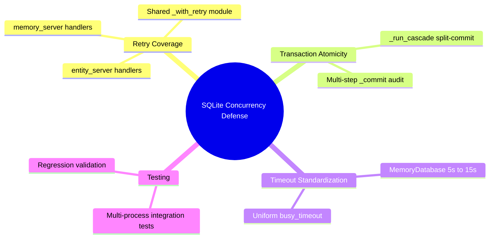

# PRD: SQLite Concurrency Defense

## Status
- Created: 2026-03-24
- Last updated: 2026-03-24
- Status: Draft
- Problem Type: Product/Feature
- Archetype: exploring-an-idea

## Problem Statement
SQLite databases shared across multiple MCP server processes (entity server, memory server, workflow state server) suffer write contention that causes silent partial commits. When split-commit handlers partially succeed then fail, the caller sees an error but state has already advanced — producing data integrity violations that are invisible at runtime.

### Evidence
- Codebase: `entity_server.py` and `memory_server.py` have zero `_with_retry` coverage at the MCP handler layer — lock contention errors propagate as unhandled MCP errors — Evidence: Codebase analysis
- Codebase: `_run_cascade()` in `entity_engine.py` makes two sequentially auto-committing calls (`cascade_unblock`, `rollup_parent`) without an enclosing transaction — Evidence: `entity_engine.py:585-591` (implementation), `entity_engine.py:161-170` (call site with error swallowing)
- Codebase: `MemoryDatabase` uses `busy_timeout=5000ms` while `EntityDatabase` uses `busy_timeout=15000ms` — inconsistent timeout windows — Evidence: `semantic_memory/database.py:790`, `entity_registry/database.py:969`
- Prior art: Features 056 (sqlite-write-contention-fix) and 058 (sqlite-db-locking-fix) established foundational patterns but left gaps — Evidence: `docs/features/056-sqlite-write-contention-fix/retro.md`
- External: `BEGIN DEFERRED` transaction write-upgrades bypass `busy_timeout` entirely, failing immediately with `SQLITE_BUSY` — Evidence: https://berthug.eu/articles/posts/a-brief-post-on-sqlite3-database-locked-despite-timeout/
- External: `SQLITE_BUSY_SNAPSHOT` in WAL mode requires full transaction restart, not just query retry — Evidence: http://activesphere.com/blog/2018/12/24/understanding-sqlite-busy
- RCA: Root cause analysis at `docs/rca/20260324-workflow-sql-error.md` documents three confirmed causes: 7-9 processes competing for writer lock, split-commit architecture, no retry/recovery — Evidence: Prior incident

## Goals
1. Eliminate silent partial commits across all shared SQLite databases
2. Standardize concurrency defense patterns across entity, memory, and workflow DB layers
3. Add application-level retry where SQLite's `busy_timeout` alone is insufficient

## Success Criteria
- [ ] All multi-step write operations wrapped in `BEGIN IMMEDIATE` transactions (zero split-commit paths)
- [ ] `_with_retry` decorator applied to entity server and memory server MCP handlers (parity with workflow state server)
- [ ] `busy_timeout` standardized across all database modules
- [ ] Concurrent-write integration tests validate correctness under multi-process contention
- [ ] Zero `OperationalError: database is locked` propagated as unhandled MCP errors

## User Stories
### Story 1: Reliable Entity Registration Under Contention
**As a** pd plugin user running multiple Claude Code sessions **I want** entity registration to succeed even when multiple MCP servers write concurrently **So that** entity state remains consistent without manual intervention
**Acceptance criteria:**
- `register_entity` succeeds or retries transparently under contention
- No partial entity state (registered but no workflow phase) persists

### Story 2: Consistent Phase Completion Cascades
**As a** developer completing a workflow phase **I want** the cascade (unblock dependents, rollup parent progress) to be atomic **So that** parent progress always reflects completed child phases
**Acceptance criteria:**
- `_run_cascade()` wrapped in a single transaction
- Cascade failure does not leave orphaned unblock/rollup state

### Story 3: Memory Server Write Reliability
**As a** pd plugin user capturing learnings **I want** memory writes to survive concurrent access from hooks and MCP servers **So that** no `store_memory` calls silently fail
**Acceptance criteria:**
- Memory server MCP handlers have retry coverage
- `busy_timeout` aligned with entity DB (15000ms)

## Use Cases
### UC-1: Concurrent MCP Server Writes
**Actors:** entity_server, workflow_state_server, memory_server | **Preconditions:** All three servers running, sharing `entities.db` and `memory.db`
**Flow:** 1. User completes a phase 2. Workflow server writes phase completion 3. Entity server registers a new entity simultaneously 4. Memory server stores a learning simultaneously
**Postconditions:** All three writes succeed (possibly with retry); no partial state
**Edge cases:** All three writers contend within the same 100ms window — retry backoff staggers them

### UC-2: Hook-Triggered Reconciliation During Active Session
**Actors:** reconciliation_orchestrator, entity_server | **Preconditions:** PostToolUse hook triggers reconciliation while entity server is mid-write
**Flow:** 1. Reconciliation opens DB connection 2. Attempts `BEGIN IMMEDIATE` 3. Gets `SQLITE_BUSY` 4. Retries with backoff 5. Succeeds after writer releases lock
**Postconditions:** Reconciliation completes; entity server write unaffected
**Edge cases:** Reconciliation timeout exceeds `busy_timeout` — falls back to next hook invocation

## Edge Cases & Error Handling
| Scenario | Expected Behavior | Rationale |
|----------|-------------------|-----------|
| All retry attempts exhausted | Return clear error to MCP caller with "database contention" context | Prevent silent swallowing; let caller decide whether to retry at a higher level |
| `SQLITE_BUSY_SNAPSHOT` (stale WAL snapshot) | Retry entire transaction, not just failing statement | WAL snapshot errors require fresh transaction start |
| Nested `BEGIN IMMEDIATE` attempt | `RuntimeError` raised immediately (existing guard) | Prevent deadlock; caller must restructure |
| `executescript()` called mid-transaction | Prevented by lint/review — `executescript()` auto-commits | Documented Python sqlite3 pitfall |
| Doctor diagnostic runs during active writes | Doctor uses short timeout (2s) and read-only checks | Doctor should not block or be blocked by writes |

## Constraints
### Behavioral Constraints (Must NOT do)
- Must NOT retry non-idempotent operations at sub-transaction granularity — Rationale: Partial replay of non-atomic writes can produce duplicate state
- Must NOT wrap single-statement writes in `BEGIN IMMEDIATE` unnecessarily — Rationale: Adds lock-acquisition latency with no benefit; `busy_timeout` handles these natively
- Must NOT introduce a single-writer proxy process — Rationale: Over-engineering for single-developer tooling; adds IPC latency and new failure modes

### Technical Constraints
- Must use existing `transaction()` / `begin_immediate()` infrastructure in `EntityDatabase` — Evidence: Feature 056 established these patterns
- Must work with Python 3.10+ `sqlite3` module (no `autocommit` attribute until 3.12) — Evidence: macOS system Python compatibility
- Must not change WAL mode or journal_mode — Evidence: WAL established as project standard
- Must not add external dependencies (e.g., `tenacity`) — Evidence: Plugin portability requirement

## Requirements
### Functional
- FR-1: Port `_with_retry` decorator from `workflow_state_server.py` to `entity_server.py` MCP handlers
- FR-2: Port `_with_retry` decorator from `workflow_state_server.py` to `memory_server.py` MCP handlers
- FR-3: Make cascade operations atomic within Phase B: ensure `cascade_unblock` and `rollup_parent` in `_run_cascade()` are wrapped in a single `transaction()` block. Note: the Phase A / Phase B separation is intentional by design (Phase A completion succeeds even if Phase B cascade fails, with reconciliation as recovery). This requirement preserves that separation but makes Phase B internally atomic.
- FR-4: Audit and wrap multi-step writes in `EntityDatabase` that issue multiple `_commit()` calls outside `BEGIN IMMEDIATE`
- FR-5: Standardize `busy_timeout` to 15000ms across all database modules (entity, memory, workflow)
- FR-6: Extract `_with_retry` and `_is_transient` into a shared library module at `plugins/pd/hooks/lib/sqlite_retry.py` for reuse across servers. Parameterize the server-name log prefix (currently hardcoded as `'workflow-state:'` in the existing implementation).

### Non-Functional
- NFR-1: Concurrent-write integration tests using multiple subprocesses with real file-backed SQLite
- NFR-2: Retry overhead is zero on the happy path (decorator only activates on `OperationalError`); verifiable by code inspection
- NFR-3: All existing 940+ entity registry tests, 309 workflow engine tests, and memory server tests continue to pass

## Non-Goals
- Consolidating multiple MCP servers into a single process — Rationale: Architectural change too large for this feature; evaluate separately
- Adding connection pooling — Rationale: Each MCP server uses one connection; pooling adds complexity without benefit
- Supporting concurrent writes from multiple machines (NFS) — Rationale: WAL mode requires same-host; this is local tooling

## Out of Scope (This Release)
- WAL checkpoint management (PRAGMA wal_checkpoint) — Future consideration: Monitor WAL file size under heavy use
- Python 3.12+ `autocommit` attribute adoption — Future consideration: When minimum Python version advances
- Retry at the Claude Code harness level (MCP call retry) — Future consideration: Higher-level retry for any MCP server failure

## Research Summary
### Internet Research
- WAL mode allows concurrent reads + single writer; `BEGIN DEFERRED` write-upgrades bypass `busy_timeout` — Source: https://www.sqlite.org/wal.html
- `SQLITE_BUSY_SNAPSHOT` requires full transaction restart, not query retry — Source: http://activesphere.com/blog/2018/12/24/understanding-sqlite-busy
- `BEGIN IMMEDIATE` makes SQLite respect `busy_timeout` for write lock acquisition — Source: https://berthug.eu/articles/posts/a-brief-post-on-sqlite3-database-locked-despite-timeout/
- Python `executescript()` always auto-commits regardless of `isolation_level` — Source: https://github.com/ghaering/pysqlite/issues/59
- Application-level retry must operate at transaction level, not statement level — Source: http://activesphere.com/blog/2018/12/24/understanding-sqlite-busy
- `synchronous=normal` is safe in WAL mode and faster than default `full` — Source: https://phiresky.github.io/blog/2020/sqlite-performance-tuning/

### Codebase Analysis
- `workflow_state_server.py:429` has production-ready `_with_retry` decorator — reusable pattern — Location: `plugins/pd/mcp/workflow_state_server.py:429-463`
- `entity_server.py` and `memory_server.py` have zero retry coverage — Location: `plugins/pd/mcp/entity_server.py`, `plugins/pd/mcp/memory_server.py`
- `_run_cascade()` in `entity_engine.py` makes two auto-committing calls without enclosing transaction — Location: `plugins/pd/hooks/lib/workflow_engine/entity_engine.py:165-170`
- `MemoryDatabase` busy_timeout=5000ms vs EntityDatabase 15000ms — inconsistent — Location: `semantic_memory/database.py:790`
- Three MCP servers + reconciliation_orchestrator + doctor all open connections to same DB files — Location: Multiple
- `memory_server.py:128` documents single-threaded assumption with TOCTOU window — Location: `plugins/pd/mcp/memory_server.py:128`. Note: the comment claiming "no concurrent writes possible" is misleading — single-threaded within one process does not prevent cross-process SQLite contention. Flag for correction during FR-2 implementation.

### Existing Capabilities
- Feature 056: Established `BEGIN IMMEDIATE`, `_with_retry`, `transaction()`, `_commit()` suppression — How it relates: Foundation this feature builds on
- Feature 058: Fixed migration race condition, `begin_immediate()` + `_in_transaction` bug — How it relates: Follow-on fixes to 056 patterns
- RCA `20260324-workflow-sql-error.md`: Documented three root causes driving these features — How it relates: Problem origin
- Knowledge bank: "Add retry with backoff for SQLite write contention" heuristic — How it relates: Prior learning validating the approach

## Structured Analysis
### Problem Type
Product/Feature — Hardening existing infrastructure against a known concurrency defect class

### SCQA Framing
- **Situation:** pd plugin uses SQLite databases shared across 3+ MCP server processes, with WAL mode and `BEGIN IMMEDIATE` already established by features 056/058
- **Complication:** Entity server and memory server lack retry coverage; cascade operations use split-commit patterns; `busy_timeout` values are inconsistent across DB modules
- **Question:** How do we close the remaining concurrency defense gaps without over-engineering?
- **Answer:** Port the existing `_with_retry` pattern to uncovered servers, wrap multi-step writes in atomic transactions, and standardize timeouts — a targeted gap-fill, not a new architecture

### Decomposition
```
SQLite Concurrency Defense
+-- Retry Coverage Gap
|   +-- entity_server.py: No _with_retry on handlers
|   +-- memory_server.py: No _with_retry on handlers
|   +-- Extract shared _with_retry module
+-- Split-Commit Atomicity
|   +-- _run_cascade(): Two auto-committing calls
|   +-- Audit multi-step _commit() paths
+-- Timeout Standardization
|   +-- MemoryDatabase: 5000ms -> 15000ms
|   +-- Verify all connection points
+-- Validation
    +-- Concurrent-write integration tests
    +-- Regression on existing test suites
```

### Mind Map


## Strategic Analysis

### Pre-mortem
- **Core Finding:** The two-phase commit pattern in `entity_engine.py` (Phase A auto-commits completion; Phase B cascade runs in a separate transaction with failures silently swallowed) is the highest-probability failure point — producing exactly the silent partial commit this feature aims to eliminate.
- **Analysis:** The plan assumes `BEGIN IMMEDIATE` is sufficient, but inconsistent timeout values (5s vs 15s) across DB modules mean coordinated retry strategies have mismatched effective windows. `SQLITE_BUSY_SNAPSHOT` errors in WAL mode require full transaction restarts — not just query retry. The `_run_cascade()` method makes two separate auto-committing calls without an enclosing transaction; if `cascade_unblock` succeeds but `rollup_parent` fails under contention, the unblock is durable but progress rollup is silently lost. The entire test suite uses in-process SQLite serialized by the GIL — no test exercises the actual WAL concurrent-writer contention path. External post-mortems confirm that WAL + busy_timeout without `BEGIN IMMEDIATE` causes phantom write loss under bursty concurrent access.
- **Key Risks:**
  - Phase A / Phase B split in `_fived_complete` + `_run_cascade` is a live race condition today
  - Inconsistent `busy_timeout` values make cross-DB write coordination impossible
  - No concurrent-write integration tests — correctness is unverifiable
  - `cascade_error` swallow pattern means Phase B failures are non-fatal by design
  - Nested transaction guard fires at runtime, not statically
- **Recommendation:** First collapse Phase A / Phase B split into a single `transaction()` block. Then standardize `busy_timeout`. Only then layer application-level retry — with concurrent-write integration tests to validate.
- **Evidence Quality:** strong

### Opportunity-cost
- **Core Finding:** The workflow state server already has a production-ready `_with_retry` decorator — the entity and memory servers simply need the same pattern ported, not designed from scratch. The actual scope is narrower than the problem statement implies.
- **Analysis:** `busy_timeout=15000ms` + `BEGIN IMMEDIATE` on multi-step writes handles the vast majority of real contention scenarios. The remaining gap is the missing retry decorator on entity and memory MCP handlers — a port of existing code, not new design. A single-writer proxy would eliminate contention entirely but is over-engineering for single-developer tooling. Consolidating entity and workflow state into one MCP server process would collapse inter-process contention to zero — this alternative was not considered. The minimum experiment: port `_with_retry` to the two uncovered servers (30-line change) and audit multi-step writes for `BEGIN IMMEDIATE` coverage. The actual occurrence rate of silent partial commits in practice is low — single developer, MCP servers mostly idle between commands.
- **Key Risks:**
  - Over-engineering: Application-level retry on top of `busy_timeout` for single-statement writes doubles retry machinery with no benefit
  - Non-idempotency: Retry at wrong granularity can replay partially committed operations
  - Scope creep: Auditing all 30+ `_commit()` call sites will surface false positives
  - No evidence of actual incidents at current usage scale — problem may be theoretical
- **Recommendation:** Narrow scope to two deliverables: (1) port `_with_retry` to entity and memory servers, (2) audit and wrap multi-step writes in `transaction()`. Resist adding retry inside the database layer itself.
- **Evidence Quality:** strong

## Options Evaluated
| Option | Pros | Cons | Verdict |
|--------|------|------|---------|
| Port `_with_retry` + audit multi-step writes (Targeted) | Minimal code change; proven pattern; addresses actual gaps | Doesn't cover all theoretical contention paths | **Selected** — best effort-to-impact ratio |
| Single-writer proxy process | Eliminates all write contention | New IPC component; single point of failure; over-engineering | Rejected — disproportionate complexity |
| Consolidate MCP servers | Eliminates inter-process contention | Major architectural change; coupling increase | Deferred — evaluate separately |
| Do nothing (rely on busy_timeout) | Zero effort | entity/memory servers still have unhandled errors | Rejected — known gap |

## Decision Matrix
| Criterion (weight) | Targeted Fix | Single-Writer | Consolidate | Do Nothing |
|---------------------|:-----------:|:------------:|:-----------:|:----------:|
| Implementation effort (3) | 5 | 2 | 1 | 5 |
| Risk reduction (4) | 4 | 5 | 5 | 1 |
| Maintainability (3) | 5 | 2 | 3 | 5 |
| Regression risk (2) | 4 | 2 | 1 | 5 |
| **Weighted total** | **54** | **36** | **34** | **44** |

## Review History
*(Added by Stage 4/5 review cycles)*

## Open Questions
- Should we add WAL checkpoint management (PRAGMA wal_checkpoint) as a maintenance task?

## Out of Scope (Moved from Open Questions)
- `synchronous=normal` optimization — safe per research but orthogonal to concurrency defense; evaluate separately

## Next Steps
Ready for /pd:create-feature to begin implementation.
