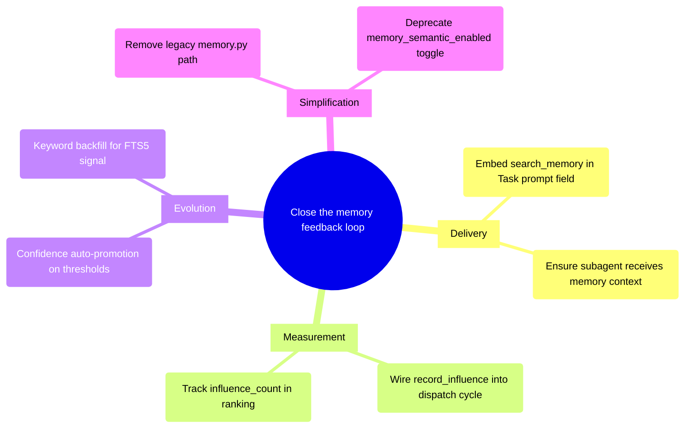

# PRD: Memory System Overhaul — Closing the Feedback Loop

## Status
- Created: 2026-03-26
- Last updated: 2026-03-26
- Status: Draft
- Problem Type: Technical/Architecture
- Archetype: improving-existing-work

## Problem Statement

The pd memory system has sophisticated write infrastructure (774 entries, semantic dedup, multi-source capture) connected to a passive, unverified read path with a completely absent feedback path. The system accumulates engineering knowledge reliably but cannot demonstrate — or improve — its impact on agent behavior.

### Evidence
- DB audit: 774 entries, 100% have embeddings, but 71% have `recall_count=0` (never retrieved), `influence_count` is universally 0, and 97% have empty keywords — Evidence: SQLite queries on `~/.claude/pd/memory/memory.db`
- The `record_influence` MCP tool exists with full DB implementation but has zero callers across all commands and skills — Evidence: `grep -rn record_influence plugins/pd/commands/ plugins/pd/skills/` returns 0 matches
- Confidence never evolves: `database.py:_update_existing()` increments `observation_count` but contains no promotion logic — Evidence: `plugins/pd/hooks/lib/semantic_memory/database.py:377`
- Ranking engine allocates 35% of the prominence sub-score (15% recall + 20% influence) to signals that are universally zero; since prominence itself is 30% of the final score, ~10.5% of total ranking weight reads dead signals — Evidence: `plugins/pd/hooks/lib/semantic_memory/ranking.py`
- Prior RCA identified 6 root causes for search returning no results; FTS5 bugs (causes 1-3) are fixed, embedding availability (causes 4-6) remain structural — Evidence: `docs/rca/20260319-search-memory-returns-no-results.md`
- Existing PRD from 2026-03-24 identified 5 gaps and proposed 3-phase plan, but none implemented — Evidence: `docs/brainstorms/20260324-100000-memory-feedback-loop-completion.prd.md`

## Goals

1. **Close the feedback loop** — Every memory injection should produce measurable signal about whether it influenced agent behavior
2. **Enable self-improving retrieval** — Ranking quality should compound over time as influence data accumulates
3. **Remove dead weight** — Eliminate subsystems that consume resources without producing value (legacy `memory.py`, unpopulated signals)
4. **Activate dormant infrastructure** — Wire up `record_influence`, implement confidence auto-promotion, backfill keywords

## Success Criteria

- [ ] SC-1: Every subagent dispatch in the 5 workflow commands attempts `search_memory` enrichment before prompt construction (measurable via grep for search_memory call pattern in commands); results included when non-empty
- [ ] SC-2: `influence_log` table is populated after feature completion (>0 entries per feature cycle)
- [ ] SC-3: Confidence auto-promotes based on configurable thresholds; entries with sufficient observation evidence graduate upward (default: `observation_count >= 3` for `low` → `medium`, `>= 5` AND retro-validated for `medium` → `high`; tunable via config)
- [ ] SC-4: Legacy `memory.py` injection path removed; `memory_semantic_enabled` config key deprecated
- [ ] SC-5: Keyword backfill: <10% of entries have empty keywords after migration
- [ ] SC-6: Ranking prominence signal is non-zero for >=30% of entries within 3 feature cycles
- [ ] SC-7: Session-start injection stays within 5s timeout budget (p95)

## User Stories

### Story 1: Invisible Quality Improvement
**As a** pd user running `/pd:implement` **I want** the implementation reviewer to receive relevant anti-patterns from past features **So that** recurring mistakes are caught without me manually remembering to mention them.
**Acceptance criteria:**
- Agent dispatch prompt contains memory section
- Memory entries are contextually relevant (not random)
- No user action required — happens automatically

### Story 2: Compounding Knowledge
**As a** pd user completing retrospectives **I want** high-confidence learnings from past retros to rank higher than low-confidence session captures **So that** the most validated knowledge surfaces first.
**Acceptance criteria:**
- Entries with high observation counts and retro validation outrank single-capture entries
- Confidence evolves based on evidence, not just initial capture heuristic

### Story 3: Observable Memory Health
**As a** pd developer debugging the memory system **I want** to see which memories actually influenced agent behavior **So that** I can assess whether the system is working and tune retrieval quality.
**Acceptance criteria:**
- `influence_log` records agent role, feature, and timestamp
- `influence_count` in ranking produces measurable differentiation

## Use Cases

### UC-1: Subagent Memory Delivery
**Actors:** Orchestrator (command file), Subagent (reviewer/implementer) | **Preconditions:** Session has injected memories; command dispatches subagent
**Flow:** 1. Command calls `search_memory` with agent-role-specific query. 2. Results formatted as markdown section. 3. Section embedded inside Task prompt `prompt:` field. 4. Subagent receives and can reference memories in its work.
**Postconditions:** Subagent output references or applies relevant memory entries
**Edge cases:** search_memory returns no results → dispatch without memory section; MCP unavailable → skip enrichment with warning

### UC-2: Post-Dispatch Influence Recording
**Actors:** Orchestrator (command file), Memory MCP server | **Preconditions:** Subagent completed; memories were injected
**Flow:** 1. Orchestrator inspects subagent output for references to injected memory entries. 2. For each referenced entry, calls `record_influence(entry_name, agent_role, feature_type_id)`. 3. MCP server increments `influence_count` and logs event.
**Postconditions:** `influence_log` has new entries; `influence_count` incremented
**Edge cases:** Subagent didn't reference any memories → no influence recorded (this is valid signal); MCP unavailable → log warning, don't block

### UC-3: Confidence Auto-Promotion
**Actors:** Memory server (background), Database | **Preconditions:** Entry exists with `observation_count >= 3` and `confidence = 'low'`
**Flow:** 1. On `store_memory` dedup merge (observation_count increment), check promotion thresholds. 2. If `observation_count >= 3` AND `confidence = 'low'`: promote to `medium`. 3. If `observation_count >= 5` AND `confidence = 'medium'` AND source includes `retro`: promote to `high`.
**Postconditions:** Entry confidence reflects accumulated evidence
**Edge cases:** Entry already at target confidence → no-op; retro validation required for high → prevents session-capture spam from reaching high confidence

## Edge Cases & Error Handling

| Scenario | Expected Behavior | Rationale |
|----------|-------------------|-----------|
| MCP server down during search_memory | Skip enrichment, dispatch without memory section | Agents must not be blocked by memory system failures |
| search_memory returns 0 results | Dispatch agent normally without memory section | No relevant memory is valid — don't inject noise |
| influence_count overflow on hot entries | Cap at 10,000 | Prevent integer overflow; value beyond 10k is indistinguishable |
| Confidence promotion during bulk import | Skip promotion for source='import' | Imports inherit original confidence; promotion only for organic growth |
| Session-start injection breaches 5s timeout | Fall back to cached last-injection output | Preserve previous session's memory rather than skip entirely |
| Keyword backfill on 774 entries | Batch process with rate limiting | Avoid API quota exhaustion on Gemini embedding calls |

## Constraints

### Behavioral Constraints (Must NOT do)
- Must NOT add new user-facing commands or workflows — all improvements are internal plumbing. Rationale: zero adoption friction is a design goal
- Must NOT break existing `store_memory` / `search_memory` MCP API contracts — existing callers must work without changes. Rationale: 16+ call sites across commands and skills
- Must NOT make influence tracking blocking on agent dispatch — latency budget is critical. Rationale: users feel agent startup delay directly

### Technical Constraints
- Session-start injection has 5s timeout with 3 retries — Evidence: `session-start.sh:412`
- Claude Code plugin architecture: MCP tools, session hooks, subagent dispatch via Task tool — Evidence: plugin.json
- Embedding provider dependency (Gemini default, ~768 dimensions) — Evidence: `semantic_memory/embedding.py`
- SQLite concurrent write safety via `sqlite_retry` decorator — Evidence: `hooks/lib/sqlite_retry.py`
- Existing 774-entry corpus must be preserved through migration — Evidence: User input

## Requirements

### Functional
- FR-1: All 5 workflow commands (`specify`, `design`, `create-plan`, `create-tasks`, `implement`) must embed `search_memory` results INSIDE the Task `prompt:` field for every subagent dispatch
- FR-2: After each subagent returns, orchestrator must call `record_influence` for memory entries that were referenced. The command tracks entry names returned by `search_memory` before dispatch, then scans subagent output for exact string matches on those names. Matched entries get `record_influence` calls. Detection strategy is deterministic and zero-cost. LLM-based attribution deferred to Phase 3
- FR-3: `store_memory` dedup merge path must check confidence promotion thresholds and auto-promote when criteria met
- FR-4: Keyword backfill CLI command must process all 774 entries, generating keywords via Tier 1 regex for initial migration (no API dependency); optional Tier 2 (Gemini) enrichment as a separate follow-up step
- FR-5: Legacy `memory.py` injection path must be removed; `memory_semantic_enabled` config toggle deprecated
- FR-6: Ranking engine must use live `influence_count` and `recall_count` signals once populated (no code change needed — already reads them, just needs non-zero data)

### Non-Functional
- NFR-1: Session-start injection p95 latency must remain under 5s
- NFR-2: `record_influence` calls must complete in <100ms (SQLite local write)
- NFR-3: Keyword backfill must be idempotent (re-runnable without duplicating keywords)
- NFR-4: All changes must have test coverage (unit tests for promotion logic, integration tests for influence recording)

## Non-Goals
- Building a custom embedding model or fine-tuning retrieval — Rationale: Gemini embeddings are sufficient; the problem is feedback loop closure, not embedding quality
- Adding user-facing memory management UI — Rationale: CLI-native power users; `/pd:doctor` already provides health checks
- Cross-agent memory sharing (multi-user) — Rationale: pd is single-user tooling; global memory store already handles cross-project
- Real-time memory updates during agent execution — Rationale: session-level injection is sufficient; mid-session updates add complexity without clear value

## Out of Scope (This Release)
- Reranking with cross-encoder models — Future consideration: when corpus exceeds 2,000 entries and top-k precision degrades
- Memory decay / automatic forgetting — Future consideration: when corpus exceeds 5,000 entries and staleness becomes measurable
- DSPy-style automatic retrieval optimization — Future consideration: requires outcome data from influence tracking (this release enables that data collection)
- Structured memory representations (subject-predicate-object triples) — Future consideration: current flat entries are sufficient for the corpus size

## Research Summary

### Internet Research

- **Mem0 (arXiv 2504.19413):** Production memory system achieving 91% lower p95 latency and 90%+ token cost reduction vs. full-context. Architecture: extraction → update → conflict/dedup evaluation. Graph-enhanced variant captures relational structures. Key insight: structured persistent memory > larger context windows. — Source: https://arxiv.org/abs/2504.19413
- **Memori (arXiv 2603.19935):** Decomposes conversations into atomic subject-predicate-object triples for retrieval. Hybrid cosine+BM25. 81.95% accuracy at ~5% of full context tokens. — Source: https://arxiv.org/html/2603.19935
- **A-MAC (arXiv 2603.04549):** Five-signal memory admission scoring: Utility, Confidence, Novelty, Recency, Type Prior. Achieves F1=0.583 (+7.8% SOTA). Key design: conflicting entries trigger merge when new score exceeds existing. — Source: https://arxiv.org/html/2603.04549
- **Anthropic Contextual Retrieval:** Contextual Embeddings + Contextual BM25 reduces retrieval failures 49-67%. Recommendation: retrieve top-20, combine vector+BM25+reranking. For knowledge bases under 200k tokens, skip RAG. — Source: https://www.anthropic.com/news/contextual-retrieval
- **ACT-R-Inspired Memory Scoring:** Human cognitive science adapted for LLM agents. Base-level activation: `B(m) = ln(Σ t_i^(-d))`. Recently and frequently retrieved memories stay accessible; others naturally decay. — Source: https://dl.acm.org/doi/10.1145/3765766.3765803
- **Reflexion + LATS (LangChain):** Three patterns for closed-loop agent learning: basic reflection, Reflexion (grounded self-critique), Language Agent Tree Search (reflection + MCTS). Tight feedback loops allow accurate trajectory discrimination. — Source: https://blog.langchain.com/reflection-agents/
- **Google Sufficient Context Measurement (ICLR 2025):** Quantifies whether retrieved context provides enough info for correct answers. Classifier achieves >=93% accuracy. Key finding: agents don't recognize insufficient context and hallucinate. — Source: https://research.google/blog/deeper-insights-into-retrieval-augmented-generation-the-role-of-sufficient-context/
- **Experience-Following Behavior (arXiv 2505.16067):** Agents don't uniformly benefit from all retrieved memories; quality and relevance matter more than quantity. Provides measurement framework for testing whether memory systems change behavior. — Source: https://arxiv.org/html/2505.16067v2
- **Hybrid Search + Reranking 2025 Baseline:** Hybrid (vector + BM25/SPLADE) with RRF shows 15-30% better retrieval accuracy than pure vector. Cross-encoder reranking improves NDCG@10 by up to 48%. — Source: https://superlinked.com/vectorhub/articles/optimizing-rag-with-hybrid-search-reranking
- **Context Engineering as Core Discipline (Weaviate, Anthropic):** Finding smallest set of high-signal tokens maximizing outcome. "Just in time" retrieval with lightweight identifiers. Memory quality > quantity. Regular pruning of outdated entries. — Source: https://weaviate.io/blog/context-engineering, https://www.anthropic.com/engineering/effective-context-engineering-for-ai-agents

### Codebase Analysis

- `keywords.py` is ACTIVE (called at `memory_server.py:83`), not dead — Tier 1 regex runs unconditionally. But 97% of existing entries have empty keywords (pre-date the fix) — Location: `plugins/pd/mcp/memory_server.py:83`
- `record_influence` is fully implemented (MCP tool + DB + influence_log table) with zero callers — Location: `plugins/pd/mcp/memory_server.py:457`
- Confidence never auto-promotes — `database.py:_update_existing()` increments `observation_count` only — Location: `plugins/pd/hooks/lib/semantic_memory/database.py:377`
- Subagent memory injection: the `search_memory` instruction is a natural language directive to the orchestrating model, not a programmatic integration. The `{search_memory results}` placeholder sits outside the Task `prompt:` YAML field. Delivery reliability depends on model instruction-following. Verified: all 5 command files (specify.md, design.md, create-plan.md, create-tasks.md, implement.md) contain search_memory instruction blocks — confirmed via grep — Location: `plugins/pd/commands/implement.md:62`
- FTS5 retrieval bugs (causes 1-3 from RCA) fixed via `_sanitize_fts5_query()`; embedding availability (causes 4-6) remain constraints — Location: `plugins/pd/hooks/lib/semantic_memory/database.py:17`
- Semantic dedup and project-scoped search are implemented; confidence promotion, influence callers, and recall dampening are not — Location: various
- Two active injection paths: `semantic_memory.injector` (semantic) and `memory.py` (legacy markdown), controlled by `memory_semantic_enabled` config toggle — Location: `plugins/pd/hooks/session-start.sh:412`

### Existing Capabilities

- `/pd:remember` command — Manual memory capture with signal-word-based category inference. Working correctly.
- `capturing-learnings` skill — Model-initiated detection of 5 trigger patterns. Working but relies on `memory_model_capture_mode` config.
- `retrospecting` skill — Bulk write path via AORTA retro. Writes to both MCP and markdown KB. Working.
- `semantic_memory` library — 3,500+ lines, 940+ tests. Retrieval, ranking, dedup, embedding all functional.
- Memory MCP server — 4 tools (store, search, delete, record_influence). Server operational; `record_influence` never called.
- Session-start injection — Functional with 5s timeout, 3 retries, context-aware query construction.
- 5 workflow commands with `search_memory` enrichment instructions — Instructions present but structural embedding into Task prompts is uncertain.

## Structured Analysis

### Problem Type
Technical/Architecture — The memory system's infrastructure is mature but its feedback mechanisms are disconnected, requiring architectural rewiring rather than new capability development.

### SCQA Framing
- **Situation:** The pd memory system has 774 entries in a well-engineered SQLite store with hybrid vector+FTS5 retrieval, semantic deduplication, multi-source capture (retro, session, manual, import), and a ranking engine that weights vector similarity, keyword matching, and prominence signals.
- **Complication:** The feedback loop between memory injection and agent behavior is severed: `influence_count` is universally 0, 71% of entries have never been retrieved, confidence never evolves, 97% of keywords are empty, and the ranking engine's prominence sub-score allocates 35% to recall+influence (amounting to ~10.5% of total ranking weight) — both always zero. The system writes knowledge that compounds but reads it through a path that cannot self-improve.
- **Question:** How should we restructure the memory system to close the feedback loop so that retrieval quality compounds with usage?
- **Answer:** Wire up the existing dormant infrastructure (influence tracking, confidence promotion, keyword backfill), ensure subagent dispatch actually delivers memory to agents, remove the legacy injection path, and let the already-built ranking engine operate on real data.

### Decomposition

```
How should we restructure memory to close the feedback loop?
├── Factor 1: Delivery gap — subagents don't reliably receive injected memories
│   ├── Evidence for: {search_memory results} placeholder is outside Task prompt: block
│   └── Evidence against: Commands contain search_memory instructions; orchestrator MAY forward
├── Factor 2: Measurement gap — no signal flows back from agent behavior to memory system
│   ├── record_influence tool exists but has zero callers
│   └── influence_count and recall_count feed ranking but are always zero
├── Factor 3: Evolution gap — memory quality is static after capture
│   ├── Confidence never promotes despite observation_count accumulation
│   └── 97% empty keywords degrade FTS5 retrieval signal
└── Factor 4: Complexity gap — dead/legacy subsystems consume maintenance budget
    ├── Legacy memory.py injection path parallel to semantic injector
    └── Dual injection tracking formats (.last-injection.json)
```

### Mind Map



## Strategic Analysis

### Self-cannibalization
- **Core Finding:** The most significant overlap is the dual injection path (`semantic_memory.injector` vs legacy `memory.py`), controlled by `memory_semantic_enabled` toggle — any improvement to one silently diverges from the other.
- **Analysis:** The legacy `memory.py` path maintains its own dedup logic, priority ranking, and tracking file format. If improvements ship only to the semantic path, the legacy path becomes silently stale. The `record_influence` MCP tool is fully implemented server-side but the revive-vs-replace decision must be explicit. The `keywords.py` module runs on every store call (including Gemini Tier 2) — expanding keyword capability without measuring FTS5 contribution risks adding latency to a path with unverified benefit. Confidence promotion signals (`observation_count`, `recall_count`, `last_recalled_at`) already exist in the schema — promotion logic should mutate existing columns rather than add shadow scoring tables.
- **Key Risks:**
  - Legacy path never deprecated — improvements shipped only to semantic path create silent behavioral divergence
  - `record_influence` revival requires dispatch-time hook in subagent invocation paths — this hook point may not currently exist
  - `.last-injection.json` has different schemas between injection paths — third-path integration hazard
- **Recommendation:** Remove the legacy `memory.py` path entirely. Wire up existing `record_influence` before building anything new. Mutate existing schema columns for confidence promotion rather than layering new tables.
- **Evidence Quality:** strong

### Flywheel
- **Core Finding:** The system has the structural bones of a data flywheel — schema columns, ranking signals, hybrid retrieval — but the feedback loop is severed between injection and outcome, meaning 774 entries compound on the write side while the read side degrades toward noise.
- **Analysis:** The write side genuinely compounds: 774 entries, observation counts reaching 2,743, consistent accumulation from retrospectives and session captures. The ranking engine's prominence sub-score weights `recall_count` (15%) and `influence_count` (20%) — contributing ~10.5% of total ranking — but since both are always zero, entries are ranked purely on `observation_count` and recency. What should be a self-reinforcing cycle (better retrieval → more useful injections → higher influence → better future retrieval) is mechanically stalled. The 97% empty keyword rate further degrades the BM25 signal, reducing hybrid retrieval to semantic-only for nearly all entries. Research confirms this pattern: RAG systems without feedback collection degrade toward arbitrary retrieval because the corpus grows but signal quality stays uniform (567 Labs RAG Flywheel, Agent-in-the-Loop +14.8% Precision@8).
- **Key Risks:**
  - Phantom flywheel: schema creates illusion of self-improvement while feedback path is disconnected
  - Corpus dilution: more entries with equal prominence = more noise in top-k, not better signal
  - Sunk-cost architectural risk: `influence_log` table represents past investment that becomes dead weight if never connected
- **Recommendation:** Prioritize closing the injection-to-outcome feedback loop before adding more entries. Even a coarse signal (incrementing `recall_count` reliably + lightweight influence tracking) would unlock the prominence scoring already built. Dead subsystems should be wired up in one targeted sprint or removed.
- **Evidence Quality:** strong

### Adoption-friction
- **Core Finding:** All proposed changes are internal plumbing — zero new user-facing behavior to learn — but invisibility introduces trust-erosion risk if the system silently behaves worse before it behaves better.
- **Analysis:** The three stable user touchpoints (`/pd:remember`, `capturing-learnings`, `retrospecting`) don't change. The learning curve is flat: nothing to learn. The friction concern shifts to "will users notice if something breaks." The 5s session-start timeout is a fragile seam — additional MCP calls could cause silent skip. Confidence auto-promotion is the one change with user-visible effects: over-promoted low-quality entries could surface more prominently, degrading injection quality. The existing `capturing-learnings` and `/remember` Bash fallbacks depend on `semantic_memory.writer` module structure — dead-code removal must not disturb this interface.
- **Key Risks:**
  - Session-start latency regression breaching 5s timeout
  - Trust erosion from invisible quality degradation post-deploy
  - Dead-code removal breaking CLI fallback paths
  - Confidence auto-promotion calibration risk on 774-entry corpus
- **Recommendation:** Gate confidence auto-promotion behind a config flag (default off, enable incrementally). Ensure all new calls are non-blocking or have independent timeout budgets. Preserve `semantic_memory.writer` public interface through refactoring.
- **Evidence Quality:** moderate

## Current State Assessment

### Write Path (Working)
| Component | Status | Evidence |
|-----------|--------|----------|
| `store_memory` MCP tool | Functional | 774 entries accumulated |
| Semantic dedup (cosine > 0.90) | Functional | Merges near-duplicates, increments observation_count |
| Multi-source capture (retro, session, manual, import) | Functional | Source distribution: 521 session, 226 import, 25 retro, 2 manual |
| Embedding generation (Gemini) | Functional | 774/774 entries have embeddings (100%) |
| Knowledge bank markdown sync | Functional | 3 KB files maintained by retrospecting skill |

### Read Path (Partially Working)
| Component | Status | Evidence |
|-----------|--------|----------|
| Session-start injection | Functional | Last injection: 20 entries from 774, hybrid retrieval |
| Hybrid retrieval (vector + FTS5) | Degraded | FTS5 bugs fixed, but 97% empty keywords neuter BM25 signal |
| Ranking engine | Structurally sound, operationally degraded | ~10.5% of total ranking weight (35% of prominence sub-score) reads zero signals |
| Subagent delivery | Uncertain | Instructions exist but structural embedding in Task prompts unclear |
| Project-scoped search | Implemented | Two-tier blend (project-local + global) available |

### Feedback Path (Not Working)
| Component | Status | Evidence |
|-----------|--------|----------|
| Influence tracking | Infrastructure built, never called | 0 entries in influence_log, 0 total influence_count |
| Confidence evolution | Not implemented | No promotion logic exists anywhere |
| Recall tracking | Partially working | 71% have recall_count=0; injector updates but may not run reliably |
| Ranking feedback | Dead signals | influence_count and recall_count always zero in ranking formula |

## Change Impact

### What Changes
1. **Command files** (5 files): Restructure `search_memory` + Task dispatch to ensure memory is INSIDE `prompt:` field
2. **Command files** (5 files): Add `record_influence` calls after subagent returns
3. **`database.py`**: Add confidence promotion logic in `_update_existing()` / `merge_duplicate()`
4. **Keyword backfill**: One-time migration to populate keywords for all 774 entries
5. **`session-start.sh`**: Remove legacy `memory.py` branch; remove `memory_semantic_enabled` config check
6. **`memory.py`**: Delete file entirely (move any unique logic to `semantic_memory/` first)

### Who Is Affected
- **pd users**: Invisible improvement — better memory injection, smarter ranking over time
- **pd developers**: Must understand new influence tracking flow when modifying commands
- **Existing entries**: Preserved; keywords backfilled, confidence may auto-promote

### Migration Needed
- Keyword backfill: batch process 774 entries via `semantic_memory.writer --action backfill-keywords`
- Config cleanup: deprecate `memory_semantic_enabled` (always true now)
- No schema migration needed — all columns exist (migration 4 already created `influence_count` + `influence_log`)

## Migration Path

### Phase 1: Close the Delivery Gap (Highest ROI)
1. Restructure 5 command files to embed `search_memory` results INSIDE Task `prompt:` field
2. Add `record_influence` calls after subagent returns in all 5 command files
3. Deprecate legacy `memory.py` injection path: set `memory_semantic_enabled` to `true` by default and log a deprecation warning when explicitly set. The toggle remains functional for 1 release as a rollback escape hatch
4. Run keyword backfill on existing 774 entries (Tier 1 regex, no API cost)
5. After 1 stable release: remove `memory.py` and `memory_semantic_enabled` toggle entirely

### Phase 2: Activate Evolution Mechanisms
1. Implement confidence auto-promotion in `database.py` (behind config flag)
2. Add recall dampening (time decay) to prevent rich-get-richer in ranking
3. Validate that `recall_count` is reliably incremented by injector in production sessions

### Phase 3: Measure and Tune
1. After 3 feature cycles: analyze `influence_log` data to assess which memories drive behavior
2. Adjust ranking weights based on empirical influence data
3. Consider reranking or more sophisticated retrieval if corpus exceeds 2,000 entries

## Review History

### Review 0 (2026-03-26)
**Reviewer:** prd-reviewer (opus)
**Findings:**
- [blocker] Prominence weight claim mathematically incorrect: 35% of sub-score (30% weight) = ~10.5% of total, not 35% (at: Problem Statement, Flywheel analysis)
- [blocker] Influence detection mechanism punted to Open Questions — core architectural decision needed for FR-2 (at: Open Questions #2, FR-2)
- [warning] SC-1 too absolute — contradicts UC-1 edge case for empty results (at: Success Criteria)
- [warning] FR-4 contradicts Open Question #4 on keyword backfill tier (at: FR-4 vs OQ-4)
- [warning] Subagent delivery characterization imprecise — instructional vs structural (at: Codebase Analysis)
- [warning] SC-3 thresholds embedded despite being debated in OQ-3 (at: SC-3 vs OQ-3)
- [warning] No rollback plan for legacy memory.py removal (at: Migration Path Phase 1)
- [warning] Missing verification that all 5 commands have search_memory (at: FR-1)
- [suggestion] OQ-1 resolvable with DB query (at: Open Questions)
- [suggestion] Research citations lack explicit connection to decisions (at: Research Summary)
- [suggestion] Phase 2 "recall dampening" appears without prior discussion (at: Migration Path)

**Corrections Applied:**
- Fixed prominence weight claim to ~10.5% of total ranking (all occurrences) — Reason: mathematical accuracy
- Resolved OQ-2: v1 uses exact string match, LLM attribution deferred to Phase 3 — Reason: unblock FR-2
- Revised SC-1 to measure enrichment attempt rate, not section presence — Reason: consistency with UC-1 edge cases
- Made SC-3 threshold-agnostic with configurable defaults — Reason: consistency with OQ-3 resolution
- Resolved FR-4 vs OQ-4: Tier 1 for migration, Tier 2 as follow-up — Reason: remove contradiction
- Clarified subagent delivery as instructional (not programmatic), added grep verification — Reason: precision
- Added 1-release deprecation period for memory.py removal with rollback escape hatch — Reason: rollback safety
- Resolved OQ-3: configurable thresholds behind config flag — Reason: adoption-friction advisory recommendation

### Review 1 (2026-03-26)
**Reviewer:** prd-reviewer (opus)
**Result:** APPROVED
**Findings:**
- [warning] 5 workflow commands never explicitly listed (at: FR-1) — Fixed: enumerated in FR-1
- [warning] FR-2 entry name tracking mechanism underspecified (at: FR-2) — Fixed: clarified track-before-dispatch, scan-after-return
- [warning] Escape hatch toggle not named explicitly (at: Migration Phase 1) — Fixed: named `memory_semantic_enabled` with deprecation warning
- [suggestion] OQ-1 needs verification plan — Acknowledged, deferred to implementation
- [suggestion] SC-6 "3 feature cycles" ambiguous — Acceptable approximate target

## Open Questions

1. **Recall count reliability:** The injector code calls `db.update_recall()` but 71% of entries show `recall_count=0`. This needs investigation during implementation: query entries with `recall_count > 0`, cross-reference with `.last-injection.json` history. The answer determines whether Phase 2's "validate recall_count" is a bug fix or a verification task.
2. ~~**Influence detection granularity:**~~ **RESOLVED:** v1 uses exact string match on entry names in subagent output — deterministic, zero-cost. LLM-based attribution deferred to Phase 3 (requires outcome data from Phase 1 to calibrate).
3. ~~**Confidence promotion calibration:**~~ **RESOLVED:** Configurable thresholds (defaults: `>= 3` for low→medium, `>= 5` + retro-validated for medium→high). Gated behind `memory_auto_promote` config flag (default: false) per adoption-friction advisory.
4. ~~**Keyword backfill API cost:**~~ **RESOLVED:** Tier 1 regex for initial migration (free, no API dependency). Tier 2 (Gemini) enrichment as optional follow-up step.

## Next Steps

Ready for `/pd:create-feature` to begin implementation.
