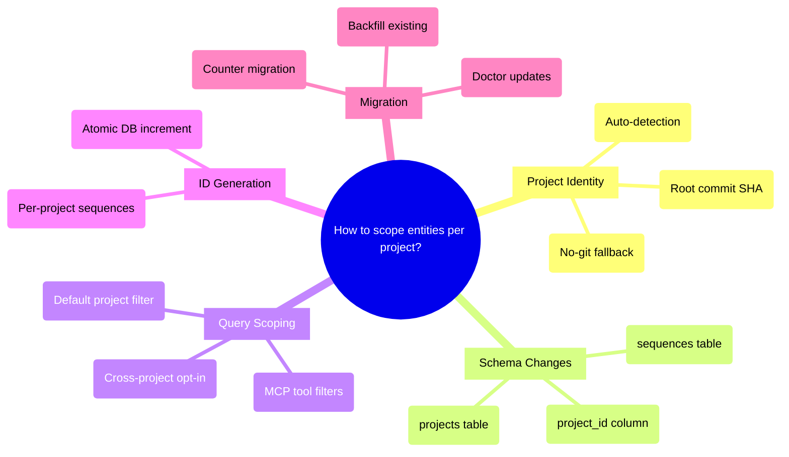

# PRD: Cross-Project Entity Scoping

## Status
- Created: 2026-03-26
- Last updated: 2026-03-26
- Status: Draft
- Problem Type: Product/Feature
- Archetype: exploring-an-idea

## Problem Statement
The pd entity registry uses a single global SQLite database (`~/.claude/pd/entities/entities.db`) shared across all projects. Entity IDs — especially backlog sequential IDs like `00021` — collide across projects because there is no project scoping at the DB level. Cross-project entities contaminate queries: during a routine audit, 8 entities from `cast-below` and `my-ai-setup` appeared in `pedantic-drip` results.

### Evidence
- Direct observation: `backlog:00001`, `backlog:00005`, `backlog:00006` registered from `/Users/terry/projects/cast-below/docs/backlog.md` — Evidence: DB query during RCA session
- Direct observation: `backlog:00021`–`backlog:00023`, `backlog:00025` registered from `/Users/terry/projects/my-ai-setup/docs/backlog.md` — Evidence: DB query during RCA session
- No `project_id` column in entities table schema — Evidence: `database.py:569-643`
- `search_entities()` and `list_entities()` have no project filter — Evidence: `database.py:1807-1874`
- `_metadata` table stores global `next_seq_{entity_type}` counters with no project scope — Evidence: `id_generator.py:56-89`
- Backlog IDs are parsed from markdown files, not from a stateful service — Evidence: `add-to-backlog.md:23-30`
- `type_id` (e.g., `backlog:00021`) is `UNIQUE` — cross-project collisions cause silent INSERT OR IGNORE skips — Evidence: `database.py:1339-1427`

## Current State: Existing project_id Infrastructure

The `project_id` concept already exists in the codebase as a **metadata-level field**, not a DB schema column:

- **`frontmatter_sync.py:93-130`** — derives `project_id` from metadata and `parent_type_id` for features
- **`frontmatter_inject.py:88`** — `_extract_project_id()` extracts project_id from feature frontmatter
- **`frontmatter.py:25,42`** — includes `project_id` in field lists for reading/writing `.meta.json`
- **`metadata.py:43`** — validates `project_id` as string type
- **`backfill.py:576-579`** — uses `project_id` from metadata to derive parent entity (`project:{project_id}`)
- **60+ test cases** across `test_frontmatter_sync.py`, `test_frontmatter.py`, `test_backfill.py` cover project_id behavior

**The actual gap** is narrower than "add project_id": it is **promoting `project_id` from a metadata JSON field to a first-class DB column** and extending it from feature-only to all entity types. The migration must preserve existing `project_id` values already stored in metadata JSON.

## Goals
1. Every entity in the DB is attributable to a specific project
2. Queries can filter entities by project without scanning artifact paths
3. Sequential IDs are scoped per-project and generated from a stateful service (not parsed from files)
4. Existing entities are backfilled with correct project attribution

## Success Criteria
- [ ] Zero cross-project entity collisions — same `entity_type:entity_id` in different projects coexist
- [ ] All DB queries (search, list, get) support project filtering
- [ ] Sequential ID generation is atomic and project-scoped
- [ ] Doctor check validates project attribution consistency
- [ ] All existing entities have `project_id` populated OR are explicitly flagged as unattributable. Doctor check reports zero unattributable entities that have a determinable project.

## User Stories

### Story 1: Project-scoped entity queries
**As a** pd user working across multiple projects **I want** entity queries to return only my current project's entities **So that** cross-project contamination doesn't confuse my workflow
**Acceptance criteria:**
- `search_entities` filters by current project by default
- `export_entities` only exports current project's entities
- `show-status` shows only current project's backlogs/features

### Story 2: Safe backlog creation across projects
**As a** pd user **I want** to create backlog items in different projects without ID collisions **So that** backlog `00021` in project A and backlog `00021` in project B both exist independently
**Acceptance criteria:**
- Sequential ID generated from DB, scoped to project
- `type_id` uniqueness is per-project, not global
- `add-to-backlog` uses DB sequence, not file parsing

### Story 3: Stable project identity
**As a** pd user **I want** my project to have a stable identity that survives directory renames, remote URL changes, and SSH/HTTPS switching **So that** entity attribution persists across environment changes
**Acceptance criteria:**
- Project identity derived from immutable git property (root commit SHA)
- Same identity across clones, worktrees, protocol variants
- Fallback for repos without remotes or git history

## Use Cases

### UC-1: Multi-project backlog audit
**Actors:** Developer using pd across 3 projects | **Preconditions:** All projects have backlog items registered
**Flow:** 1. Developer runs `/pd:show-status` in project A 2. Only project A's open backlogs appear 3. Developer switches to project B, same command shows only B's backlogs
**Postconditions:** No cross-project contamination in any view
**Edge cases:** New project with no entities yet — should show empty, not other projects' entities

### UC-2: Backlog creation in fresh project
**Actors:** Developer starting a new project | **Preconditions:** Global DB has entities from other projects
**Flow:** 1. Developer runs `/pd:add-to-backlog "first item"` 2. Item gets ID `00001` scoped to this project 3. Global DB already has `backlog:00001` from another project — no collision
**Postconditions:** Both `backlog:00001` entries coexist, each with their project_id
**Edge cases:** Project without git (no root commit SHA) — use fallback identifier

## Edge Cases & Error Handling
| Scenario | Expected Behavior | Rationale |
|----------|-------------------|-----------|
| Repo has no git history (detached HEAD, fresh init) | Use directory basename as fallback project_id | Must handle pre-commit repos |
| Same repo accessed via SSH and HTTPS | Same project_id (root commit SHA is protocol-agnostic) | Pre-mortem identified URL instability as top risk |
| Git worktrees of same repo | Same project_id (shared root commit) | Correct — worktrees ARE the same project |
| Project directory renamed | project_id unchanged (root commit SHA is immutable) | Path-based identity is fragile |
| Existing entities with no project_id | Backfill via artifact_path heuristic, NULL for unattributable | Graceful degradation during migration |
| `git rev-list` fails (corrupt repo) | Fall back to directory basename with warning | Must not block entity operations |

## Constraints

### Behavioral Constraints (Must NOT do)
- Must NOT break existing entity queries during migration — Rationale: gradual rollout, not big-bang
- Must NOT require manual project registration — Rationale: project_id should be auto-detected
- Must NOT change entity UUIDs — Rationale: UUIDs are referenced externally (lineage, dependencies)

### Technical Constraints
- Single SQLite file for global DB — Evidence: `~/.claude/pd/entities/entities.db`
- Schema changes require `_migrate()` pattern — Evidence: `database.py:569-942`
- `type_id` has immutability trigger — Evidence: `database.py:610-620`
- FTS5 index must be rebuilt on schema changes — Evidence: `database.py:912-942`
- `next_seq_{entity_type}` in `_metadata` is global — Evidence: `id_generator.py:56-89`

## Requirements

### Functional
- FR-1: Promote `project_id` from metadata JSON to a first-class `project_id TEXT` column on `entities` table. Migration must backfill from existing `metadata` JSON `project_id` values where present.
- FR-2: Add `projects` table: `(project_id TEXT PK, name TEXT, root_commit_sha TEXT, remote_url TEXT, created_at TEXT)`
- FR-3: Change `type_id` UNIQUE constraint to `UNIQUE(project_id, type_id)` — allowing same type_id across projects. Implementation note: requires table-rebuild migration pattern (CREATE-COPY-DROP-RENAME) already established in `_migrate_to_uuid_pk`. All 8 immutability/self-parent triggers must be recreated on the new table. No triggers need modification — only recreation.
- FR-4: Add `sequences` table: `(project_id TEXT, entity_type TEXT, next_val INTEGER, PRIMARY KEY(project_id, entity_type))` — replacing `_metadata` `next_seq_*` keys
- FR-5: Add `project_id` parameter to MCP tools. Affected tools: `register_entity` (required, auto-detected from MCP server context), `update_entity` (optional, for re-attribution), `search_entities` (optional, defaults to current project), `list_entities` (optional, defaults to current project), `export_entities` (optional, defaults to current project), `export_lineage_markdown` (optional, defaults to current project). `get_entity` does NOT need project_id — lookup by type_id + project context.
- FR-6: `detect_project_id()` function contract:
  - **Input:** working directory path (defaults to cwd)
  - **Output:** string, 12-char truncated hex SHA (e.g., `a1b2c3d4e5f6`)
  - **Primary:** `git rev-list --max-parents=0 HEAD` in the working directory, truncated to first 12 characters
  - **Fallback chain:** (1) if `git rev-list` fails (no git, corrupt repo, shallow clone with no root): use `git rev-parse --short=12 HEAD` (current HEAD, less stable but available); (2) if no git at all: use `hashlib.sha256(os.path.basename(cwd)).hexdigest()[:12]` (deterministic but path-dependent)
  - **Relationship to project entities:** `detect_project_id()` produces the DB `project_id` column value. This is distinct from the `project` entity type (`project:P001`) which is a user-created organizational entity. A project entity's `project_id` column would contain the same root commit SHA as all entities in that repo.
  - **Caching:** Result should be cached per-process (root commit SHA is immutable). MCP server resolves once at startup from `PROJECT_ROOT` env var.
- FR-7: Next available migration version (currently 8, may change if other features land first): add `project_id` column, create `projects` and `sequences` tables, backfill existing entities from metadata JSON `project_id` values and artifact_path heuristics
- FR-8: Update `add-to-backlog` to use `sequences` table instead of parsing markdown
- FR-9: Update doctor `check_backlog_status` to scope checks by project

### Non-Functional
- NFR-1: Migration must be backward-compatible — entities with NULL `project_id` continue to work. Note: SQLite treats each NULL as distinct in UNIQUE constraints, so `UNIQUE(NULL, 'backlog:00021')` would NOT conflict with another `UNIQUE(NULL, 'backlog:00021')`. This means the UNIQUE constraint is effectively disabled for unmigrated entities. Acceptable as temporary state during migration window. Consider using a sentinel value (e.g., `'__unknown__'`) instead of NULL for truly unattributable entities to preserve UNIQUE enforcement.
- NFR-2: `detect_project_id()` must complete in <100ms (git rev-list is fast)
- NFR-3: Sequential ID generation must be atomic (BEGIN IMMEDIATE + increment + INSERT in one transaction)

## Non-Goals
- Per-project separate DB files — Rationale: would break cross-project querying and the global knowledge bank model
- ULID replacement for UUID — Rationale: existing UUIDs work fine as internal PKs; low ROI for the migration cost
- Full multi-tenancy with access control — Rationale: this is a single-user tool, scoping is for organization not security

## Out of Scope (This Release)
- Cross-project entity migration tool — Future consideration: when a project forks or merges
- Project registry UI — Future consideration: when more than 5 projects are active
- Namespace prefixed human-readable IDs (e.g., `pd/backlog-001`) — Future consideration: when projects need external references

## Research Summary

### Internet Research
- Linear uses compound keys (team-slug + per-team sequence, e.g., "ENG-123") with UUID internal PKs — Source: linear.app/docs/conceptual-model
- Root commit SHA (`git rev-list --max-parents=0 HEAD`) is the established pattern for stable repo identity, used by opencode and others — Source: github.com/anomalyco/opencode/issues/5638
- SQLite has no native scoped AUTOINCREMENT; standard pattern is a `sequences` table with `(scope_id, sequence_name)` key — Source: sqlite.org/autoinc.html
- `sequenced` gem is the canonical reference for scoped sequential IDs: MAX+1 with unique index for safety — Source: github.com/derrickreimer/sequenced
- Sequential integers beat UUIDs on WAL overhead, B-tree locality, and storage for single-writer local DBs — Source: brandur.org/nanoglyphs/026-ids
- Git remote URL is unstable (SSH vs HTTPS, org renames, `insteadOf` rewrites) — npm/normalize-git-url exists but fragile — Source: github.com/npm/normalize-git-url

### Codebase Analysis
- No `project_id` column in entities schema — Location: `database.py:569-643`
- `type_id` is globally UNIQUE with immutability trigger — Location: `database.py:610-620`
- `_metadata` stores global `next_seq_{entity_type}` counters — Location: `id_generator.py:56-89`
- `_scan_existing_max_seq` scans ALL entities of a type, no project filter — Location: `id_generator.py`
- `detect_project_root()` already exists in `common.sh` (git root walk from PWD) — Location: `plugins/pd/hooks/lib/common.sh`
- `project_id` exists as a feature-level `.meta.json` field linking to project entities — Location: `backfill.py:138-166`
- Backfill is guarded by `backfill_complete` flag + `_BACKFILL_VERSION` — Location: `backfill.py`
- Reconciliation orchestrator runs at session start, syncs entity status from filesystem — Location: `reconciliation_orchestrator/__main__.py`
- MCP server stores `project_root` as module global but doesn't use it for query filtering — Location: `entity_server.py:44-47`

### Existing Capabilities
- `detect_project_root()` in `common.sh` — already resolves git root; can be extended to derive project_id
- Doctor `check_backlog_status()` — already does bidirectional file↔DB cross-reference; needs project scoping
- `register_entities_batch()` with BEGIN IMMEDIATE — transaction pattern for atomic batch operations
- `_migrate()` chain in `database.py` — established pattern for schema migrations with version tracking
- `id_generator.py` — existing sequence infrastructure, needs project scoping

## Structured Analysis

### Problem Type
Product/Feature — a data model gap in the entity registry that causes cross-project contamination

### SCQA Framing
- **Situation:** pd uses a global SQLite entity DB shared across all projects, with entity type+ID uniqueness enforced globally
- **Complication:** As pd is used across multiple projects, entity IDs collide (backlog:00021 in project A vs B), queries return cross-project results, and sequential IDs have no stateful project-scoped generator
- **Question:** How should entities be scoped to projects in the global DB while maintaining cross-project queryability and backward compatibility?
- **Answer:** Add a `project_id` discriminator column derived from root commit SHA, a `sequences` table for project-scoped ID generation, and update the uniqueness constraint to `UNIQUE(project_id, type_id)`

### Decomposition
```
Cross-Project Entity Scoping
├── Project Identity
│   ├── Root commit SHA as stable identifier
│   ├── Fallback for no-git scenarios
│   └── Auto-detection at session/MCP start
├── Schema Migration
│   ├── project_id column on entities table
│   ├── projects registration table
│   ├── sequences table replacing _metadata counters
│   └── UNIQUE constraint change (global → per-project)
├── Query Scoping
│   ├── MCP tool parameter additions
│   ├── Default filtering by current project
│   └── Cross-project query opt-in
├── ID Generation
│   ├── DB-owned sequence per (project, entity_type)
│   ├── Atomic increment in transaction
│   └── Backlog migration from file-parsing to DB
└── Migration & Backfill
    ├── Existing entity project attribution
    ├── _metadata counter migration to sequences table
    └── Doctor check updates
```

### Mind Map


## Strategic Analysis

### Pre-mortem
- **Core Finding:** The project fails not from the ID collision problem it sets out to solve, but from choosing an unstable identifier (git remote URL) as the `project_id` anchor — causing silent data fragmentation every time a repo is cloned, renamed, or accessed over SSH vs HTTPS.

- **Analysis:** The failure story writes itself cleanly. After shipping the `project_id` column and migration, everything appears to work on the happy path. A few weeks later, a developer notices entities registered under the SSH remote are invisible to queries from an HTTPS checkout. Both produce valid rows but are treated as different projects. The fallback to root commit SHA only triggers when no remote exists; it does not fire when the remote changes protocol.

  A second failure mode lives inside the sequence table. The `_metadata` table currently stores `next_seq_{entity_type}` as a global counter. After adding project_id scoping, the key must become project-scoped. If the migration is not perfectly atomic — if any code path still reads the old unscoped key — two projects will silently share a counter.

  The constraint list says "backward compatible with existing ~39 entities" but the migration risk is asymmetric: entities with no `project_id` will be silently excluded by any query that requires a non-null `project_id`.

- **Key Risks:**
  - (High/High) Git remote URL instability — SSH vs HTTPS produces different project_id values. Silent data fork.
  - (High/High) Sequence counter migration incomplete — unscoped key not namespaced per project; bootstrap-scan ignores project.
  - (Medium/High) Backfill misclassification of existing entities — path-based heuristic assigns wrong project_id.
  - (Medium/Medium) Projects without git remotes — root commit SHA fallback is different format; composite indexes must handle both.
  - (Medium/Medium) `insteadOf` URL rewrite rules cause git remote get-url to return rewritten URL.

- **Recommendation:** Use root commit SHA (not git remote URL) as the primary project_id — it's immutable, protocol-agnostic, and clone-safe. Scope the `next_seq` key simultaneously in the same migration. Audit `_scan_existing_max_seq` to filter by project.

- **Evidence Quality:** moderate

### Opportunity-cost
- **Core Finding:** The contamination is real but low-severity at current scale (2-3 projects, 8 stray entities, ~39 total), and the proposed solutions carry disproportionate implementation cost relative to the actual harm.

- **Analysis:** The problem is framed as an architectural gap requiring a structural fix — but the observed harm is 8 entities appearing in the wrong project's query results during a routine audit. No data was lost, no sequential IDs were duplicated within a project yet, and no user workflows broke.

  The approaches considered all require schema migrations that touch the immutable-type_id trigger pattern, FTS index, and all query callsites — a wide blast radius. The existing `_migrate_to_uuid_pk` migration demonstrates that even well-scoped DDL migrations in this codebase are multi-step and fragile.

  The inversion test: what happens if we do nothing? Query results occasionally include entities from other projects. The doctor check already flags this. A human operator corrects it. The pain scales linearly with the number of projects — it is not an exponential failure mode.

- **Key Risks:**
  - Premature over-engineering for 2-3 projects
  - Migration blast radius: triggers, indexes, FTS, all query code
  - Sequential ID counter in `_metadata` is global; fixing IDs without fixing counter = half-solution
  - "Backward compatible" constraint conflicts with CLAUDE.md "no backward compatibility" principle

- **Recommendation:** Before committing to a schema migration, implement the minimum experiment — a `--project-filter` query-time flag backed by `artifact_path` prefix matching. This resolves the contamination symptom in one targeted change, validates whether full scoping is worth the larger investment.

- **Evidence Quality:** moderate

## Options Evaluated

### Option A: Minimum Viable — Query-time artifact_path filtering
Add a `project_root` parameter to search/list/export MCP tools. Filter by `artifact_path LIKE '{project_root}%'`. No schema change.
- **Pros:** Zero migration risk, immediate fix, one session of work
- **Cons:** Doesn't fix ID collisions (same type_id still UNIQUE globally), doesn't fix sequence generation, path-based (fragile on renames)

### Option B: Full Schema — project_id column + sequences table
Add `project_id` column, `projects` table, `sequences` table. Change UNIQUE constraint. Migrate counters. Full backfill.
- **Pros:** Architecturally correct, solves all three problems (identity, scoping, sequences), future-proof
- **Cons:** Wide blast radius (schema, triggers, FTS, queries, MCP tools, doctor), migration complexity, ~1 week of work

### Option C: Phased — Option A now, Option B when needed
Ship query-time filtering immediately. Plan schema migration as a separate feature when a 4th+ project is added or ID collisions actually occur.
- **Pros:** Immediate relief, deferred risk, validates need before investment
- **Cons:** Two implementations to maintain, path-based filtering is a known antipattern

## Decision Matrix

| Criterion (weight) | Option A: Query filter | Option B: Full schema | Option C: Phased |
|--------------------|-----------------------|----------------------|-----------------|
| Solves contamination (3) | 3 (filters at query time) | 3 (filters at DB level) | 3 (both) |
| Solves ID collisions (3) | 0 (type_id still global) | 3 (per-project UNIQUE) | 1 (deferred) |
| Solves sequence scoping (2) | 0 (still file-parsed) | 3 (DB sequences) | 1 (deferred) |
| Implementation risk (2) | 3 (minimal change) | 1 (wide blast radius) | 2 (two phases) |
| Migration safety (2) | 3 (no migration) | 1 (complex DDL) | 2 (deferred risk) |
| Future-proofness (1) | 1 (antipattern) | 3 (correct model) | 2 (correct later) |
| **Weighted total** | **24** | **27** | **24** |

**Selected: Option B (Full Schema)**. Rationale: This is being prioritized as a dedicated feature with proper review cycles. The CLAUDE.md "no backward compatibility" principle eliminates the main argument for Option C's phased approach — we don't need to maintain two implementations. Option A's path-based filtering is a known antipattern that would accumulate tech debt. The blast radius is real but manageable with the established table-rebuild migration pattern. The Opportunity-cost advisor's "experiment first" recommendation is superseded by the confirmed observed harm (8 contaminated entities, documented RCA) and the established migration pattern in the codebase — the validation step has already occurred through the investigation that prompted this PRD.

## Review History

### Review 1 (2026-03-26)
**Findings:**
- [blocker] PRD ignored existing project_id infrastructure in metadata/frontmatter/backfill code
- [blocker] No chosen option declared — three options evaluated but no decision stated
- [blocker] detect_project_id() contract unspecified — no fallback chain, output format, or relationship to project entities
- [warning] Migration version number assumed (8) without noting collision risk
- [warning] Strategic Analysis too shallow — advisory perspectives summarized without reasoning
- [warning] Success criteria "~39 entities backfilled" not measurable
- [warning] FR-3 UNIQUE constraint change didn't address immutability trigger interaction
- [warning] NFR-1 NULL project_id contradicts FR-3 composite UNIQUE (SQLite NULL semantics)

**Corrections Applied:**
- Added "Current State" section documenting existing project_id infrastructure — Reason: blocker #1
- Declared Option B as selected with rationale — Reason: blocker #2
- Specified detect_project_id() contract with input/output/fallback chain/caching — Reason: blocker #3
- Changed FR-7 to "next available migration version (currently 8)" — Reason: warning about collision
- Reframed FR-1 as promoting project_id from metadata to column — Reason: blocker #1
- Made success criteria measurable (explicit unattributable flagging) — Reason: warning
- Added table-rebuild migration note to FR-3 with trigger recreation — Reason: warning
- Added SQLite NULL semantics note and sentinel value consideration to NFR-1 — Reason: warning
- Enumerated affected MCP tools in FR-5 — Reason: suggestion

## Open Questions
- Should cross-project queries remain possible? **Deferred to implementation** — implementer decides. Recommended: `--all-projects` flag on MCP tools, default to current project.
- Should the `type_id` format change to include project prefix? **Decision: No** — keep `type_id` as-is, enforce uniqueness via composite index `UNIQUE(project_id, type_id)`. Simpler, no migration of existing type_id values needed.
- What is the backfill strategy for unattributable entities? **Decision:** Use sentinel value `'__unknown__'` for entities whose artifact_path doesn't match any known project root. Doctor check flags these for manual resolution.

## Next Steps
Ready for /pd:create-feature to begin implementation.
