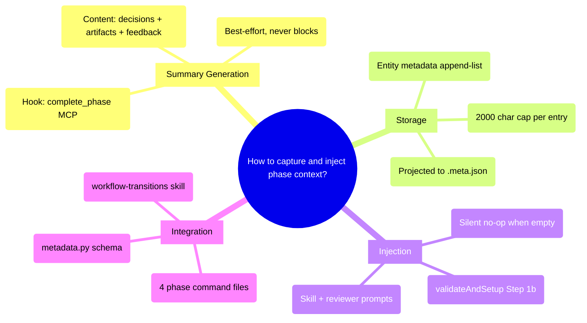

# PRD: Phase Context Accumulation

*Source: Backlog #00044*

## Status
- Created: 2026-04-02
- Last updated: 2026-04-02
- Status: Draft
- Problem Type: Technical/Architecture
- Archetype: improving-existing-work

## Problem Statement
When backward transitions (rework) occur in the pd workflow, the re-entered phase has zero context about what was decided, produced, or flagged in prior phases. This causes blind rework — reviewers re-raise issues that were already addressed, drafters make decisions that contradict prior phase conclusions, and iteration counts increase unnecessarily.

### Evidence
- Codebase: `commitAndComplete` outputs a plain-text phase summary to stdout (workflow-transitions SKILL.md:246-273) but never stores it — the summary is ephemeral — Evidence: workflow-transitions/SKILL.md
- Codebase: `backward_context` is written by reviewers at backward referral time but cleared after the rework phase completes (workflow-transitions SKILL.md:94-95) — if a second backward hop occurs, prior context is lost — Evidence: workflow-transitions/SKILL.md
- Codebase: `phase_timing` tracks `completed`, `iterations`, and `reviewerNotes` per phase but contains no decision or artifact summaries — Evidence: workflow_state_server.py:701-728
- Backlog: Item #00044 identifies this gap directly: "On rework (backward transition), the rework stage receives all prior stage summaries as input context" — Evidence: docs/backlog.md

## Goals
1. Capture structured summaries (decisions + artifacts + reviewer feedback) when each phase completes
2. Store summaries durably in entity metadata so they survive across sessions
3. Inject prior phase summaries into skill and reviewer prompts on backward transitions
4. Reduce unnecessary re-iteration during rework by providing historical context

## Success Criteria
- [ ] Each `complete_phase` call generates and stores a structured phase summary in entity metadata
- [ ] Summary schema includes: key decisions made, artifacts produced, reviewer feedback summary, and rework trigger (if applicable)
- [ ] On backward transition, `validateAndSetup` injects all prior phase summaries into the phase skill prompt
- [ ] On backward transition, reviewer dispatches include prior phase summaries in their prompt context
- [ ] Multiple rework cycles through the same phase accumulate summaries (append, not overwrite)
- [ ] Features with no prior rework experience zero behavior change (silent no-op when no summaries exist)

## User Stories
### Story 1: Informed Rework
**As a** pd workflow phase skill **I want** access to summaries from all prior completed phases **So that** I can produce artifacts that are consistent with prior decisions rather than contradicting them.

**Acceptance criteria:**
- When re-entering a phase via backward transition, the skill prompt includes a `## Prior Phase Summaries` section
- Each summary entry identifies the phase name, completion timestamp, key decisions, and artifacts produced
- The section is omitted entirely when no summaries exist (first run or no prior completions)

### Story 2: Context-Aware Review
**As a** reviewer agent **I want** to know what previous phases decided and what issues were already raised **So that** I don't re-raise resolved issues or flag decisions that were intentionally made in earlier phases.

**Acceptance criteria:**
- Reviewer dispatch prompts include phase summaries from completed phases
- The summary identifies which issues were already resolved in prior iterations

## Use Cases
### UC-1: First-Time Phase Completion (No Prior Summaries)
**Actors:** Phase skill (e.g., specify) | **Preconditions:** Feature has no phase_summaries in metadata
**Flow:** 1. Phase executes normally 2. complete_phase is called 3. Summary is generated from phase artifacts and reviewer feedback 4. Summary stored in entity metadata under `phase_summaries[]`
**Postconditions:** Entity metadata contains one summary entry for the completed phase
**Edge cases:** If summary generation fails, complete_phase still succeeds (summary is best-effort)

### UC-2: Backward Transition with Accumulated Summaries
**Actors:** Reviewer agent triggers backward travel | **Preconditions:** Feature has completed specify, design. Design reviewer sends backward_to=specify.
**Flow:** 1. backward_context is written (existing behavior) 2. validateAndSetup detects backward transition 3. validateAndSetup reads phase_summaries from entity metadata 4. Both specify and design summaries are injected into the specify skill prompt 5. Specify phase re-executes with full context
**Postconditions:** The re-executed specify phase has access to what design decided and why rework was triggered
**Edge cases:** If phase_summaries is empty or missing, injection is silently skipped

### UC-3: Multiple Rework Cycles Through Same Phase
**Actors:** Workflow engine | **Preconditions:** Feature has been through specify three times (original + two reworks)
**Flow:** 1. Fourth entry into specify 2. phase_summaries contains three specify entries (all stored) 3. Last 2 entries per phase are injected (FR-7 trim), showing the most recent evolution
**Postconditions:** Drafter sees the two most recent specify summaries; full history preserved in metadata for audit

## Edge Cases & Error Handling
| Scenario | Expected Behavior | Rationale |
|----------|-------------------|-----------|
| Summary generation fails | complete_phase succeeds, no summary stored | Summary is best-effort; must not block phase completion |
| Entity metadata is corrupted | parse_metadata returns {} | Existing safety net — parse_metadata handles None/invalid |
| Phase completed without reviewer (skipped) | Summary includes "Phase skipped" indicator | Some phases are skippable; summary reflects this |
| Very long summary text | Truncated to max 2000 chars per entry | Prevent metadata bloat; keep injection token-efficient |
| Pre-existing features without summaries | Injection silently no-ops | Progressive disclosure — zero behavior change for old features |

## Constraints
### Behavioral Constraints (Must NOT do)
- Must NOT block complete_phase if summary generation fails — Rationale: phase completion is the primary operation; summary is supplementary
- Must NOT overwrite prior summaries on rework — Rationale: the append history IS the value; overwriting defeats the purpose
- Must NOT inject summaries on forward transitions — Rationale: forward transitions already have the prior phase's artifacts available; injection is only valuable during rework

### Technical Constraints
- Entity metadata is a JSON TEXT column — summary must serialize to JSON — Evidence: database.py
- MCP payload size is unconstrained but token-efficiency matters for prompt injection — Evidence: context window limits
- complete_phase MCP tool is the only phase completion path — summary generation must hook here — Evidence: workflow_state_server.py

## Requirements
### Functional
- FR-1: Generate structured phase summary at phase completion. **Data flow:** The workflow-transitions skill's `commitAndComplete` already produces a plain-text Phase Summary (outcome, artifacts, remaining feedback) at Step 3. This content is repurposed: the skill instructions are updated so the LLM executing `commitAndComplete` constructs a JSON summary dict and passes it as a string parameter to the `complete_phase` MCP tool call (new `phase_summary` parameter). Summary schema: `{phase: str, timestamp: str, outcome: str, artifacts_produced: [str], key_decisions: str, reviewer_feedback_summary: str, rework_trigger: str|null}`. The `key_decisions` field is a free-text paragraph summarizing choices made during the phase (not a structured list — extracting discrete decisions from unstructured phase output is infeasible without LLM analysis, which would violate NFR-1). The 2000-char cap (FR-5) applies to the serialized JSON of the entire entry; `key_decisions` and `reviewer_feedback_summary` are truncated first if the cap is exceeded.
- FR-2: Store summaries in entity metadata under `phase_summaries` key as an append-list of entries (not a keyed dict — multiple entries per phase are expected on rework)
- FR-3: On backward transition detection in validateAndSetup, read phase_summaries from `.meta.json` (projected from entity metadata by `_project_meta_json`) and inject as a merged `## Phase Context` markdown block alongside existing `backward_context`. Format: backward_context first (reviewer's referral findings), then phase_summaries (drafter's completed work). Clear provenance labels per section.
- FR-4: On backward transitions, inject the same merged `## Phase Context` block into reviewer dispatch prompts in phase command files (specify.md, design.md, create-plan.md, implement.md)
- FR-5: Summaries capped at 2000 chars per entry to prevent metadata bloat
- FR-6: Summary generation is best-effort — failures logged as warnings, never block completion
- FR-7: All summaries are stored (full history), but injection trims to the last 2 entries per phase to balance context richness with token cost

### Non-Functional
- NFR-1: Summary generation is purely mechanical (field copying from commitAndComplete output into a structured dict) — adds negligible latency (<10ms, no LLM calls)
- NFR-2: Zero behavior change for features without summaries — progressive disclosure
- NFR-3: Summary content must be human-readable when viewed in .meta.json

## Non-Goals
- Cross-feature context sharing (summaries are per-feature only) — Rationale: project-level context is handled separately by validateAndSetup Step 5
- Automatic rework decision-making based on summaries — Rationale: summaries inform, they don't trigger; backward travel decisions remain with reviewers
- Summary editing by users — Rationale: summaries are auto-generated; users can override via backward_context

## Out of Scope (This Release)
- Structured DB tables for phase summaries (backlog #00051) — Future consideration: when cross-feature queries on phase data are needed
- Summary quality scoring or validation — Future consideration: if boilerplate summaries become a problem
- Summary-based metrics (e.g., "which phase most often triggers rework") — Future consideration: analytics layer

## Research Summary
### Internet Research
- Saga pattern: per-step context for compensating transactions — stores both forward result and counter-operation — Source: Microsoft Azure Architecture Center
- ADRs: structured decision logs with lifecycle states (proposed→accepted→deprecated) — Source: Cognitect/Martin Fowler
- Temporal: durable execution via event history replay — full accumulated state available at any point without explicit plumbing — Source: temporal.io
- Google ADK: narrative casting between agents — recontextualizes prior outputs for receiving agent — Source: Google Developers Blog
- Multi-layer memory: sliding-window summarization prunes detail while preserving semantics — Source: arxiv.org/html/2603.29194

### Codebase Analysis
- `commitAndComplete` outputs plain-text phase summary to stdout but never stores it — Location: workflow-transitions/SKILL.md:246-273
- `backward_context` written by reviewers, cleared after phase completes — Location: workflow-transitions/SKILL.md:94-95
- `phase_timing` tracks completion/iterations/reviewerNotes per phase, no decisions — Location: workflow_state_server.py:701-728
- `validateAndSetup` Step 1b is the injection hook for backward travel context — Location: workflow-transitions/SKILL.md:71-95
- `_project_meta_json()` projects phase_timing, backward_context to .meta.json — Location: workflow_state_server.py:295-395
- Entity metadata is free-form JSON, new keys addable via update_entity — Location: database.py

### Existing Capabilities
- `backward_context` — existing but ephemeral (cleared after completion); carries reviewer findings, not drafter decisions
- `backward_history` — audit-only array, not projected to .meta.json, not injected into prompts
- `phase_timing.reviewerNotes` — per-phase reviewer feedback already persisted, but not structured as decision/artifact summaries
- `validateAndSetup` Step 5 — project context injection pattern (PRD, roadmap, dependency specs); analogous pattern for phase summaries

## Structured Analysis

### Problem Type
Technical/Architecture — system-level enhancement to the workflow engine's context management during backward transitions.

### SCQA Framing
- **Situation:** pd workflow has 6 sequential phases. Each produces artifacts reviewed by agents. Backward transitions (rework) are supported and store `backward_context` with reviewer findings.
- **Complication:** `backward_context` is cleared after phase completion, losing all prior-phase context. `phase_timing` tracks iterations but not decisions. When a second backward hop occurs, no history survives. Rework is blind.
- **Question:** How should we capture and inject phase context to enable informed rework?
- **Answer:** Generate structured summaries on phase completion (decisions + artifacts + feedback), store as append-list in entity metadata, inject into skill and reviewer prompts on backward transitions.

### Decomposition
```
How should we capture and inject phase context?
├── [Summary Generation]
│   ├── (Hook point: complete_phase MCP)
│   ├── (Content: decisions, artifacts, reviewer feedback)
│   ├── (Schema: structured JSON per entry)
│   └── (Best-effort: failures don't block completion)
├── [Storage]
│   ├── (Entity metadata JSON blob — phase_summaries key)
│   ├── (Append-list, not keyed dict — preserves rework history)
│   ├── (Size cap: 2000 chars per entry)
│   └── (Projected to .meta.json for file-based access)
├── [Injection]
│   ├── (validateAndSetup Step 1b — backward transition hook)
│   ├── (Skill prompt: ## Prior Phase Summaries block)
│   ├── (Reviewer prompt: same block in dispatch templates)
│   └── (Silent no-op when no summaries exist)
└── [Integration]
    ├── (complete_phase MCP — summary parameter)
    ├── (workflow-transitions SKILL.md — injection logic)
    ├── (Phase command files — reviewer prompt updates)
    └── (metadata.py — METADATA_SCHEMAS update)
```

### Mind Map


## Strategic Analysis

### Self-cannibalization
- **Core Finding:** The proposed `phase_summaries` feature partially overlaps with an already-deployed backward context system (`backward_context`, `backward_history`, `backward_return_target`) stored in the same entity metadata JSON blob.

- **Analysis:** The existing `workflow-transitions` skill implements a backward context injection pipeline. When a reviewer triggers backward travel, `handleReviewerResponse` writes a `backward_context` object (containing `source_phase`, `findings`, `suggestions`, `downstream_impact`) and a `backward_return_target` into entity metadata. Step 1b of `validateAndSetup` reads this and prepends a `## Backward Travel Context` markdown block to the phase prompt.

  However, `backward_context` is written by the *reviewer* at the point of backward referral and cleared after the rework phase completes. If a second backward hop occurs through the same phase, prior context is gone. `phase_summaries` would fill this gap as a durable, phase-authored record — capturing what the *drafter* decided, not just what the *reviewer* flagged.

  The risk is that `backward_context` and `phase_summaries` become two overlapping systems with different lifecycles at the same injection point. `backward_context` is cleared on completion; `phase_summaries` is permanent.

- **Key Risks:**
  - Dual context sources at injection time — two overlapping blocks in the prompt with no clear precedence
  - `complete_phase` responsibility creep — adding summary generation to an already-complex transaction
  - `backward_history` (reviewer perspective) and `phase_summaries` (drafter perspective) both describe phase outcomes
- **Recommendation:** Implement `phase_summaries` as a complement to `backward_context`. Merge both sources into a single `## Phase Context` injection block with clear provenance labels ("Prior phase summary" vs. "Reviewer findings").
- **Evidence Quality:** strong

### Flywheel
- **Core Finding:** Phase summaries create a genuine data flywheel — each rework cycle adds a context layer that improves re-entry quality, with value compounding within the feature lifetime.

- **Analysis:** The mechanism exhibits clear compounding structure. Each backward transition gains access to a timestamped record of what was decided, why it was changed, and what signals triggered rework. A feature that has cycled through specify→design→specify twice accumulates two layers of specify-context; the second rework is informed by both prior attempts.

  Maintenance cost is low and does not grow with use. Phase summary blobs are append-like writes into an existing metadata JSON field. No index tables, no schema migrations for existing features, no cross-entity dependencies. Cost trajectory is flat while cumulative value grows with each rework cycle.

- **Key Risks:**
  - Garbage in, garbage out — boilerplate summaries add noise rather than signal
  - If injection is optional or inconsistently wired, the feedback loop is broken
  - Metadata bloat on long-lived features with many rework cycles
- **Recommendation:** Implement with injection as a mandatory step. Enforce a lightweight summary schema to keep signal-to-noise high. Consider a recency trim (last 2 entries per phase) for injection.
- **Evidence Quality:** moderate

### Adoption-friction
- **Core Finding:** Zero human adoption friction — the target "user" is the automated workflow engine. All friction is purely technical wiring at two well-isolated call sites.

- **Analysis:** The feature is fully automated — summaries generated and injected without user interaction. The only meaningful friction is developer-integration friction: threading a new data path through `complete_phase` (write) and `validateAndSetup` Step 1b (read). Both integration points exist and are well-isolated.

  Progressive disclosure is inherent: if no summary exists for a phase (first-time or pre-feature entities), the injection path silently no-ops. No degraded experience.

- **Key Risks:**
  - Silent degradation if callers don't pass summary content at complete_phase time
  - `METADATA_SCHEMAS['feature']` needs a `phase_summaries` key or schema-mismatch warnings fire
  - If summaries stored as keyed dict (not append-list), rework cycles overwrite prior context
- **Recommendation:** Store as append-list. No user-facing adoption steps required; all friction is internal wiring.
- **Evidence Quality:** strong

## Current State Assessment
- `backward_context`: Ephemeral reviewer-authored context, cleared after phase completion. Injection at validateAndSetup Step 1b.
- `phase_timing`: Durable per-phase timing + reviewerNotes. No decisions or artifacts.
- `commitAndComplete` summary: Plain-text stdout output, never persisted.
- `.review-history.md`: Per-phase review iteration logs committed to git, not indexed in metadata.

## Change Impact
- `workflow_state_server.py`: `_process_complete_phase` gains summary parameter and storage logic
- `workflow-transitions/SKILL.md`: `validateAndSetup` Step 1b gains phase_summaries injection alongside backward_context
- `commitAndComplete`: Existing stdout summary repurposed as the source for phase_summaries content
- 4 phase command files (specify.md, design.md, create-plan.md, implement.md): Reviewer dispatch prompts gain `## Prior Phase Summaries` section
- `metadata.py`: METADATA_SCHEMAS['feature'] gains `phase_summaries: list` entry to prevent schema-mismatch warnings
- `.meta.json` projection: `_project_meta_json` projects phase_summaries to .meta.json

## Migration Path
- No migration needed — new `phase_summaries` key is additive
- Pre-existing features without summaries experience zero behavior change (silent no-op)
- No backward compatibility concerns — entity metadata is free-form JSON

## Review History
{Added by Stage 4}

## Resolved Questions
- **Injection trigger:** Summaries injected only on backward transitions (not forward re-entry). Forward transitions already have prior artifacts available via file reads. Decided: backward-only.
- **Generation responsibility:** The workflow-transitions skill (`commitAndComplete`) generates summary content and passes it to `complete_phase` MCP as a new parameter. The MCP tool stores it. Decided: skill generates, MCP stores.
- **Content quality:** Structured schema with free-text `key_decisions` field. No validation beyond 2000-char cap. Quality depends on commitAndComplete output quality, which is already tested. Decided: schema sufficient.

## Next Steps
Ready for /pd:create-feature to begin implementation.
