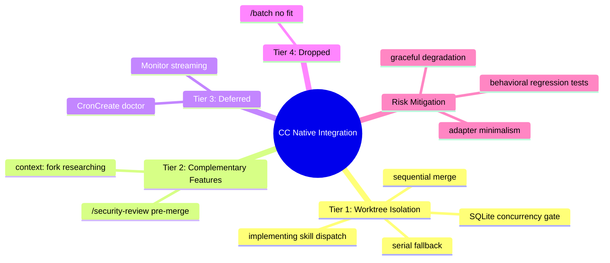

# PRD: CC Native Feature Integration for pd Plugin

## Status
- Created: 2026-04-12
- Last updated: 2026-04-12
- Status: Draft
- Problem Type: Product/Feature
- Archetype: exploring-an-idea

## Problem Statement
The pd plugin implements all orchestration logic through custom Agent/Task dispatches and bash scripts. A cross-examination against Claude Code's native feature set (v2.1.104, April 2026) identified opportunities where CC native primitives could replace custom code, reduce maintenance surface, or unlock capabilities that pd currently lacks — most notably filesystem-level parallelism during implementation.

### Evidence
- Comparative analysis: CC ships 60+ native commands, worktree isolation, `/batch`, `/security-review`, CronCreate, `context: fork`, Monitor tool — Evidence: [CC common-workflows docs](https://code.claude.com/docs/en/common-workflows), [CC skills docs](https://code.claude.com/docs/en/skills), [CC scheduled-tasks docs](https://code.claude.com/docs/en/scheduled-tasks)
- pd codebase: implementing skill dispatches implementer agents sequentially (one at a time) because there is no filesystem isolation mechanism; worktree isolation would enable parallel dispatch of independent tasks, reducing wall-clock time — Evidence: `plugins/pd/skills/implementing/SKILL.md:37-156`
- pd codebase: no existing usage of worktree, context: fork, CronCreate, /batch, or Monitor anywhere in plugin — Evidence: Skill searcher scan (0 matches across all components)
- Pre-mortem: SQLite concurrency under worktrees is the highest-risk integration point — Evidence: Entity registry DB history (features 056, 058, 066 all hit SQLite locking bugs)

## Goals
1. Enable safe parallel task implementation via worktree isolation
2. Add CC native `/security-review` as a complementary pre-merge check
3. Evaluate CronCreate for scheduled health monitoring (doctor)
4. Identify skills suitable for `context: fork` optimization
5. Establish behavioral regression baseline before any integration

## Success Criteria
- [ ] Implementing skill uses `isolation: "worktree"` for parallel implementer agents without SQLite concurrency conflicts
- [ ] Pre-merge validation pipeline invokes `/security-review` alongside existing discovered checks
- [ ] Behavioral regression test suite verifies workflow phase outcomes (entity DB state, .meta.json fields, phase transitions) before and after integration
- [ ] (Stretch) At least 1 skill converted to `context: fork` (researching skill is primary candidate)
- [ ] (Stretch) Doctor can be scheduled via CronCreate for desktop-tier recurring checks

## User Stories
### Story 1: Parallel Implementation
**As a** pd user **I want** implementer agents to work in isolated worktrees **So that** parallel task execution doesn't cause file conflicts or partial overwrites

**Acceptance criteria:**
- Each implementer agent dispatched with `isolation: "worktree"`
- Worktree branches merged sequentially after all agents complete
- `.meta.json` and entity DB writes remain conflict-free
- Fallback to serial execution if worktree creation fails

### Story 2: Security Gate in Pre-Merge
**As a** pd user **I want** CC's native `/security-review` to run during pre-merge validation **So that** security vulnerabilities are caught before merge regardless of whether implement's review loop ran

**Acceptance criteria:**
- `/security-review` invoked as an additional check in Step 5a of finish-feature and wrap-up
- Runs after discovered project checks (validate.sh, tests) pass
- Failures treated as blocking (same as other pre-merge check failures)
- Does NOT replace pd's security-reviewer agent in implement review loop

### Story 3: Context-Forked Research
**As a** pd skill author **I want** research skills to use `context: fork` **So that** research agent context doesn't pollute the main conversation window

**Acceptance criteria:**
- Researching skill Phase 1 dispatches use `context: fork`
- Results surface cleanly to main conversation
- No behavioral change in research output quality

## Use Cases
### UC-1: Parallel Task Implementation
**Actors:** pd user, implementing skill, implementer agents | **Preconditions:** tasks.md exists with 3+ unchecked tasks, `max_concurrent_agents >= 2`
**Flow:** 1. Implementing skill reads tasks.md 2. Dispatches up to `max_concurrent_agents` implementer agents with `isolation: "worktree"` 3. Each agent works in its own worktree branch 4. On completion, branches are merged sequentially to feature branch 5. Merge conflicts flagged for user resolution
**Postconditions:** All tasks implemented, feature branch has all changes merged
**Edge cases:** SQLite DB lock during parallel entity writes → gate behind WAL mode + retry; Worktree creation fails → fall back to serial dispatch

### UC-2: Scheduled Doctor
**Actors:** CronCreate, doctor module | **Preconditions:** Desktop scheduling tier available
**Flow:** 1. CronCreate schedules `pd:doctor` at configurable interval (e.g., every 4 hours) 2. Doctor runs 10 health checks 3. Results logged; critical issues surface as notifications
**Postconditions:** Workspace health monitored without manual invocation
**Edge cases:** Cloud tier lacks local file access → doctor cannot run; Desktop not available → skip scheduling silently

## Edge Cases & Error Handling
| Scenario | Expected Behavior | Rationale |
|----------|-------------------|-----------|
| Worktree + SQLite concurrent write | Retry with exponential backoff; if 3 failures, fall back to serial | Entity DB has documented concurrency fragility |
| `/security-review` not available | Skip with warning, don't block merge | Feature is complementary, not critical path |
| `context: fork` not honored by CC | Skill falls back to inline execution | Issue #17283 was fixed but regressions possible |
| CronCreate disabled via env var | Skip scheduling silently | `CLAUDE_CODE_DISABLE_CRON=1` is a valid user choice |
| Worktree missing `.env`/config | Require `.worktreeinclude` file in project | CC docs: gitignored files not included without this |

## Constraints
### Behavioral Constraints (Must NOT do)
- Must NOT replace pd's security-reviewer agent with `/security-review` — Rationale: pd's agent provides structured JSON output, OWASP checklist, and integrates with implement.md's review loop; `/security-review` is complementary, not a substitute
- Must NOT make worktree isolation the default without resolving SQLite concurrency — Rationale: Entity registry DB has 3 documented concurrent-write failure features (056, 058, 066)
- Must NOT adopt CronCreate before defining a concrete use case with measurable pain — Rationale: Premature commitment to platform features with no stability guarantee (opportunity-cost advisor)

### Technical Constraints
- CC native features have no plugin stability contract — Evidence: Changelog documents breaking changes (tool renames, hook trigger changes) without versioned API guarantees
- `context: fork` only works for skills with explicit step-by-step instructions — Evidence: CC docs warn forked subagent receives guidelines but no actionable task and returns empty
- CronCreate cloud tier cannot access local files — Evidence: CC scheduled-tasks docs
- Worktree branches require manual sequential merge — Evidence: CC worktree docs; no auto-merge back to parent

## Requirements
### Functional
- FR-0: (Phase 0 Spike) Before implementing FR-1, run a controlled test with 3 parallel worktree agents writing to entity DB simultaneously under WAL mode + retry. Document results. If failures persist, FR-1 is blocked until entity DB architecture is resolved.
- FR-1: Implementing skill SHALL support `isolation: "worktree"` for parallel implementer agent dispatches (gated by FR-0 passing)
- FR-2: Pre-merge validation (Step 5a) SHALL instruct the orchestrating agent to invoke `/security-review` as a skill/command (via `Skill` tool or inline instruction in the command markdown) after project checks pass — Assumption: CC slash commands can be invoked from command markdown instructions to the agent; needs verification during implementation
- FR-3: Researching skill SHALL use `context: fork` for Phase 1 parallel dispatches
- FR-4: Doctor command SHALL support optional CronCreate scheduling via config field
- FR-5: A behavioral regression test suite SHALL verify phase outcomes before and after integration, covering: (a) implement phase → entity DB has correct task entity states, (b) finish-feature → .meta.json has status=completed with timestamps, (c) phase transitions → workflow engine accepts/rejects correctly. Tests SHALL be automated shell scripts in `plugins/pd/hooks/tests/` following existing test patterns. Baseline captured before any FR-1 changes.

### Non-Functional
- NFR-1: Worktree isolation SHALL fall back to serial dispatch on any worktree creation failure
- NFR-2: All CC native integrations SHALL degrade gracefully if the native feature is unavailable or changed
- NFR-3: CC native integrations SHOULD reduce net custom code where possible; any integration that increases custom code by more than 200 lines requires explicit justification documenting why the adapter complexity is warranted

## Non-Goals
- Replacing pd's MCP memory-server with CC native auto-memory — Rationale: pd's provides cross-project semantic search, categories, and confidence levels that CC native per-project memory cannot match
- Replacing pd's entity registry or workflow engine — Rationale: CC has no equivalent for feature lifecycle tracking
- Adopting `/batch` for pd workflow tasks — Rationale: Codebase explorer confirmed pd has no cross-cutting direct-edit patterns; all multi-file changes are agent-delegated
- Full `/batch` integration — Rationale: pd decomposes work into tasks and dispatches agents; `/batch` adds nothing over this pattern

## Out of Scope (This Release)
- Monitor tool integration — Future consideration: could stream pre-merge validation output in real-time; defer until a concrete long-running operation is identified
- Path-scoped `.claude/rules/*.md` replacing hook-based context injection — Future consideration: rules are static, hooks read dynamic state
- Scheduled retrospectives via CronCreate — Future consideration: no recurring retro cadence established

## CC Native Feature Reference

| Feature | CC Version | Documentation | API/Syntax |
|---------|-----------|---------------|------------|
| Worktree isolation | v2.1.49 (Feb 2026) | [common-workflows](https://code.claude.com/docs/en/common-workflows) | Agent frontmatter: `isolation: worktree` |
| `/security-review` | Available | [claude-code-security-review](https://github.com/anthropics/claude-code-security-review) | Slash command or customizable `.claude/commands/security-review.md` |
| CronCreate | v2.1.72+ | [scheduled-tasks](https://code.claude.com/docs/en/scheduled-tasks) | Tool: `CronCreate({ schedule, prompt, recurrence })` |
| `context: fork` | v2.1.x (Issue #17283 closed Jan 2026) | [skills](https://code.claude.com/docs/en/skills) | Skill frontmatter: `context: fork` + `agent: <type>` |
| Monitor | v2.1.98 (Apr 2026) | [claudefa.st/monitor](https://claudefa.st/blog/guide/mechanics/monitor) | Tool: `Monitor({ command, timeout_ms, persistent })` |
| `/batch` | Available | [claudefa.st/batch](https://claudefa.st/blog/guide/mechanics/simplify-batch-commands) | Slash command: `/batch <description>` |

## Research Summary
### Internet Research
- Worktree isolation shipped v2.1.49 (Feb 2026); branches from origin/HEAD, no auto-merge, `.worktreeinclude` for gitignored files — Source: [code.claude.com/docs/en/common-workflows](https://code.claude.com/docs/en/common-workflows)
- `/batch` orchestrates parallel changes with worktree isolation per agent; requires natural-language description — Source: [claudefa.st/batch](https://claudefa.st/blog/guide/mechanics/simplify-batch-commands)
- `/security-review` is open-source reference impl (`anthropics/claude-code-security-review`); covers OWASP categories; customizable by copying to `.claude/commands/` — Source: [github.com/anthropics/claude-code-security-review](https://github.com/anthropics/claude-code-security-review)
- CronCreate has 3 tiers: session (dies on exit), desktop (persistent, local files), cloud (no local files, min 1hr) — Source: [code.claude.com/scheduled-tasks](https://code.claude.com/docs/en/scheduled-tasks)
- `context: fork` runs skill in isolated subagent context; only works for explicit step-by-step skills; Issue #17283 fixed Jan 2026 — Source: [code.claude.com/skills](https://code.claude.com/docs/en/skills)
- Monitor tool (shipped v2.1.98, April 2026): event-driven background streaming, zero tokens when silent — Source: [claudefa.st/monitor](https://claudefa.st/blog/guide/mechanics/monitor)
- Worktree + DB isolation requires explicit handling; MCP servers are NOT isolated by worktree — Source: [damiangalarza.com](https://www.damiangalarza.com/posts/2026-03-10-extending-claude-code-worktrees-for-true-database-isolation)

### Codebase Analysis
- Implementing skill dispatches are strictly serial (Step 2 loop, document order) — Location: `plugins/pd/skills/implementing/SKILL.md:37-156`
- Task dispatch block at SKILL.md:101-122 has no isolation fields — exact insertion point for `isolation: "worktree"` — Location: `plugins/pd/skills/implementing/SKILL.md:101-122`
- Pre-merge validation (Step 5a) is identical in finish-feature.md and wrap-up.md — 4 discovery sources, sequential execution, 3 auto-fix attempts — Location: `plugins/pd/commands/finish-feature.md:339-371`
- Doctor has 10 named checks, runs at session start only, no CronCreate wiring — Location: `plugins/pd/commands/doctor.md:58-99`
- Researching skill dispatches 2 parallel Task calls in Phase 1 (codebase-explorer + internet-researcher) — best `context: fork` candidate — Location: `plugins/pd/skills/researching/SKILL.md:27-78`
- Design.md also dispatches 2 parallel Task calls — secondary candidate — Location: `plugins/pd/commands/design.md:53`
- root-cause-analysis and promptimize are fully inline (no Task dispatches) — NOT candidates for context: fork — Location: `plugins/pd/skills/root-cause-analysis/SKILL.md`, `plugins/pd/skills/promptimize/SKILL.md`
- `max_concurrent_agents` actively used only in brainstorming dispatch loop — Location: `plugins/pd/skills/brainstorming/SKILL.md:171-182`

### Existing Capabilities
- pd:security-reviewer agent exists, deeply integrated into implement.md's 4-level review loop with resume state, delta guards, and context-compaction handling — How it relates: `/security-review` is complementary for pre-merge, not a replacement for implement-phase review
- No worktree, context: fork, CronCreate, /batch, or Monitor usage exists anywhere in pd — How it relates: all integrations are greenfield with no migration concerns

## Structured Analysis
### Problem Type
Product/Feature — enhancing an existing development workflow plugin with platform-native capabilities

### SCQA Framing
- **Situation:** pd plugin orchestrates feature development through custom skills, agents, hooks, and MCP servers. CC has evolved to provide native primitives for parallel execution (worktrees), security analysis, scheduling, and context isolation.
- **Complication:** pd's implementing skill dispatches tasks serially with no filesystem isolation. CC's worktree isolation, `/security-review`, CronCreate, and `context: fork` could address this — but integrating platform features creates coupling to Anthropic's release cadence with no plugin stability guarantees.
- **Question:** Which CC native features should pd adopt, in what order, and with what safeguards?
- **Answer:** Adopt worktree isolation first (highest value, clearest gap), `/security-review` second (complementary, low risk), `context: fork` third (optimization). Gate worktree behind SQLite concurrency resolution. Defer CronCreate and `/batch` until concrete pain is documented.

### Decomposition
```
CC Native Integration
├── Tier 1: Do Now (high value, low risk)
│   └── Worktree isolation for implementing
│       ├── Add isolation: "worktree" to implementer dispatch
│       ├── Gate behind SQLite concurrency resolution
│       ├── Sequential merge after parallel agents complete
│       └── Fallback to serial on failure
├── Tier 2: Do Next (moderate value)
│   ├── /security-review in pre-merge
│   │   ├── Add to Step 5a discovery
│   │   └── Complementary to pd:security-reviewer
│   └── context: fork for researching skill
│       ├── Phase 1 parallel dispatches
│       └── Validate output quality matches current
├── Tier 3: Defer (need use case)
│   ├── CronCreate for scheduled doctor
│   └── Monitor for pre-merge streaming
└── Tier 4: Drop (no fit)
    └── /batch (no cross-cutting edit patterns in pd)
```

### Mind Map


## Strategic Analysis

### Pre-mortem
- **Core Finding:** The integration most likely fails not from technical difficulty but from a mismatch between pd's stable, tested workflow phases and the churn rate of CC native features — the platform moves faster than the plugin's integration layer can absorb, and one breaking change silently corrupts the workflow for a solo maintainer with no regression net.
- **Analysis:** The failure narrative writes itself clearly. Terry integrates worktree isolation, and it works initially. Then CC ships a minor version that changes how worktree branches are named, or alters the cleanup behavior. pd's workflow continues executing without error — it just silently drops worktree isolation and falls back to serial execution. No test catches it because pd's test suite covers hook correctness and MCP calls, not behavioral equivalence of CC-native orchestration features. The second cascade follows from worktree isolation directly — pd's workflow carries significant state: `.meta.json`, entity registry DB writes, MCP server connections, SQLite WAL-mode locks. Worktree isolation duplicates the filesystem but not the MCP server. When worktree-isolated implementers try to write to `~/.claude/pd/entities/entities.db` concurrently, the same SQLite locking bugs that consumed features 056, 058, and 066 re-emerge in a new topology.
- **Key Risks:** CC native features change without plugin contracts; worktree + SQLite concurrency amplifies the most documented failure class in pd history; silent fallback means invisible degradation; no regression baseline exists to detect it
- **Recommendation:** Before integrating any feature, establish a behavioral regression baseline — a small test suite that exercises each workflow phase end-to-end and asserts on state outcomes. Gate worktree isolation behind SQLite concurrency resolution.
- **Evidence Quality:** moderate

### Opportunity-cost
- **Core Finding:** Integrating all 5 CC native features is a portfolio commitment of ~5 features worth of development time; the true opportunity cost is that items with verified, chronic pain (backlog 00033 reviewer token efficiency, 00051 structured phase events DB) remain deferred while pd absorbs platform-level risk from features whose CC API stability is unproven.
- **Analysis:** Worktree isolation is the only integration with both a clear custom-code gap and a low-risk, documented API. `/security-review` would duplicate an already-working custom mechanism — pd's security-reviewer provides workflow-integrated JSON output that native `/security-review` cannot replicate. CronCreate and `context: fork` are newly shipped features with no established pd use cases — adopting them before defining the problem is premature commitment. The real opportunity cost is deferral of backlog items with documented, chronic pain and no platform-stability risk. pd already covers the `/batch` use case via parallel Task dispatch with its own decomposition; the marginal gain from `/batch` integration is unconfirmed.
- **Key Risks:** Platform API instability for recently shipped features; treating all 5 as one initiative delays delivery; security-review duplication adds a second mechanism to maintain; no minimum experiment defined for CronCreate or context: fork
- **Deferred backlog context:** 00033 = reviewer token efficiency (reducing token waste in review loops); 00051 = structured phase events DB (replacing .meta.json with proper event sourcing)
- **Recommendation:** Integrate worktree isolation immediately as a standalone, high-confidence micro-change. Defer CronCreate, `/batch`, and `context: fork` until a concrete use case with measurable pain is identified. Re-evaluate `/security-review` only if pd's security-reviewer is ever scheduled for removal.
- **Evidence Quality:** moderate

## Options Evaluated

| Option | Value | Risk | Verdict |
|--------|-------|------|---------|
| Worktree isolation for implementing | High — enables safe parallelism | Medium — SQLite concurrency needs resolution | **Tier 1: Do Now** |
| `/security-review` in pre-merge | Medium — adds defense-in-depth | Low — complementary, not replacement | **Tier 2: Do Next** |
| `context: fork` for researching | Low-Medium — context window savings | Low — clean fallback to inline | **Tier 2: Do Next** |
| CronCreate for scheduled doctor | Low — no documented pain from manual invocation | Medium — platform stability unknown | **Tier 3: Defer** |
| Monitor for pre-merge streaming | Low — no long-running operations identified | Low — additive feature | **Tier 3: Defer** |
| `/batch` for cross-cutting tasks | None — no candidates found | N/A | **Tier 4: Drop** |

## Review History

### Review 1 (2026-04-12)
**Reviewer:** prd-reviewer (opus)
**Result:** NOT APPROVED — 3 blockers, 5 warnings, 2 suggestions

**Findings:**
- [blocker] Problem statement mischaracterized serial dispatch as a limitation rather than design choice (at: Evidence section)
- [blocker] /security-review invocation mechanism unverified — slash commands may not be invocable programmatically (at: FR-2)
- [blocker] All CC native feature references lacked verifiable documentation sources (at: Problem Statement, FR-1 through FR-4)
- [warning] Open Question 1 (SQLite concurrency) conflicts with Tier 1 classification — no resolution plan (at: Open Questions vs Options)
- [warning] NFR-3 50-line cap unrealistic for worktree adapter logic (at: NFR-3)
- [warning] Research Summary section was a placeholder (at: Research Summary)
- [warning] FR-5 behavioral regression test suite underspecified (at: FR-5)
- [warning] context: fork commitment level contradicts Low-Medium value rating (at: Success Criteria vs Options)
- [suggestion] Worktree branch naming, conflict detection, cleanup not detailed (at: UC-1)
- [suggestion] Backlog items 00033 and 00051 referenced without description (at: Strategic Analysis)

**Corrections Applied:**
- Reframed serial dispatch characterization to "sequential by necessity" — Reason: Blocker #1
- Added CC Native Feature Reference table with documentation links, versions, and API syntax — Reason: Blocker #3
- Flagged /security-review invocation as assumption needing verification; noted Skill tool or command markdown instruction as mechanism — Reason: Blocker #2
- Added FR-0 Phase 0 Spike: controlled SQLite concurrency test before FR-1 proceeds — Reason: Warning #1
- Replaced 50-line cap with 200-line threshold + justification principle — Reason: Warning #2
- Populated Research Summary with actual findings and source URLs — Reason: Warning #3
- Expanded FR-5 with specific phase outcomes, test format, and baseline capture — Reason: Warning #4
- Downgraded context: fork to stretch goal in Success Criteria — Reason: Warning #5
- Added backlog item descriptions (00033, 00051) to strategic analysis — Reason: Suggestion #2

## Open Questions
1. Does WAL mode + retry logic fully resolve SQLite concurrent writes from worktree-parallel sessions, or does the entity registry need architectural changes (e.g., per-worktree DB copies)?
2. Should `/security-review` run on every pre-merge, or only when file changes exceed a threshold (e.g., >100 lines changed)?
3. Can `context: fork` inherit MCP server connections from the parent session, or do research skills lose access to entity-registry/memory-server?
4. What is the token cost of `/security-review` on a typical pd feature branch? Is it material for a solo developer's usage budget?

## Next Steps
Ready for /pd:create-feature to begin implementation.
