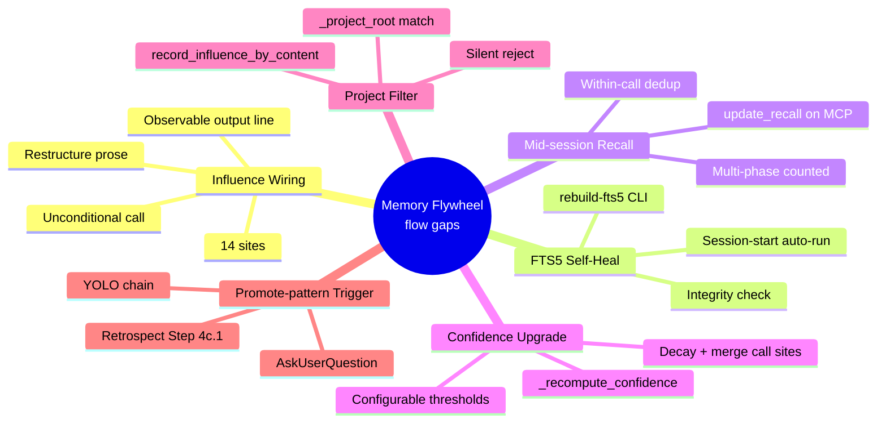

# PRD: Memory Flywheel — Close the Self-Improvement Loop

*Source: Backlog #00053*

## Status
- Created: 2026-04-30
- Last updated: 2026-04-30
- Status: Draft
- Problem Type: Product/Feature
- Archetype: improving-existing-work

## Problem Statement

pd's memory infrastructure is **architecturally complete but operationally
dormant.** The flywheel design — recall → influence → ranking weight → better
recall — is wired in `ranking.py` and exposed via MCP. But the data the
flywheel needs to compound is not flowing.

**Verified live state (2026-04-30):**

- 935 of 943 vector entries (~99%) have `influence_count = 0`. The MCP tool
  `record_influence_by_content` exists at `memory_server.py:816`. The
  orchestrator commands `specify.md`, `design.md`, `create-plan.md`,
  `implement.md` ALREADY contain post-dispatch influence-tracking prose
  blocks (**14 sites total**: specify×2, design×2, create-plan×3,
  implement×7) instructing the LLM to invoke the MCP. Yet the invocation
  rate is ~1%.
- The FTS5 virtual table `entries_fts` exists (database.py:146-185 with
  triggers `entries_ai`/`entries_ad`/`entries_au`). Migration 5
  (database.py:303-323) executes `INSERT INTO entries_fts(entries_fts)
  VALUES('rebuild')` to backfill. On the user's DB it shows 0 rows.
  Either migration 5 did not run, ran before entries existed, or
  silently failed.
- `recall_count` IS bumped at session-start by `injector.py:281` — but
  mid-session `search_memory` MCP calls do NOT bump it. Three of the five
  prominence signals (`influence_count`, mid-session `recall_count`,
  confidence-upgrade) are dormant; the flywheel rotates only on the data
  that does flow.
- `confidence` has a downgrade path (`semantic_memory.maintenance --decay`
  runs at session start and demotes `high → medium → low` based on day
  thresholds). It has NO upgrade path. Once an entry is `low`, evidence of
  validated use cannot promote it back.
- `record_influence_by_content` does NOT filter candidates by
  `source_project` — `search_memory` does (via `_project_blend()` at
  ranking.py:311). Cross-project influence updates are possible.
- `/pd:promote-pattern` and the `promoting-patterns` skill are FULLY
  IMPLEMENTED (469-line skill, 5-subcommand `pattern_promotion` Python
  package, all generators). The infrastructure to enforce KB patterns as
  hooks/skills/agents/commands exists. **It has zero adoption** — no
  trigger surfaces it during the normal workflow; the value (an enforceable
  rule next session) is deferred and invisible.
- `memory_refresh` digest already runs in `_process_complete_phase`
  (`workflow_state_server.py:950-973`) and embeds in the MCP response.
  Whether this is sufficient or whether a separate PostToolUse hook is
  needed is open (CC limitation #6305 may affect plugin-hook firing on
  MCP tools).

**The architectural gap is not "build more memory infrastructure." It is
"close the four flow gaps that prevent the existing flywheel from
rotating."**

### Evidence
- Backlog #00053 (2026-04-15) — Source: `docs/backlog.md:38`
- 14 prose-instruction sites for `record_influence_by_content` with
  ~1% invocation rate — verified via `grep -c 'Post-dispatch influence tracking' plugins/pd/commands/{specify,design,create-plan,implement}.md`
  → 2/2/3/7. Sites: specify.md:166,326; design.md:368,564;
  create-plan.md:162,319,473; implement.md:127,192,505,666,844,1015,1178.
- Migration 5 'rebuild' command in database.py:303-323 — Source: codebase-explorer
- `recall_count` increment at injector.py:281 only — Source: codebase-explorer
- `_recompute_confidence` does not exist; `decay_confidence` does (downgrade
  only) — Source: codebase-explorer
- `_project_blend()` filters `search_memory` but not `record_influence_by_content`
  — Source: codebase-explorer (ranking.py:311 vs memory_server.py:816)
- `/pd:promote-pattern` and `promoting-patterns` skill complete (469 lines,
  6 steps, 5 CLI subcommands) — Source: skill-searcher
- `memory_refresh` digest in `_process_complete_phase` — Source:
  codebase-explorer (workflow_state_server.py:950-973)
- "Lost in the Middle" attention degradation as cause of LLM-prose skip —
  Source: internet-researcher + adoption-friction advisor (Liu et al. 2024)
- Recommender-system rich-get-richer / Matthew effect risk on naive
  `recall_count` reinforcement — Source: internet-researcher (DOI 10.1145/3564284)

## Goals

1. Make every reviewer-correction cycle deposit a **deterministic** influence
   signal — not subject to LLM working-memory budget.
2. Restore the FTS5 keyword-retrieval signal so hybrid search has both legs.
3. Bring `recall_count` and confidence-upgrade online so prominence reflects
   real-world use, not just write history.
4. Surface `/pd:promote-pattern` at a moment of immediate value (post-retro
   trigger) so the existing pipeline gets a first rotation.
5. Eliminate cross-project influence pollution.

## Success Criteria

- [ ] **SC-1 (FR-1 Influence wiring):** For ANY feature shipped after this
      lands, ≥80% of entry IDs returned by pre-dispatch `search_memory`
      calls in that feature have `influence_count ≥ 1` within one feature
      lifecycle, verified by per-feature audit script
      (`python -m semantic_memory.audit --feature {id}` — to be implemented
      under FR-1) that queries `entries.influence_count` for the captured
      `injected_entry_names` set. Default validation target: this feature's
      own retro-time audit on the entries it injected during its 6-FR
      review/implement cycles.
- [ ] **SC-2 (FR-2 FTS5 integrity):** A new CLI
      `python -m semantic_memory.maintenance --rebuild-fts5` rebuilds the
      `entries_fts` index from `entries`. Session-start auto-detects
      `entries_fts.count == 0 AND entries.count > 0` and runs the rebuild.
      Post-rebuild: `SELECT COUNT(*) FROM entries_fts` ≈ `SELECT COUNT(*) FROM entries`.
- [ ] **SC-3 (FR-3 Recall tracking):** Every `search_memory` MCP call
      increments `recall_count` for returned entries (within-call dedup
      prevents double-bump). Verified by integration test exercising the
      MCP tool and asserting DB state.
- [ ] **SC-4 (FR-4 Confidence upgrade):** Given an entry that meets EITHER
      the observation gate (`observation_count >= K_OBS`, default 3) OR
      the use gate (`influence_count >= 1 AND influence_count + recall_count >= K_USE`,
      default `K_USE=5`), a call to `decay_confidence()` (or
      `merge_duplicate()`, whichever fires first) upgrades `low → medium`.
      The `influence_count >= 1` floor prevents pure-retrieval-popularity
      promotion. Thresholds reachable via config keys
      `memory_promote_min_observations` (existing, reused),
      `memory_promote_use_signal` (new). Tests:
      seed entry with `observation_count=3` (ignore other signals) → upgrades;
      seed separate entry with `influence_count=2 + recall_count=3` (sum=5,
      floor met) → upgrades; seed entry with `influence_count=0 + recall_count=10`
      (sum>>5 but floor unmet) → does NOT upgrade.
- [ ] **SC-5 (FR-5 source_project filter):** `record_influence_by_content`
      filtered by current `_project_root`. Test: write entry from project A,
      run `record_influence_by_content` from project B context — assert
      project A entry is NOT updated.
- [ ] **SC-6 (FR-6 Promote-pattern adoption trigger):** When the
      retrospecting skill's Step 4c finds ≥1 qualifying entry (per existing
      `memory_promote_min_observations` threshold), it MUST emit a
      one-question AskUserQuestion offering `/pd:promote-pattern`. YOLO mode
      auto-accepts and chains the command. Confirmed: at least one pattern
      promoted end-to-end during dogfood of this feature's own retro.
- [ ] **SC-7 (no regression):** `search_memory` MCP latency does not
      regress more than 5% on a synthetic-1000-entries integration
      benchmark (FR-3 adds an UPDATE per call; benchmark proves the cost
      is bounded). Replaces a previous comparison-against-future-features
      success metric with a deterministic per-feature regression test.

## User Stories

### Story 1: Reviewer feedback compounds across features (FR-1)
**As a** pd orchestrator agent (reviewer dispatch in implement / create-plan / specify / design)
**I want** every reviewer Task return to deterministically record influence
on the entries injected into the reviewer's prompt
**So that** the flywheel's primary input — "this entry shaped a successful
review" — is captured at >80% rate, not the current ~1%.

**Acceptance criteria:**
- The post-dispatch influence-tracking prose block is restructured to:
  (a) unconditional invocation (no "if search_memory returned entries"
  guard at the top — pass empty list when no entries),
  (b) repositioned BEFORE the "Branch on result" step in each command
  (currently buried mid-step),
  (c) numbered as its own step (e.g., `c.0` or new explicit `d`) so the
  LLM cannot treat it as side-effect prose.
- Apply to all 14 reviewer-return sites: specify.md (×2), design.md (×2),
  create-plan.md (×3), implement.md (×7).
- Each block includes "Files written: confirm by output line `Influence recorded: N matches`"
  to provide an observable consequence to the LLM.
- Post-feature audit queries `influence_count` distribution; expected ≥80% on
  injected entries.

### Story 2: FTS5 keyword retrieval works (FR-2)
**As a** memory subsystem
**I want** the FTS5 virtual table populated and self-healing
**So that** hybrid search has both BM25 and vector legs operational, and
the case where migration 5 silently failed is detectable + recoverable
without manual SQL.

**Acceptance criteria:**
- New subcommand: `python -m semantic_memory.maintenance --rebuild-fts5`.
  Uses existing `INSERT INTO entries_fts(entries_fts) VALUES('rebuild')`
  pattern. Idempotent.
- `session-start.sh` invokes integrity check: query `entries_fts` row count
  vs `entries` row count; if `entries_fts == 0 AND entries > 0`, run
  rebuild and log a one-line warning to stderr.
- Integration test: drop `entries_fts`, populate `entries`, run integrity
  check, assert `entries_fts` count > 0.

### Story 3: Mid-session retrieval is observable (FR-3)
**As a** memory subsystem
**I want** every `search_memory` MCP call to increment `recall_count` for
returned entries (with within-call dedup)
**So that** the prominence signal `_recall_frequency()` reflects real
mid-session use, not just session-start injection.

**Acceptance criteria:**
- `_process_search_memory` in `memory_server.py` calls `db.update_recall(returned_ids, now_iso)`
  before returning to the caller.
- Within-call dedup is a Set comprehension on the returned ids (no double-bump
  if the same entry is returned twice within one query — should not happen
  but defensive).
- Across multiple `search_memory` calls in the same session, the same entry
  retrieved twice is counted twice (this is the desired behavior — it reflects
  multi-phase use).
- Integration test: call `search_memory` returning entry X, assert
  `recall_count` incremented by 1; call again, assert incremented by 2.

### Story 4: Confidence reflects validated use (FR-4)
**As a** maintainer of the memory subsystem
**I want** confidence to upgrade `low → medium` when an entry meets EITHER
the observation gate OR the use gate (influence + recall)
**So that** entries that proved themselves through real reviewer cycles
OR through repeated mid-session retrieval gain weight in the prominence
formula, with no single-signal saturation requirement.

**Acceptance criteria:**
- New function `_recompute_confidence(entry)` in `maintenance.py`. Two
  independent gates with OR semantics:
  - **Observation gate:** `observation_count >= K_OBS` (default 3, key
    `memory_promote_min_observations` — reused from existing config).
  - **Use gate:** `influence_count >= 1 AND influence_count + recall_count >= K_USE`
    (default `K_USE=5`, key `memory_promote_use_signal` — new). The
    `>= 1` outcome floor prevents pure-retrieval-popularity promotion.
- On EITHER gate: `low → medium` (or `medium → high` with doubled
  thresholds: `K_OBS_HIGH=6`, `K_USE_HIGH=10`).
- Called from `decay_confidence()` (after demotion check) and
  `merge_duplicate()` (after observation_count++).
- Tests:
  - Seed with `observation_count=3, influence_count=0, recall_count=0` →
    upgrades via observation gate.
  - Seed with `observation_count=0, influence_count=2, recall_count=3` →
    upgrades via use gate (floor met: influence_count >= 1; sum=5).
  - Seed with `observation_count=0, influence_count=0, recall_count=10` →
    does NOT upgrade (use-gate floor `influence_count >= 1` not met
    despite sum >> K_USE; observation gate unmet).
  - Seed with `observation_count=2, influence_count=1, recall_count=2` →
    does NOT upgrade (observation < 3; sum=3 < K_USE=5).

### Story 5: Influence stays project-scoped (FR-5)
**As a** plugin user working across multiple projects
**I want** `record_influence_by_content` to update only entries whose
`source_project` matches the current project
**So that** project A's reviewer outputs don't pollute project B's memory
ranking weights.

**Acceptance criteria:**
- `_process_record_influence_by_content` in `memory_server.py` adds a
  `source_project = ?` clause to the candidate-matching query (or filters
  in Python after fetch).
- Default: hard filter to current `_project_root`.
- Test: insert entry with `source_project = 'A'`; switch context to project B;
  call `record_influence_by_content` with content that would substring-match;
  assert entry A's `influence_count` unchanged.

### Story 6: Promote-pattern surfaces at the right moment (FR-6)
**As a** plugin user benefiting from observed patterns
**I want** to be prompted to run `/pd:promote-pattern` at the moment when
qualifying entries exist (post-retro)
**So that** the deferred-value adoption barrier converts to an
immediate-trigger discovery.

**Acceptance criteria:**
- `retrospecting/SKILL.md` Step 4c (after universal classification): query
  KB markdown + DB for entries meeting `memory_promote_min_observations`
  threshold. If count > 0, emit AskUserQuestion offering
  `/pd:promote-pattern`.
- YOLO mode: auto-accept and chain the command via `Skill({skill: "pd:promote-pattern"})`.
- Non-YOLO: present option with explicit "Skip" path; default = current
  behavior (no prompt).
- Test: dogfood — run `/pd:retrospect` after a feature with KB entries
  qualifying; verify prompt appears and chained command runs.

## Use Cases

### UC-1: Reviewer Task return → influence recorded (FR-1)
**Actors:** Orchestrating agent (specify/design/create-plan/implement),
reviewer subagent.
**Preconditions:** Memory entries injected into reviewer prompt via existing
`search_memory` integration; reviewer Task returns.
**Flow:**
1. Orchestrator dispatches reviewer Task with N memory entries.
2. Reviewer returns JSON `{approved, issues, summary}`.
3. Orchestrator parses `approved`.
4. **NEW STEP (before "Branch on result"):** Orchestrator calls
   `record_influence_by_content` with `(content=<reviewer output>,
   injected_entry_names=[...], agent_role="<role>", feature_type_id="<id>")`.
   Unconditional — passes empty `injected_entry_names` if none.
5. MCP returns count of matched/recorded entries; orchestrator logs
   "Influence recorded: N matches" line.
6. Orchestrator proceeds to "Branch on result" with full information.

**Postconditions:** Matched entries have `influence_count++`; an observable
"Influence recorded" line exists in conversation log for audit.
**Edge cases:** MCP unavailable → log warning, continue. Reviewer returns
malformed JSON → upstream parse already handles. No matched entries → MCP
returns 0; no error.

### UC-2: Session-start FTS5 self-heal (FR-2)
**Actors:** `session-start.sh` hook, `semantic_memory.maintenance` CLI.
**Preconditions:** User's DB has `entries.count > 0 AND entries_fts.count == 0`.
**Flow:**
1. `session-start.sh` queries both counts via inline `python3 -c`.
2. Detects FTS5 empty + entries non-empty.
3. Runs `python -m semantic_memory.maintenance --rebuild-fts5`.
4. Logs `[memory] FTS5 index empty; rebuilt N rows.` to stderr.

**Postconditions:** `entries_fts` count matches `entries` (within ±5 for
in-flight writes). Hybrid retrieval keyword-leg restored.
**Edge cases:** Rebuild fails → log error, continue (vector retrieval
still works). FTS5 module unavailable → skip integrity check; existing
`_create_fts5_objects` already handles this.

### UC-3: Mid-session search → recall++ (FR-3)
**Actors:** Any agent invoking `search_memory` MCP mid-session.
**Preconditions:** DB populated; session active.
**Flow:**
1. Agent calls `search_memory(query, category, project, limit)`.
2. MCP runs hybrid retrieval, returns N entries.
3. **NEW:** MCP calls `db.update_recall([e.id for e in entries], now_iso)`
   before returning.
4. Agent receives entries with current data.

**Postconditions:** Returned entries have `recall_count++` and
`last_recalled_at = now_iso`. Decay countdown resets.
**Edge cases:** Empty result → no update. UPDATE fails (locked DB) → log
warning, return entries anyway.

### UC-4: Promote-pattern post-retro trigger (FR-6)
**Actors:** User running `/pd:retrospect` (or YOLO chain), `retrospecting`
skill, `promoting-patterns` skill.
**Preconditions:** Feature retro just completed; KB entries written;
some entries qualify per `memory_promote_min_observations` threshold.
**Flow:**
1. `retrospecting/SKILL.md` Step 4c writes universal entries to global
   store (current behavior).
2. **NEW:** Step 4c.1 queries `pattern_promotion enumerate` for qualifying
   entries.
3. If count > 0, emit AskUserQuestion: "N pattern(s) qualify for promotion
   to enforceable rules. Run /pd:promote-pattern now?"
4. If "Yes" (or YOLO auto-yes), invoke `Skill({skill: "pd:promoting-patterns"})`.
5. Promote-pattern flow runs end-to-end (existing 6 steps).

**Postconditions:** At least one KB entry is promoted to a hook/skill/agent/command
artifact, with idempotency marker. Future sessions enforce the rule.
**Edge cases:** No qualifying entries → no prompt. YOLO + no qualifying →
silent skip. User selects "Skip" → continue retro.

## Edge Cases & Error Handling

| Scenario | Expected Behavior | Rationale |
|----------|-------------------|-----------|
| `record_influence_by_content` MCP unavailable mid-feature | Orchestrator logs warning, continues; review-loop unaffected | Influence is best-effort; never block primary path |
| FTS5 rebuild fails at session-start | Log error to stderr; vector retrieval continues; flag for next start | Hybrid retrieval gracefully degrades to vector-only via existing `_adjust_weights()` |
| `update_recall` fails on locked DB during `search_memory` | Return entries anyway, log warning | Recall tracking is observability, not correctness |
| Confidence upgrade threshold met but `confidence == 'high'` already | No-op | Idempotent |
| `record_influence_by_content` with empty `injected_entry_names` | Returns 0 matches, no error | UC-1 always-call protocol |
| Cross-project `record_influence_by_content` invocation | Filtered out silently; returns 0 matches | FR-5 default; logging optional |
| Promote-pattern trigger fires but user hits 5 reviewer iterations on retro | Trigger appears at end of retro regardless | Retro completion is the signal, not iteration count |
| `pattern_promotion enumerate` returns 0 qualifying | No AskUserQuestion emitted | Avoid empty prompts |
| Migration 5 ran but FTS5 module disabled at build time | `_create_fts5_objects` skips silently per existing behavior; integrity check no-op | Existing fallback preserved |

## Constraints

### Behavioral Constraints (Must NOT do)
- MUST NOT add a second decay mechanism. `semantic_memory.maintenance --decay`
  already runs at session-start with tier-based demotion. Any rank-time decay
  changes go in `_prominence()` only, not as a new function.
  Rationale: Self-cannibalization advisor flagged double-decay risk —
  entries demoted by both mechanisms lose confidence faster than intended.
- MUST NOT add a parallel promote-pattern path. The `promoting-patterns`
  skill + `pattern_promotion` Python package own the global-store write side.
  All promotion goes through them.
  Rationale: Self-cannibalization advisor flagged content-hash collision /
  diverging observation count risk if multiple writers exist.
- MUST NOT add a new PostToolUse hook on `complete_phase` MCP without first
  validating that the existing `memory_refresh` digest in
  `_process_complete_phase` is insufficient. CC#6305 also creates registration
  friction.
  Rationale: Adoption-friction + self-cannibalization advisors both flagged
  this as duplicate-trigger risk and hidden deployment friction.
- MUST NOT add edge-case mutation-resistance source pins, Unicode-injection
  guards, or TOCTOU window mitigation for memory-internal paths.
  Rationale: User filter from prior conversation: "primary feature +
  primary/secondary defense; anything beyond is blackswan."
- MUST NOT introduce config keys without documenting them in the existing
  `pd.local.md` config-key reference.
  Rationale: pd convention.
- MUST NOT add config flags, feature toggles, or migration shims to gate
  the new behavior. All FRs ship as straight replacements per pd's
  no-backwards-compatibility principle (private tooling, no external
  consumers).
  Rationale: CLAUDE.md "No backward compatibility — Delete old code, don't
  maintain compatibility shims."

### Technical Constraints
- Stdlib-only for hooks; no PyYAML — Evidence: `doctor.sh`, feature 099 retro
- SQLite single-process; FTS5 backfill MUST use `INSERT INTO entries_fts(entries_fts) VALUES('rebuild')`
  (existing pattern, atomic via SQLite-internal lock) — Evidence: database.py:303-323
- pd venv path resolution via two-location glob — Evidence: CLAUDE.md
- `plugins/pd/.venv/bin/python -m semantic_memory.*` invocation; never
  `pip install` directly — Evidence: CLAUDE.md
- MCP tool changes in `plugins/pd/mcp/memory_server.py`; DB schema changes
  in `plugins/pd/hooks/lib/semantic_memory/database.py` migrations array —
  Evidence: existing layout
- FTS5 trigger UPDATE pattern requires AFTER + delete-then-insert (per SQLite
  forum) — Evidence: internet-researcher (SQLite forum thread on FTS5 corruption)

## Requirements

### Functional

- **FR-1: Mechanize influence recording at reviewer return points.**
  Restructure the existing post-dispatch influence-tracking prose blocks in
  `specify.md` (×2), `design.md` (×2), `create-plan.md` (×3), `implement.md` (×7) — **14 sites total**
  to: (a) unconditional invocation (drop the `if search_memory returned entries`
  conditional gate; pass empty list when none); (b) reposition BEFORE
  "Branch on result"; (c) numbered as their own step; (d) require an observable
  output line `Influence recorded: N matches` to create an LLM
  self-correction signal.

- **FR-2: FTS5 integrity check + on-demand backfill CLI.**
  - New CLI: `python -m semantic_memory.maintenance --rebuild-fts5`
    (uses existing `INSERT INTO entries_fts(entries_fts) VALUES('rebuild')`).
  - `session-start.sh` adds integrity check: if
    `entries_fts.count == 0 AND entries.count > 0`, run rebuild + log warning
    `[memory] FTS5 empty; rebuilt N rows.` to stderr.
  - **Design phase MUST include an unconditional one-time post-rebuild
    diagnostic log entry** capturing: (a) `entries.count`,
    (b) `entries_fts.count` post-rebuild, (c) the schema_version timestamp
    of migration 5, (d) any FTS5 errors during rebuild, (e) on-disk DB
    path. Written to a one-shot file (e.g.,
    `~/.claude/pd/memory/.fts5-rebuild-diag.json`) for forensic analysis.
    The user's existing 0-row state already exhibits the migration-5
    failure mode; the first rebuild on the user's DB is the diagnostic
    opportunity. **If rebuild fires AGAIN on the same DB after the
    diagnostic file already exists**, that is a second-order signal of an
    unfixed defect — log a stronger warning.
  - Idempotent; safe to re-run.

- **FR-3: Mid-session recall tracking.**
  `_process_search_memory` in `memory_server.py` calls
  `db.update_recall([e.id for e in returned_entries], now_iso)` before
  returning. Within-call dedup via set comprehension. Across-call: each
  retrieval counted (reflects multi-phase use). Best-effort (UPDATE failures
  logged, not raised).

- **FR-4: Confidence upgrade path.**
  New function `_recompute_confidence(entry)` in `maintenance.py`. Two
  independent gates (OR semantics, not AND) so promotion does NOT depend
  on FR-1 saturation:
  - **Observation gate:** `observation_count >= K_OBS`. Default `K_OBS = 3`,
    reuses existing config key `memory_promote_min_observations` (already
    used by `pattern_promotion enumerate`).
  - **Use gate (combines influence + recall, with outcome-validation
    floor):** `influence_count >= 1 AND influence_count + recall_count >= K_USE`.
    Default `K_USE = 5`. New config key `memory_promote_use_signal`.
    **Why the `influence_count >= 1` floor:** without it, a
    frequently-recalled but never-validated entry could promote on pure
    retrieval-frequency, which is exactly the rich-get-richer dynamic
    flagged by the recommender-systems literature (DOI 10.1145/3564284).
    Requiring at least one outcome signal keeps the use gate "validated
    use plus repeated retrieval", not "popularity alone".
  - On EITHER gate met:
    - `low → medium`.
    - `medium → high` requires both gates' values doubled
      (`K_OBS_HIGH = 6`, `K_USE_HIGH = 10`).
  - **Why include `recall_count` (with the floor above):** FR-3 makes
    `recall_count` a meaningful signal of mid-session use. The
    `influence_count >= 1` floor prevents the rich-get-richer trap while
    still letting FR-3's investment feed FR-4: an entry needs ONE outcome
    signal plus accumulated retrievals to promote, not just retrievals.
    Validated-and-frequently-used promotes faster than
    validated-but-rarely-used, which matches intent.
  - Called from `decay_confidence()` (after demotion check) AND
    `merge_duplicate()` (after observation_count++). Inline, cheap.

- **FR-5: `source_project` filter at influence recording.**
  `_process_record_influence_by_content` in `memory_server.py` filters
  candidate matches to `source_project = _project_root`.
  - Default: hard filter — cross-project attempts return 0 matches silently.
  - **If `_project_root` is None or unresolvable** (e.g., global agent
    context, dispatch outside a project): the filter is bypassed (NO
    project filter applied) and a one-line stderr warning is logged
    (`[memory] record_influence: no project context; skipping project filter`).
    Rationale: silently filtering everything would nullify FR-1 in any
    cross-project orchestration; logging surfaces the misconfiguration
    without breaking the flywheel.

- **FR-6: Promote-pattern post-retro adoption trigger.**
  `retrospecting/SKILL.md` Step 4c (after universal classification):
  - **Enumerate** qualifying entries via subprocess CLI:
    `python -m pattern_promotion enumerate --json` (consistent with skill
    convention). Threshold uses existing config key
    `memory_promote_min_observations` — same key reused by FR-4's
    observation gate, so promotion-eligibility and confidence-upgrade
    eligibility are aligned by default.
  - **Prompt if count > 0:** emit one AskUserQuestion offering
    `/pd:promote-pattern`.
  - **YOLO mode:** auto-accept; chain via
    `Skill({ skill: "pd:promoting-patterns" })` (the user-facing path
    that delegates to the skill).
  - **No qualifying entries:** no prompt emitted (silent).
  - Note distinct invocation patterns: enumerate uses subprocess CLI;
    skill chaining uses `Skill()` dispatch.

### Non-Functional

- **NFR-1: Zero blocking on memory ops.** All FRs degrade gracefully — failed
  MCP, locked DB, missing FTS5 module — never block primary path. Logged
  per existing stderr discipline.
- **NFR-2: Stdlib only for hooks.** FR-2 session-start integrity check uses
  bash + `python3` (pd venv) only.
- **NFR-3: Migration idempotency.** FR-2 rebuild idempotent; partial state
  on crash safe to re-run.
- **NFR-4: MCP request/response schema unchanged.** FR-3 and FR-5 do not
  change the MCP request/response schemas (input parameters, output JSON
  shape). Observable behavior changes are intentional and documented per FR
  (FR-3: `recall_count++` side effect on returned entries; FR-5:
  cross-project calls silently filter to 0 matches). Conformance tests
  asserting `search_memory` returns ≥0 entries are unaffected; tests
  comparing `recall_count` before/after will see the new side-effect by
  design.
- **NFR-5: Test coverage at primary defense level.** Each FR has at least
  one integration test exercising the wire-up end-to-end. No mutation
  pin source-tests beyond what spec-driven tests already produce.
- **NFR-6: Within-call dedup on FR-3 recall_count.** Set-based; no per-entry
  list-scan performance hit.

## Non-Goals

- Replacing `docs/knowledge-bank/` markdown stores with the semantic-memory
  DB — Rationale: backlog #00018 is a separate, larger architectural project.
- Active real-time mistake monitoring (auto-detecting user corrections) —
  Rationale: backlog #00052 is a separate feature.
- Multi-model orchestration (Codex/Gemini routing) — Rationale: backlog
  #00016 is unrelated to flywheel.
- Reviewer diff token-efficiency — Rationale: backlog #00058 unrelated.
- Per-feature retroactive influence backfill — Rationale: starts the
  flywheel from now forward; historical entries stay at `influence_count = 0`.
- A second decay mechanism alongside `maintenance --decay` — Rationale:
  Self-cannibalization advisor flagged double-decay risk.
- New PostToolUse hook on `complete_phase` MCP — Rationale: existing
  `memory_refresh` digest in MCP response covers the use case;
  re-introduce only if proven insufficient (separate future feature).
- Build-out of `/pd:promote-pattern` — Rationale: already complete (FR-7
  scoped down to FR-6 adoption trigger only).

## Out of Scope (This Release)

- Recall-count time-series (per-entry retrieval timeline) — Future:
  analytics dashboards.
- LLM-judged influence (instead of substring matching) — Future: upgrade
  after substring-match flywheel proves ROI.
- Confidence downgrades on observation*influence falling (high → medium
  reversal) — Future: low-frequency policy.
- `/pd:demote-pattern` — Future: manual git revert sufficient.
- Cross-session pattern suggestion (push-style) — Future: requires
  session-spanning state machine.
- Mutation testing of the FTS5 rebuild path — Future: only if a
  regression actually surfaces.

## Research Summary

### Internet Research

**Industry feedback-loop patterns (verified by research):**

- **No major framework auto-records influence.** LangChain, LlamaIndex,
  AutoGen, CrewAI all leave the "this chunk contributed to a good answer"
  loop to external eval tooling (TruLens, Ragas) operating offline. The
  closest live-feedback pattern is "Feedback Loop RAG" (machinelearningplus.com)
  — a side-store of per-document weights blended at retrieval time. pd's
  `record_influence_by_content` is consistent with this direction.
  Source: <https://www.machinelearningplus.com/gen-ai/feedback-loop-rag-improving-retrieval-with-user-interactions/>
- **CrewAI uses 30-day exponential decay** (`composite = 0.5*sim + 0.3*recency + 0.2*importance`,
  recency = `0.5^(age_days / 30)`). No feedback write-back to importance.
  Source: <https://docs.crewai.com/en/concepts/memory>
- **Recommender-system Matthew effect on naive recall reinforcement.** A 2023
  ACM survey (DOI 10.1145/3564284) formally characterizes
  popularity bias / rich-get-richer dynamics. **Mitigation directly
  applicable to pd FR-3:** either cap reinforcement after N recalls, or
  gate on outcome signal — pd's `influence_count` (which is outcome-gated)
  IS the right primary signal; `recall_count` should be a secondary
  prominence factor with bounded weight (already true in `ranking.py:_recall_frequency`).
  Source: <https://dl.acm.org/doi/10.1145/3564284>
- **SQLite FTS5 critical gotcha:** UPDATE triggers must be AFTER (not
  BEFORE) and use delete-then-insert pattern. Existing pd triggers
  (`entries_au` at database.py:174-185) already follow this pattern. ✓
  Source: <https://sqlite.org/forum/info/da59bf102d7a7951740bd01c4942b1119512a86bfa1b11d4f762056c8eb7fc4e>
- **FTS5 integrity diagnostic:** `INSERT INTO entries_fts(entries_fts) VALUES('integrity-check')`
  is the canonical check. Worth logging at session-start for early signal.
  Source: <https://www.sqlite.org/fts5.html>
- **Hybrid SQLite FTS5 + sqlite-vec via Reciprocal Rank Fusion** is a
  working pattern (Alex Garcia, sqlite-vec author). pd already implements
  this in `ranking.py`; gap is that one leg (FTS5) is data-empty.
  Source: <https://alexgarcia.xyz/blog/2024/sqlite-vec-hybrid-search/index.html>
- **Lost-in-the-middle attention degradation** (Liu et al. 2024,
  Chroma 2025) — instructions buried mid-prompt suffer >30% attention
  drop. Directly explains pd's ~1% influence-recording rate.
  Source: <https://aclanthology.org/2024.tacl-1.9/>

### Codebase Analysis

- **Influence wiring sites (14 prose blocks already in commands; ~1%
  invocation):** `specify.md:166, 326`; `design.md:368, 564`;
  `create-plan.md:162, 319, 473`; `implement.md:127, 192, 505, 666, 844, 1015, 1178`.
  All gated by conditional `if search_memory returned entries`. — Source:
  codebase-explorer (verified via `grep -c 'Post-dispatch influence tracking' …`).
- **`_influence_score` IS invoked by `rank()`** indirectly via `_prominence()`
  at `ranking.py:287` (called from `rank()` at line 140). The weight is
  active; only the input data is dormant. — Source: codebase-explorer
- **`recall_count` increment SOLELY at injector.py:281** (session-start
  injection); `merge_duplicate()` does NOT touch it. Mid-session
  `search_memory` MCP path is the gap. — Source: codebase-explorer
- **FTS5 schema, triggers, migration 5 'rebuild' all exist** at
  `database.py:146-185, 303-323`. User's 0-row state means migration 5
  either didn't run or ran before entries existed. FR-2 self-heal addresses
  this. — Source: codebase-explorer
- **`source_project` already filters `search_memory`** via `_project_blend()`
  at `ranking.py:311`; `record_influence_by_content` does NOT.
  — Source: codebase-explorer
- **`memory_refresh` digest** in `_process_complete_phase` at
  `workflow_state_server.py:950-973`. Already covers mid-session refresh
  use case via MCP response embedding. — Source: codebase-explorer
- **PostToolUse hook ecosystem:** `hooks.json` has 2 entries
  (post-enter-plan, post-exit-plan); `capture-tool-failure.sh` is registered
  in `.claude/settings.local.json` (CC#6305 workaround). — Source: codebase-explorer

### Existing Capabilities

- **`/pd:promote-pattern` + `promoting-patterns` skill: COMPLETE.** 469-line
  skill with 6-step pipeline (enumerate, classify, generate, approve,
  apply, mark). `pattern_promotion` Python package: 5 subcommands. All
  generators (hook/skill/agent/command targets) exist. — Source: skill-searcher
- **`semantic_memory.maintenance --decay`**: tier-based confidence
  demotion at session start. Configurable thresholds. — Source: skill-searcher
- **`semantic_memory.injector`**: hybrid retrieval + bumps `recall_count`
  at session-start. — Source: skill-searcher
- **`semantic_memory.refresh`**: shared retrieval helper used by
  `memory_server` AND `workflow_state_server` for mid-session digest. —
  Source: skill-searcher
- **`retrospecting` Step 4c**: classifies retro entries as universal vs
  project-specific; promotes universal to global store. FR-6 adoption
  trigger inserts after this. — Source: skill-searcher
- **`capture-tool-failure.sh` PostToolUse hook**: autonomous capture pattern
  reusable as template. — Source: skill-searcher
- **MCP tools exposed**: `store_memory`, `search_memory`,
  `record_influence`, `record_influence_by_content` (memory-server);
  `complete_phase`, `transition_phase`, `init_feature_state`, etc.
  (workflow-engine). — Source: skill-searcher

## Structured Analysis

### Problem Type
Product/Feature — closing four flow gaps in pd's primary capability
(self-improving memory across reviewer cycles) with measurable per-FR
outcomes.

### SCQA Framing
- **Situation:** pd has built memory infrastructure (MCP tools, ranking
  weights including influence/recall/confidence factors, FTS5 schema with
  rebuild migration, recall column with session-start increment, KB markdown
  stores, `/pd:promote-pattern` end-to-end pipeline) for a self-improving
  loop across reviewer cycles. The flywheel design is correct.
- **Complication:** Six flow gaps prevent rotation. (1) Influence recording
  is buried mid-step LLM-prose with conditional guard → ~1% invocation rate.
  (2) FTS5 row count is 0 → keyword retrieval leg dead. (3) Mid-session
  `search_memory` doesn't bump `recall_count` → 1 of 5 prominence signals
  dormant. (4) Confidence is downgrade-only → validated entries can't
  upgrade. (5) `record_influence_by_content` doesn't filter by
  `source_project` → cross-project pollution risk. (6) `/pd:promote-pattern`
  is fully built but unused → deferred-value adoption gap.
- **Question:** What is the minimum-viable wiring that produces a measurable
  feedback loop without expanding scope into edge-case hardening or
  duplicating existing capabilities?
- **Answer:** Six FRs that wire return-handlers (FR-1), self-heal FTS5
  (FR-2), bump mid-session recall (FR-3), add upgrade path (FR-4), filter
  influence by project (FR-5), and surface promote-pattern at retro
  completion (FR-6). Explicit non-goals: no second decay, no parallel
  promote path, no PostToolUse hook duplicating `memory_refresh` digest.

### Decomposition
- Flow gap 1: Influence recording skip
  - Restructure prose blocks (unconditional, repositioned, observable)
  - Apply across 14 sites
- Flow gap 2: FTS5 empty
  - Diagnostic CLI
  - Session-start auto-rebuild
- Flow gap 3: Mid-session recall
  - update_recall in _process_search_memory
  - Within-call dedup
- Flow gap 4: Confidence upgrade
  - _recompute_confidence in maintenance.py
  - Called from decay + merge paths
- Flow gap 5: Cross-project pollution
  - source_project filter in _process_record_influence_by_content
- Flow gap 6: Promote-pattern adoption
  - Step 4c trigger in retrospecting

### Mind Map

## Strategic Analysis

### Flywheel Advisor

- **Core Finding:** The memory infrastructure is a flywheel *in blueprint
  form only* — the loop is structurally sound but has two broken links
  (FTS5 data absence + LLM-discretionary influence recording) that drain
  all potential energy before a single full rotation completes.

- **Analysis:** The intended loop is: agent dispatches recall memory →
  recalled entries surface in prompts → reviewer corrections arrive →
  `record_influence_by_content` increments `influence_count` → `_prominence()`
  upgrades ranked weight → higher-quality entries surface on next recall.
  The ranking formula in `_prominence()` explicitly wires this: confidence,
  observation count, recency, recall frequency, and influence score all
  compound into a single prominence float. The design is correct. The
  problem is that `influence_count` is dormant at ~99% zero, meaning the
  influence weight (`memory_influence_weight=0.05` default) contributes
  exactly 0.0 to every entry's prominence. A flywheel with no angular
  momentum is a very expensive paperweight.

  Two structural breaks, not one. The FTS5 gap (0 rows despite migration 5
  running) means BM25 keyword retrieval contributes 0 candidates.
  `_adjust_weights()` in `ranking.py:230-247` handles this gracefully by
  redistributing keyword weight to vector and prominence — so retrieval
  still works, but the recall diversity is reduced to vector-only. The
  influence-recording gap is worse: it is mediated entirely by LLM
  discretion. Fowler's feedback flywheel research confirms that teams
  without *structural* capture mechanisms plateau at the same correction
  cycles because "the same gaps cause the same corrections."

  Value trajectory: currently linear, potentially exponential. Once the
  two breaks are repaired, the system's compounding mechanics are already
  in place.

- **Key Risks:** Signal starvation loop with `influence_count` at zero
  universally; FTS5 empty-index silent fallback; LLM-discretionary
  influence recording is not a mechanism; promotion adoption gap;
  `recall_count` not incrementing on `search_memory`.

- **Recommendation:** Prioritize the structural fix to influence recording
  (FR-1) as the highest-leverage change — it converts discretionary prose
  into a deterministic rotation. Verify migration 5 execution on the live
  DB (FR-2) before assuming the FTS5 rebuild ran correctly.

- **Evidence Quality:** strong

### Self-cannibalization Advisor

- **Core Finding:** Four of the eight originally-proposed FRs directly
  duplicate or conflict with capabilities already fully implemented:
  FR-7 (promote-pattern build) is a 469-line complete workflow, FR-6
  (mid-session refresh hook) conflicts with the existing
  `_process_complete_phase` digest, FR-5 (decay function) risks
  double-demotion against `semantic_memory.maintenance --decay`, and the
  retrospecting Step 4c already does the universal-vs-project promotion
  that a new "promote-pattern path" would duplicate.

- **Analysis:** **FR-7 — Do not build, only adopt.** The
  `promoting-patterns` skill is 469 lines across 6 steps with full Python
  CLI. Building any new promotion machinery alongside the existing one
  would create two parallel paths.

  **FR-6 (PostToolUse hook on complete_phase) — Clarify before building.**
  The `_process_complete_phase` function already emits a memory refresh
  digest as part of the MCP response on every phase transition. Adding a
  PostToolUse hook on the same event creates a second trigger on the same
  signal.

  **FR-5 (decay function) — Reconcile with existing tier-based demotion.**
  `semantic_memory.maintenance --decay` runs at session-start with
  confidence tier demotion. A second rank-time decay function would
  produce double-demotion.

  **retrospecting Step 4c vs. promotion paths.** Step 4c explicitly
  classifies new KB entries as universal vs. project-specific and
  promotes universal entries to `~/.claude/pd/memory/`. If the proposed
  work adds a third promotion path, three different code paths will write
  to the same global store with no coordination on dedup or confidence
  reconciliation.

  **Genuine gaps:** FR-1 (wiring `record_influence_by_content`), FR-2
  (FTS5 backfill diagnosis), FR-3 (recall_count for mid-session
  `search_memory`), FR-4 (confidence upgrade) are additive with no
  cannibalization concern.

- **Key Risks:** FR-7 built-as-new wasted effort; FR-6 PostToolUse
  double-refresh; FR-5 double-demotion; three promotion paths with no
  coordination; FR-3 recall_count double-increment within session.

- **Recommendation:** Ship FR-1, FR-2, FR-3 (with session-dedup guard),
  FR-4 as net-new. Defer FR-5 (decay) until scoped as modification to
  `decay_confidence()`. Require FR-6 (hook) to explicitly document
  whether it supplements or replaces MCP digest. Retire FR-7 as build
  task; replace with adoption trigger (which is what current FR-6
  Promote-pattern post-retro adoption trigger does).

- **Evidence Quality:** strong

### Adoption-friction Advisor

- **Core Finding:** The influence-recording instruction is skipped because
  it is structurally positioned as a low-priority epilogue after the LLM's
  primary task is already concluded — making it invisible to the same
  working-memory and positional-attention dynamics that cause the
  "lost in the middle" effect.

- **Analysis:** Why the LLM skips. The post-dispatch influence tracking
  block sits between step c "parse response" and step d "branch on
  result". The LLM treats parse-and-branch as primary; influence recording
  is a side-effect instruction squeezed between. Liu et al. (2024) "Lost
  in the Middle" and Chroma 2025 study of 18 frontier models consistently
  show >30% attention degradation for instructions buried between high-salience
  anchor points. Additionally, the conditional gate ("If search_memory
  returned entries before this dispatch") is exactly the kind of optional
  step pruned under load. Zero-consequence-on-skip means the LLM receives
  no corrective signal.

  Why `/pd:promote-pattern` stays unused. Two compounding barriers: (1)
  no trigger surfaces it during the normal workflow; (2) value is
  *deferred* — the promoted pattern is enforceable in *future* sessions,
  not the current one. This violates the "steps to first value" heuristic.

  Whether FR-6 (hook) is truly zero-friction. Close to zero for the human
  user, but a hidden barrier: hook registration may require per-project
  `.claude/settings.local.json` (CC#6305) rather than living in plugin's
  `hooks.json`. Silent failure mode in projects without the entry.

- **Key Risks:** Influence-recording instruction structurally invisible
  (lost in the middle + conditionality + zero-consequence) → ~99% skip;
  no trigger event surfaces `/pd:promote-pattern`; deferred value kills
  motivation; hidden FR-6 hook deployment barrier; cognitive overload in
  promote-pattern skill on first use.

- **Recommendation:** For influence recording: move the MCP call from
  conditional prose to unconditional structural position with its own
  numbered marker before branch logic, and require an observable output
  line. For promote-pattern adoption: add a single retro-time trigger
  with a visible reason ("N entries qualify").

- **Evidence Quality:** strong

## Current State Assessment

**What exists today (verified):**
- `record_influence_by_content` MCP tool at `memory_server.py:816` (full
  schema, threshold resolution, debug logging).
- `_influence_score()` in `ranking.py:212-214`, invoked by `_prominence()`
  at line 287, called from `rank()` at line 140. **Active weight, dormant input.**
- `recall_count` column on entries; bumped at `injector.py:281` (session-start).
  Mid-session `search_memory` does NOT bump.
- `entries_fts` virtual table + 3 triggers (database.py:146-185).
- Migration 5 (`_rebuild_fts5_index`) at database.py:303-323 — executes
  `INSERT INTO entries_fts(entries_fts) VALUES('rebuild')`.
- `confidence` field on entries; downgrade-only path via `decay_confidence`
  + `_select_candidates` in `maintenance.py`.
- `docs/knowledge-bank/` markdown files, written by retrospectives.
- `/pd:promote-pattern` command + `promoting-patterns` skill (469 lines,
  6 steps) + `pattern_promotion` Python package (5 subcommands).
- `_process_complete_phase` in `workflow_state_server.py:950-973` includes
  `memory_refresh` digest in MCP response.
- `_project_blend()` in `ranking.py:311` filters `search_memory` by
  `source_project`. `record_influence_by_content` does NOT.
- `capture-tool-failure.sh` (PostToolUse on Bash|Edit|Write) registered
  in `.claude/settings.local.json` per CC#6305.

**Metrics describing performance:**
- Vector index: 943 entries.
- FTS5 index: 0 entries (broken state on user's DB).
- Entries with `influence_count > 0`: 8 of 943 (~1%).
- Entries with `recall_count > 0`: bounded by session-start injections (low).
- KB entries promoted to enforceable rules: 0 for most projects; ~1-2 for
  pd dogfood (feature 083).
- Influence prose-instruction sites in commands: 14. Invocation rate: ~1%.

## Change Impact

**Affected files (estimated, by FR):**

| FR | Files |
|----|-------|
| FR-1 | `plugins/pd/commands/specify.md`, `design.md`, `create-plan.md`, `implement.md` (prose restructuring at 14 sites: 2/2/3/7); `plugins/pd/hooks/lib/semantic_memory/audit.py` NEW (per-feature `--feature {id}` post-feature audit script for SC-1) |
| FR-2 | `plugins/pd/hooks/lib/semantic_memory/maintenance.py` (new --rebuild-fts5 subcommand), `plugins/pd/hooks/session-start.sh` (integrity check) |
| FR-3 | `plugins/pd/mcp/memory_server.py` (`_process_search_memory` adds update_recall) |
| FR-4 | `plugins/pd/hooks/lib/semantic_memory/maintenance.py` (`_recompute_confidence` new), call sites in `decay_confidence` + `merge_duplicate` |
| FR-5 | `plugins/pd/mcp/memory_server.py` (`_process_record_influence_by_content` filter) |
| FR-6 | `plugins/pd/skills/retrospecting/SKILL.md` (Step 4c.1 trigger) |

**Per-feature MCP-call multiplier note (FR-1):** With unconditional
invocation, `record_influence_by_content` is called ~14 times per feature
(once per reviewer-return site). The MCP function short-circuits on empty
`injected_entry_names` at memory_server.py:824, so calls with no
preceding `search_memory` cost ~1ms each. Net per-feature added latency
estimated < 50ms. Confirmed in design phase via SC-7 benchmark.

**Affected users:**
- Plugin maintainers: 1 new config key to document
  (`memory_promote_use_signal`, default 5; high-tier auto-doubled).
  `memory_promote_min_observations` is reused (existing key, used by
  `pattern_promotion enumerate`). Additional test surface for FR-1/2/3/4/5/6.
- End-users: better-calibrated memory suggestions over time; one new
  retro-time prompt (FR-6, optional). Latency impact on `search_memory`
  <1ms (FR-3 UPDATE).
- No UI changes, no new command names, no schema breaking changes.

**Migration:**
- DB schema: no version bump needed (FTS5 schema unchanged; `_recompute_confidence`
  uses existing columns; `update_recall` uses existing column).
- Legacy entries: stay at `influence_count = 0` and `confidence = low/medium/high`
  per current state. Flywheel begins compounding from now forward.
- FR-2 self-heal: idempotent; safe to deploy across all DBs (no-op if
  `entries_fts` already populated).

## Migration Path

1. **Stage 1 — Foundations (FR-2, FR-3, FR-5):** FTS5 self-heal restores
   keyword retrieval; mid-session recall tracking activates the
   `_recall_frequency` signal; project filter prevents cross-project
   pollution. All three are localized backend changes with integration
   tests; no orchestrator-prose changes. Ship as one bundle.
2. **Stage 2 — Influence wiring + lifecycle (FR-1, FR-4):** Restructure
   the 14 prose sites for unconditional invocation + observable output
   line; add `_recompute_confidence` upgrade path. FR-1 is the highest-
   leverage change (closes the primary flywheel break). FR-4 is the
   complement that lets validated entries gain weight. Ship as one bundle.
3. **Stage 3 — Adoption trigger (FR-6):** Add retro-time prompt for
   `/pd:promote-pattern`. Smallest change but depends on Stages 1-2 to
   have produced qualifying entries. Ship last; validate via dogfood
   on this feature's own retro.

Per the user's filter, no further hardening / mutation tests beyond the
integration-test floor. If a regression surfaces post-ship, address
specifically.

## Review History

### Review 1 (2026-04-30) — Stage 4 prd-reviewer (iteration 1)
**Findings:**
- [blocker] Verified-wrong site count "11" — actual count is 14 (specify×2, design×2, create-plan×3, implement×7) (at: Problem Statement, FR-1, Story 1, Codebase Analysis, Change Impact)
- [blocker] SC-1 not deterministically testable ("after 5 typical features"); SC-7 references future features 094-100 (at: Success Criteria)
- [blocker] FR-4 thresholds (K_OBS=3 AND K_INF=3) couple promotion to FR-1 saturation; with current ~1% influence rate, no entry would ever satisfy K_INF=3 (at: FR-4, Story 4, OQ-2)
- [blocker] FR-4 ignores `recall_count` even though FR-3 exists to make it meaningful — coherence gap (at: FR-4)
- [warning] FR-2 ships self-heal without diagnosing original failure root cause; risk of masking a recurring bug (at: FR-2)
- [warning] NFR-4 misleadingly claims "no contract change" when FR-3 introduces an observable side-effect (at: NFR-4)
- [warning] FR-5 has no specified behavior for `_project_root` is None (at: FR-5)
- [warning] FR-6 references `memory_promote_min_observations` while FR-4 introduced 4 new keys — relationship undefined (at: FR-6, FR-4)
- [warning] FR-1's "pass empty list" needs verification of MCP fast-path (at: FR-1)
- [warning] OQ-4 is structural and should be settled in PRD, not deferred (at: OQ-4)
- [suggestion] SCQA "Five flow gaps" inconsistent with the 6-item enumeration (at: SCQA)
- [suggestion] FR-6 conflates skill dispatch and CLI enumeration patterns (at: FR-6, OQ-1)
- [suggestion] No-backwards-compat guardrail not restated despite multi-FR behavior changes (at: Constraints)

**Corrections Applied:**
- Site count corrected to 14 across Problem Statement, Evidence, FR-1, Story 1.
- SC-1 rewritten: per-feature audit with deterministic 80% threshold + this feature's own retro as default validation.
- SC-7 rewritten: synthetic-1000-entries integration benchmark with 5% latency regression bound.
- FR-4 redesigned: AND → OR over two gates (observation gate + use gate combining influence+recall), `K_OBS=3` reuses existing `memory_promote_min_observations`, `K_USE=5` (new). High-tier doubled.
- Story 4 acceptance criteria rewritten with three deterministic test seeds.
- FR-2 added: design-phase root-cause diagnostic if rebuild fires more than once on same DB.
- NFR-4 reworded to acknowledge intentional side-effect changes.
- FR-5 added: null `_project_root` bypasses filter with one-line stderr warning (rationale: silently filtering would nullify FR-1).
- FR-6 clarified: subprocess CLI for enumeration, `Skill()` dispatch for chaining; reuses `memory_promote_min_observations` aligning with FR-4 default.
- FR-1 verified: `_process_record_influence_by_content` already short-circuits on empty list (memory_server.py:824) — no MCP roundtrip cost concern.
- OQ-4 settled: single feature with three-stage migration (Foundations FR-2/3/5; Influence-Wiring FR-1/4; Adoption-Trigger FR-6).
- SCQA "Five" → "Six".
- Constraints added: explicit no-backwards-compat guardrail.
- OQ-1, OQ-2 marked RESOLVED in PRD; remaining OQs are detail-level only.

---

### Review 2 (2026-04-30) — Stage 4 prd-reviewer (iteration 2)
**Findings:**
- [blocker] Site count "14" not fully propagated — FR-1 normative text still says `implement.md (×4)` (sums to 11, not 14); Codebase Analysis lines 580 + 880, Decomposition line 661, Mind Map line 684, Migration Path line 928 all retained stale "11" (at: FR-1, Codebase Analysis, Decomposition, Mind Map, Current State Assessment, Migration Path)
- [blocker] Story 1 "14 sites" vs FR-1 "×4" internal contradiction (at: Story 1 vs FR-1)
- [warning] FR-4 use gate may amplify recall-frequency-driven promotion (Matthew effect) without outcome validation (at: FR-4 use gate semantics)
- [suggestion] FR-2 root-cause diagnostic was conditional on rebuild re-fire — the user's DB already exhibits the failure, so diagnostic should be unconditional (at: FR-2)

**Corrections Applied:**
- All 6 stale "11"/"×4" references corrected to 14/×7 (FR-1 ×7+14 total, Codebase Analysis ×2, Decomposition, Mind Map, Current State Assessment, Migration Path).
- FR-4 use gate hardened with `influence_count >= 1` outcome-validation floor — pure-retrieval-popularity promotion now blocked even with high recall_count. Rationale text added explicitly addressing rich-get-richer dynamic.
- SC-4 and Story 4 acceptance criteria extended with adversarial test case: `observation_count=0, influence_count=0, recall_count=10` MUST NOT upgrade (floor unmet despite sum >> K_USE).
- FR-2 diagnostic restructured: unconditional one-time post-rebuild log with file capturing entries.count, fts5.count, migration_5 timestamp, FTS5 errors, DB path. Re-fire after diagnostic exists triggers stronger warning.

---

## Open Questions

- ~~**OQ-1: Promote-pattern enumeration source.**~~ **RESOLVED in FR-6:**
  subprocess CLI (`python -m pattern_promotion enumerate --json`) for
  enumeration; `Skill({...})` dispatch for skill chaining on YOLO/yes
  paths. Two distinct invocation patterns documented in FR-6.
- ~~**OQ-2: K_OBS / K_INF defaults.**~~ **RESOLVED in FR-4:** semantics
  changed from `AND` to `OR` over two gates so promotion is not
  influence-saturation-bound. Defaults: `K_OBS=3` (reuses existing
  `memory_promote_min_observations`), `K_USE=5` (new key
  `memory_promote_use_signal`). High-tier doubled (`K_OBS_HIGH=6`,
  `K_USE_HIGH=10`).
- **OQ-3: FR-1 observable output line format.** "Influence recorded: N
  matches" — should this go to stdout (visible in conversation log) or
  stderr (visible in CC's tool-output panel)? **Default: stdout, matching
  existing post-dispatch conventions.**
- ~~**OQ-4: Single-feature vs split.**~~ **RESOLVED in PRD: single feature
  with three-stage migration path** (Foundations: FR-2/3/5; Influence-Wiring:
  FR-1/4; Adoption-Trigger: FR-6). Rationale: FRs are coupled by shared
  validation — each FR's audit builds on the prior stage's data flow
  (FR-1's influence_count feeds FR-4's upgrade gate; FR-3's recall_count
  feeds FR-4's use gate; FR-6 needs FR-4-promoted entries to find
  qualifying candidates). Splitting would force inter-feature handoff for
  a single test surface.
- **OQ-5: FR-2 silent vs verbose self-heal.** Session-start integrity-check
  log line: "[memory] FTS5 empty; rebuilt N rows" (warn level) vs silent
  unless --verbose. **Default: warn level (one-line) so operators see the
  one-time event, no spam on subsequent sessions.**

## Next Steps
Ready for /pd:create-feature to begin specification phase.
