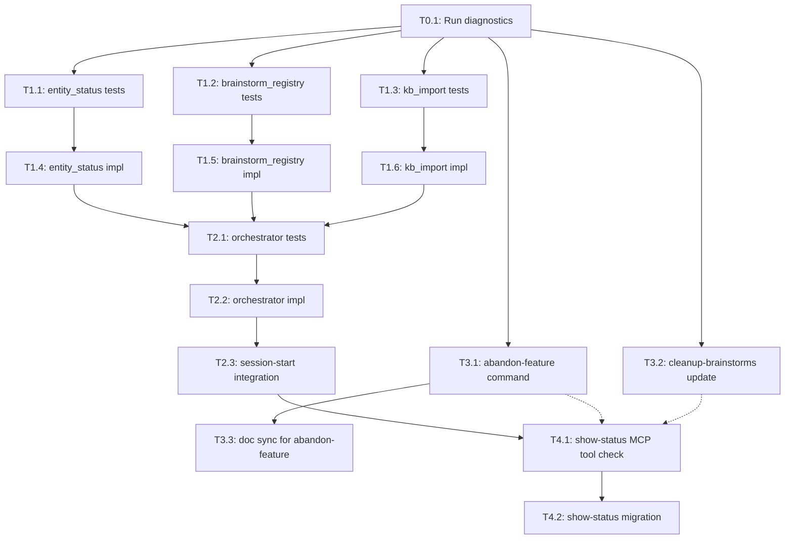

# Tasks: State Consistency Consolidation

## Dependency Graph

## Execution Strategy

### Parallel Group 1 (No dependencies)
- T0.1: Run FR-0 diagnostic queries

### Parallel Group 2 (After Group 1 — TDD: tests first)
- T1.1: Write entity_status sync tests (needs: T0.1)
- T1.2: Write brainstorm_registry sync tests (needs: T0.1)
- T1.3: Write kb_import wrapper tests (needs: T0.1)
- T3.1: Create abandon-feature command (needs: T0.1, parallel with Stage 1)
- T3.2: Add entity update to cleanup-brainstorms (needs: T0.1, parallel with Stage 1)

### Parallel Group 3 (After tests written — TDD: implementation)
- T1.4: Implement entity_status sync (needs: T1.1)
- T1.5: Implement brainstorm_registry sync (needs: T1.2)
- T1.6: Implement kb_import wrapper (needs: T1.3)
- T3.3: Documentation sync for abandon-feature (needs: T3.1)

### Sequential Group 4 (After Stage 1 implementations)
- T2.1: Write orchestrator integration tests (needs: T1.4, T1.5, T1.6)
- T2.2: Implement orchestrator CLI (needs: T2.1)

### Sequential Group 5 (After orchestrator)
- T2.3: Wire orchestrator into session-start.sh (needs: T2.2)

### Sequential Group 6 (After session-start + lifecycle commands)
- T4.1: Verify MCP tool capabilities for show-status (needs: T2.3, T3.1, T3.2 soft — show-status works without these but abandoned/archived entities display incorrectly)
- T4.2: Migrate show-status to entity registry queries (needs: T4.1)

## Task Details

### Stage 0: Diagnostics

#### Task 0.1: Run FR-0 diagnostic queries to quantify drift
- **Why:** PRD FR-0 requires diagnostic validation before implementation
- **Depends on:** None
- **Blocks:** All Stage 1+ tasks (informs scope decisions)
- **Files:** Results documented in `docs/features/043-state-consistency-consolid/diagnostics.md`
- **Do:**
  1. Run `sqlite3 ~/.claude/iflow/memory/memory.db "SELECT source, COUNT(*) FROM entries GROUP BY source;"` to get KB source distribution
  2. Scan .meta.json statuses: `for f in docs/features/*/.meta.json; do echo "$(basename $(dirname "$f")): $(python3 -c "import json,sys; print(json.load(open(sys.argv[1])).get('status','missing'))" "$f")"; done`
  3. Query entity registry: `sqlite3 ~/.claude/iflow/entities/entities.db "SELECT type_id, status FROM entities WHERE entity_type IN ('feature', 'project');"`
  4. Compare step 2 and step 3 outputs: count rows where .meta.json status differs from entity registry status
  5. Write results to `diagnostics.md` with counts and decision on scope
- **Test:** `diagnostics.md` exists with query results and scope decision
- **Done when:** Diagnostic results documented. If drift >20 entities, all phases proceed. If <20, note scope reduction opportunity.

### Stage 1: Foundation (TDD — tests first)

#### Task 1.1: Write unit tests for entity_status sync module
- **Why:** TDD: tests first for Plan item 1 / Design C2
- **Depends on:** T0.1
- **Blocks:** T1.4 (implementation)
- **Files:** `plugins/iflow/hooks/lib/reconciliation_orchestrator/test_entity_status.py`
- **Do:**
  1. Create `plugins/iflow/hooks/lib/reconciliation_orchestrator/__init__.py` (empty)
  2. Create `test_entity_status.py` with test cases:
     - `test_drifted_status_updated`: feature with `.meta.json` status="completed", entity status="active" → updated
     - `test_no_drift_skipped`: matching statuses → no update
     - `test_missing_meta_json_archived`: entity exists, `.meta.json` missing → status set to "archived"
     - `test_malformed_json_warned`: corrupt `.meta.json` → warning in results, entity skipped
     - `test_unknown_status_skipped`: `.meta.json` status="draft" → warning, entity skipped
     - `test_entity_not_in_registry_skipped`: `.meta.json` exists, no entity → skipped
     - `test_missing_directory_handled`: features/ dir doesn't exist → empty results
     - `test_projects_scanned`: projects/ dir scanned with same logic
  3. Use `EntityDatabase(":memory:")` for test isolation — EntityDatabase wraps `sqlite3.connect(db_path)` which accepts `:memory:`. If `:memory:` is not supported, use `tempfile.NamedTemporaryFile(suffix=".db")` and clean up in teardown.
- **Test:** `plugins/iflow/.venv/bin/python -m pytest plugins/iflow/hooks/lib/reconciliation_orchestrator/test_entity_status.py -v` — all tests fail (no implementation yet)
- **Done when:** Test file exists with 8+ test cases, all fail with ImportError or similar (no implementation)

#### Task 1.2: Write unit tests for brainstorm_registry sync module
- **Why:** TDD: tests first for Plan item 2 / Design C3
- **Depends on:** T0.1
- **Blocks:** T1.5 (implementation)
- **Files:** `plugins/iflow/hooks/lib/reconciliation_orchestrator/test_brainstorm_registry.py`
- **Do:**
  1. Create `test_brainstorm_registry.py` with test cases:
     - `test_unregistered_file_registered`: .prd.md file exists, no entity → registered with entity_type="brainstorm", entity_id=stem, status="active"
     - `test_already_registered_skipped`: entity exists → skipped (idempotent)
     - `test_gitkeep_ignored`: .gitkeep file → not registered
     - `test_non_prd_md_ignored`: .txt file → not registered
     - `test_missing_directory_handled`: brainstorms/ doesn't exist → empty results
     - `test_artifact_path_relative`: stored artifact_path uses relative path (e.g., `docs/brainstorms/filename.prd.md`)
  2. Use temp directory with test brainstorm files and in-memory EntityDatabase
- **Test:** `plugins/iflow/.venv/bin/python -m pytest plugins/iflow/hooks/lib/reconciliation_orchestrator/test_brainstorm_registry.py -v` — all fail
- **Done when:** Test file exists with 6+ test cases, all fail

#### Task 1.3: Write unit tests for kb_import wrapper module
- **Why:** TDD: tests first for Plan item 3 / Design C4
- **Depends on:** T0.1
- **Blocks:** T1.6 (implementation)
- **Files:** `plugins/iflow/hooks/lib/reconciliation_orchestrator/test_kb_import.py`
- **Do:**
  1. Create `test_kb_import.py` with test cases:
     - `test_new_entries_imported`: KB markdown with new entries → imported count > 0
     - `test_unchanged_entries_skipped`: entries already in DB → skipped via source_hash
     - `test_correct_params_plumbing`: verify project_root, artifacts_root, global_store_path passed correctly to MarkdownImporter
     - `test_empty_kb_directory`: no KB files → imported=0, skipped=0
  2. Mock or use real MarkdownImporter with temp test fixtures
- **Test:** `plugins/iflow/.venv/bin/python -m pytest plugins/iflow/hooks/lib/reconciliation_orchestrator/test_kb_import.py -v` — all fail
- **Done when:** Test file exists with 4+ test cases, all fail

#### Task 1.4: Implement entity_status sync to pass tests
- **Why:** TDD: implementation for Plan item 1 / Design C2
- **Depends on:** T1.1
- **Blocks:** T2.1 (orchestrator tests)
- **Files:** `plugins/iflow/hooks/lib/reconciliation_orchestrator/entity_status.py`
- **Do:**
  1. Create `entity_status.py` with `sync_entity_statuses(db: EntityDatabase, full_artifacts_path: str) → dict`
  2. Implement per Design C2 algorithm: scan features/ and projects/, compare statuses, update drifted entities
  3. Use `with open(meta_path) as f: meta = json.load(f)` with try/except for malformed JSON
  4. Use `entity = db.get_entity(type_id)` (returns None, not raises) for existence check
  5. Access entity fields via `entity["status"]` (dict, not object)
  6. STATUS_MAP = {"active", "completed", "abandoned", "planned", "promoted"}
- **Test:** `plugins/iflow/.venv/bin/python -m pytest plugins/iflow/hooks/lib/reconciliation_orchestrator/test_entity_status.py -v` — all pass
- **Done when:** All 8+ tests from T1.1 pass

#### Task 1.5: Implement brainstorm_registry sync to pass tests
- **Why:** TDD: implementation for Plan item 2 / Design C3
- **Depends on:** T1.2
- **Blocks:** T2.1 (orchestrator tests)
- **Files:** `plugins/iflow/hooks/lib/reconciliation_orchestrator/brainstorm_registry.py`
- **Do:**
  1. Create `brainstorm_registry.py` with `sync_brainstorm_entities(db: EntityDatabase, full_artifacts_path: str, artifacts_root: str) → dict`
  2. Scan `full_artifacts_path/brainstorms/` for `.prd.md` files
  3. For each: check `db.get_entity(f"brainstorm:{stem}")`, register if None
  4. Store `artifact_path` as `os.path.join(artifacts_root, "brainstorms", filename)` (relative)
  5. Register with `status="active"` explicitly
- **Test:** `plugins/iflow/.venv/bin/python -m pytest plugins/iflow/hooks/lib/reconciliation_orchestrator/test_brainstorm_registry.py -v` — all pass
- **Done when:** All 6+ tests from T1.2 pass

#### Task 1.6: Implement kb_import wrapper to pass tests
- **Why:** TDD: implementation for Plan item 3 / Design C4
- **Depends on:** T1.3
- **Blocks:** T2.1 (orchestrator tests)
- **Files:** `plugins/iflow/hooks/lib/reconciliation_orchestrator/kb_import.py`
- **Do:**
  1. Create `kb_import.py` with `sync_knowledge_bank(memory_db: MemoryDatabase, project_root: str, artifacts_root: str, global_store_path: str) → dict`
  2. Import `MarkdownImporter` from `semantic_memory.importer`
  3. Instantiate: `MarkdownImporter(db=memory_db, artifacts_root=artifacts_root)`
  4. Call: `importer.import_all(project_root=project_root, global_store=global_store_path)`
  5. Return `{"imported": result.get("imported", 0), "skipped": result.get("skipped", 0)}`
- **Test:** `plugins/iflow/.venv/bin/python -m pytest plugins/iflow/hooks/lib/reconciliation_orchestrator/test_kb_import.py -v` — all pass
- **Done when:** All 4+ tests from T1.3 pass

### Stage 2: Orchestration

#### Task 2.1: Write integration tests for orchestrator CLI
- **Why:** TDD: tests first for Plan item 4 / Design C1
- **Depends on:** T1.4, T1.5, T1.6
- **Blocks:** T2.2 (orchestrator implementation)
- **Files:** `plugins/iflow/hooks/lib/reconciliation_orchestrator/test_orchestrator.py`
- **Do:**
  1. Create `test_orchestrator.py` with test cases:
     - `test_full_run_outputs_valid_json`: run with test fixtures → JSON output with entity_sync, brainstorm_sync, kb_import, elapsed_ms keys
     - `test_per_task_error_isolation`: mock one task to raise → other tasks still run, error captured in output
     - `test_db_connections_closed`: verify connections closed even on error (try/finally)
     - `test_cli_args_parsed`: verify --project-root, --artifacts-root, --entity-db, --memory-db parsed correctly
     - `test_exit_code_always_zero`: even on errors, exit code is 0 (fail-open)
  2. Use subprocess.run to invoke `python -m reconciliation_orchestrator` with test args
- **Test:** `plugins/iflow/.venv/bin/python -m pytest plugins/iflow/hooks/lib/reconciliation_orchestrator/test_orchestrator.py -v` — all fail
- **Done when:** Test file exists with 5+ test cases, all fail

#### Task 2.2: Implement orchestrator CLI __main__.py
- **Why:** Plan item 4 / Design C1 — single Python entrypoint
- **Depends on:** T2.1
- **Blocks:** T2.3 (session-start integration)
- **Files:** `plugins/iflow/hooks/lib/reconciliation_orchestrator/__main__.py`
- **Do:**
  1. Create `__main__.py` with argparse: `--project-root`, `--artifacts-root`, `--entity-db`, `--memory-db`, `--verbose`
  2. Open DB connections: `EntityDatabase(args.entity_db)`, `MemoryDatabase(args.memory_db)` in try/finally
  3. Compute: `full_artifacts_path = os.path.join(args.project_root, args.artifacts_root)` and `global_store_path = os.path.dirname(args.memory_db)`
  4. Run tasks sequentially with per-task try/except: entity_status_sync, brainstorm_sync, kb_import
  5. Measure elapsed time with `time.monotonic()`
  6. Output JSON to stdout: `{"entity_sync": {...}, "brainstorm_sync": {...}, "kb_import": {...}, "elapsed_ms": N, "errors": [...]}`
  7. Always `sys.exit(0)` (fail-open)
- **Test:** `plugins/iflow/.venv/bin/python -m pytest plugins/iflow/hooks/lib/reconciliation_orchestrator/test_orchestrator.py -v` — all pass
- **Done when:** All 5+ tests from T2.1 pass

#### Task 2.3: Wire orchestrator into session-start.sh
- **Why:** Plan item 5 / Design I5 — enables automatic reconciliation
- **Depends on:** T2.2
- **Blocks:** T4.1 (show-status MCP check)
- **Files:** `plugins/iflow/hooks/session-start.sh`
- **Do:**
  1. Add `run_reconciliation()` function following `build_memory_context()` pattern (lines 358-413)
  2. Use `resolve_artifacts_root` for `$artifacts_root` (lowercase), `$PROJECT_ROOT` for repo root
  3. Add platform-aware timeout: `gtimeout` (macOS) → `timeout` (Linux) → no wrapper (fallback)
  4. Set PYTHONPATH, suppress stderr, `|| true` for fail-open
  5. Call `run_reconciliation` in `main()` between `build_memory_context()` and `build_context()`
- **Test:** `bash plugins/iflow/hooks/tests/test-hooks.sh` — existing hook tests pass. Smoke test with temp fixtures (do NOT use production DBs): `mkdir -p /tmp/test-recon/docs && PYTHONPATH=plugins/iflow/hooks/lib plugins/iflow/.venv/bin/python -m reconciliation_orchestrator --project-root /tmp/test-recon --artifacts-root docs --entity-db /tmp/test-recon/entities.db --memory-db /tmp/test-recon/memory.db && rm -rf /tmp/test-recon` — verify exit code 0 and valid JSON output
- **Done when:** Hook tests pass, orchestrator smoke test exits 0 with valid JSON

### Stage 3: Lifecycle Commands

#### Task 3.1: Create abandon-feature command file
- **Why:** Plan item 6 / Design C5, FR-5 — no abandonment command exists
- **Depends on:** T0.1
- **Blocks:** T3.3 (doc sync)
- **Files:** `plugins/iflow/commands/abandon-feature.md`
- **Do:**
  1. Create `abandon-feature.md` with YAML frontmatter — use `plugins/iflow/commands/finish-feature.md` as template. Required frontmatter fields: `name`, `description`, `invocation`, `category`. Copy frontmatter block and update name/description.
  2. Implement flow: resolve feature → validate status (active/planned only) → confirm → update `.meta.json` status to "abandoned" → call `update_entity` MCP tool → output
  3. Error cases: "completed" → "Already completed", "abandoned" → "Already abandoned"
  4. Fail-open: if MCP fails, warn and continue (`.meta.json` updated, reconciliation resolves drift)
  5. Output includes: branch left intact message with `git branch -D` suggestion
  6. YOLO mode: skip confirmation prompt
- **Test:** Manual setup and verification:
  1. `mkdir -p docs/features/test-999-abandon-test`
  2. `echo '{"status":"active","feature_id":"999","slug":"abandon-test"}' > docs/features/test-999-abandon-test/.meta.json`
  3. Run `/iflow:abandon-feature --feature=test-999-abandon-test`
  4. Verify: `cat docs/features/test-999-abandon-test/.meta.json` shows `status: "abandoned"`
  5. Cleanup: `rm -rf docs/features/test-999-abandon-test`
- **Done when:** Command file exists. Manual test: active feature abandoned successfully, completed feature rejected.

#### Task 3.2: Add entity update to cleanup-brainstorms command
- **Why:** Plan item 7 / Design C6, FR-4 — prevents orphaned entity rows
- **Depends on:** T0.1
- **Blocks:** None
- **Files:** `plugins/iflow/commands/cleanup-brainstorms.md`
- **Do:**
  1. Read existing `cleanup-brainstorms.md`
  2. After each brainstorm file deletion step, add: `Call update_entity MCP tool: update_entity(type_id="brainstorm:{filename_stem}", status="archived")`
  3. Add error handling: `If MCP call fails or entity not found: Warn "Entity update skipped for {filename_stem}" and continue`
- **Test:** Manual: delete a brainstorm file via `/iflow:cleanup-brainstorms`, check entity registry
- **Done when:** Command file updated. Entity status set to "archived" after deletion for brainstorms with entities.

#### Task 3.3: Update documentation for abandon-feature command
- **Why:** CLAUDE.md requires doc sync when adding commands
- **Depends on:** T3.1
- **Blocks:** None
- **Files:** `README.md`, `README_FOR_DEV.md`, `plugins/iflow/README.md`
- **Do:**
  1. Add `abandon-feature` to command table in `README.md`
  2. Add `abandon-feature` to command table in `README_FOR_DEV.md`
  3. Add `abandon-feature` to command table and update command count in `plugins/iflow/README.md`
- **Test:** `grep -r "abandon-feature" README.md README_FOR_DEV.md plugins/iflow/README.md` returns matches in all three files
- **Done when:** All three files updated with abandon-feature command entry

### Stage 4: Consumer Migration

#### Task 4.1: Verify MCP tool capabilities for show-status migration
- **Why:** Pre-implementation check required by plan — confirm tool interfaces
- **Depends on:** T2.3, T3.1, T3.2 (soft — show-status works without lifecycle commands but abandoned/archived entities display incorrectly)
- **Blocks:** T4.2 (show-status migration)
- **Files:** `docs/features/043-state-consistency-consolid/mcp-tool-notes.md`
- **Do:**
  1. Check `export_entities` MCP tool in `plugins/iflow/mcp/entity_server.py`: verify it accepts `entity_type` and `status` filters
  2. Check `list_features_by_status` in `plugins/iflow/mcp/workflow_state_server.py`: verify it returns phase-enriched data
  3. Test both tools manually: call `export_entities(entity_type="feature")` and `export_entities(entity_type="brainstorm")` to confirm output format
  4. Document findings in `mcp-tool-notes.md`: (1) which tool to use per show-status section, (2) sample response JSON, (3) filter limitations confirmed
- **Test:** `mcp-tool-notes.md` exists with tool selection and sample responses
- **Done when:** `mcp-tool-notes.md` created with tool selection per section, sample responses, and filter limitations

#### Task 4.2: Migrate show-status to entity registry MCP queries
- **Why:** Plan item 8 / Design C7, FR-6, FR-7 — replace filesystem scanning
- **Depends on:** T4.1
- **Blocks:** None
- **Files:** `plugins/iflow/commands/show-status.md`
- **Do:**
  1. Read existing `show-status.md`
  2. Replace Section 1.5 (Project Features) data source: use `export_entities(entity_type="feature")` + filter by project_id in metadata, with `get_phase()` for active features
  3. Replace Section 2 (Open Features) data source: use `export_entities(entity_type="feature")` + client-side filter (exclude completed, exclude project-linked)
  4. Replace Section 3 (Open Brainstorms) data source: use `export_entities(entity_type="brainstorm")` + client-side filter (exclude status="promoted" and status="archived"), get file age from artifact_path mtime
  5. Add MCP availability detection: tri-state pattern (null → true/false on first call)
  6. Add fallback: if MCP unavailable, preserve current filesystem scanning behavior exactly
  7. Add footer: `Source: entity-registry` (MCP path) or `Source: filesystem` (fallback)
- **Test:** Manual: run `/iflow:show-status` with MCP available → verify `Source: entity-registry` footer, promoted brainstorms excluded. Verify output format matches previous output structure.
- **Done when:** show-status works via entity registry. Promoted brainstorms excluded. Fallback to filesystem works when MCP unavailable. Footer shows data source.

## Summary

- Total tasks: 16
- Parallel groups: 6
- Critical path: T0.1 → T1.1 → T1.4 → T2.1 → T2.2 → T2.3 → T4.1 → T4.2
- Max parallelism: 5 (Group 2: T1.1, T1.2, T1.3, T3.1, T3.2)
