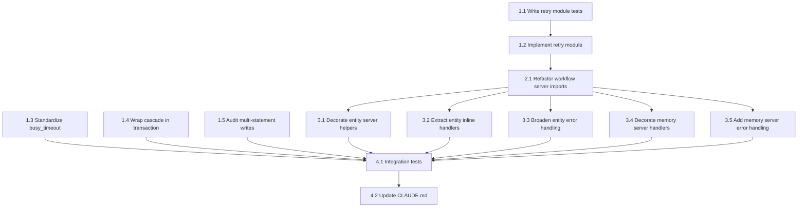

# Tasks: SQLite Concurrency Defense

## Dependency Graph



## Execution Strategy

### Parallel Group 1 (No dependencies)
- Task 1.1: Write unit tests for sqlite_retry module
- Task 1.3: Standardize MemoryDatabase busy_timeout to 15000ms
- Task 1.4: Wrap _run_cascade() Phase B in transaction()
- Task 1.5: Audit and wrap multi-statement writes in database.py

### Sequential after 1.1
- Task 1.2: Implement sqlite_retry.py to pass tests (needs: 1.1)

### Parallel Group 2 (After 1.2)
- Task 2.1: Refactor workflow_state_server to import from sqlite_retry (needs: 1.2)

### Parallel Group 3 (After 2.1)
- Task 3.1: Decorate entity server_helpers with @with_retry (needs: 2.1)
- Task 3.2: Extract 8 entity server inline handlers to sync _process_* functions (needs: 2.1)
- Task 3.3: Broaden exception handling for 3 entity server handlers (needs: 3.2)
- Task 3.4: Decorate memory server sync helpers with @with_retry (needs: 2.1)
- Task 3.5: Add try/except to memory server async handlers + fix comment (needs: 3.4)

### Sequential Group 4 (After all above)
- Task 4.1: Write concurrent-write integration tests (needs: all above)
- Task 4.2: Update CLAUDE.md with test commands (needs: 4.1)

## Task Details

### Stage 1: Foundation

#### Task 1.1: Write unit tests for sqlite_retry module
- **Why:** Plan item 1 (TDD) / Design C1, I1, I2
- **Depends on:** None
- **Blocks:** Task 1.2
- **Files:** `plugins/pd/hooks/lib/test_sqlite_retry.py` (new)
- **Do:**
  1. Create `plugins/pd/hooks/lib/test_sqlite_retry.py`
  2. Write test for `is_transient()`: OperationalError with "database is locked" returns True
  3. Write test for `is_transient()`: OperationalError with "database IS LOCKED" returns True (case-insensitive)
  4. Write test for `is_transient()`: OperationalError with "no such table" returns False
  5. Write test for `is_transient()`: OperationalError with "SQL logic error" returns True (stale implicit transaction variant per RCA)
  6. Write test for `is_transient()`: non-OperationalError returns False
  6. Write test for `with_retry()`: successful call returns result without retry
  7. Write test for `with_retry()`: transient error retries up to max_attempts then re-raises
  8. Write test for `with_retry()`: transient error succeeds on 2nd attempt
  9. Write test for `with_retry()`: non-transient error raises immediately without retry
  10. Write test for `with_retry()`: backoff sequence matches (0.1, 0.5, 2.0) + jitter
  11. Write test for `with_retry()`: server_name appears in log output
  12. Monkeypatch `time.sleep` to avoid real delays
- **Test:** `plugins/pd/.venv/bin/python -m pytest plugins/pd/hooks/lib/test_sqlite_retry.py -v` — all tests FAIL (no implementation yet)
- **Done when:** Test file exists at `plugins/pd/hooks/lib/test_sqlite_retry.py` with 10+ test cases; `pytest --collect-only` confirms test collection succeeds

#### Task 1.2: Implement sqlite_retry module to pass tests
- **Why:** Plan item 1 (TDD) / Design C1, I1, I2
- **Depends on:** Task 1.1
- **Blocks:** Task 2.1
- **Files:** `plugins/pd/hooks/lib/sqlite_retry.py` (new)
- **Do:**
  1. Create `plugins/pd/hooks/lib/sqlite_retry.py`
  2. Implement `is_transient(exc)`: `msg = str(exc).lower(); return isinstance(exc, sqlite3.OperationalError) and ('locked' in msg or 'sql logic error' in msg)`. Add comment referencing `docs/rca/20260324-workflow-sql-error.md:69-75` explaining why "sql logic error" is included (stale implicit transaction variant of SQLITE_BUSY).
  3. Implement `with_retry(server_name, max_attempts=3, backoff=(0.1, 0.5, 2.0))` decorator factory
  4. Inside wrapper: catch `sqlite3.OperationalError`, call `is_transient()`, sleep `backoff[min(attempt, len(backoff)-1)] + random.uniform(0, 0.05)`, print warning to stderr with server_name prefix
  5. On exhausted retries: re-raise last exception
  6. Use `@functools.wraps(func)` to preserve function metadata
  7. Imports: `time`, `random`, `functools`, `sqlite3`, `sys`
- **Test:** `plugins/pd/.venv/bin/python -m pytest plugins/pd/hooks/lib/test_sqlite_retry.py -v` — all tests PASS
- **Done when:** All unit tests from Task 1.1 pass; `from sqlite_retry import with_retry, is_transient` succeeds

#### Task 1.3: Standardize MemoryDatabase busy_timeout to 15000ms
- **Why:** Plan item 2 / Design C7, Spec FR-5
- **Depends on:** None
- **Blocks:** Task 4.1
- **Files:** `plugins/pd/hooks/lib/semantic_memory/database.py`, `plugins/pd/hooks/lib/workflow_engine/engine.py`
- **Do:**
  1. In `semantic_memory/database.py`, change `PRAGMA busy_timeout = 5000` to `PRAGMA busy_timeout = 15000` (line 790)
  2. In `workflow_engine/engine.py`, fix stale comment at line 287: change "5s" to "15s"
  3. Grep `PRAGMA busy_timeout` across production DB modules (excluding test files and doctor/) — confirm all are 15000
  4. Add comment in `semantic_memory/database.py` after the PRAGMA line: `# Python connect(timeout=...) governs initial connection lock wait; PRAGMA busy_timeout governs statement-level waits — intentionally different.`
  5. Update `test_busy_timeout` in `semantic_memory/test_database.py:408`: change `assert cur.fetchone()[0] == 5000` to `assert cur.fetchone()[0] == 15000`
- **Test:** `plugins/pd/.venv/bin/python -m pytest plugins/pd/hooks/lib/semantic_memory/ -v` — all tests pass including updated `test_busy_timeout`
- **Done when:** Grep confirms no PRAGMA busy_timeout value other than 15000 in production DB modules; stale comment corrected; `test_busy_timeout` passes with new value

#### Task 1.4: Wrap _run_cascade() Phase B in transaction()
- **Why:** Plan item 4 / Design C5, I3, Spec FR-3
- **Depends on:** None
- **Blocks:** Task 4.1
- **Files:** `plugins/pd/hooks/lib/workflow_engine/entity_engine.py`
- **Do:**
  1. In `_run_cascade()` (line 571), add `with self._db.transaction():` wrapping only `cascade_unblock` (line 586) and `rollup_parent` (line 591)
  2. Move `compute_progress` (line 598) and `_push_notifications` (lines 601-602) AFTER the `with` block exits
  3. Wrap post-transaction `compute_progress` + notifications in separate try/except that logs but does not propagate (prevents masking successful DB commit as cascade_error)
  4. Verify (read-only): `grep -n "blocked_by" plugins/pd/hooks/lib/workflow_engine/reconciliation.py` — search lines 521-624 for logic that queries blocked_by entries for entities where status=completed. If found, note "confirmed" in commit message. If absent, add entry to `docs/backlog.md`: "reconciliation_orchestrator does not detect stale blocked_by entries for completed entities — Phase B complete-failure recovery unverified."
- **Test:** `plugins/pd/.venv/bin/python -m pytest plugins/pd/hooks/lib/workflow_engine/ -v` — all 309 tests pass
- **Done when:** `_run_cascade` uses `transaction()` context manager; compute_progress is outside transaction; reconciliation verification documented

#### Task 1.5: Audit and wrap multi-statement writes in database.py
- **Why:** Plan item 5 / Design C6, Spec FR-4
- **Depends on:** None
- **Blocks:** Task 4.1
- **Files:** `plugins/pd/hooks/lib/entity_registry/database.py`
- **Do:**
  1. Run `grep -n '_commit()' plugins/pd/hooks/lib/entity_registry/database.py` and identify methods with 2+ write SQL statements (INSERT, UPDATE, DELETE) before `_commit()` outside existing `BEGIN IMMEDIATE`
  2. Known targets: `register_entity()` (INSERT entity + INSERT FTS before one `_commit()`), `update_entity()` (UPDATE + FTS delete/insert before one `_commit()`)
  3. Skip: `set_parent()` (single-statement write), `delete_entity()` (already uses `BEGIN IMMEDIATE`)
  4. Wrap identified methods in `self.transaction()` — this upgrades from implicit deferred to `BEGIN IMMEDIATE` for eager lock acquisition
  5. Circuit breaker: if >8 multi-statement sequences found, stop and re-evaluate scope
  6. Document audit results as comments in code
- **Test:** `plugins/pd/.venv/bin/python -m pytest plugins/pd/hooks/lib/entity_registry/ -v` — all 940+ tests pass
- **Done when:** Audit comment exists in `database.py` listing all `_commit()` sites found and their wrapping status (format: `# Audit 062: N _commit() call sites found, M wrapped in transaction()`). Each wrapped method has inline comment: `# Audit 062: N write SQL statements — wrapped in transaction() for BEGIN IMMEDIATE`. All 940+ entity registry tests pass.

### Stage 2: Import Pattern Validation

#### Task 2.1: Refactor workflow_state_server to import from sqlite_retry
- **Why:** Plan item 3 / Design C4, I6
- **Depends on:** Task 1.2
- **Blocks:** Tasks 3.1-3.5
- **Files:** `plugins/pd/mcp/workflow_state_server.py`
- **Do:**
  1. Add import: `from sqlite_retry import with_retry, is_transient` (works because line 14-16 already adds `hooks/lib` to `sys.path` via `_hooks_lib`)
  2. Replace local `_is_transient` function (lines 424-426) with: `_is_transient = is_transient`
  3. Replace local `_with_retry` function (lines 429-463) with: `def _with_retry(**kwargs): return with_retry("workflow-state", **kwargs)`
  4. Verify `grep -c '@_with_retry' workflow_state_server.py` returns 9
  5. Run existing tests to confirm no behavioral change
- **Test:** `plugins/pd/.venv/bin/python -m pytest plugins/pd/mcp/test_workflow_state_server.py -v` — all 272 tests pass
- **Done when:** Local `_with_retry`/`_is_transient` replaced with imports; all tests pass; `@_with_retry` count is 9

### Stage 3: Server Integration

#### Task 3.1: Decorate entity server_helpers with @with_retry
- **Why:** Plan item 6 / Design C2 (Type A handlers)
- **Depends on:** Task 2.1
- **Blocks:** Task 4.1
- **Files:** `plugins/pd/hooks/lib/entity_registry/server_helpers.py`
- **Do:**
  1. Add import: `from sqlite_retry import with_retry` (works because `entity_server.py` adds `hooks/lib` to `sys.path` via `_hooks_lib` at lines 14-16 BEFORE importing `server_helpers` — same mechanism as `workflow_state_server.py`. Verify: `server_helpers.py` already uses `from entity_registry.metadata import ...` which requires `hooks/lib` on path.)
  2. Add `@with_retry("entity")` decorator to `_process_register_entity`
  3. Add `@with_retry("entity")` decorator to `_process_set_parent`
  4. Run entity registry tests after each decoration
- **Test:** `plugins/pd/.venv/bin/python -m pytest plugins/pd/hooks/lib/entity_registry/ -v` — all tests pass
- **Done when:** Both Type A handlers have `@with_retry("entity")` decorator; tests pass

#### Task 3.2: Extract 8 entity server inline handlers to sync _process_* functions
- **Why:** Plan item 6 / Design C2 (Type B handlers)
- **Depends on:** Task 2.1
- **Blocks:** Task 3.3, Task 4.1
- **Files:** `plugins/pd/mcp/entity_server.py`
- **Do:**
  1. Import at top: `from sqlite_retry import with_retry` (already on sys.path via _hooks_lib)
  2. Extract each handler's try-block DB logic into a sync function with `@with_retry("entity")`:
     - `_process_update_entity(db, resolved_type_id, name, description, status, metadata) -> str`
     - `_process_delete_entity(db, resolved_type_id) -> str`
     - `_process_add_entity_tag(db, resolved_type_id, tag) -> str`
     - `_process_add_dependency(db, dep_mgr, blocker_type_id, blocked_type_id) -> str`
     - `_process_remove_dependency(db, dep_mgr, blocker_type_id, blocked_type_id) -> str`
     - `_process_add_okr_alignment(db, entity_type_id, kr_type_id) -> str`
     - `_process_create_key_result(db, objective_type_id, kr_id, kr_name, target, baseline, unit) -> str`
     - `_process_update_kr_score(db, kr_type_id, score) -> str`
  3. Replace inline logic in each async handler with call to the new sync function
  4. Run entity registry tests after each extraction to catch regressions early
  5. Grep `entity_server.py` for all `@mcp.tool()` handlers with `_db` write calls — confirm all 10 write paths now go through `@with_retry`
- **Test:** Run entity tests incrementally after each extraction
- **Done when:** All 8 inline handlers extracted to sync functions with `@with_retry("entity")`; all tests pass

#### Task 3.3: Broaden exception handling for 3 entity server handlers
- **Why:** Plan item 6 / Design C2 (error conversion for handlers 8-10)
- **Depends on:** Task 3.2
- **Blocks:** Task 4.1
- **Files:** `plugins/pd/mcp/entity_server.py`
- **Do:**
  1. In `add_okr_alignment` async handler: change `except ValueError` to `except Exception`
  2. In `create_key_result` async handler: change `except (ValueError, KeyError)` to `except Exception`
  3. In `update_kr_score` async handler: change `except (ValueError, KeyError)` to `except Exception`
  4. Ensure each `except Exception` block returns structured JSON error (not raw traceback)
- **Test:** Run entity tests; verify no OperationalError can propagate unhandled
- **Done when:** All 3 handlers catch `Exception`; each except block returns `json.dumps({"error": str(exc)})` or equivalent structured JSON (verified by reading the code and by a test injecting `OperationalError` into each handler's `_process_*` function confirming structured JSON error is returned); entity registry test count matches pre-task count (no regressions)

#### Task 3.4: Decorate memory server sync helpers with @with_retry
- **Why:** Plan item 7 / Design C3
- **Depends on:** Task 2.1
- **Blocks:** Task 3.5, Task 4.1
- **Files:** `plugins/pd/mcp/memory_server.py`
- **Do:**
  1. Add import: `from sqlite_retry import with_retry`
  2. Add `@with_retry("memory")` decorator to `_process_store_memory` (line 38)
  3. Add `@with_retry("memory")` decorator to `_process_record_influence` (line 237)
  4. Extract `delete_memory` inline DB logic (line 410) to sync `_process_delete_memory` function with `@with_retry("memory")`
- **Test:** `plugins/pd/.venv/bin/python -m pytest plugins/pd/mcp/test_memory_server.py -v` — all tests pass
- **Done when:** All 3 memory server write paths have `@with_retry("memory")`; tests pass

#### Task 3.5: Add try/except to memory server async handlers and fix comment
- **Why:** Plan item 7 / Design C3 (error conversion)
- **Depends on:** Task 3.4
- **Blocks:** Task 4.1
- **Files:** `plugins/pd/mcp/memory_server.py`
- **Do:**
  1. Add `try/except Exception` wrapper to `store_memory` async handler (line 314) — return structured error string on exception
  2. Add `try/except Exception` wrapper to `record_influence` async handler (line 451) — return structured error string on exception
  3. Fix misleading comment at line 128: replace with `# Note: single-threaded within this process does not prevent cross-process SQLite contention. Multiple MCP servers and hook processes share the same DB file — retry coverage is required.`
- **Test:** `plugins/pd/.venv/bin/python -m pytest plugins/pd/mcp/test_memory_server.py -v` — all tests pass
- **Done when:** Both async handlers have `try/except Exception` returning `json.dumps({"error": str(exc)})` (matching entity server convention); misleading comment corrected; a test injecting `OperationalError` confirms structured JSON error is returned; all memory server tests pass

### Stage 4: Validation

#### Task 4.1: Write concurrent-write integration tests
- **Why:** Plan item 8 / Design C8, Spec NFR-1
- **Depends on:** All previous tasks
- **Blocks:** Task 4.2
- **Files:** `plugins/pd/hooks/lib/test_sqlite_retry_integration.py` (new)
- **Do:**
  1. Create `plugins/pd/hooks/lib/test_sqlite_retry_integration.py`
  2. Write test: 3+ processes simultaneously write to entity DB via multiprocessing — all succeed within 30 seconds
  3. Write test: 3+ processes simultaneously write to memory DB via multiprocessing — all succeed within 30 seconds
  4. Use `multiprocessing.Event()` as barrier for synchronized start
  5. Post-test assertion: row count equals N * M (no missing/duplicate writes)
  6. Write test: spawn a process holding exclusive lock (`BEGIN EXCLUSIVE` without committing, held for 3s minimum). Attempt a write using `with_retry("test", max_attempts=1, backoff=(0.1,))` — confirms zero-retry path raises `sqlite3.OperationalError` with "locked" immediately without hanging. The 3s hold ensures lock is still active when the write attempt occurs.
  7. Each test creates temporary DB file via `tempfile` — no shared state
- **Test:** `plugins/pd/.venv/bin/python -m pytest plugins/pd/hooks/lib/test_sqlite_retry_integration.py -v --timeout=60` — all pass
- **Done when:** 3+ integration tests pass; concurrent writes verified for both entity and memory DBs

#### Task 4.2: Update CLAUDE.md with test commands
- **Why:** Plan item 9 / Documentation sync requirement
- **Depends on:** Task 4.1
- **Blocks:** None
- **Files:** `CLAUDE.md`
- **Do:**
  1. Add test command block after entity registry test entry:
     ```
     # Run sqlite retry unit tests
     plugins/pd/.venv/bin/python -m pytest plugins/pd/hooks/lib/test_sqlite_retry.py -v

     # Run sqlite retry concurrent-write integration tests
     plugins/pd/.venv/bin/python -m pytest plugins/pd/hooks/lib/test_sqlite_retry_integration.py -v --timeout=60
     ```
  2. Document reconciliation verification finding from Task 1.4 (if gap found, add to backlog)
  3. Run `./validate.sh` to confirm no issues
- **Test:** `./validate.sh` passes
- **Done when:** CLAUDE.md updated; validate.sh passes

## Summary

- Total tasks: 13
- Parallel groups: 4
- Critical path: Task 1.1 → 1.2 → 2.1 → 3.2 → 3.3 → 4.1 → 4.2
- Max parallelism: 4 (Group 1: Tasks 1.1, 1.3, 1.4, 1.5)
