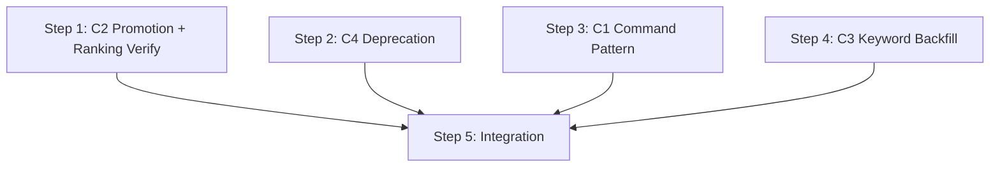

# Plan: Memory Feedback Loop

## Execution Order

Components C1-C4 are parallelizable. C5 may be covered by existing tests. C3 runs last as a migration step.

```
Phase 1 (parallel):
  ├── C2: Confidence Auto-Promotion (database.py + config.py + memory_server.py)
  ├── C4: Legacy Path Deprecation (session-start.sh)
  └── C1: Command File Memory Pattern (5 command files × 15 dispatch blocks)

Phase 2 (migration, after all code changes):
  └── C3: Keyword Backfill (run CLI + validate)

Phase 3 (validation):
  └── Integration validation (all tests + structural checks)
```

## Steps

### Step 1: C2 — Confidence Auto-Promotion

**Why this item:** Implements design component C2 / spec REQ-3. The core feedback mechanism — confidence evolves with evidence.
**Why this order:** No dependencies. Placed first because TDD tests establish infrastructure shared by ranking verification.
**TDD order: tests first, then implementation.**

**Deliverable:** All 6 unit tests + 1 MCP integration test pass; config keys present in DEFAULTS; promotion fires within existing transaction boundary.

1.1. **Add config keys to DEFAULTS** in `config.py`:
   - `memory_auto_promote: False`
   - `memory_promote_low_threshold: 3`
   - `memory_promote_medium_threshold: 5`

1.2. **Write unit tests** in `test_database.py`:
   - `test_merge_duplicate_promotes_low_to_medium`
   - `test_merge_duplicate_promotes_medium_to_high_retro_only`
   - `test_merge_duplicate_no_promote_when_disabled`
   - `test_merge_duplicate_no_promote_import_source`
   - `test_merge_duplicate_no_promote_below_threshold`
   - `test_merge_duplicate_already_at_target`

1.3. **Implement promotion logic** in `database.py:merge_duplicate()`:
   - Add `config: dict | None = None` parameter
   - Insert conditional UPDATE between the `UPDATE entries SET observation_count...` statement and `self._conn.commit()` (both within the existing `BEGIN IMMEDIATE` transaction)
   - Separate conditional UPDATE for confidence (not refactoring existing SQL)

1.4. **Update call site** in `memory_server.py:_process_store_memory()`:
   - Change `db.merge_duplicate(existing_id, keywords)` → `db.merge_duplicate(existing_id, keywords, config=cfg)`

1.5. **Add MCP integration test** in `test_memory_server.py`:
   - `test_store_memory_dedup_triggers_promotion`

1.6. **Verify existing ranking tests** — Check if `test_ranking.py` already has tests for `influence_count` and `recall_count` affecting ranking (design REQ-6). If existing tests cover REQ-6's acceptance criteria, note "REQ-6 satisfied by existing tests" and skip writing new ones. If gaps exist, add targeted tests.

---

### Step 2: C4 — Legacy Path Deprecation

**Why this item:** Implements design component C4 / spec REQ-5. Simplifies the injection path and prepares for legacy removal.
**Why this order:** No dependencies. Small, self-contained change.
**TDD order: test first.**

**Deliverable:** Deprecation warning appears in session output when `memory_semantic_enabled=false`; test passes.

2.0. **Write deprecation test** (spec test #15):
   - `test_deprecation_warning_on_legacy_toggle` — when `memory_semantic_enabled=false`, session-start output includes "deprecated" warning string

2.1. **Edit `session-start.sh:build_memory_context()`:**
   - Invert the `memory_semantic_enabled` conditional: check `= "false"` first
   - Add `echo "$deprecation_warning"` to stdout in the legacy branch
   - Default path (else) runs semantic injector

---

### Step 3: C1 — Command File Memory Pattern (largest step)

**Why this item:** Implements design components C1 / spec REQ-1 + REQ-2. The primary delivery mechanism — subagents receive memory, influence is tracked.
**Why this order:** No dependencies. Largest step, benefits from template-and-replicate approach.
**TDD order: structural validation tests first.**

**Deliverable:** Grep validation confirms 15 dispatch blocks have memory section inside `prompt: |` and `record_influence` post-dispatch in all 5 commands.

3.0. **Write structural validation tests** (spec tests #9, #10):
   - `test_memory_section_inside_prompt_blocks` — validates `## Relevant Engineering Memory` appears inside dispatch blocks
   - `test_influence_tracking_section_present` — validates `record_influence` in all 5 commands
   - These tests should FAIL initially (red), then pass (green) after edits.

3.1. **Apply pattern to `specify.md`** (template — 2 blocks):
   - Move `## Relevant Engineering Memory` inside `prompt: |` for both dispatch blocks
   - Add "Store entry names" + "Post-dispatch influence tracking" after each dispatch

3.2. **Verification gate:** Run structural validation tests on `specify.md` BEFORE replicating. If test fails, fix template pattern before continuing.

3.3. **Replicate to remaining 4 files:**
   - `design.md` (2 eligible blocks)
   - `create-plan.md` (2 blocks)
   - `create-tasks.md` (2 blocks)
   - `implement.md` (7 blocks — only fresh I1-R4 dispatches, not resumed iterations)

3.4. **Run structural validation tests** on all 5 files — all must pass.

---

### Step 4: C3 — Keyword Backfill (Migration)

**Why this item:** Implements design component C3 / spec REQ-4. Populates empty keywords for FTS5 retrieval.
**Why this order:** No technical dependency, but sequenced after code changes as a migration step.

**Deliverable:** SQL query confirms <10% entries have empty keywords; spot-check of 10 entries shows reasonable keyword quality.

4.1. **Verify backfill on sample:** Run on 10-entry subset, inspect keyword quality (domain-relevant multi-word terms, not single common words)

4.2. **Run full backfill:**
```bash
PLUGIN_ROOT=$(ls -d ~/.claude/plugins/cache/*/pd*/*/hooks 2>/dev/null | head -1 | xargs dirname)
PYTHONPATH="$PLUGIN_ROOT/hooks/lib" "$PLUGIN_ROOT/.venv/bin/python" \
  -m semantic_memory.writer --action backfill-keywords --global-store ~/.claude/pd/memory
```

4.3. **Validate:**
```sql
SELECT COUNT(*) * 100.0 / (SELECT COUNT(*) FROM entries) FROM entries WHERE keywords = '[]';
```
Result must be < 10.0.

4.4. **Spot-check 10 random entries** to verify keyword quality is reasonable.

---

### Step 5: Integration Validation

**Why this item:** Confirms all components work together, no regressions.
**Why this order:** Depends on all previous steps being complete.

**Deliverable:** All test suites pass; structural validation green; NFR timing within budget.

5.1. **Run all test suites:**
   - `plugins/pd/.venv/bin/python -m pytest plugins/pd/mcp/test_memory_server.py -v`
   - `plugins/pd/.venv/bin/python -m pytest plugins/pd/hooks/lib/semantic_memory/ -v`

5.2. **Structural validation:** Confirm grep tests from Step 3.0 pass across all 5 commands

5.3. **NFR validation:**
   - `record_influence` latency test (< 100ms)
   - Manual session-start smoke test (5 runs, all < 5s — smoke test, not statistical p95)

## Dependency Graph



Steps 1-3 are parallelizable. Step 4 runs after code changes. Step 5 runs last.

## Risk Mitigation

| Risk | Step | Mitigation |
|------|------|------------|
| Command file edit errors | Step 3 | Structural validation tests written first (red); template on specify.md verified before replicating to 4 files |
| Promotion regression | Step 1 | TDD: 6 unit tests + 1 integration test written before implementation |
| Keyword backfill quality | Step 4 | Sample validation + spot-check before/after full run |
| Session-start latency | Step 2 | No new calls in injection path; deprecation is print-only |
| Template pattern error propagation | Step 3 | Verification gate after specify.md, before replicating |
