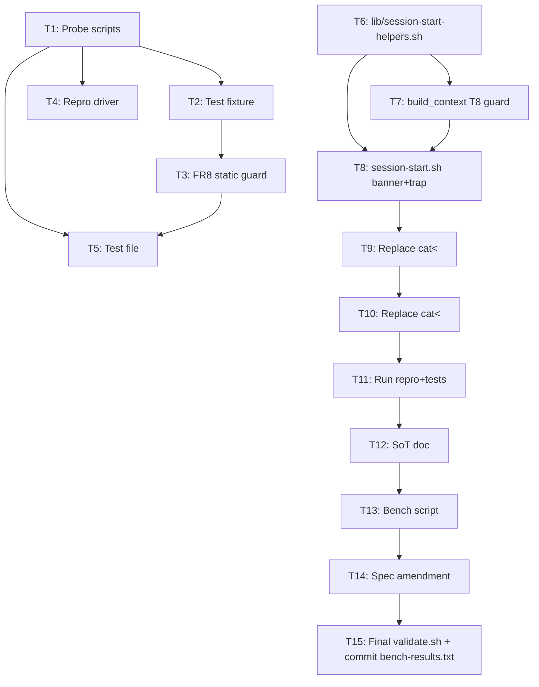

# Plan: Fix SessionStart hook broken-pipe failure

- **Feature:** 107-fix-sessionstart-broken-pipe
- **Spec:** `spec.md` (rev 3)
- **Design:** `design.md` (rev 3)

## Implementation Strategy

TDD-first within the constraints of bash hook testing: write the test harness scaffolding and probes BEFORE modifying `session-start.sh`. The new helpers in `lib/session-start-helpers.sh` are written test-first — the test file drives their interface.

The implementation is **localized**: only `session-start.sh` is modified among hooks; one new file is added in `lib/`. `install_err_trap` in `lib/common.sh` is **untouched** (per SG1).

## Component → File Map

| Component | File(s) | New / Modified |
|---|---|---|
| C1, C2, C3 | `plugins/pd/hooks/lib/session-start-helpers.sh` | NEW |
| C4 | `plugins/pd/hooks/session-start.sh` (lines 1-15, 13, 423-426, 807, 922) | MODIFIED |
| C5 | `docs/dev_guides/hook-development.md` | NEW or MODIFIED |
| C6 | `plugins/pd/hooks/tests/repro-broken-pipe.sh`, `probe-a1-exit0-under-broken-pipe.sh`, `probe-printf-sigpipe.sh`, `fixture-unsafe-write.sh`, `check-no-unsafe-writes.sh`, `test-session-start-broken-pipe.sh` | NEW |
| C7 | `plugins/pd/hooks/tests/bench-session-start.sh`, `bench-results.txt` | NEW |
| Spec amendment | `docs/features/107-fix-sessionstart-broken-pipe/spec.md` (FR5 example) | MODIFIED |

## Build Order

## Sequencing Note

T14 (spec FR5 example amendment) is a documentation-only edit — it changes the example string in spec.md but does NOT change the FR5 regex schema. T5's regex assertion uses `PD_LOG_LINE_REGEX` hardcoded in the test file (per TD5), so T14 has no functional dependency on T11. T14 can run anytime after spec.md is in place (i.e., always — it's safe to parallelize). Listed as `Depends on: none` in tasks.md.

## Parallelizable Groups

- **Group A** (independent probes/fixtures): T1, T2, T3, T4 — can run in parallel.
- **Group B** (helpers + lib changes, depend on Group A): T6, T7 — can run in parallel after Group A.
- **Group C** (session-start.sh edits): T8 → T9 → T10 — sequential (each modifies `session-start.sh`).
- **Group D** (verification): T11 — depends on Group C.
- **Group E** (docs + bench + spec): T12, T13, T14 — can run in parallel after T11.
- **Group F** (final): T15 — depends on Group E.

## Risk Mitigations Implemented in Plan

- **R1 (jq encoding parity)** — T10 includes a comparison test against a frozen reference fixture. T5 also includes T6 (multiline `additionalContext`).
- **R7 (set -e in subshells)** — T7 adds the `PD_FORCE_BUILD_CONTEXT_FAIL` guard; T5 includes T8 test verifying EXIT trap recovers.
- **NFR2 (latency)** — T13 runs benchmark; AC8 enforces ≤ +50 ms median delta against merge-base baseline.

## Notes

- All test artifacts use `PD_SESSION_START_LOG=$(mktemp)` to avoid polluting the user's real log file.
- `fixture-unsafe-write.sh` is named per resolved OQ-fixture-naming (flat path, no `fixtures/` subdir).
- `bench-results.txt` is committed once at PR open (per resolved OQ-bench-baseline + bench-results.txt policy in design).
