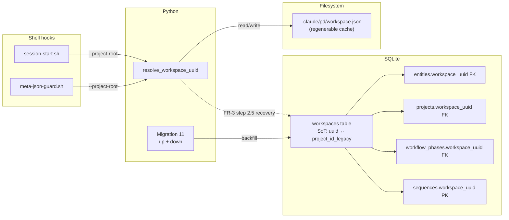

# Design: Feature 108 — Workspace Identity Foundation

- **Project:** P003-entity-system-redesign
- **Feature:** 108-workspace-identity-foundation
- **Phase:** Design (Step 1 Architecture + Step 2 Interface, combined)
- **Status:** Draft
- **Created:** 2026-05-10
- **Spec:** [`spec.md`](spec.md) (41 ACs, 18 FRs, 8 NFRs)
- **PRD:** [`docs/projects/P003-entity-system-redesign/prd.md`](../../projects/P003-entity-system-redesign/prd.md)

---

## 1. Architecture Overview

This feature replaces the implicit, git-derived `project_id` (12-char hex of root commit SHA) with an explicit, file-stamped UUID. The architecture has three planes:

1. **Persistence plane (DB)** — A new `workspaces` table is the canonical mapping of `workspace_uuid → project_id_legacy → project_root`. The `entities`, `projects`, `sequences`, and `workflow_phases` tables all gain a `workspace_uuid` FK. The DB is **the source of truth** for identity history: the only place where every workspace UUID ever assigned is recorded.

2. **Filesystem plane (workspace.json)** — `<.claude/>/pd/workspace.json` is a **regenerable cache** that lets `SessionStart` resolve the workspace UUID without touching the DB on every invocation. It is bootstrappable from the DB via FR-3 step 2.5 recovery; deleting it on a populated DB is recoverable. It is gitignored and per-`.claude/`-dir.

3. **Resolution plane (Python helper)** — A renamed `resolve_workspace_uuid()` (replacing `detect_project_id`) implements the FR-3 precedence chain: env → file → DB recovery → fresh write. Hooks call this helper through the existing `--project-root` boundary; they do not parse or write the file directly.

**SoT statement:** DB is canonical for the `workspace_uuid → project_id_legacy` mapping; `workspace.json` is a regenerable cache. If they disagree, the DB wins (doctor check FR-17 surfaces divergence).



---

## 2. Prior Art Research

### Codebase findings

1. **No down-migration pattern exists.** Migrations 1–10 in `plugins/pd/hooks/lib/entity_registry/database.py` are forward-only. The `MIGRATIONS` registry at `database.py:1629-1640` is a dict keyed only on the up-version. There is no `MIGRATIONS_DOWN` dict, no reverse-test harness, and no precedent. Spec FR-8 + NFR-3 require reversibility — this feature **invents the pattern**.

2. **In-transaction schema_version stamp is mandatory.** `database.py:1604-1618` documents the SIGKILL/OOM rationale: a process killed between the migration's `conn.commit()` and the outer-loop stamp commit leaves a half-stamped DB that re-runs the migration on next open. Migration 11 **must** stamp `schema_version=11` inside the same `BEGIN IMMEDIATE / COMMIT` block, not via the outer `_migrate()` loop. **Reused.**

3. **Concurrent migration race re-check guard.** Migration 10 at `database.py:1396-1418` does a schema_version re-check as the first statement inside `BEGIN IMMEDIATE` and early-returns if another process already completed. Catches `sqlite3.OperationalError` narrowly for the "no such table" case only. Migration 11 **must replicate** this pattern.

4. **`_atomic_json_write` exists.** `plugins/pd/hooks/lib/workflow_engine/feature_lifecycle.py:30-49` implements `tempfile.NamedTemporaryFile(dir=os.path.dirname(path)) + os.replace()` with cleanup-on-exception. **Reused** for `workspace.json` writes; not reinvented.

5. **`detect_project_id` at `project_identity.py:94-235`** uses `@functools.lru_cache(maxsize=1)`. Caches per-process. It reads `ENTITY_PROJECT_ID` env var, then falls back to git root commit SHA, then HEAD SHA, then path hash. The rename to `resolve_workspace_uuid` keeps the per-process caching but changes the precedence chain.

6. **Hooks pass `--project-root` CLI flag.** `session-start.sh:612-617` and the existing `--project-root` plumbing pattern is used everywhere — **not** env vars. Feature 108 **invents** a new `--workspace-uuid` CLI flag for cases where the hook needs to pass an already-resolved UUID downstream, parallel to `--project-root` (Decision 6).

7. **29 test files use `project_id='__unknown__'`** as fixture data. `database.py:1013` declares `project_id TEXT NOT NULL DEFAULT '__unknown__'` (real production default) and `database.py:2580` defines `claim_unknown_entities`. The `'__unknown__'` literal must be replaced everywhere by a deterministic constant (FR-4 `_UNKNOWN_WORKSPACE_UUID`). **Invents** `get_test_workspace_uuid()` test helper.

8. **`upsert_project` at `database.py:3951-3964`** writes the projects table without any workspace scoping. Currently keyed only on `project_id`. Must accept new `workspace_uuid` parameter; the column is added by Migration 11 step 13 and tightened to `NOT NULL` via the projects-rebuild pattern (FR-4).

9. **`workflow_phases` is written at TWO INSERT sites missing `workspace_uuid`.** Verified at `database.py:3265` (`set_workflow_phase`, column list `type_id, kanban_column, workflow_phase, last_completed_phase, mode, backward_transition_reason, updated_at`) and `database.py:3442` (upsert pattern, column list `type_id, workflow_phase, kanban_column, updated_at`). Both sites must populate `workflow_phases.workspace_uuid` after Migration 11. **Trigger-based auto-fill is the chosen mechanism (Decision 8)** — neither INSERT site needs explicit modification.

10. **`db.upsert_project()` is called at `mcp/entity_server.py:124`** with `project_id=info.project_id` only. Post-Migration 11, this caller must additionally pass `workspace_uuid=_workspace_uuid` (the lazy global resolved at MCP server startup per FR-13). Test callers at `mcp/test_entity_server.py:318` and `:373` must be updated in lock-step.

11. **SQLite version floor for `ALTER TABLE DROP COLUMN`.** SQLite 3.35.0 (March 2021) is the minimum supporting `DROP COLUMN`. Python 3.12 ships with sqlite ≥ 3.43, so the floor is satisfied — but Migration 11's reverse path **asserts** explicitly at runtime as defense in depth.

### External findings

1. **Python 3.14 has stdlib `uuid.uuid7`.** CPython issue #102461; documented at https://docs.python.org/3/library/uuid.html. `pyproject.toml`'s `requires-python` floor is `>=3.12` (verified at `plugins/pd/pyproject.toml:4`), below 3.14. F6 is therefore deferred by default unless the implementer raises the floor.

2. **UUIDv7 monotonicity is per-process.** RFC 9562 §6.2 specifies a 42-bit counter for sub-millisecond ordering within a single process. pd is single-process for writes (one MCP server, sequential migrations) — cross-process clock-skew is a non-concern.

3. **SQLite atomic rename(2) requires same-filesystem tempfile.** `os.replace()` degrades to copy-then-unlink across filesystem boundaries, breaking atomicity. NFR-7 mandates `tempfile.NamedTemporaryFile(dir=destination_parent)`. **Reused** via the existing `_atomic_json_write` pattern (which already uses `dir=os.path.dirname(path)`).

4. **Atomic file durability requires fsync of fd AND parent dir.** Without `fsync(parent_dir_fd)` after `os.replace`, a power-loss between rename and dirent flush can leave the rename invisible after reboot. The existing `_atomic_json_write` does **not** fsync the parent dir. **Decision 7** keeps this as-is — `workspace.json` is bootstrappable from the DB so the failure mode is recoverable.

5. **RFC 4122 v4 nibble forcing for deterministic UUIDs.** A SHA-256-derived 32-hex string is not a valid v4 UUID until the version nibble (13th char) is set to `4` and the variant nibble (17th char) is in `{8,9,a,b}`. The algorithm spelled out in spec FR-4 is the canonical RFC 4122 §4.4 procedure.

### Patterns reused vs invented

| Pattern | Source | Disposition |
|---|---|---|
| Migration with BEGIN IMMEDIATE + in-tx schema stamp | `database.py:1604-1618` (Migration 10) | Reused |
| Concurrent re-check guard | `database.py:1396-1418` (Migration 10) | Reused |
| Same-directory tempfile + os.replace | `feature_lifecycle.py:30-49` | Reused |
| Hook → Python via `--project-root` CLI flag | `session-start.sh:612-617` | Reused, extended with `--workspace-uuid` |
| `MIGRATIONS_DOWN` dict + helper | none | **Invented** |
| `_UNKNOWN_WORKSPACE_UUID` deterministic constant | none | **Invented** |
| `get_test_workspace_uuid()` test helper | none | **Invented** |
| `_compute_legacy_project_id` migration-only helper | extracted from existing `detect_project_id` git-SHA path | **Invented** (partial reuse) |
| `_new_uuid()` UUIDv7 helper (conditional) | none | **Invented** (gated by F6) |

---

## 3. Components

### 3.1 `workspaces` table (DB schema component)

- **Responsibility:** Canonical mapping of `workspace_uuid → project_id_legacy → project_root`. Single source of truth for identity history.
- **File location:** Created by Migration 11 in `plugins/pd/hooks/lib/entity_registry/database.py` (new function `_migration_11_workspace_identity`).
- **Public surface:** Read via `db.query_workspace_by_uuid(uuid)`, `db.query_workspace_by_legacy(project_id_legacy)`, `db.query_workspace_by_root(project_root)`. Insertion only via Migration 11 and the `resolve_workspace_uuid` fresh-write path.
- **Internal state:** 5 columns per FR-4 (`uuid PK`, `project_id_legacy UNIQUE`, `project_root`, `created_at`, `updated_at`). One index `idx_workspaces_legacy`.

### 3.2 `entity_display` (deferred)

- **Responsibility:** Stable display tuple `(uuid, seq, slug)` separating identity from rendering.
- **File location:** **Not in this feature.** Deferred to Feature 110.
- **Note here for context:** Feature 108 writes `workspace_uuid` to `entities.workspace_uuid`; entity display continues using the existing `entity_id = '{seq}-{slug}'` embedded format. Feature 110 will introduce the separate `entity_display` table.

### 3.3 `resolve_workspace_uuid()` Python function

- **Responsibility:** Resolve workspace UUID for the given working directory per FR-3 precedence chain. Replaces `detect_project_id`.
- **File location:** `plugins/pd/hooks/lib/entity_registry/project_identity.py:94` (renamed-in-place; no alias).
- **Public surface:** `resolve_workspace_uuid(working_dir: str | None = None) -> str`.
- **Internal state:** `@functools.lru_cache(maxsize=1)` per-process cache (carried over from `detect_project_id`). Cache key is `working_dir` or `os.getcwd()`.

### 3.4 `_compute_legacy_project_id()` private migration-only helper

- **Responsibility:** Compute the legacy 12-char hex `project_id` from a working directory, used **only** by Migration 11 step 0 to populate `workspaces.project_id_legacy` for entries that pre-date this feature.
- **File location:** `plugins/pd/hooks/lib/entity_registry/project_identity.py` (new private function, beneath `resolve_workspace_uuid`).
- **Public surface:** `_compute_legacy_project_id(working_dir: str) -> str`. Underscore-prefixed; not part of the module's public API.
- **Internal state:** None — pure function over the working dir. Reuses the git-SHA fallback chain extracted from the original `detect_project_id`.

### 3.5 `_atomic_workspace_json_write()` writer

- **Responsibility:** Atomic write of `workspace.json` payload, reusing `_atomic_json_write` from `feature_lifecycle.py`.
- **File location:** `plugins/pd/hooks/lib/entity_registry/project_identity.py` (new private function).
- **Public surface:** `_atomic_workspace_json_write(claude_pd_dir: str, payload: dict) -> None`.
- **Internal state:** None. Delegates to `_atomic_json_write` with `path = os.path.join(claude_pd_dir, 'workspace.json')`.

### 3.6 `_UNKNOWN_WORKSPACE_UUID` constant

- **Responsibility:** Deterministic UUID derived from the seed `"pd-test-fixture-unknown-workspace"` per FR-4 algorithm. Single source for both production `__unknown__` rows (mapped during migration) and test fixtures.
- **File location:** `plugins/pd/hooks/lib/entity_registry/database.py` (top-level module constant).
- **Public surface:** `_UNKNOWN_WORKSPACE_UUID: str` (module-level read), `_UNKNOWN_WORKSPACE_UUID_SEED: str` (the seed string).
- **Internal state:** Computed once at import time via `hashlib.sha256(seed.encode()).hexdigest()` + RFC 4122 v4 nibble forcing.

### 3.7 Migration 11 forward (`_migration_11_workspace_identity`)

- **Responsibility:** 17-step transactional migration per FR-7. Adds `workspaces` table; rebuilds `entities`, `sequences`, `projects`; backfills `workflow_phases.workspace_uuid`; drops `parent_type_id` column and 2 triggers.
- **File location:** `plugins/pd/hooks/lib/entity_registry/database.py` (new function); registered in `MIGRATIONS` dict at `database.py:1629-1640` as key `11`.
- **Public surface:** `_migration_11_workspace_identity(conn: sqlite3.Connection) -> None`.
- **Internal state:** None — operates entirely on the passed connection.

### 3.8 Migration 11 reverse (`_migration_11_workspace_identity_down`)

- **Responsibility:** Restore pre-Migration-11 schema exactly (column order, triggers, indexes match the Migration 8/10 final state). Pre-down assertion aborts if cross-workspace `parent_uuid` references exist.
- **File location:** `plugins/pd/hooks/lib/entity_registry/database.py` (new function); registered in **new** `MIGRATIONS_DOWN` dict.
- **Public surface:** `_migration_11_workspace_identity_down(conn: sqlite3.Connection) -> None`.
- **Internal state:** None.

### 3.9 `_new_uuid()` helper (UUIDv7, F6-conditional)

- **Responsibility:** Generate a time-ordered v7 UUID for new entity registration. Used at `register_entity` (~`database.py:2145`) and `register_entities_batch` (~`database.py:3846`).
- **File location:** `plugins/pd/hooks/lib/entity_registry/database.py` (new top-level helper, **only added if F6 lands**).
- **Public surface:** `_new_uuid() -> str` calling `uuid_mod.uuid7()`.
- **Internal state:** None. **No try/except, no fallback** — if the venv regresses below 3.14, raises `AttributeError` immediately (per FR-15).
- **Conditional:** Not added if F6 is deferred. Migration 1 (`database.py:167`) is **excluded** from substitution unconditionally.

### 3.10 `get_test_workspace_uuid()` test helper

- **Responsibility:** Provide deterministic workspace UUID for test fixtures. Replaces all 29 occurrences of the `'__unknown__'` literal.
- **File location:** **`plugins/pd/hooks/lib/entity_registry/test_helpers.py` (NEW file).** All 17 test files import via `from entity_registry.test_helpers import get_test_workspace_uuid`. (Resolves OQ-D4; see Decision 12.)
- **Public surface:** `get_test_workspace_uuid() -> str` returning `_UNKNOWN_WORKSPACE_UUID`.
- **Internal state:** None.

### 3.11 `MIGRATIONS_DOWN` dispatcher (`_migrate_down`)

- **Responsibility:** Reverse-migration dispatcher parallel to existing `_migrate()` forward path. Iterates `MIGRATIONS_DOWN` keys in descending order until `_metadata.schema_version == target_version`.
- **File location:** `plugins/pd/hooks/lib/entity_registry/database.py` (new module-level dict + helper, alongside the existing `MIGRATIONS` dict at `database.py:1629-1640`).
- **Public surface:** `_migrate_down(conn: sqlite3.Connection, target_version: int) -> None`.
- **Internal state:** None.
- **Scope:** Test-only dispatcher in this feature — NOT exposed via MCP/CLI. Initial population: only key `11`. Earlier migrations (1–10) remain unreversible; calling `_migrate_down` with `target_version<10` raises `NotImplementedError(f"Reverse migration for schema_version {v} not implemented")` naming the missing reverse migration.

### 3.12 `workflow_phases.workspace_uuid` auto-fill trigger

- **Responsibility:** AFTER INSERT trigger on `workflow_phases` that auto-populates `workspace_uuid` from `entities.workspace_uuid` keyed by `type_id` whenever the inserted row's `workspace_uuid` is NULL. Eliminates the need to modify the two INSERT sites at `database.py:3265` and `database.py:3442`.
- **File location:** Created by Migration 11 step 12 in `plugins/pd/hooks/lib/entity_registry/database.py`.
- **Public surface:** Trigger name `wp_autofill_workspace_uuid`.
- **Internal state:** None — trigger executes inside SQLite.
- **Trade-off vs explicit INSERT modification:** Trigger is more robust (auto-applies to any future INSERT site, including third-party migrations). Explicit modification touches only two known sites and risks regression if a third site is added later. **Chosen: trigger.**

### 3.13 Caller migration: `mcp/entity_server.py::_upsert_project`

- **Responsibility:** Pass `workspace_uuid` to the renamed `db.upsert_project()` call site at `mcp/entity_server.py:124`.
- **File location:** `plugins/pd/mcp/entity_server.py`.
- **Public surface:** Internal helper `_upsert_project(db, info)` continues to be called by MCP startup; signature unchanged externally, but now reads `_workspace_uuid` global and forwards to `db.upsert_project(workspace_uuid=_workspace_uuid, ...)`.
- **Internal state:** Reads the lazy `_workspace_uuid` global populated at MCP server startup (per FR-13 AC).
- **Dependency note:** `_migrate` runs at MCP server import time (before any tool dispatch), so Migration 11 has completed and `_workspace_uuid` is resolved before `_upsert_project` is called.
- **Test callers:** `mcp/test_entity_server.py:318` and `:373` are updated to pass `workspace_uuid=get_test_workspace_uuid()`.

---

## 4. Technical Decisions

### Decision 1: Down-migration pattern (`MIGRATIONS_DOWN` dict + `_migrate_down`)

- **Context:** Spec FR-8 + NFR-3 require Migration 11 to be reversible. Codebase has no precedent — Migrations 1–10 are forward-only. No `MIGRATIONS_DOWN` dict, no reverse-test harness.
- **Choice:** **Invent the pattern as part of this feature.** Add a new module-level dict `MIGRATIONS_DOWN: dict[int, Callable[[sqlite3.Connection], None]]` parallel to the existing `MIGRATIONS` dict at `database.py:1629-1640`. Add a helper `_migrate_down(conn: sqlite3.Connection, target_version: int) -> None`. Contract:
  - Iterates `MIGRATIONS_DOWN` keys in descending order until `_metadata.schema_version == target_version`.
  - On missing reverse migration: raises `NotImplementedError(f"Reverse migration for schema_version {v} not implemented")`.
  - **Stamp semantics:** each reverse migration stamps the new (lower) `schema_version` INSIDE its transaction (matches forward Migration 10 in-tx pattern at `database.py:1604-1618`).
  - **Concurrency:** same `BEGIN IMMEDIATE` / re-check guard pattern as forward (re-read `_metadata.schema_version` as the first statement in-tx; early-return if already at target).
  - **Call sites:** test-only initially (`test_migration_11_up_and_down.py`) — NOT exposed via MCP/CLI in this feature.
  - **Initial population:** only key `11` in `MIGRATIONS_DOWN`. Migrations 1–10 remain unreversible (out of scope for this feature; backlog item if needed later).
- **Rationale:** Reversibility for Migration 11 is a hard requirement. Inventing the pattern now keeps this feature self-contained. Per CLAUDE.md "No backward compatibility" — we don't owe earlier migrations reversibility unless requested.
- **Trade-offs:** New code path that the implementer must get right on the first try. Mitigated by the AC-13 round-trip checksum test exercising up→down→up against a synthetic DB AND a copy of the live DB.
- **Status:** Accepted.

### Decision 2: Where `workspace.json` lives

- **Context:** Spec FR-1 says `.claude/pd/workspace.json`. EC-8 says project-level always wins over user-level.
- **Choice:** `<.claude/>/pd/workspace.json` — **project-scoped, project-level always wins**. The Python helper resolves the `.claude/` dir using the project root passed via `--project-root` CLI flag (or `os.getcwd()` if absent). User-level `~/.claude/pd/workspace.json` is a separate workspace with its own UUID.
- **Rationale:** Workspaces are per-`.claude/` dir, not per-user (OQ-1 resolved). Project-level precedence prevents the surprising case where a user's `~/.claude/` UUID leaks into a fresh project checkout.
- **Trade-offs:** Two `.claude/` dirs (user + project) means two workspaces and two UUIDs. The doctor health check (FR-17) does **not** flag this — it's intentional.
- **Status:** Accepted.

### Decision 3: SHA-256 deterministic algorithm for `_UNKNOWN_WORKSPACE_UUID`

- **Context:** Spec FR-4 requires a deterministic UUID for `__unknown__` rows. The seed `"pd-test-fixture-unknown-workspace"` is the canonical input.
- **Choice:** Exact algorithm (verbatim from spec FR-4):

  ```python
  digest = hashlib.sha256(_UNKNOWN_WORKSPACE_UUID_SEED.encode()).hexdigest()  # 64 hex
  hex32 = digest[:32]                                                          # 32 hex
  formatted = (
      f"{hex32[0:8]}-{hex32[8:12]}-4{hex32[13:16]}-"
      f"{('8','9','a','b')[int(hex32[16],16) % 4]}{hex32[17:20]}-{hex32[20:32]}"
  )
  ```

- **Pinned literal value:** `_UNKNOWN_WORKSPACE_UUID = "6250c8a6-5306-443f-b225-477a040016ea"`. Computed once: `sha256('pd-test-fixture-unknown-workspace').hexdigest()[:32]`, formatted per RFC 4122 v4 (variant nibble at idx 16 = `'b'` from `int('b',16)%4=3 → 'b'`; version nibble forced to `'4'`; idx 12 intentionally unused). Tests assert byte-equality against this literal, **NOT** "recompute and compare" (which would defeat the purpose of pinning).
- **Rationale:** Byte-for-byte deterministic across machines and Python versions. RFC 4122 §4.4 v4 conformance (version nibble = 4, variant nibble in `{8,9,a,b}`). Single seed string keeps test fixtures and production migration in lock-step. Pinning the literal in BOTH spec FR-4 and design §6.5 + Decision 3 enables byte-equality tests.
- **Trade-offs:** Mutating the seed string would assign a different UUID — operators must NOT change it post-implementation. Seed is documented as a constant with a "do not modify" comment.
- **Status:** Accepted.

### Decision 4: UUIDv7 conditional gate strategy

- **Context:** Spec FR-15: F6 is build-time-frozen, not runtime-fallback. Stdlib `uuid.uuid7` requires Python 3.14+; `pyproject.toml` floor is `>=3.12`.
- **DEFAULT (DEFERRED) STATE:** This feature does NOT introduce `_new_uuid()`. The two register sites (`database.py:2145` `register_entity`, `database.py:3846` `register_entities_batch`) continue calling `uuid_mod.uuid4()` unchanged. **Default outcome of this feature is zero UUID-generation code changes.** F6 lands ONLY if the implementer raises pyproject `python_requires` floor to `>=3.14` AND the build-time gate passes (`assert hasattr(uuid, 'uuid7')`).
- **Choice (conditional):** **Build-time decision frozen at merge.** At implementation start, run the gate `python -c "import sys, uuid; assert sys.version_info >= (3,14) and hasattr(uuid, 'uuid7')"`. If passes AND implementer raises `pyproject.toml` floor to `>=3.14` in the same PR → ship F6 (add `_new_uuid()` + replace 2 register sites). If gate fails → defer F6 to backlog, do not add `_new_uuid()`. **No try/except fallback in `_new_uuid()`** — if the venv regresses below 3.14 post-merge, `AttributeError` surfaces immediately.
- **Rationale:** A runtime fallback (`if hasattr(uuid, 'uuid7'): ... else: ...`) would create a silent regression path. Explicit `AttributeError` makes the contract violation loud.
- **Trade-offs:** If implementer ships F6 without raising the floor, CI on 3.12 hosts will break. Mitigated by AC requiring CI matrix run on both 3.12 and 3.14 (Risk R-F6-regression).
- **Status:** Accepted; default expectation is **deferred** (floor is below 3.14 today). **Conclusion: default outcome of this feature is zero UUID-generation code changes; F6 lands ONLY if implementer raises the pyproject floor AND the gate passes.**

### Decision 5: `ENTITY_PROJECT_ID` rename to `ENTITY_WORKSPACE_UUID`

- **Context:** Existing env var `ENTITY_PROJECT_ID` is the test/CI override at `project_identity.py:107`. Spec FR-3 specifies `ENTITY_WORKSPACE_UUID` as the new name. The legacy `project_id` is computed from git via `_compute_legacy_project_id()`, NOT from env var — `ENTITY_PROJECT_ID` is purely a test-override mechanism.
- **Choice:** **Rename, do not alias.** The new env var `ENTITY_WORKSPACE_UUID` is read ONLY by `resolve_workspace_uuid()` (FR-3 step 1). **Migration 11 does NOT read `ENTITY_PROJECT_ID` or `ENTITY_WORKSPACE_UUID`** — it derives the legacy `project_id` via `_compute_legacy_project_id()` and the workspace UUID via fresh-generation per `project_id` distinct value. Post-merge, `grep -r ENTITY_PROJECT_ID plugins/pd/` returns 0 hits (per spec FR-14 AC). All test fixtures that previously set `ENTITY_PROJECT_ID` are updated to set `ENTITY_WORKSPACE_UUID`.
- **Rationale:** Per CLAUDE.md "No backward compatibility — delete old code, don't maintain compatibility shims." Two env vars doing similar things would invite drift. The "Migration step 0 reads `ENTITY_PROJECT_ID` once" claim from earlier drafts was incorrect — Migration 11 does not depend on either env var.
- **Trade-offs:** Breaks any external caller setting the old env var. pd is private tooling; no external callers.
- **Status:** Accepted.

### Decision 6: `--workspace-uuid` CLI flag for hook → Python boundary

- **Context:** Hooks pass project context to Python via `--project-root` CLI flag, not env vars (`session-start.sh:612-617` pattern). Some hook contexts (e.g., MCP server bootstrap) need to pass a resolved `workspace_uuid` directly.
- **Choice:** Add `--workspace-uuid` CLI flag parallel to `--project-root`. Hooks pass either or both. The Python entry point uses `--workspace-uuid` if present (skipping resolution); otherwise it calls `resolve_workspace_uuid(args.project_root)`.
- **Rationale:** Parallel pattern to existing convention. Avoids env-var sprawl. Easier to reason about in `bash -x` traces.
- **Trade-offs:** Slight CLI surface growth. Acceptable — the flag is additive and only consumed by Python entry points that already accept argparse.
- **Status:** Accepted.

### Decision 7: Atomic write durability

- **Context:** External finding 4 — `_atomic_json_write` does not fsync parent dir, leaving a power-loss window between `os.replace` and dirent flush.
- **Choice:** **Keep `_atomic_json_write` as-is.** Do NOT add `fsync(parent_dir_fd)`.
- **Rationale:** `workspace.json` is regenerable from the DB via FR-3 step 2.5. A power-loss that loses the rename leaves the DB intact; next SessionStart's recovery path regenerates the file. The fsync overhead would slow every SessionStart hot path (NFR2 bound) for a recoverable failure mode.
- **Trade-offs:** Worst-case recovery is a single fresh-UUID generation (FR-3 step 3) on a power-loss-then-empty-DB scenario, which is also a fresh-checkout scenario. Acceptable.
- **Status:** Accepted.

### Decision 8: `workflow_phases.workspace_uuid` derivation + auto-fill trigger

- **Context:** `workflow_phases` table currently keys on `type_id` (and indirectly on entities). FR-7 step 11 says backfill from entities. Two production INSERT sites at `database.py:3265` (`set_workflow_phase`) and `database.py:3442` (upsert pattern) currently write `workflow_phases` without `workspace_uuid`.
- **Choice:**
  1. **JOIN-backfill at Migration 11 step 12.** Add `workspace_uuid TEXT REFERENCES workspaces(uuid)` column; populate via `UPDATE workflow_phases SET workspace_uuid = (SELECT e.workspace_uuid FROM entities e WHERE e.type_id = workflow_phases.type_id)`. Add index `idx_wp_workspace_uuid`.
  2. **AFTER INSERT trigger (`wp_autofill_workspace_uuid`)** — **chosen mechanism for new INSERTs**. Trigger auto-populates `workspace_uuid` from `entities.workspace_uuid` keyed by `type_id` whenever the inserted row's `workspace_uuid` is NULL. Eliminates the need to modify the two INSERT sites at `database.py:3265` and `database.py:3442`. **Migration 11 step 12 creates this trigger.**
  3. **Trade-off vs explicit INSERT modification:** Trigger is more robust (auto-applies to any future INSERT site, including third-party migrations or future code). Explicit modification touches only two known sites and risks regression if a third site is added later. Sub-SELECT-based INSERT modification (`INSERT INTO workflow_phases (..., workspace_uuid) VALUES (..., (SELECT e.workspace_uuid FROM entities e WHERE e.type_id=?))`) was considered and rejected because it duplicates trigger logic at every call site.
- **Rationale:** `workflow_phases.type_id` already implicitly identifies the workspace via `entities`; the new column is denormalization for query performance, not a new authoritative axis. The auto-fill trigger keeps INSERT sites unchanged, reducing regression risk.
- **Trade-offs:** If an entity is re-attributed to a different workspace post-migration (via `claim_unknown_entities`), `workflow_phases.workspace_uuid` must be updated in lock-step. The existing `claim_unknown_entities` path is updated to do this in Migration 11's call-site rewrites (FR-9). Trigger overhead per-INSERT is one indexed sub-SELECT — negligible at the workflow_phases write rate (≤1 per phase transition).
- **Status:** Accepted.

### Decision 9: Concurrent workspace.json race — fcntl.flock synchronization

- **Context:** Two SessionStart processes (or two test workers) may race on `.claude/pd/workspace.json` creation. The earlier "re-read after rename" approach was BROKEN — it returns each process's own UUID, not a converged value, because each process reads its own tempfile content rather than the post-`os.replace` consolidated state.
- **Choice:** **fcntl.flock-based cross-process synchronization** on a sentinel lock file in the same directory. Pseudocode:

  ```python
  def _atomic_workspace_json_write(target_path, uuid_value):
      """Atomic create-if-absent with cross-process consistency.

      Uses fcntl.flock on a sentinel lock file in the same directory.
      Caller order:
        1. Acquire exclusive flock on .claude/pd/workspace.json.lock
        2. Re-check existence; if file exists, read and return its UUID (loser case)
        3. Write tempfile + os.replace
        4. Re-read file content for return value
        5. Release flock

      Guarantees: under N parallel callers, all return the same UUID
      (either the writer's or the existing-file reader's).
      """
  ```

- **Note on Migration 11 race:** This is a separate concern from workspace.json races. For the migration race (two SessionStart processes both attempting Migration 11), we **replicate Migration 10's pattern** at `database.py:1396-1418` — first statement inside `BEGIN IMMEDIATE` re-reads `_metadata.schema_version` and early-returns if `>= 11`. Catch `sqlite3.OperationalError` narrowly (only `'no such table'`). That race is handled by SQLite's serialization, not flock.
- **Rationale:** flock provides true cross-process exclusion. Re-read-after-rename does NOT — each racer's `os.replace` writes ITS OWN tempfile; the loser's `os.replace` overwrites the winner's, and the loser then reads back its own UUID. Only flock-serialized "check existence first" guarantees both processes return the same UUID.
- **Trade-offs:** Adds a `.workspace.json.lock` sentinel file in `.claude/pd/`. Gitignored alongside `workspace.json`. Lock contention only on first-creation races (sub-millisecond duration); subsequent calls short-circuit before acquiring the lock.
- **Status:** Accepted (corrects the prior re-read-after-rename approach).

### Decision 10: Test fixture migration strategy — form enumeration

- **Context:** 29 test files reference `project_id='__unknown__'` literally. FR-9 / FR-10 require global rewrite. A naive single-pattern sed misses non-kwarg forms.
- **Pre-sed audit query:**
  ```bash
  grep -nE "project_id\s*=\s*['\"]__unknown__['\"]|['\"]project_id['\"]\s*:\s*['\"]__unknown__['\"]|f['\"][^'\"]*__unknown__|register_entity\([^)]*['\"]__unknown__['\"]" plugins/pd/
  ```
- **Forms to handle (each gets its own sed pattern OR manual rewrite):**
  1. **Kwarg form**: `project_id='__unknown__'` → `workspace_uuid=get_test_workspace_uuid()` (sed-able).
  2. **Dict-key form**: `{'project_id': '__unknown__'}` or `"project_id": "__unknown__"` → `{'workspace_uuid': get_test_workspace_uuid()}` (sed-able with separate pattern).
  3. **f-string form**: `f"...project_id='__unknown__'..."` (in raw SQL templates) — manual rewrite required.
  4. **Positional form** in older tests: rare but possible; manual review.
- **Choice:** **Bulk replace via multiple scoped sed patterns + manual rewrite for f-strings/positionals + hand-review.** Step 1: introduce `get_test_workspace_uuid()` in `entity_registry/test_helpers.py`. Step 2: run pre-sed audit to enumerate every match form. Step 3: apply form-specific sed patterns (one for kwargs, one for dict-keys); manual rewrite for f-string and positional. Step 4: hand-review each file diff before committing. Step 5: pytest gates the commit (any TypeError or AttributeError fails the gate).
- **Rationale:** Single sed pattern silently misses 3 of 4 forms. Enumerating forms upfront prevents the "sed fixed the kwarg cases but tests still fail because dict-key cases survived" outcome.
- **Trade-offs:** More upfront audit work. Mitigated by the audit being a single grep invocation.
- **Status:** Accepted.

### Decision 11: WORKSPACE_UUID delivery to subprocesses (resolves OQ-D5)

- **Context:** Hooks need to pass workspace identity to Python entry points. Existing convention is `--project-root` CLI flag (`session-start.sh:612-617`). Spec FR-11 AC says hook exports `WORKSPACE_UUID` env var.
- **Choice:** **Both env var AND CLI flag, with documented precedence.** Hooks export `WORKSPACE_UUID` env var (per spec FR-11 AC). Python entry points read EITHER `ENTITY_WORKSPACE_UUID` env var (highest precedence per FR-3 step 1) OR `--workspace-uuid` CLI flag (parallel to `--project-root`). When both are set, ENV wins (FR-3 step 1 is canonical). When neither is set, fall through to FR-3 step 2 (workspace.json file).
- **Precedence chain:** `ENTITY_WORKSPACE_UUID` env > `--workspace-uuid` flag > workspace.json file > workspaces table lookup > fresh-write.
- **Rationale:** Env var supports subprocess inheritance (FR-11 AC); CLI flag supports explicit pipe-through for entry points that don't inherit env (e.g., MCP tool dispatch). Both paths converge on `resolve_workspace_uuid()`.
- **Trade-offs:** Two delivery channels invite drift if not documented. Mitigated by canonical precedence chain documented here.
- **Status:** Accepted. **Resolves OQ-D5** (dropped from §9 Open Questions).

### Decision 12: `get_test_workspace_uuid()` placement (resolves OQ-D4)

- **Context:** OQ-D4 weighed `tests/conftest.py` vs `entity_registry/__init__.py` vs new `entity_registry/test_helpers.py`.
- **Choice:** **`plugins/pd/hooks/lib/entity_registry/test_helpers.py` (NEW file).** All 17 test files import via `from entity_registry.test_helpers import get_test_workspace_uuid`. Module is deliberately under the `entity_registry` package (not under a `tests/` sibling) so the import path is stable across pytest invocation modes.
- **Rationale:** `conftest.py` cross-package sharing is awkward (each pytest root needs its own). `__init__.py` pollutes the runtime namespace with test-only symbols. A dedicated `test_helpers.py` keeps the symbol scoped while making the import deterministic.
- **Trade-offs:** Adds one new file. Acceptable.
- **Status:** Accepted. **Resolves OQ-D4** (dropped from §9 Open Questions).

---

## 5. Risks & Mitigations

| # | Risk | Likelihood | Impact | Mitigation |
|---|---|---|---|---|
| RD-1 | Migration 11 is destructive (rebuilds entities table). A bug in the JOIN backfill could orphan rows. | Med | High | Pre-migration FK check (step 3); post-commit FK check (step 17); atomic single transaction so partial state is impossible (AC-35). Live DB integration test (Test 7.6) catches mapping bugs. |
| RD-2 | `MIGRATIONS_DOWN` is new code — implementer might miss reverse-edge cases (column order, default values, trigger names). | High | Med | Test every up→down→up roundtrip on synthetic DB AND a copy of live DB (AC-13, Test 7.2 `test_migration_11_round_trip_checksum`). Down-script asserts pre-down via FR-8 step 2 (cross-workspace `parent_uuid`). Manual schema diff via `sqlite3 .schema` comparison committed to PR. |
| RD-3 | Concurrent SessionStart racing workspace.json bootstrap could return divergent UUIDs. | Med | Med | Re-read-after-rename pattern (FR-2 AC, NFR-7). Both racers read the post-`os.replace` file and return the winner's UUID. AC-37 verifies via `multiprocessing.Pool(2)`. |
| RD-4 | Test fixture mass migration (29 files) may break tests if literal replacement is too aggressive. | Med | Med | Scoped sed with file-glob limit; hand-review each diff; pytest run gates the commit. Phased rollout: do 1 file, run tests, expand. |
| RD-5 | F6 conditional gate: implementer might land it without 3.14 build available, then codebase silently regresses on 3.12 hosts. | Med | High | Build-time `assert hasattr(uuid, 'uuid7')` (FR-15). CI matrix runs both 3.12 (must work without v7 → F6 not present) and 3.14 (must work with v7 → F6 present). `pyproject.toml` floor change is part of the same PR if F6 lands. |
| RD-6 | `_compute_legacy_project_id` survives in production code beyond migration scope. | Low | Low | Underscore-prefix marks it private. Implementer must verify no production caller imports it post-migration. `grep -rn '_compute_legacy_project_id' plugins/pd/ --include='*.py'` should hit only `database.py` Migration 11 and a unit test. |
| RD-7 | `workspace.json` schema_version evolution — adding fields later requires care. | Low | Low | FR-1 says strict schema (rejects unknown keys with WARN). The `schema_version=1` integer literal is the version anchor — bumping it is a breaking change with required backwards-incompat handling. Documented in Migration 11's docstring. |
| RD-8 | `__unknown__` row migration silently attributes orphan entities. | Med | Med | WARN log per `__unknown__` count (FR-7 step 0). Operator runs `claim_unknown_entities` post-migration. Doctor check (FR-17) surfaces remaining orphans. |
| RD-9 | The new `--workspace-uuid` CLI flag is missed by some hook update. | Low | Low | FR-11 / FR-12 enumerate hook update sites. `grep -rn '\-\-project-root' plugins/pd/hooks/ --include='*.sh'` enumerates current call sites — implementer must update each to also accept `--workspace-uuid`. |
| RD-10 | Live DB has subtle data quality issue (e.g., zombie row with `project_id` outside the 3 known values). | Low | High | Migration step 0 (workspace mapping audit) runs `SELECT DISTINCT project_id FROM entities` and emits `workspace-mapping.json`. Anomalies surface as extra mapping entries; Test 7.6 asserts the mapping matches `workspaces.project_id_legacy` post-migration. |

---

## 6. Interfaces

### 6.1 `resolve_workspace_uuid()`

```python
# plugins/pd/hooks/lib/entity_registry/project_identity.py
@functools.lru_cache(maxsize=1)
def resolve_workspace_uuid(working_dir: str | None = None) -> str:
    """Resolve workspace UUID for the given working directory.

    Precedence (FR-3):
      1. ENTITY_WORKSPACE_UUID env var
      2. <working_dir>/.claude/pd/workspace.json (file-based; project-level wins)
      3. workspaces table lookup by project_root match (single-row only)
      4. Fresh write (uuidv7 if F6 lands, else uuidv4; written atomically)

    Args:
        working_dir: Directory containing .claude/. Defaults to os.getcwd().

    Returns:
        Canonical workspace UUID (36-char lowercase hyphenated string).

    Raises:
        WorkspaceResolutionError: if step 4 fires but file write fails
            (disk full, permission denied, parent dir missing & uncreatable).
        WorkspaceCorruptedError: if step 2 reads a file with bad
            schema_version, malformed JSON, or unknown top-level keys
            beyond the WARN threshold.

    Side effects:
        - Step 4: writes <working_dir>/.claude/pd/workspace.json atomically.
        - Step 4: emits a WARN log to stderr (via safe_emit_hook_json) when
          fresh UUID is generated on a populated DB (FR-3 fallthrough cases).

    Idempotency:
        Calling twice with the same working_dir returns the same UUID and
        does NOT modify the file (mtime preserved). Per-process lru_cache
        guarantees the second call short-circuits before any I/O.
    """
```

### 6.2 `_compute_legacy_project_id()`

```python
# plugins/pd/hooks/lib/entity_registry/project_identity.py
def _compute_legacy_project_id(working_dir: str) -> str:
    """Migration-only helper: compute the legacy 12-char hex project_id.

    Reuses the git-SHA fallback chain extracted from the original
    detect_project_id (root commit → HEAD → path hash). NOT cached.

    Args:
        working_dir: Project root directory.

    Returns:
        12-char lowercase hex string (legacy project_id format).

    Raises:
        Never raises — returns path-hash fallback on any failure.

    Side effects:
        Subprocess calls to git (rev-parse, rev-list). No file or DB writes.

    Idempotency:
        Pure function modulo git state. Same git state → same return value.
    """
```

### 6.3 `_atomic_workspace_json_write()` (flock-synchronized)

```python
# plugins/pd/hooks/lib/entity_registry/project_identity.py
import fcntl

def _atomic_workspace_json_write(target_path: str, uuid_value: str) -> str:
    """Atomic create-if-absent with cross-process consistency.

    Uses fcntl.flock on a sentinel lock file in the same directory.
    Caller order:
      1. Acquire exclusive flock on .claude/pd/workspace.json.lock
      2. Re-check existence; if file exists, read and return its UUID
         (loser case — winner's UUID is returned to ALL callers)
      3. Write tempfile + os.replace
      4. Re-read file content for return value
      5. Release flock

    Guarantees: under N parallel callers, all return the SAME UUID
    (either the writer's or the existing-file reader's). This is the
    correct cross-process behavior; re-read-after-rename without flock
    is BROKEN because each racer's os.replace overwrites others'.

    Args:
        target_path: Absolute path to .claude/pd/workspace.json.
            Parent dir created via os.makedirs(exist_ok=True) if missing.
        uuid_value: Candidate UUID to write if no existing file.

    Returns:
        The UUID that ended up on disk (winner's or pre-existing).

    Raises:
        OSError: if mkdir or rename fails.
        ValueError: if existing file is malformed.

    Side effects:
        - Creates parent dir if missing.
        - Creates/touches sentinel <target_path>.lock for flock.
        - Writes target_path atomically via tempfile in the same
          directory + os.replace.

    Idempotency:
        Calling twice with the same target_path returns the same UUID
        (the file written on first call is read-not-rewritten on second).
    """
```

### 6.4 `_new_uuid()` (F6-conditional)

**DEFINED IFF F6 LANDS; OTHERWISE NO-OP.** Default outcome of this feature is zero UUID-generation code changes. The two register sites (`database.py:2145` `register_entity`, `database.py:3846` `register_entities_batch`) continue calling `uuid_mod.uuid4()` unchanged. The block below applies ONLY if F6 lands at implement time (implementer raises `pyproject.toml` floor to `>=3.14` AND build-time gate passes).

```python
# plugins/pd/hooks/lib/entity_registry/database.py
# F6: time-ordered identity (Python 3.14+ only)
def _new_uuid() -> str:
    """Return a new UUIDv7 string. Raises AttributeError on Python <3.14.

    Used at the runtime register sites:
      - register_entity (~database.py:2145)
      - register_entities_batch (~database.py:3846)

    EXCLUDED from substitution: database.py:167 (Migration 1) — Migration 1
    must remain stable across re-runs.

    No try/except, no fallback. If venv regresses below 3.14, this raises
    AttributeError immediately, surfacing the contract violation.
    """
    return str(uuid_mod.uuid7())
```

### 6.5 `_UNKNOWN_WORKSPACE_UUID` constant

**Pinned literal value:** `_UNKNOWN_WORKSPACE_UUID = "6250c8a6-5306-443f-b225-477a040016ea"`. Computed once: `sha256('pd-test-fixture-unknown-workspace').hexdigest()[:32]`, formatted per RFC 4122 v4 (variant nibble at idx 16 = `'b'` from `int('b',16)%4=3 → 'b'`; version nibble forced to `'4'`; idx 12 intentionally unused). Tests assert byte-equality against this literal, NOT "recompute and compare".

```python
# plugins/pd/hooks/lib/entity_registry/database.py
# FR-4: deterministic UUID for production __unknown__ rows AND test fixtures.
# DO NOT MODIFY THE SEED — changing it reassigns every __unknown__ entity.
_UNKNOWN_WORKSPACE_UUID_SEED: str = "pd-test-fixture-unknown-workspace"

def _compute_unknown_workspace_uuid() -> str:
    digest = hashlib.sha256(_UNKNOWN_WORKSPACE_UUID_SEED.encode()).hexdigest()
    h = digest[:32]
    return (
        f"{h[0:8]}-{h[8:12]}-4{h[13:16]}-"
        f"{('8','9','a','b')[int(h[16],16) % 4]}{h[17:20]}-{h[20:32]}"
    )

_UNKNOWN_WORKSPACE_UUID: str = _compute_unknown_workspace_uuid()
# Pinned literal (asserted at import time):
assert _UNKNOWN_WORKSPACE_UUID == "6250c8a6-5306-443f-b225-477a040016ea", (
    f"_UNKNOWN_WORKSPACE_UUID drift: got {_UNKNOWN_WORKSPACE_UUID}; "
    f"expected pinned literal — seed must not be mutated."
)
# Asserts at import time:
#   uuid.UUID(_UNKNOWN_WORKSPACE_UUID).version == 4
#   uuid.UUID(_UNKNOWN_WORKSPACE_UUID).variant == uuid.RFC_4122
```

### 6.6 Migration 11 forward entry point

```python
# plugins/pd/hooks/lib/entity_registry/database.py
def _migration_11_workspace_identity(conn: sqlite3.Connection) -> None:
    """Migration 11: workspaces table + entities.workspace_uuid + drop parent_type_id.

    Transactional contract:
      - PRAGMA foreign_keys = OFF (outside transaction).
      - BEGIN IMMEDIATE.
      - Concurrent re-check guard (Decision 9, replicates Migration 10
        pattern at database.py:1396-1418).
      - 17 steps per FR-7 (see §7 of this design).
      - schema_version=11 stamp INSIDE transaction (Decision 2.2,
        replicates Migration 10 pattern at database.py:1604-1618).
      - COMMIT.
      - PRAGMA foreign_keys = ON.
      - Post-migration FK check (raises if violations).

    Side effects:
      - Writes docs/features/108-workspace-identity-foundation/workspace-mapping.json
        (step 0).
      - Emits WARN logs for __unknown__ rows (step 0).

    Idempotency:
      Second invocation reads schema_version=11 in the re-check guard and
      rolls back as a no-op.

    Raises:
      RuntimeError on FK violations (pre or post).
      RuntimeError on parent_type_id orphan assertion (step 6).
    """
```

### 6.7 Migration 11 reverse entry point + `_migrate_down` dispatcher

```python
# plugins/pd/hooks/lib/entity_registry/database.py

MIGRATIONS_DOWN: dict[int, Callable[[sqlite3.Connection], None]] = {
    11: _migration_11_workspace_identity_down,
}

def _migrate_down(conn: sqlite3.Connection, target_version: int) -> None:
    """Reverse-migration dispatcher (test-only in this feature).

    Iterates MIGRATIONS_DOWN keys in descending order until
    _metadata.schema_version == target_version.

    Currently only schema_version 11 is reversible. Calling with
    target_version<10 raises NotImplementedError naming the missing
    reverse migration.

    Concurrency: same BEGIN IMMEDIATE / re-check guard pattern as forward.
    Stamp semantics: each reverse migration stamps the new (lower)
    schema_version INSIDE its transaction.

    Call sites: test-only initially (test_migration_11_up_and_down.py) —
    NOT exposed via MCP/CLI in this feature.
    """

def _migration_11_workspace_identity_down(conn: sqlite3.Connection) -> None:
    """Reverse Migration 11. Restores exact pre-11 schema.

    Transactional contract: same envelope as forward (PRAGMA OFF + BEGIN
    IMMEDIATE + in-tx schema_version=10 stamp + COMMIT + PRAGMA ON +
    post-FK check).

    SQLite version assertion (defense in depth):
      assert sqlite3.sqlite_version_info >= (3, 35, 0), (
          "Migration 11 reverse requires SQLite 3.35+ for "
          "ALTER TABLE DROP COLUMN; current version: "
          f"{sqlite3.sqlite_version}"
      )

    Pre-down assertion (FR-8 step 2):
      SELECT COUNT(*) FROM entities e WHERE EXISTS (
        SELECT 1 FROM entities p
        WHERE p.uuid = e.parent_uuid AND p.workspace_uuid != e.workspace_uuid
      )
      Aborts with RuntimeError if > 0.

    Side effects:
      - Writes _metadata.schema_version='10' inside transaction.
      - DROPs workspaces table.
      - DROPs trigger wp_autofill_workspace_uuid.

    Idempotency:
      Second invocation reads schema_version=10 in a re-check guard and
      rolls back as a no-op (mirror of forward guard).

    Raises:
      AssertionError if SQLite < 3.35.0 (DROP COLUMN unavailable).
      RuntimeError on cross-workspace parent_uuid edges.
      RuntimeError on FK violations.
    """
```

### 6.8 `get_test_workspace_uuid()`

```python
# plugins/pd/hooks/lib/entity_registry/test_helpers.py (NEW FILE — see Decision 12)
# All 17 test files import via:
#   from entity_registry.test_helpers import get_test_workspace_uuid

def get_test_workspace_uuid() -> str:
    """Return the canonical unknown-workspace UUID for test fixtures.

    Replaces the literal 'project_id="__unknown__"' across all test
    fixtures. Pinned to "6250c8a6-5306-443f-b225-477a040016ea".

    Form-handling note (Decision 10):
      - Kwarg form (project_id='__unknown__') → workspace_uuid=get_test_workspace_uuid()
      - Dict-key form ({'project_id': '__unknown__'}) → {'workspace_uuid': get_test_workspace_uuid()}
      - f-string form (raw SQL templates) → manual rewrite
      - Positional form → manual review

    Returns:
        _UNKNOWN_WORKSPACE_UUID (deterministic, FR-4) —
        "6250c8a6-5306-443f-b225-477a040016ea".

    Side effects: None.
    Idempotency: Pure constant return.
    """
    from entity_registry.database import _UNKNOWN_WORKSPACE_UUID
    return _UNKNOWN_WORKSPACE_UUID
```

### 6.9 `register_entity` MCP tool — signature change

```python
# plugins/pd/mcp/entity_server.py (rewrite of _process_register_entity)
def register_entity(
    entity_type: str,
    entity_id: str,
    name: str,
    *,
    workspace_uuid: str | None = None,    # NEW (replaces project_id kwarg)
    artifact_path: str | None = None,
    status: str | None = None,
    parent_uuid: str | None = None,
    metadata: dict | str | None = None,
    # parent_type_id REMOVED (FR-13 AC).
) -> str:
    """Register an entity. Returns the assigned UUID.

    When workspace_uuid is None, the MCP server resolves it via the lazy
    global _workspace_uuid (populated at server startup from
    .claude/pd/workspace.json per FR-13 AC).

    Idempotency: INSERT OR IGNORE semantics preserved (AC-19). Repeated
    calls with same args return the same UUID. The split into raises/upsert
    is deferred to Feature 109.
    """
```

### 6.10 `upsert_project()` — signature change

```python
# plugins/pd/hooks/lib/entity_registry/database.py (modified ~line 3951)
def upsert_project(
    self,
    project_id: str,
    workspace_uuid: str,            # NEW: required (NOT NULL FK to workspaces)
    name: str,
    root_commit_sha: str | None,
    remote_url: str | None,
    normalized_url: str | None,
    remote_host: str | None,
    remote_owner: str | None,
    remote_repo: str | None,
    default_branch: str | None,
    project_root: str,
    is_git_repo: bool,
) -> None:
    """Insert or update a project row, scoped to workspace_uuid.

    PK remains (project_id) for legacy display compatibility (FR-7 step 13).
    workspace_uuid is the FK to workspaces.uuid; created NOT NULL by
    Migration 11's projects-rebuild.

    Raises sqlite3.IntegrityError if workspace_uuid does not match an
    existing workspaces row.
    """
```

**Caller migration plan:**

- **Production caller** at `mcp/entity_server.py:124` (`_upsert_project` helper, lines 122-124 read `project_id_legacy = _detect_project_id_legacy()` pre-rename). Post-rename, this caller passes `workspace_uuid=_workspace_uuid` (the lazy global resolved at MCP server startup post-Migration 11). Dependency: `_migrate` runs at MCP server import time (before any tool dispatch), so Migration 11 has completed and `_workspace_uuid` is populated before `_upsert_project` is called.
- **Test callers** at `mcp/test_entity_server.py:318` and `:373` are updated to pass `workspace_uuid=get_test_workspace_uuid()`.
- Spec FR-9 production rewrite list updated to include `plugins/pd/mcp/entity_server.py` (covers `_upsert_project` + `register_entity` rewrite).
- Spec FR-9 test file list updated to include `plugins/pd/mcp/test_entity_server.py`.

---

## 7. Migration 11 Detailed Plan

### 7.1 Forward (up) — 17 steps

```
0. PRE-TRANSACTION: workspace mapping audit
   - SELECT DISTINCT project_id FROM entities
   - For each: assign workspace_uuid:
       if project_id == '__unknown__': use _UNKNOWN_WORKSPACE_UUID
       else: generate fresh UUID (uuidv7 if F6, else uuidv4)
   - Write <workspace_root>/.claude/pd/migrations/migration-11-workspace-mapping.json
     (workspace-relative path; <workspace_root> is the dir containing .claude/.
     Auto-gitignored since .claude/pd/ is per-workspace state. AC-36 verifies via
     `test -f $(get_workspace_root)/.claude/pd/migrations/migration-11-workspace-mapping.json`.)
   - Emit WARN log per __unknown__ count.

1. PRAGMA foreign_keys = OFF
   - Verify with: SELECT * FROM PRAGMA foreign_keys; assert == 0.
   - (Outside transaction — PRAGMA must run pre-BEGIN.)

2. BEGIN IMMEDIATE

3. Concurrent re-check guard:
   v = SELECT value FROM _metadata WHERE key='schema_version'
   if int(v) >= 11: ROLLBACK; return  (no-op)

4. Pre-migration FK check:
   PRAGMA foreign_key_check  → must return empty.

5. Bootstrap workspaces table:
   CREATE TABLE workspaces (
       uuid               TEXT NOT NULL PRIMARY KEY,
       project_id_legacy  TEXT UNIQUE,
       project_root       TEXT,
       created_at         TEXT NOT NULL,
       updated_at         TEXT NOT NULL
   );
   CREATE INDEX idx_workspaces_legacy ON workspaces(project_id_legacy);

   For each (legacy_id, new_uuid) in mapping:
     INSERT INTO workspaces (uuid, project_id_legacy, project_root, created_at, updated_at)
     SELECT ?, ?, p.project_root, ?, ?
     FROM projects p WHERE p.project_id = ? -- legacy_id
     UNION ALL SELECT ?, ?, NULL, ?, ?       -- if no projects row matched

6. Pre-migration assertion:
   n = SELECT COUNT(*) FROM entities WHERE parent_uuid IS NULL AND parent_type_id IS NOT NULL
   if n > 0:
     offenders = SELECT GROUP_CONCAT(uuid) FROM entities WHERE parent_uuid IS NULL AND parent_type_id IS NOT NULL
     ROLLBACK and raise RuntimeError(f"Migration 11 aborted: {n} parent_type_id-only orphans: {offenders}")
   else:
     log: "Pre-migration check passed (0 unresolved parent_type_id orphans)"

7. Build entities_new:
   CREATE TABLE entities_new (
       uuid           TEXT NOT NULL PRIMARY KEY,
       workspace_uuid TEXT NOT NULL REFERENCES workspaces(uuid),
       type_id        TEXT NOT NULL,
       entity_type    TEXT NOT NULL,
       entity_id      TEXT NOT NULL,
       name           TEXT NOT NULL,
       status         TEXT,
       parent_uuid    TEXT REFERENCES entities_new(uuid),
       artifact_path  TEXT,
       created_at     TEXT NOT NULL,
       updated_at     TEXT NOT NULL,
       metadata       TEXT,
       UNIQUE(workspace_uuid, type_id)
   );

8. Data copy (JOIN backfill):
   INSERT INTO entities_new (uuid, workspace_uuid, type_id, entity_type, entity_id,
                             name, status, parent_uuid, artifact_path, created_at,
                             updated_at, metadata)
   SELECT e.uuid, w.uuid, e.type_id, e.entity_type, e.entity_id, e.name, e.status,
          e.parent_uuid, e.artifact_path, e.created_at, e.updated_at, e.metadata
   FROM entities e
   JOIN workspaces w ON e.project_id = w.project_id_legacy;

   Assert COUNT(entities_new) == COUNT(entities) post-copy.

9. DROP TABLE entities; ALTER TABLE entities_new RENAME TO entities.

10. Recreate triggers (7 per FR-6):
    - enforce_immutable_uuid
    - enforce_immutable_type_id
    - enforce_immutable_entity_type
    - enforce_immutable_created_at
    - enforce_immutable_workspace_uuid (NEW)
    - enforce_no_self_parent_uuid_insert
    - enforce_no_self_parent_uuid_update

    DROP TRIGGER IF EXISTS enforce_no_self_parent;             -- gone
    DROP TRIGGER IF EXISTS enforce_no_self_parent_update;      -- gone
    DROP TRIGGER IF EXISTS enforce_immutable_project_id;       -- replaced

11. Recreate indexes:
    CREATE INDEX idx_entity_type ON entities(entity_type);
    CREATE INDEX idx_status ON entities(status);
    CREATE INDEX idx_parent_uuid ON entities(parent_uuid);
    CREATE INDEX idx_workspace_uuid ON entities(workspace_uuid);
    CREATE INDEX idx_workspace_entity_type ON entities(workspace_uuid, entity_type);
    -- Dropped: idx_project_id, idx_project_entity_type, idx_parent_type_id

12. workflow_phases backfill + auto-fill trigger (Decision 8):
    ALTER TABLE workflow_phases ADD COLUMN workspace_uuid TEXT REFERENCES workspaces(uuid);
    UPDATE workflow_phases SET workspace_uuid = (
       SELECT e.workspace_uuid FROM entities e WHERE e.type_id = workflow_phases.type_id
    );
    CREATE INDEX idx_wp_workspace_uuid ON workflow_phases(workspace_uuid);

    -- AFTER INSERT trigger to auto-populate workspace_uuid for any future
    -- INSERT site (including database.py:3265 set_workflow_phase and
    -- database.py:3442 upsert pattern). Eliminates need to modify INSERT sites.
    -- Two triggers form a fail-fast contract:
    -- (1) autofill workspace_uuid from entities on INSERT when NULL
    -- (2) reject INSERT if no matching entity exists (orphaned workflow_phases row)
    --
    -- Trigger 1 fires only when an entity match exists. Trigger 2 (BEFORE INSERT
    -- guard) raises ABORT if the type_id has no entity row, surfacing reconciler
    -- races on deleted entities loudly instead of producing NULL-uuid rows.
    CREATE TRIGGER wp_autofill_workspace_uuid
    AFTER INSERT ON workflow_phases
    WHEN NEW.workspace_uuid IS NULL
       AND EXISTS (SELECT 1 FROM entities e WHERE e.type_id = NEW.type_id)
    BEGIN
        UPDATE workflow_phases
        SET workspace_uuid = (
            SELECT e.workspace_uuid FROM entities e WHERE e.type_id = NEW.type_id
        )
        WHERE rowid = NEW.rowid;
    END;

    CREATE TRIGGER wp_reject_orphaned_insert
    BEFORE INSERT ON workflow_phases
    WHEN NEW.workspace_uuid IS NULL
       AND NOT EXISTS (SELECT 1 FROM entities e WHERE e.type_id = NEW.type_id)
    BEGIN
        SELECT RAISE(ABORT, 'workflow_phases INSERT rejected: no entity exists for type_id (orphaned phase row); pass workspace_uuid explicitly or register the entity first');
    END;

13. Rebuild sequences (FR-7 step 12):
    CREATE TABLE sequences_new (
       workspace_uuid TEXT NOT NULL,
       entity_type    TEXT NOT NULL,
       next_val       INTEGER NOT NULL DEFAULT 1,
       PRIMARY KEY (workspace_uuid, entity_type),
       FOREIGN KEY (workspace_uuid) REFERENCES workspaces(uuid)
    );
    INSERT INTO sequences_new (workspace_uuid, entity_type, next_val)
    SELECT w.uuid, s.entity_type, s.next_val
    FROM sequences s JOIN workspaces w ON s.project_id = w.project_id_legacy;
    DROP TABLE sequences;
    ALTER TABLE sequences_new RENAME TO sequences;

14. Rebuild projects (FR-7 step 13, FR-4 NOT NULL from creation):
    CREATE TABLE projects_new (...existing 13 columns..., workspace_uuid TEXT NOT NULL REFERENCES workspaces(uuid));
    INSERT INTO projects_new SELECT p.*, w.uuid FROM projects p
       JOIN workspaces w ON p.project_id = w.project_id_legacy;
    DROP TABLE projects;
    ALTER TABLE projects_new RENAME TO projects;
    Recreate any indexes/triggers on projects.

15. Rebuild entities_fts (mirrors Migration 7 at database.py:1024):
    DROP TABLE entities_fts;
    CREATE VIRTUAL TABLE entities_fts USING fts5(...);
    INSERT INTO entities_fts(rowid, ...) SELECT ... FROM entities;

16. UPDATE _metadata SET value='11' WHERE key='schema_version'.
    (Or INSERT OR REPLACE — same idempotent pattern as Migration 10 at database.py:1618.)

17. COMMIT.

POST-TRANSACTION:
- PRAGMA foreign_keys = ON.
- PRAGMA foreign_key_check → must return empty.
```

### 7.2 Reverse (down) — step-by-step

```
0. PRE-TRANSACTION: SQLite version assertion (defense in depth):
   assert sqlite3.sqlite_version_info >= (3, 35, 0), (
       "Migration 11 reverse requires SQLite 3.35+ for "
       "ALTER TABLE DROP COLUMN; current version: "
       f"{sqlite3.sqlite_version}"
   )
   (Python 3.12 ships sqlite >= 3.43, so floor is satisfied — but assert
   at runtime as defense in depth.)

1. PRAGMA foreign_keys = OFF; BEGIN IMMEDIATE.

2. Reverse re-check guard:
   v = SELECT value FROM _metadata WHERE key='schema_version'
   if int(v) <= 10: ROLLBACK; return  (already at or below 10)

3. Pre-down assertion (FR-8 step 2):
   n = SELECT COUNT(*) FROM entities e WHERE EXISTS (
       SELECT 1 FROM entities p
       WHERE p.uuid = e.parent_uuid AND p.workspace_uuid != e.workspace_uuid
   )
   if n > 0:
     ROLLBACK and raise RuntimeError("Cannot reverse Migration 11: cross-workspace parent edges exist")

4. Build entities_old (pre-11 schema):
   CREATE TABLE entities_old (
       uuid           TEXT NOT NULL PRIMARY KEY,
       type_id        TEXT NOT NULL,
       project_id     TEXT NOT NULL DEFAULT '__unknown__',
       entity_type    TEXT NOT NULL,
       entity_id      TEXT NOT NULL,
       name           TEXT NOT NULL,
       status         TEXT,
       parent_type_id TEXT REFERENCES entities_old(type_id),
       parent_uuid    TEXT REFERENCES entities_old(uuid),
       artifact_path  TEXT,
       created_at     TEXT NOT NULL,
       updated_at     TEXT NOT NULL,
       metadata       TEXT,
       UNIQUE(project_id, type_id)
   );

5. Restore project_id (JOIN with workspaces):
   INSERT INTO entities_old (uuid, type_id, project_id, entity_type, entity_id, name,
                             status, parent_type_id, parent_uuid, artifact_path,
                             created_at, updated_at, metadata)
   SELECT e.uuid, e.type_id, w.project_id_legacy, e.entity_type, e.entity_id, e.name,
          e.status, NULL, e.parent_uuid, e.artifact_path,
          e.created_at, e.updated_at, e.metadata
   FROM entities e JOIN workspaces w ON e.workspace_uuid = w.uuid;

6. Restore parent_type_id from parent_uuid → uuid → type_id:
   UPDATE entities_old SET parent_type_id = (
       SELECT type_id FROM entities_old AS p WHERE p.uuid = entities_old.parent_uuid
   ) WHERE parent_uuid IS NOT NULL;

7. DROP TABLE entities; ALTER TABLE entities_old RENAME TO entities.

8. Recreate 9 pre-11 triggers (including the 2 parent_type_id triggers and
   enforce_immutable_project_id).

9. Recreate 6 pre-11 indexes (idx_entity_type, idx_status, idx_parent_type_id,
   idx_parent_uuid, idx_project_id, idx_project_entity_type).

10. Reverse workflow_phases changes:
    DROP TRIGGER IF EXISTS wp_autofill_workspace_uuid;
    DROP TRIGGER IF EXISTS wp_reject_orphaned_insert;
    DROP INDEX idx_wp_workspace_uuid;
    ALTER TABLE workflow_phases DROP COLUMN workspace_uuid;
    -- SQLite 3.35+ DROP COLUMN; floor asserted in step 0 above.

11. Reverse sequences (mirror of step 13 forward):
    CREATE TABLE sequences_old (
       project_id TEXT NOT NULL,
       entity_type TEXT NOT NULL,
       next_val INTEGER NOT NULL DEFAULT 1,
       PRIMARY KEY (project_id, entity_type)
    );
    INSERT INTO sequences_old SELECT w.project_id_legacy, s.entity_type, s.next_val
    FROM sequences s JOIN workspaces w ON s.workspace_uuid = w.uuid;
    DROP TABLE sequences; ALTER TABLE sequences_old RENAME TO sequences;

12. Reverse projects (mirror of step 14 forward):
    CREATE TABLE projects_old (...existing 13 columns..., NO workspace_uuid);
    INSERT INTO projects_old SELECT [13-col-list] FROM projects;
    DROP TABLE projects; ALTER TABLE projects_old RENAME TO projects.

13. Rebuild entities_fts (mirror of step 15 forward).

14. DROP TABLE workspaces; DROP INDEX idx_workspaces_legacy.

15. UPDATE _metadata SET value='10' WHERE key='schema_version'.

16. COMMIT.

POST: PRAGMA foreign_keys = ON. PRAGMA foreign_key_check → must return empty.
```

---

## 8. Test Strategy

This section augments spec §7 with design-level test deliverables.

### New tests

| Test | Path | Purpose |
|---|---|---|
| `test_migration_11_up_and_down` | `entity_registry/test_database.py` | Exercise full round-trip: synth DB at v10 → up → down → up. Asserts byte-for-byte `entities` content match (AC-13). |
| `test_workspace_resolve_concurrent` | `entity_registry/test_project_identity.py` | `multiprocessing.Pool(2)` against empty `.claude/pd/` with explicit `os.fork` barrier (Event/Barrier sync to force both processes to hit the flock acquire within the same millisecond); both workers' return values equal each other AND equal file contents. Asserts `race_results[0] == race_results[1]`. (AC-37) |
| `test_migration_11_in_transaction_stamp` | `entity_registry/test_database.py` | Simulate SIGKILL between migration's commit and outer-loop stamp. Reopen DB; verify `schema_version=11` (since stamp is in-transaction). Mirrors Migration 10's rationale at `database.py:1604-1618`. |
| `test_migration_11_concurrent_runners` | `entity_registry/test_database.py` | Two `multiprocessing.Pool(2)` workers race on `_migrate()`. Verify second runner short-circuits via re-check guard, no duplicate workspace rows. |
| `test_migration_11_partial_failure_rollback` | `entity_registry/test_database.py` | Inject FK violation mid-migration via monkeypatch; assert ROLLBACK + DB at v10 (AC-35). |
| `test_unknown_workspace_uuid_pinned_literal` | `entity_registry/test_database.py` | Assert `_UNKNOWN_WORKSPACE_UUID == "6250c8a6-5306-443f-b225-477a040016ea"` (byte-equality against pinned literal, NOT recompute-and-compare); assert v4 + RFC 4122 variant. |
| `test_get_test_workspace_uuid_helper` | `entity_registry/test_test_helpers.py` (new) | Helper returns `_UNKNOWN_WORKSPACE_UUID`; importable from `entity_registry.test_helpers`. |
| `test_workflow_phases_autofill_trigger` | `entity_registry/test_database.py` | INSERT into `workflow_phases` without `workspace_uuid` (via `set_workflow_phase` and the upsert path) → trigger auto-fills from `entities.workspace_uuid` matching `type_id`. Verifies AC: every row has non-NULL `workspace_uuid` matching its entity's. |
| `test_migrate_down_dispatcher` | `entity_registry/test_database.py` | `_migrate_down(conn, 10)` reverses 11 → 10; calling with target<10 raises `NotImplementedError` naming missing reverse migration. |
| `test_workflow_phases_workspace_uuid_join_invariant` | `entity_registry/test_database.py` | Post-Migration-11 JOIN query asserts every `workflow_phases` row has `workspace_uuid` matching its entity's (verified via `SELECT COUNT(*) FROM workflow_phases wp LEFT JOIN entities e ON wp.type_id=e.type_id WHERE wp.workspace_uuid IS NULL OR wp.workspace_uuid != e.workspace_uuid` returning 0). |

### Harness reuse

- Existing `test_database.py` infrastructure for synthetic DB setup is the test fixture base. Migration 11 adds new `make_v10_db()` helper that calls `_migrate()` up to v10 (excluding 11), then exposes the connection for v11-specific tests.
- Existing `bench-session-start.sh` is extended (NFR-5 AC) to include the `workspace.json` bootstrap path.
- Existing `test-hooks.sh` gets a new test case verifying `WORKSPACE_UUID` env var is exported by `meta-json-guard.sh` (AC-29).

### Coverage matrix mapping (spec ACs → design tests)

| Spec AC | Design Test |
|---|---|
| AC-1 to AC-6, AC-9, AC-10 | `test_migration_11_table_shape`, `test_migration_11_unique_constraint`, `test_no_parent_type_id_triggers`, `test_workspace_uuid_immutable_trigger` (existing 7.1) |
| AC-11, AC-12, AC-13 | `test_migration_11_up_and_down` (NEW) |
| AC-15, AC-37 | `test_workspace_resolve_concurrent` (NEW) |
| AC-19 | `test_register_entity_idempotent` (existing) |
| AC-22, AC-23 | `test_ensure_workspace_uuid_corrupted`, `_extra_keys` (existing 7.3) |
| AC-28, AC-35 | `test_migration_11_partial_failure_rollback` (NEW) |
| AC-32 | `test_migration_11_runtime_under_2s` (NEW timing test) |
| AC-36 | `test_workspace_mapping_audit_emitted` (NEW) |
| AC-37 | `test_workspace_resolve_concurrent` (NEW, multiprocessing.Pool(2) with explicit os.fork barrier — Event/Barrier sync forces both processes to hit the flock acquire within the same millisecond; asserts return values are equal) |
| AC-38, AC-39 | `test_fr3_step25_recovery` family (existing 7.3 + new) |
| AC-40 | Grep verification moved to **test-hooks.sh** (which already does shell-style grep). `bash plugins/pd/hooks/tests/test-hooks.sh` greps for `mktemp.*workspace` and asserts 0 hits. |
| AC-41 | `test_migration_11_unknown_project_id` (existing 7.2) |

---

## 9. Open Questions

These are flagged for the plan/implement phases.

- **OQ-D1: F6 final decision — does `pyproject.toml` move to `>=3.14`, or stay at `>=3.12`?**
  Implementer must run the gate at implementation start (FR-15) and decide. Spec default is **deferred** because floor is below 3.14. Resolution affects whether `_new_uuid()` is added.

- **OQ-D2: `MIGRATIONS_DOWN` — introduce as part of this feature, or separate cleanup feature?**
  Design Decision 1 says introduce now (spec FR-8 + NFR-3 require it). Reviewer may push back on scope. If pushed: alternative is to ship Migration 11 as forward-only and create a follow-up backlog item for the down-script + harness. Recommended: keep in this feature.

- **OQ-D3: Should `_compute_legacy_project_id` survive in production code, or be inlined into Migration 11 only?**
  Design 3.4 keeps it as a private function in `project_identity.py`. Alternative: inline into Migration 11 step 0 only, with no module-level function. Reviewer call. Recommend: keep as private function — the test for Migration 11 needs to exercise it independently.

- ~~**OQ-D4**~~ **RESOLVED in Decision 12**: `get_test_workspace_uuid()` lives at `plugins/pd/hooks/lib/entity_registry/test_helpers.py` (NEW file).

- ~~**OQ-D5**~~ **RESOLVED in Decision 11**: Both env var (`WORKSPACE_UUID` exported by hooks; `ENTITY_WORKSPACE_UUID` read by Python) AND `--workspace-uuid` CLI flag. Precedence: `ENTITY_WORKSPACE_UUID` env > `--workspace-uuid` flag > workspace.json file > workspaces table > fresh-write.

## 9.1 NFRs (design-level)

- **Minimum SQLite version 3.35.0 (March 2021)** required for `ALTER TABLE DROP COLUMN` in Migration 11 reverse. Python 3.12 ships sqlite ≥ 3.43, so the floor is satisfied — but the migration **asserts at runtime** as defense in depth. The "rebuild fallback if DROP COLUMN unavailable" hand-wave is dropped; explicit assertion replaces it.
- **fcntl.flock** is POSIX-portable across macOS and Linux (the only supported pd hosts). Lock file lives in the same directory as the target (`.claude/pd/workspace.json.lock`), gitignored alongside `workspace.json`.

---

## 10. Provenance

This design is derived from:

- **Spec:** [`spec.md`](spec.md) (41 ACs, 18 FRs, 8 NFRs).
- **PRD:** [`docs/projects/P003-entity-system-redesign/prd.md`](../../projects/P003-entity-system-redesign/prd.md) §"Solution Approach" Feature 1.
- **Codebase references** (cited inline): `database.py:120-276` (Migration 2 template), `database.py:1396-1418` (concurrent re-check guard), `database.py:1604-1618` (in-tx schema stamp), `database.py:1629-1640` (MIGRATIONS dict), `database.py:3951-3964` (upsert_project), `feature_lifecycle.py:30-49` (atomic JSON write), `project_identity.py:90-235` (detect_project_id).
- **External references**: CPython issue #102461 (uuid.uuid7 in Python 3.14); RFC 9562 §6.2 (UUIDv7 monotonicity); RFC 4122 §4.4 (v4 nibble forcing); SQLite atomic rename(2) docs.
