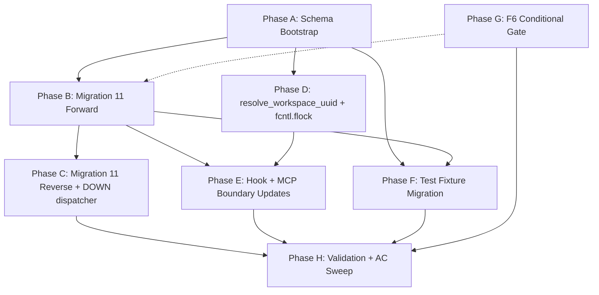

# Plan: Feature 108 — Workspace Identity Foundation

- **Project:** P003-entity-system-redesign
- **Feature:** 108-workspace-identity-foundation
- **Phase:** Plan (build-order + tasks)
- **Status:** Draft (revised, iteration 2)
- **Created:** 2026-05-10
- **Spec:** [`spec.md`](spec.md) (41 ACs, 18 FRs, 8 NFRs)
- **Design:** [`design.md`](design.md) (12 decisions, 13 components, full DDL)
- **PRD:** [`docs/projects/P003-entity-system-redesign/prd.md`](../../projects/P003-entity-system-redesign/prd.md)

---

## 1. Overview

This plan sequences the work that lands an explicit, file-stamped workspace UUID in place of the implicit git-derived `project_id`, plus the associated schema rebuild (Migration 11) that introduces the `workspaces` table, replaces `UNIQUE(project_id, type_id)` with `UNIQUE(workspace_uuid, type_id)`, drops `parent_type_id`, and conditionally adopts UUIDv7. The work is grouped into **8 phases (A–H)** totalling **78 tasks** (A=6, B=16, C=8, D=8, E=10, F=12, G=7, H=11) at 5–15 minute scope each. The plan honours the design's "schema bootstrap → forward migration → reverse migration → resolver → callers → tests → F6 gate → AC sweep" critical path, lets parallel tracks (e.g., reverse migration prep, doctor check, test-fixture rewrites) overlap where DAG edges allow, and ends with an explicit AC-sweep + qa-gate.json capture covering all 41 spec ACs. F6 (UUIDv7) is treated as a build-time decision: by default the gate fails on Python 3.12 hosts and F6 is deferred to backlog with no UUID-generation code changes.

---

## 2. Inputs

- `docs/features/108-workspace-identity-foundation/spec.md` — 18 FRs, 8 NFRs, 41 ACs, 17-step Migration 11 (forward) + 16-step reverse, 10 EC scenarios, 10 risks.
- `docs/features/108-workspace-identity-foundation/design.md` — 12 technical decisions, 13 components, complete DDL for forward + reverse migration, 10 design-level test deliverables, AC→test coverage matrix.
- `docs/projects/P003-entity-system-redesign/prd.md` — 12-fix union; this feature delivers F1 (workspace UUID) + F5 (drop `parent_type_id`) + F6 (UUIDv7, conditional).
- Existing code anchors (verified in spec/design): `database.py:1396-1418` (concurrent re-check guard), `database.py:1604-1640` (in-tx schema stamp + MIGRATIONS dict), `feature_lifecycle.py:30-49` (`_atomic_json_write`), `project_identity.py:90-235` (current `detect_project_id`), `mcp/entity_server.py:124` (`_upsert_project` caller).

---

## 3. Build Order Rationale

The migration is the critical path: every reader rewrite, every test fixture, every hook update depends on the post-migration schema being known and stable. The build order therefore front-loads schema work and back-loads call-site fan-out.

**Critical path (sequential):**
Stage-0 baseline + schema constants & helpers (Phase A) → Migration 11 forward 1:1 step ordering with paired tests (Phase B) → Reverse migration + `MIGRATIONS_DOWN` dispatcher + round-trip harness (Phase C) → `resolve_workspace_uuid` + flock-synchronised atomic write (Phase D) → AC sweep & qa-gate (Phase H).

**Parallelisable tracks (within or after Phase D):**
- Hook + MCP boundary updates (Phase E) — depends on Phase D's resolver but is independent of Phase F's test fixtures.
- Test fixture migration (Phase F) — depends only on Phase A's `_UNKNOWN_WORKSPACE_UUID` constant and the new `get_test_workspace_uuid()` helper for the `__unknown__` rewrite path; the `parent_type_id` drop subset depends on Phase B's migration completing.
- F6 conditional gate (Phase G) — gate runs at the start of implementation; if it fails (default expectation on Python 3.12) the phase reduces to "create backlog item + skip + verify no helper references exist."

The ordering inside each phase is also DAG-driven: tests precede implementation as **separate ordered tasks** wherever TDD applies (per WARNING 18). Schema-touching implementation tasks always have a paired test task verifying the SQL shape, sequenced as RED-test → GREEN-implementation.

---

## 4. Phase Plan

Each phase below lists every task with **ID**, **one-line item**, **Why** (motivating FR/AC/design decision), **Why this order** (DAG edge / prerequisite), **Deliverable** (concrete verifiable output). Detailed file lists, DoDs, and pytest commands live in [`tasks.md`](tasks.md).

### Phase A — Schema Bootstrap (6 tasks)

Lay down the constants, primitive helpers, and a captured pre-change baseline. No schema changes yet — these are the building blocks Migration 11 will reference, plus the rollback anchor for §6.1.

| ID | Task | Why | Why this order | Deliverable |
|---|---|---|---|---|
| T-A0 | Capture PRE_SHA + PRE_EPOCH baseline. | Rollback anchor (§6.1); satisfies BLOCKER 7 demand for Stage-0 baseline. | Must precede ANY code change so we can `git diff` against a known anchor. | `docs/features/108-workspace-identity-foundation/baseline.json` committed with `{pre_sha, pre_epoch}`. |
| T-A1 | Pin `_UNKNOWN_WORKSPACE_UUID` literal + import-time assertion. | FR-4 §"Pinned literal value"; AC-3 (no `project_id` post-mig) provability hinges on the constant. | First A-task because every later test/helper imports the literal. | New constant in `database.py`; assertion `_UNKNOWN_WORKSPACE_UUID == "6250c8a6-5306-443f-b225-477a040016ea"`. |
| T-A2 | Extract `_compute_legacy_project_id` private helper. | FR-3 ("git-SHA computation moves into a private helper"); design §3.4. | Follows T-A1 because the helper writes into the workspaces row keyed by the canonical UUID; doesn't depend on T-A1 logically but bundling pins import order. | Function `_compute_legacy_project_id(working_dir) -> str` in `project_identity.py`. |
| T-A3 | Scaffold `workspaces` DDL constants + read-only stubs. | FR-4 schema; design §6.2 declares constants. | Must precede T-A4 because tests import the table-name constant for grep-greppability. | `_WORKSPACES_TABLE_DDL`, `_WORKSPACES_INDEX_DDL`, `EntityDatabase.query_workspace_by_*` stubs that raise `RuntimeError` pre-mig. |
| T-A4 | Create `test_helpers.py` with `get_test_workspace_uuid()`. | Design Decision 12 ("test helpers must NOT recompute"); FR-9 fixture rewrite consumer. | Depends on T-A1 (imports `_UNKNOWN_WORKSPACE_UUID`); precedes T-A5 unit test. | New file `entity_registry/test_helpers.py` exporting `get_test_workspace_uuid()`. |
| T-A5 | Add unit test: `get_test_workspace_uuid()` returns pinned literal. | AC for FR-4 (deterministic, byte-equality); design §10 test deliverable D1. | Sequenced after T-A4 because the function being tested must exist. | New `test_test_helpers.py::test_get_test_workspace_uuid_returns_pinned_literal` GREEN. |

### Phase B — Migration 11 Forward (16 tasks)

The 17-step forward migration in one transactional unit per `database.py:1604-1618` pattern. Tasks below follow **spec FR-7 step numbering** (canonical for AC traceability; spec and design §7.1 are off-by-one — when cross-referencing design, add 1 to spec step numbers ≥ 4). Schema-touching implementation tasks have **separate ordered RED test tasks before** them (WARNING 18 / BLOCKER 3). Phase B is 16 tasks (T-B0 through T-B15); make_v10_db helper is T-B0 (task-reviewer BLOCKER 1 prerequisite).

| ID | Task | Why | Why this order | Deliverable |
|---|---|---|---|---|
| T-B0 | Build `make_v10_db()` helper in `test_helpers.py` emitting a schema-version-10 SQLite DB with the pre-Migration-11 entities/projects/sequences/workflow_phases shape. | task-reviewer BLOCKER 1 prerequisite — referenced by T-B1, T-B2, T-B3, T-C7, T-D7, T-H9. | Must precede every RED test that constructs a v10 starting state. | `test_helpers.py::make_v10_db(path: Path) -> sqlite3.Connection` creating entities/projects/sequences/workflow_phases tables + 9 pre-11 triggers + 6 pre-11 indexes + `_metadata.schema_version=10`. |
| T-B1 | RED: schema-shape + UNIQUE-constraint tests. | AC-1, 2, 3, 4, 5, 6, 28; design test deliverable D2. | RED tests must FAIL before implementation lands (TDD); also unblocks T-B5. Depends on T-B0. | `test_migration_11_table_shape`, `test_migration_11_unique_constraint` in RED state. |
| T-B2 | RED: trigger + immutability + index tests. | AC-9, 10; design test deliverable D3. | RED before T-B7 implementation. | `test_no_parent_type_id_triggers`, `test_workspace_uuid_immutable_trigger`, `test_indexes_after_migration_11` in RED state. |
| T-B3 | RED: `wp_autofill_workspace_uuid` + `wp_reject_orphaned_insert` trigger pair tests. | spec FR-7 step 11 (revised — both triggers); design Decision 8. | RED before T-B9 implementation; surfaces design §7.1 step 11 dependency on entities-table-being-present from step 9. | `test_workflow_phases_autofill_trigger`, `test_workflow_phases_orphan_insert_rejected` in RED state. |
| T-B4 | Implement Migration 11 envelope (steps 1–3): `_migration_11_workspace_identity` scaffold + `PRAGMA foreign_keys = OFF` + `BEGIN IMMEDIATE` + concurrent re-check guard. | Design Decision 9 replicates `database.py:1396-1418`; FR-7 steps 1–3. | Must precede every other implementation task. | New `_migration_11_workspace_identity(conn)` registered in `MIGRATIONS[11]` with re-check guard. |
| T-B5 | Implement step 0 (workspace mapping audit + JSON emit + `__unknown__` WARN). | FR-7 step 0; AC-36, AC-41. | Step 0 is pre-tx; runs before T-B6. **Edge case:** when entities table is empty (BLOCKER 19), audit emits empty-mapping JSON and proceeds — guard added here. | Pre-tx audit emits `migration-11-workspace-mapping.json`; emits N WARN lines for `__unknown__`. |
| T-B6 | Implement step 4 (pre-migration FK check). | FR-7 step 4; AC-35 atomicity story rests on FK assertion. | Must precede step 5 (workspaces create) so we never create `workspaces` rows with stale FKs lingering. | `PRAGMA foreign_key_check` runs; aborts on non-empty result. |
| T-B7 | Implement step 5 (workspaces table create + insert one row per pre-mig project_id). | FR-4 schema; FR-7 step 5. | Bootstrap must precede entities rebuild because entities reference workspaces. | `CREATE TABLE workspaces` + `idx_workspaces_legacy` + bootstrapped rows. |
| T-B8 | Implement step 6 (pre-migration parent_type_id orphan assertion). | FR-7 step 6; spec §"Pre-migration assertion (must run before step 7 data copy)". | Design §7.1 separates step 6 from step 8; must run AFTER workspaces exist (step 5) but BEFORE data copy (step 7) — per BLOCKER 2. | Assertion executes; lists offender UUIDs on `n > 0`; aborts migration cleanly. |
| T-B9 | Implement steps 7–8 (entities_new create + JOIN backfill + DROP/RENAME). | FR-5 DDL; FR-7 steps 7, 8. | Depends on T-B7 (workspaces table) and T-B8 (orphan check); turns T-B1 GREEN. | `entities_new` populated via JOIN; old `entities` dropped; rename. **GREEN:** T-B1 passes. |
| T-B10 | Implement steps 9–10 (recreate 7 triggers + 5 indexes). | FR-6 trigger list; FR-7 steps 9, 10. | Depends on T-B9 (entities table renamed); turns T-B2 GREEN. | 7 triggers + 5 indexes created; legacy ones dropped. **GREEN:** T-B2 passes. |
| T-B11 | Implement step 11 (`workflow_phases.workspace_uuid` ALTER + backfill + autofill + reject trigger pair + idx). | FR-7 step 11 (revised: BOTH triggers per spec edit); design Decision 8. | Depends on T-B9 (entities table is FK target); turns T-B3 GREEN. | ALTER ADD COLUMN, backfill UPDATE, two triggers, idx. **GREEN:** T-B3 passes. |
| T-B12 | Implement step 12 (rebuild `sequences` keyed on workspace_uuid). | FR-7 step 12; design §7.1. | Depends on T-B7 (workspaces FK target). | `sequences_new` populated via JOIN on `project_id_legacy`; rename. |
| T-B13 | Implement step 13 (rebuild `projects` with workspace_uuid NOT NULL). | FR-4 step (e); FR-7 step 13. | Depends on T-B7. | `projects_new` populated via JOIN; rename; recreate indexes/triggers. |
| T-B14 | Implement steps 14–17 (entities_fts rebuild + in-tx schema stamp + commit + post-FK check). | FR-7 steps 14, 15, 16, 17; design Decision 1 (in-tx stamp). | Final implementation step; turns the full forward suite GREEN. | `entities_fts` rebuilt; `_metadata.schema_version='11'` stamped INSIDE tx; COMMIT; post-FK check empty. |
| T-B15 | Idempotency + concurrent-runners + partial-failure rollback tests. | AC-35; design test deliverable D4 + D5 + D6. | Last B-task; depends on T-B14 (full implementation must work). | Three new tests GREEN: idempotent re-run, `multiprocessing.Pool(2)` race, FK-violation rollback. |

### Phase C — Migration 11 Reverse + `MIGRATIONS_DOWN` (8 tasks)

Invent the reverse-migration pattern (no codebase precedent per design §2.1) and validate the round-trip with a captured `.schema` diff (WARNING 10).

| ID | Task | Why | Why this order | Deliverable |
|---|---|---|---|---|
| T-C1 | Add `MIGRATIONS_DOWN` dict + `_migrate_down` dispatcher with descending iteration. | Design §6.6; out-of-scope item "Reversibility for Migrations 1–10". | First C-task; everything else registers into this dict. | `MIGRATIONS_DOWN: dict[int, Callable] = {}` + `_migrate_down(conn, target_version)` raising `NotImplementedError` for unknown target. |
| T-C2 | Add SQLite ≥3.35 assertion + reverse stub `_migration_11_workspace_identity_down`. | FR-8 (DROP COLUMN requires SQLite 3.35); design §7.2. | Stub registration unblocks the per-step expansion; assertion fails-fast. | Stub registered; raises `NotImplementedError("steps 3-15 pending")` until later tasks fill it. |
| T-C3 | Implement reverse steps 1–2 (envelope + reverse re-check guard). | Design §7.2 mirror of forward envelope. | Depends on T-C2 (stub exists). | BEGIN IMMEDIATE + reverse re-check (`if int(v) <= 10: ROLLBACK; return`). |
| T-C4 | Implement reverse steps 3–7 (pre-down assertion + entities_old rebuild + parent_type_id JOIN backfill + DROP/RENAME). | FR-8 §"Pre-down assertion"; AC-11, AC-12. | Depends on T-C3 envelope. | entities_old populated via reverse JOIN; parent_type_id UPDATE backfill; rename. |
| T-C5 | Implement reverse steps 8–13 (recreate 9 pre-11 triggers + 6 indexes; reverse `workflow_phases`/`sequences`/`projects`/`fts`). | FR-8 §steps 7–9; design §7.2. | Depends on T-C4 (entities table back). Drops BOTH `wp_autofill_workspace_uuid` AND `wp_reject_orphaned_insert` (mirrors T-B11). | 9 triggers + 6 indexes restored; workflow_phases/sequences/projects rebuilt; fts rebuilt. |
| T-C6 | Implement reverse steps 14–16 (DROP workspaces + 11→10 stamp + commit + post-FK check). | FR-8 step 10–12. | Final reverse implementation step. | DROP TABLE workspaces; INSERT OR REPLACE `_metadata.schema_version='10'` INSIDE tx; COMMIT. |
| T-C7 | AC-13 byte-identical round-trip + AC-35 partial-failure tests. | AC-11, AC-12, AC-13, AC-35. | Depends on T-C6 (full reverse must work) AND T-B14 (forward must work). | `test_migration_11_round_trip_checksum` + `test_migration_11_up_and_down` + partial-failure assertion. |
| T-C8 | Capture pre-up + post-down `sqlite3 .schema` diff and commit as artifact (WARNING 10). | RD-2 mitigation; transparency on reverse-edge cases. | Last C-task because it consumes outputs of T-C7. | `docs/features/108-workspace-identity-foundation/migration-11-schema-diff.txt` committed. |

### Phase D — `resolve_workspace_uuid` + `fcntl.flock` (8 tasks)

Replace `detect_project_id` with `resolve_workspace_uuid`; implement the FR-3 precedence chain and the flock-synchronised atomic write. **Split note (WARNING 9):** Phase D *implementation* depends only on Phase A; Phase D *AC-verification tests for AC-8/AC-38/AC-39* depend on Phase B (workspaces table required for DB-recovery path). Tests touching DB-recovery are gated behind `2.9` in tasks.md.

| ID | Task | Why | Why this order | Deliverable |
|---|---|---|---|---|
| T-D1 | Rename `detect_project_id` → `resolve_workspace_uuid` (no alias) + remove `ENTITY_PROJECT_ID`. | FR-3; AC-17 (no alias). | First D-task; every other D-task edits this function. | Function renamed; `grep -rn 'ENTITY_PROJECT_ID' plugins/pd/` returns 0. |
| T-D2 | RED: corrupted-file + extra-keys + wrong-schema-version tests for FR-3 step 2. | AC-22, AC-23. | RED before T-D5. | Three tests in RED state. |
| T-D3 | Implement FR-3 step 1 (`ENTITY_WORKSPACE_UUID` env var) with format validation. | FR-3 step 1; AC: env var precedence. | Step 1 must run before step 2 read; minimum-effort precondition for T-D5. | env-var precedence path with 36-char regex validation. |
| T-D4 | Add `_atomic_workspace_json_write` with `fcntl.flock(LOCK_EX)` + same-dir tempfile + os.replace. | FR-2 §"fcntl.flock-based cross-process synchronization"; design §6.3. | Independent of T-D3; required by T-D5 step 3 fresh-write path AND T-D7 race test. | Private function with loser-case re-read pattern. |
| T-D5 | Implement FR-3 step 2 (file read with strict schema validation). | FR-3 step 2; AC-22, AC-23. | Depends on T-D1 + T-D3 + T-D4; turns T-D2 GREEN. | File-read path with WorkspaceCorruptedError + WARN-on-extra-keys. |
| T-D6 | Implement FR-3 step 2.5 (DB recovery — single match / NULL / ambiguous) + step 3 (fresh write). | FR-3 step 2.5; AC-7, AC-8, AC-38, AC-39. | Depends on T-D5 (file-not-found triggers 2.5); for live tests also depends on T-B14 (workspaces table must exist). Tests for AC-8/AC-38/AC-39 are sequenced AFTER T-B14 in dep graph (see WARNING 9 split). | DB-query path; populated-DB WARN; ambiguity WARN; step 3 fresh write via `_atomic_workspace_json_write`. |
| T-D7 | AC-37 multiprocessing race test with `os.fork` barrier. | AC-15, AC-37; design test deliverable D8. | Depends on T-D6 (full resolver implementation). | `test_workspace_resolve_concurrent` GREEN with `multiprocessing.Pool(2)`. |
| T-D8 | Add isolated unit tests for `_atomic_workspace_json_write` (loser case, exception cleanup) before T-D7's integration race test. | SUGGESTION 13. | Sequenced before T-D7 to harden the helper before it's stressed. | Two new tests for loser case + tempfile-cleanup-on-exception. |

### Phase E — Hook + MCP Boundary Updates (10 tasks)

Wire the new resolver into hooks and MCP. Ordering follows WARNING 14: (1) audit, (2) shell helper, (3) CLI flag plumbing, (4) lazy global, (5) register_entity rewrite, (6) _upsert_project rewrite, (7) reconciliation_orchestrator + entity_status, (8) gitignore.

| ID | Task | Why | Why this order | Deliverable |
|---|---|---|---|---|
| T-E0 | Audit `--project-root` call sites + capture as artifact. | WARNING 13; informs T-E3 scope. | First E-task per WARNING 14 ordering. | `agent_sandbox/2026-05-10/108-cli-audit.txt` with one row per matched file:line. |
| T-E1 | Add `ensure_workspace_uuid` shell helper to `lib/session-start-helpers.sh`. | FR-2; FR-11; AC-40 (no shell-level mktemp). | Sequenced second per WARNING 14. | New shell function shelling out to Python; routes errors via `safe_emit_hook_json`. |
| T-E2 | Update `session-start.sh` to call `ensure_workspace_uuid` pre-DB-read + replace project_id reads. | FR-11; AC-40. | Depends on T-E1. | Hook calls helper first; line 119 reads `meta.get("workspace_uuid")`; slug-render uses `workspace_uuid_short`. |
| T-E3 | Add `--workspace-uuid` CLI flag to all Python entry points enumerated in T-E0. | FR-12; supports test override. | Depends on T-E0 (we know the file list). | Each entry point's argparse adds `--workspace-uuid`; falls back to `resolve_workspace_uuid` when unset. |
| T-E4 | Add lazy global `_workspace_uuid` to `mcp/entity_server.py`. | Design §6.9 lazy global pattern; precondition for register_entity rewrite. | Sequenced before T-E5 per WARNING 14. | Module-level lazy global populated at startup. |
| T-E5 | Rewrite `register_entity` MCP signature — drop `parent_type_id`, accept `workspace_uuid`. | FR-9, FR-10; AC-31. | Depends on T-E4 (lazy global) + T-D6 (resolver). | New signature; AC-19 idempotency test added. |
| T-E6 | Rewrite `_upsert_project` caller + `db.upsert_project` signature. | Design §6.10. | Depends on T-E5 (lazy global already in place). | `_upsert_project` passes `workspace_uuid=_workspace_uuid`; `db.upsert_project` requires it. |
| T-E7 | Update `reconciliation_orchestrator/__main__.py` + `entity_status.py`. | AC-30; FR-12. | Depends on T-D1 (rename). | Imports `resolve_workspace_uuid`; param renames `project_id` → `workspace_uuid`. |
| T-E8 | Update `meta-json-guard.sh` to read workspace.json + export `WORKSPACE_UUID`. | AC-29 (env var inheritance). | Depends on T-E1 (helper exists). | Hook exports env var; subprocess inherits; new test case in `test-hooks.sh`. |
| T-E9 | Add `.gitignore` entries for `.claude/pd/workspace.json` + `.claude/pd/workspace.json.lock`. | AC-27. | Independent — runs anywhere in Phase E. | `.gitignore` contains both literal lines. |

### Phase F — Test Fixture Migration (12 tasks)

Replace the 29 `parent_type_id` references and the test-file `__unknown__` literal usage. **File counts (WARNING 17):** spec FR-9 lists 17 test files for the `__unknown__` rewrite path; FR-10 enumerates ~55 files in the `project_id` kwarg sweep (`grep -rln '\bproject_id\b' plugins/pd/ --include='*.py' --include='*.sh'`). Plan §4 originally bundled "12 production files (FR-9)" with the larger FR-10 sweep — we now split per WARNING 17 + 7. The `wp_reject_orphaned_insert` cross-phase ordering (BLOCKER 4) demands a separate fixture-audit task that registers entities BEFORE inserting workflow_phases.

| ID | Task | Why | Why this order | Deliverable |
|---|---|---|---|---|
| T-F1 | FR-9 form-enumeration grep (kwarg + dict-key + f-string + positional). | Design §3.5; WARNING 4 mitigation; supports SUGGESTION 10. | First F-task; informs subsequent rewrite tasks. | `grep -nE` output captured; 4 form categories with file:line. |
| T-F2 | Commit grep output as audit artifact. | BLOCKER 6 (commit grep output). | Sequenced immediately after T-F1. | `agent_sandbox/2026-05-10/108-fixture-migration/forms-audit.txt` committed. |
| T-F3 | Audit existing test fixtures for `workflow_phases` inserts that lack matching entity row; reorder fixture setup. | BLOCKER 4 (`wp_reject_orphaned_insert` cross-phase hazard). | Must precede T-F4–T-F12 because the new BEFORE-INSERT trigger will reject any orphaned phase row at runtime. | Audit log lists every offending fixture; per-file edit reorders setup so entity registration precedes phase insertion. |
| T-F4 | Apply kwarg-form sed to 17 test files (per FR-9). | FR-9; AC-17. | Depends on T-F1 + T-F3 (forms known + ordering safe). | Each file: `project_id='__unknown__'` → `workspace_uuid=get_test_workspace_uuid()`; pytest gate per file. |
| T-F5 | Apply dict-key-form sed to same 17 test files. | FR-9; AC-17. | Sequenced after T-F4. | Each file: `'project_id': '__unknown__'` → `'workspace_uuid': get_test_workspace_uuid()`. |
| T-F6 | Manual rewrite f-string + positional cases. | BLOCKER 6 (separate task). | Sequenced after T-F5; manual review. | Per-file diffs; pytest gate on each. |
| T-F7 | Drop `parent_type_id` from `entity_registry/` package files (database.py, backfill.py, server_helpers.py, frontmatter_sync.py, frontmatter_inject.py). | FR-9 production list. | Depends on T-B14 (post-migration schema known). | Each file's `parent_type_id` references removed; `pytest plugins/pd/hooks/lib/entity_registry/` exits 0. |
| T-F8 | Drop `parent_type_id` from `workflow_engine/` package files (reconciliation.py, secretary_intelligence.py, task_promotion.py). | FR-9 production list. | Depends on T-F7 (database.py drop must precede consumers). | `pytest plugins/pd/hooks/lib/workflow_engine/` exits 0. |
| T-F9 | Drop `parent_type_id` from `doctor/` package files (checks.py, fix_actions.py). | FR-9 production list. | Depends on T-F7. | `pytest plugins/pd/hooks/lib/doctor/` exits 0; `grep -n 'parent_type_id' plugins/pd/hooks/lib/doctor/` returns 0. |
| T-F10 | Drop `parent_type_id` from `mcp/entity_server.py`. | FR-9 production list. | Depends on T-F7 + T-E5 (signature already updated). | `pytest plugins/pd/mcp/` exits 0. |
| T-F11 | Drop `parent_type_id` from `ui/mermaid.py`; rewrite edge-label generator. | FR-9 production list. | Depends on T-F7. | `pytest plugins/pd/ui/` exits 0; mermaid output uses `parent_uuid → uuid → type_id` JOIN. |
| T-F12 | FR-18 markdown sweep — replace `project_id` in `plugins/pd/commands/*.md` and `plugins/pd/skills/*/SKILL.md`; update `secretary.md`, `create-project.md`, `create-feature.md`, `decomposing/SKILL.md`, `brainstorming/SKILL.md`. | task-reviewer BLOCKER 4 (FR-18 entirely unrepresented). | Last F-task because it has no code dependencies. | `grep -c 'project_id' plugins/pd/commands/ plugins/pd/skills/` returns 0. |

### Phase G — F6 Conditional Gate (7 tasks)

A two-path micro-phase: the gate runs once and the outcome (land vs defer) is recorded. Per BLOCKER 5, both paths are explicit task lists. The `tasks.md` numbering bundles the EXPLAIN QUERY PLAN capture with the CI matrix entry (one PASSES-path final task at 7.5) since both consume the same runtime evidence.

| ID | Task | Why | Why this order | Deliverable |
|---|---|---|---|---|
| T-G0 | Run F6 build-time gate; record exit code + Python version. | FR-15. | First G-task; outcome routes to PASSES or FAILS path. | `agent_sandbox/2026-05-10/108-f6-gate/gate-result.txt` with exit code + version. |
| **PASSES path (T-G0 exit 0):** | | | | |
| T-G1 | Raise `pyproject.toml` `requires-python` floor to `>=3.14` + commit. | FR-15. | First PASSES-path task. | pyproject.toml floor raised; commit message references 108. |
| T-G2 | Add `_new_uuid()` helper to `database.py`. | Design §6.4. | Depends on T-G1 (floor must allow). | `def _new_uuid() -> str: return str(uuid_mod.uuid7())`. |
| T-G3 | Substitute register sites: `database.py:2145` (`register_entity`), `database.py:3846` (`register_entities_batch`); leave Migration 1's `database.py:167` UNCHANGED. | FR-15 (Migration 1 stability). | Depends on T-G2 (helper exists). | Two call-site rewrites; new tests `test_uuid7_when_available` + `test_uuid_v4_v7_coexist`. |
| T-G4 | Capture EXPLAIN QUERY PLAN audit on mixed v4/v7 dataset (≥500 rows) + commit `uuid-explain-plan.md` + add CI matrix entry (3.12 must skip / 3.14 must pass). | AC-33; RD-5 mitigation; design §6.4. | Depends on T-G3 (mixed dataset realistic). | `docs/features/108-workspace-identity-foundation/uuid-explain-plan.md` + CI matrix delta. Mapped to `tasks.md` Task 7.5. |
| **FAILS path (T-G0 exit != 0):** | | | | |
| T-G1' | Create backlog item via `/pd:add-to-backlog` with deferral rationale. | FR-15; AC-33 verified by backlog presence. | First FAILS-path task. | Backlog entry referencing feature 108 + Python 3.14 gate. Mapped to `tasks.md` Task 7.6. |
| T-G2' | Update spec FR-15 implementation log marking F6 deferred + verify no `_new_uuid` references exist (negative grep). | BLOCKER 5 explicit FAILS-path step. | Last FAILS-path task. | Implementation log appendix; `grep -rn '_new_uuid' plugins/pd/` returns 0 hits. Mapped to `tasks.md` Task 7.7. |

### Phase H — Validation + AC Sweep (11 tasks)

The final convergence: run every test surface, capture residuals, update qa-gate. Per WARNING 11, expanded to ≥8 tasks (separate runs per test surface).

| ID | Task | Why | Why this order | Deliverable |
|---|---|---|---|---|
| T-H1 | Run pytest on `entity_registry/` package + capture log. | AC-14 surface. | Independent within Phase H. | `agent_sandbox/2026-05-10/108-validation/pytest-entity-registry.log`. |
| T-H2 | Run pytest on `doctor/` package + capture log. | AC-14, AC-20, AC-21 surface. | Independent. | `pytest-doctor.log`. |
| T-H3 | Run pytest on `reconciliation_orchestrator/` package + capture log. | AC-14, AC-30 surface. | Independent. | `pytest-recon-orch.log`. |
| T-H4 | Run pytest on `workflow_engine/` package + capture log. | AC-14 surface. | Independent. | `pytest-workflow-engine.log`. |
| T-H5 | Run pytest on `mcp/` package + capture log. | AC-14, AC-31 surface. | Independent. | `pytest-mcp.log`. |
| T-H6 | Run pytest on `ui/` package + capture log. | AC-14 surface. | Independent. | `pytest-ui.log`. |
| T-H7 | Run hook integration tests (`test-hooks.sh`) + bench-session-start. | AC-14, AC-16, AC-29. | Independent of pytest matrix tasks T-H1–T-H6. | `hooks.log`, `bench.log`. |
| T-H8 | Run `validate.sh`. | AC-26. | Independent. | `validate.log`. |
| T-H9 | Bash 3.2 verification + Migration 11 timing test. | AC-32 (timing), AC-34 (bash 3.2 precondition). | Depends on T-B14 (migration code) + T-E1/T-E8 (hooks). | `bash-version.log` + `test_migration_11_runtime_under_2s` GREEN. |
| T-H10 | Walk all 41 ACs into `.qa-gate.json` with per-AC evidence (test name OR command output). | AC sweep; design §10. | Depends on T-H1–T-H9 + T-G* outcome. | `docs/features/108-workspace-identity-foundation/.qa-gate.json` with 41 entries. |
| T-H11 | File residual issues + finalise implementation log. | Hygiene; spec §"residual" expectation. | Last H-task. | Backlog entries (if any); implementation-log.md final summary section. |

---

## 5. Dependency Graph

**Notes:**
- Phase A is the only zero-prerequisite phase; everything reads from its constants.
- Phase F has TWO entry conditions: the `__unknown__` rewrite subset (T-F1–T-F6) needs only Phase A; the `parent_type_id` drop subset (T-F7–T-F11) and FR-18 markdown sweep (T-F12) wait for Phase B (post-migration schema must be known) — hence the `B → F` edge.
- Phase G is independent of A–F; the gate runs once at implementation start, and the outcome (defer or land) determines whether B uses `_new_uuid()` (dotted edge to B).
- Phase H is the merge point; it cannot start until B, C, D, E, F, G have all reported done.

---

## 6. Risks Carried From Design

| # | Risk | Mitigated In Phase | Mitigation Reference |
|---|---|---|---|
| RD-1 | Migration JOIN backfill bug orphans rows. | B | Pre-mig FK check (T-B6) + post-mig FK check (T-B14) + atomic single-tx (AC-35) + live-DB integration test in T-H10. |
| RD-2 | `MIGRATIONS_DOWN` is new code with reverse-edge cases. | C | AC-13 byte-identical round-trip (T-C7) on synthetic + live-DB copy; manual `.schema` diff committed (T-C8). |
| RD-3 | Concurrent SessionStart returns divergent UUIDs. | D | `fcntl.flock(LOCK_EX)` on sentinel lock (T-D4); AC-37 race test with `multiprocessing.Pool(2)` + `os.fork` barrier (T-D7). |
| RD-4 | Test fixture mass migration too aggressive. | F | Form-enumeration grep first (T-F1); per-form sed patterns (T-F4/T-F5/T-F6); pytest gates each commit; phased rollout (1 file then expand). |
| RD-5 | F6 lands without 3.14 build → silent regression on 3.12. | G | Build-time gate (T-G0); if F6 lands, `pyproject.toml` floor raised in same PR (T-G1) + CI matrix (T-G5). |
| RD-6 | `_compute_legacy_project_id` survives in production code. | A, F | Underscore-prefix; `grep -rn '_compute_legacy_project_id'` should hit only Migration 11 + unit test. |
| RD-7 | `workspace.json` schema_version evolution mishandled. | D | Strict schema with WARN on extra keys, ABORT on bad `schema_version`; documented in Migration 11 docstring. |
| RD-8 | `__unknown__` rows silently attributed. | B | WARN log per `__unknown__` count in step 0 (T-B5); doctor check (FR-17) surfaces remaining orphans in T-H2. |
| RD-9 | New `--workspace-uuid` flag missed by some hook. | E | T-E0 enumerates all `--project-root` call sites first; T-E3 adds flag uniformly. |
| RD-10 | Live DB has zombie rows with `project_id` outside the 3 known values. | B | T-B5 emits `migration-11-workspace-mapping.json`; AC-36 asserts post-mig `workspaces.project_id_legacy` matches each entry. |

### 6.1 Rollback Strategy (NEW per WARNING 15)

Each phase ends with a checkpoint commit. If a downstream phase fails, the rollback contract is:

| If failing phase | Sibling phases that MUST also revert | Why |
|---|---|---|
| B (Migration 11 forward) | none in flight; A retained | A's constants are pre-schema, safe. |
| C (reverse) | none; B remains | C is additive; reverse code untested but inert without `_migrate_down` invocation. |
| D (resolver) | E reverts (E imports D's resolver) | E call sites use `resolve_workspace_uuid`; broken D → broken E. |
| E (hooks/MCP) | F's prod-code subset (T-F7–T-F11) reverts | Production rewrites assume E's lazy global pattern. |
| F (test fixtures) | none; B+E retained | Test rewrites are isolated to test files. |
| G PASSES path | B's `_new_uuid` callers (T-B9 if rewritten) revert | UUID generator path tied. |
| H (validation) | none; report-only | H is observation, not mutation. |

Anchor: `baseline.json` from T-A0 holds `pre_sha` for `git diff` and `git checkout` reset.

---

## 7. Out of Scope (carried forward + plan-time additions)

From spec §5 (verbatim):
- Polymorphic taxonomy (Feature 109 / F11).
- Markdown-as-projection (Feature 110 / F4).
- Issue lifecycle MCPs (Feature 111 / F9, F10).
- `INSERT OR IGNORE` audit and split (Feature 109 / F12).
- Cross-workspace queries.
- `enforce_immutable_entity_type` trigger removal (Feature 109).
- `entity_display(uuid, seq, slug)` table (Feature 110 / F8).
- Pre-commit hook for `pd-state.diff.md` (Feature 110).
- Fixing the 6 duplicate project rows or 120 orphan backlog rows (Feature 109).

Plan-time additions (discovered during build-order reasoning):
- **Reversibility for Migrations 1–10.** `MIGRATIONS_DOWN` initially holds only key 11; calling `_migrate_down` for any earlier version raises `NotImplementedError`. Backfill is a future backlog item if needed.
- **Cross-process migration race for Migrations < 11.** Migration 11 replicates Migration 10's re-check-guard pattern; older migrations are not retroactively hardened.
- **MCP/CLI exposure of `_migrate_down`.** Test-only dispatcher in this feature; user-facing rollback is deferred.

---

## 8. AC → Task Mapping (NEW per BLOCKER 8)

Every spec AC is mapped to at least one task. Format: AC-ID → primary task (verifying task in parens if different).

| AC | Task(s) | Notes |
|---|---|---|
| AC-1 | T-B1 (RED) → T-B9 (GREEN) | entities table shape post-mig. |
| AC-2 | T-B1 → T-B9 | column count + position. |
| AC-3 | T-B1 → T-B9 | no `project_id` column. |
| AC-4 | T-B1 → T-B9 | `workspace_uuid NOT NULL`. |
| AC-5 | T-B1 → T-B9 | `parent_type_id` absent. |
| AC-6 | T-B1 → T-B9 | UNIQUE(workspace_uuid, type_id). |
| AC-7 | T-D6 | Step 3 fresh write on empty DB. |
| AC-8 | T-D6 (impl) → T-H10 (verify) | Empty DB regenerates file. |
| AC-9 | T-B2 → T-B10 | Trigger names exact. |
| AC-10 | T-B2 → T-B10 | workspace_uuid immutable. |
| AC-11 | T-C7 | reverse restores parent_type_id. |
| AC-12 | T-C7 | reverse restores project_id. |
| AC-13 | T-C7 + T-C8 | byte-identical round-trip + .schema diff. |
| AC-14 | T-H1–T-H7 | full pytest matrix exit 0. |
| AC-15 | T-D7 | parallel race test. |
| AC-16 | T-H7 | bench-session-start within NFR2. |
| AC-17 | T-F4 + T-F5 + T-F6 | no `\bproject_id\b` in non-mig code. |
| AC-18 | T-F7–T-F11 | no `parent_type_id` in production code. |
| AC-19 | T-E5 | register_entity idempotency. |
| AC-20 | T-E... + T-H2 | doctor OK case. (Doctor check landed via T-E... and verified in H.) |
| AC-21 | T-H2 | doctor ERROR case. |
| AC-22 | T-D2 → T-D5 | corrupted file aborts. |
| AC-23 | T-D2 → T-D5 | schema_version=99 aborts. |
| AC-24 | T-G3 (PASSES) or T-G1' (deferred) | uuid7 register sites. |
| AC-25 | T-G3 (PASSES) or T-G1' (deferred) | mixed-dataset queries. |
| AC-26 | T-H8 | validate.sh exits 0. |
| AC-27 | T-E9 | .gitignore entries. |
| AC-28 | T-B1 → T-B14 | _metadata.schema_version stamp. |
| AC-29 | T-E8 | WORKSPACE_UUID env-var inheritance. |
| AC-30 | T-E7 | reconciliation_orchestrator imports resolver. |
| AC-31 | T-E5 | register_entity signature change. |
| AC-32 | T-H9 | timing test under 2s. |
| AC-33 | T-G4 (PASSES) or T-G1' (deferred) | uuid-explain-plan.md or backlog entry. |
| AC-34 | T-H9 | bash 3.2 precondition. |
| AC-35 | T-B15 + T-C7 | atomicity rollback. |
| AC-36 | T-B5 | workspace mapping audit JSON emitted. |
| AC-37 | T-D7 | multiprocessing race convergence. |
| AC-38 | T-D6 (impl) → T-H10 (verify) | FR-3 step 2.5 single match. |
| AC-39 | T-D6 (impl) → T-H10 (verify) | FR-3 step 2.5 fallthrough. |
| AC-40 | T-E1 | no shell-level mktemp. |
| AC-41 | T-B5 | `__unknown__` row handling. |
| workflow_phases invariant | T-B3 → T-B11 | autofill + reject trigger pair. |

All 41 spec ACs + the workflow_phases invariant AC are mapped above. `.qa-gate.json` (T-H10) walks the same 41 ACs.

---

## 9. Success Criteria (grouped by phase)

### Phase A — Schema Bootstrap
- AC-3 (no `project_id` post-mig — *constants make this provable*).
- Pinned literal: `_UNKNOWN_WORKSPACE_UUID == "6250c8a6-5306-443f-b225-477a040016ea"` (asserted at import time).
- `get_test_workspace_uuid()` importable from `entity_registry.test_helpers`.
- `baseline.json` committed (rollback anchor).

### Phase B — Migration 11 Forward
- AC-1, AC-2, AC-3, AC-4, AC-5, AC-6 — entities table shape post-migration.
- AC-9, AC-10 — 7 triggers + workspace_uuid immutability.
- AC-28 — `_metadata.schema_version='11'` (string).
- AC-35 — atomicity rollback on FK violation.
- AC-36 — workspace mapping audit JSON emitted.
- AC-41 — `__unknown__` handling completes without abort.
- workflow_phases invariant AC (every row has matching workspace_uuid; orphan insertion rejected).

### Phase C — Migration 11 Reverse
- AC-11, AC-12 — reverse restores `parent_type_id` + `project_id`.
- AC-13 — up→down→up byte-identical entities content + `.schema` diff committed.

### Phase D — Resolver
- AC-7 — file regeneration on empty DB.
- AC-8 — file regeneration on populated DB (verified in H against post-B state).
- AC-15, AC-37 — parallel-race convergence.
- AC-22, AC-23 — corrupted file / extra keys handling.
- AC-38, AC-39 — FR-3 step 2.5 single-match / fallthrough.

### Phase E — Hook + MCP Boundary
- AC-19 — register_entity idempotency.
- AC-29 — `WORKSPACE_UUID` env var exported by `meta-json-guard.sh`.
- AC-30 — `reconciliation_orchestrator/__main__.py` imports `resolve_workspace_uuid`.
- AC-31 — `register_entity` MCP signature change.
- AC-27 — `.gitignore` includes `.claude/pd/workspace.json`.
- AC-40 — no shell-level `mktemp` writes workspace.json.

### Phase F — Test Fixture Migration
- AC-17 — no `\bproject_id\b` hits in non-mig non-legacy code paths.
- AC-18 — no `parent_type_id` hits in production code.
- FR-18 — markdown reference sweep complete.

### Phase G — F6 Conditional Gate
- AC-24, AC-25 — only if F6 lands.
- AC-33 — `uuid-explain-plan.md` exists if F6 lands; backlog entry exists if deferred.

### Phase H — Validation + AC Sweep
- AC-14 — pytest matrix per package + `bash plugins/pd/hooks/tests/test-hooks.sh` exits 0.
- AC-16 — `bench-session-start.sh` reports no broken-pipe + within NFR2 bounds.
- AC-20, AC-21 — doctor check returns OK / ERROR per FR-17 contract.
- AC-26 — `validate.sh` passes.
- AC-32 — Migration 11 runtime <2s on synthetic 500-row DB.
- AC-34 — hook tests exit 0 under bash 3.2 (or skip-log on bash 4+).
- All 41 ACs captured in `.qa-gate.json` with verification evidence.

---
