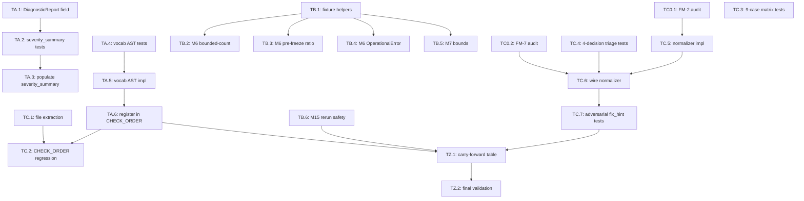

# Tasks: F116 — F115 QA-Gate Deferred Hardening

**Source plan:** `docs/features/116-f115-qa-deferred/plan.md` rev 1
**Tier 1 (code-surface):** FR-1, FR-2, FR-8, FR-9 → 9 tasks
**Tier 2 (pure test):** FR-3, FR-4, FR-5, FR-6, FR-7 → 11 tasks
**Closure tasks:** 2 tasks
**Total:** 22 tasks

---

## Theme A — Severity Rollup + Vocab AST

### TA.1: Extend `DiagnosticReport` dataclass with `severity_summary` field

**Plan item:** P-A.1 | **FR:** FR-1 | **Est:** 10 min

- [ ] Open `plugins/pd/hooks/lib/doctor/models.py`
- [ ] Add `from dataclasses import field` import if not present
- [ ] Insert `severity_summary: dict[str, int] = field(default_factory=lambda: {"error": 0, "warning": 0, "info": 0})` AFTER `warning_count: int` field
- [ ] Change `elapsed_ms: int` to `elapsed_ms: int = 0` (default-valued to satisfy field-ordering rule)
- [ ] Run `plugins/pd/.venv/bin/python -c "from doctor.models import DiagnosticReport; r = DiagnosticReport(healthy=True, checks=[], total_issues=0, error_count=0, warning_count=0); print(r.severity_summary)"` — expect `{"error": 0, "warning": 0, "info": 0}`

**Done criterion:** Smoke test above passes; existing `DiagnosticReport(...)` call sites still work (verify via `grep -rn 'DiagnosticReport(' plugins/pd/`).

---

### TA.2: Write `test_severity_summary.py` aggregation + invariant tests

**Plan item:** P-A.2 | **FR:** FR-1 | **Est:** 25 min

- [ ] Create new file `plugins/pd/hooks/lib/doctor/test_severity_summary.py`
- [ ] Write 4 tests:
  - `test_severity_summary_present_when_zero_issues`: empty `check_results` → `severity_summary == {"error": 0, "warning": 0, "info": 0}`
  - `test_severity_summary_aggregates_across_checks`: 2 mocked CheckResults with mixed severities → assert exact counts
  - `test_severity_summary_includes_skipped_check_synthetics`: invoke `_make_failed_result` and verify the synthetic error is counted
  - `test_invariant_severity_summary_matches_legacy_counters`: AC-1.4 — `report.severity_summary["error"] == report.error_count` AND `["warning"] == warning_count`
- [ ] Run: `plugins/pd/.venv/bin/python -m pytest plugins/pd/hooks/lib/doctor/test_severity_summary.py -v`

**Done criterion:** All 4 tests fail (population code not yet written) — TDD red phase.

---

### TA.3: Populate `severity_summary` in `run_diagnostics`

**Plan item:** P-A.3 | **FR:** FR-1 | **Est:** 10 min

- [ ] Open `plugins/pd/hooks/lib/doctor/__init__.py`
- [ ] Locate `DiagnosticReport(...)` construction (around line 294)
- [ ] Before constructing, compute: `sev = {"error": 0, "warning": 0, "info": 0}; [sev.update({i.severity: sev[i.severity] + 1}) for cr in check_results for i in cr.issues if i.severity in sev]` (or equivalent imperative form)
- [ ] Pass `severity_summary=sev` to the DiagnosticReport constructor
- [ ] Re-run TA.2 tests: `plugins/pd/.venv/bin/python -m pytest plugins/pd/hooks/lib/doctor/test_severity_summary.py -v`

**Done criterion:** All 4 TA.2 tests pass — TDD green phase.

---

### TA.4: Write `test_check_severity_vocab.py` tests

**Plan item:** P-A.4 | **FR:** FR-2 | **Est:** 30 min

- [ ] Create `plugins/pd/hooks/lib/doctor/test_check_severity_vocab.py`
- [ ] Write tests using temp files / monkeypatched scan target:
  - `test_check_severity_vocab_passes_on_canonical_severities`: fixture with `Issue(severity='error')`, `severity='warning'`, `severity='info'` → 0 issues emitted
  - `test_check_severity_vocab_flags_unknown_literal`: fixture with `Issue(severity='critical')` → 1 issue with severity='error', line number in message
  - `test_check_severity_vocab_skips_indirect_refs`: fixture with `Issue(severity=MY_CONST)`, `Issue(severity=get_sev())` → 0 issues (narrow visitor scope)
  - `test_check_severity_vocab_skips_positional`: fixture with `Issue("check", "warning", ...)` → 0 issues (positional severity not flagged — known limitation)
  - `test_check_severity_vocab_excludes_test_files`: fixture file path matching `test_*.py` is skipped
- [ ] Run: `plugins/pd/.venv/bin/python -m pytest plugins/pd/hooks/lib/doctor/test_check_severity_vocab.py -v`

**Done criterion:** All 5 tests fail (check not yet implemented) — TDD red phase.

---

### TA.5: Implement `check_severity_vocab.py`

**Plan item:** P-A.5 | **FR:** FR-2 | **Est:** 25 min

- [ ] Create `plugins/pd/hooks/lib/doctor/check_severity_vocab.py`
- [ ] Module docstring referencing F116 FR-2
- [ ] Imports: `ast, pathlib, re, time` plus `from doctor.models import CheckResult, Issue`
- [ ] Constants: `CLOSED_SET = {"error", "warning", "info"}`, `_TEST_FILE_RE = re.compile(r"(^|/)(test_[^/]*|[^/]*_test)\.py$")`
- [ ] Function `def check_severity_vocab(project_root: str | None = None, **_kwargs: object) -> CheckResult:`
- [ ] Resolve doctor dir: `doctor_dir = pathlib.Path(__file__).parent` (works portably)
- [ ] Iterate candidate files via `[doctor_dir / "checks.py"] + sorted(doctor_dir.glob("check_*.py"))`
- [ ] Filter test files via `_TEST_FILE_RE`
- [ ] For each file: `ast.parse(path.read_text())`, walk `Call` nodes; for each `keyword` where `kw.arg == 'severity'` AND `isinstance(kw.value, ast.Constant)` AND `isinstance(kw.value.value, str)` AND `kw.value.value not in CLOSED_SET`: emit `Issue(check="check_severity_vocab", severity="error", entity=str(path), message=f"line {kw.value.lineno}: severity={kw.value.value!r} outside closed set", fix_hint=f"change to one of {sorted(CLOSED_SET)}")`
- [ ] On `SyntaxError` from `ast.parse`: emit `Issue(severity='error', message='AST parse failed: {path}: {e}')`
- [ ] Wrap in `try/except` returning `CheckResult(name="check_severity_vocab", passed=..., issues=..., elapsed_ms=int((time.perf_counter() - t0) * 1000))`
- [ ] Run TA.4 tests: `plugins/pd/.venv/bin/python -m pytest plugins/pd/hooks/lib/doctor/test_check_severity_vocab.py -v`

**Done criterion:** All 5 TA.4 tests pass — TDD green phase.

---

### TA.6: Register `check_severity_vocab` in CHECK_ORDER

**Plan item:** P-A.6 | **FR:** FR-2 | **Est:** 5 min

- [ ] Open `plugins/pd/hooks/lib/doctor/__init__.py`
- [ ] Add import: `from .check_severity_vocab import check_severity_vocab` near the existing check imports (line ~12-35)
- [ ] Append `check_severity_vocab` to `CHECK_ORDER` list (line ~69, AFTER `check_audit_emit_failed_count`)
- [ ] Add comment: `# Feature 116 FR-2 / AC-2.x: AST audit that all doctor checks emit severity from {error, warning, info}.`
- [ ] Verify: `plugins/pd/.venv/bin/python -c "from doctor import CHECK_ORDER; print(len(CHECK_ORDER)); print(CHECK_ORDER[-1].__name__)"` — expect `20` and `check_severity_vocab`

**Done criterion:** Doctor invocation now includes the new check at position 20.

---

## Theme B — Migration Regression Coverage

### TB.1: Add fixture helpers to `semantic_memory/test_database.py`

**Plan item:** P-B.1 | **FR:** FR-3, FR-4 | **Est:** 30 min

- [ ] Open `plugins/pd/hooks/lib/semantic_memory/test_database.py`
- [ ] Add helper `_build_memory_db_at_v5(tmp_path)` per spec FR-3 (replays MIGRATIONS[1..5] against raw sqlite3.Connection, stamps schema_version='5')
- [ ] Add helper `_build_memory_db_at_v6(tmp_path)` per spec FR-3 (calls `_build_memory_db_at_v5` then manually stamps schema_version='6')
- [ ] Add helper `_seed_tool_failure_rows(db_path, count, created_at)` per spec FR-3 with full NOT NULL column set: `id, name, description, category, source, source_project, source_hash, confidence, created_at, updated_at, observation_count`. `source_hash` computed as `hashlib.sha256(description.encode()).hexdigest()[:16]`
- [ ] Add helper `_seed_inflated_import_rows(db_path, count, observation_count, created_at)` per spec FR-4 with same NOT NULL columns
- [ ] Add helper `_read_schema_version(db_path)` per spec FR-3
- [ ] Smoke test: run `_build_memory_db_at_v5(tmp_path)` + `_seed_tool_failure_rows(db, 10, '2026-05-01T00:00:00')` in a throwaway test; assert `_read_schema_version` returns "5" and 10 rows inserted via `SELECT COUNT(*) FROM entries`

**Done criterion:** Fixtures execute without IntegrityError; smoke test passes.

---

### TB.2: Implement T3b.3a (M6 bounded-count abort)

**Plan item:** P-B.2 | **FR:** FR-3 | **Est:** 15 min

- [ ] In `test_database.py`, add parametrized test `test_m6_aborts_on_bounded_count_violation` with cases `(600, "above")` and `(300, "below")`
- [ ] Body per spec FR-3 T3b.3a: build v5, seed N rows at pre-freeze `created_at`, capture pre_version, call `_migration_6_unify_source_hash_and_cleanup(conn)`, assert `pytest.raises(RuntimeError, match=r"outside \[418, 518\]|Pin H-115|Tool-failure count")`, assert schema_version unchanged
- [ ] Run: `plugins/pd/.venv/bin/python -m pytest plugins/pd/hooks/lib/semantic_memory/test_database.py::test_m6_aborts_on_bounded_count_violation -v`

**Done criterion:** Both parametrized cases pass.

---

### TB.3: Implement T3b.3b (M6 pre-freeze ratio abort)

**Plan item:** P-B.3 | **FR:** FR-3 | **Est:** 15 min

- [ ] Add test `test_m6_aborts_on_pre_freeze_ratio_violation`: build v5, seed 425 rows at `created_at='2026-05-01T00:00:00'` + 25 rows at `created_at='2026-05-17T00:00:00'`, call M6, assert `pytest.raises(RuntimeError, match=r"(identity spot.check|pre.freeze)")`, assert schema_version unchanged
- [ ] Run: `plugins/pd/.venv/bin/python -m pytest plugins/pd/hooks/lib/semantic_memory/test_database.py::test_m6_aborts_on_pre_freeze_ratio_violation -v`

**Done criterion:** Test passes; ratio 425/450 = 0.9444 < 0.95 triggers identity spot-check.

---

### TB.4: Implement T3b.3c (M6 OperationalError propagation)

**Plan item:** P-B.4 | **FR:** FR-3 | **Est:** 25 min

- [ ] Add `_MidTxFailingConnection` proxy class per spec FR-3 T3b.3c with full delegation surface
- [ ] Add test `test_m6_operational_error_propagates_uncaught`: build v5, seed 450 valid rows, wrap raw_conn in proxy, assert `pytest.raises(sqlite3.OperationalError, match="injected mid-tx failure")` when calling M6
- [ ] Defensive assertion before raise: `assert proxied._injected is False`; after raise: `assert proxied._injected is True`
- [ ] Run rollback on raw_conn after raise; assert schema_version unchanged + row count unchanged
- [ ] Run: `plugins/pd/.venv/bin/python -m pytest plugins/pd/hooks/lib/semantic_memory/test_database.py::test_m6_operational_error_propagates_uncaught -v`

**Done criterion:** Test passes; injection point fires before any successful DELETE.

---

### TB.5: Implement T3b.4 (M7 bounds violation)

**Plan item:** P-B.5 | **FR:** FR-4 | **Est:** 15 min

- [ ] Add test `test_m7_aborts_on_bounds_violation`: build v6, seed 20 rows with `observation_count=200` + `created_at='2026-05-01T00:00:00'`, call `_migration_7_reset_inflated_observation_count(conn)`, assert `pytest.raises(RuntimeError, match=r"outside \[9, 15\]|inflated count|Pin I-115")`, assert schema_version unchanged
- [ ] Run: `plugins/pd/.venv/bin/python -m pytest plugins/pd/hooks/lib/semantic_memory/test_database.py::test_m7_aborts_on_bounds_violation -v`

**Done criterion:** Test passes; 20 rows > M7's [9, 15] bound triggers abort.

---

### TB.6: Implement T1.10 (M15 re-run safety)

**Plan item:** P-B.6 | **FR:** FR-5 | **Est:** 25 min

- [ ] Open `plugins/pd/hooks/lib/entity_registry/test_database.py`
- [ ] Add fixture `_build_entities_db_at_v14(tmp_path)` per spec FR-5 (instantiate EntityDatabase, rewind schema_version, delete counter key)
- [ ] Add test `test_m15_safe_to_rerun_with_documented_reset_semantics`:
  - Open connection with `sqlite3.connect(db_path, isolation_level=None)` (autocommit) to avoid M15 BEGIN IMMEDIATE collision
  - First run: call `_migration_15_audit_emit_counter(conn)`; UPDATE counter to '7'; UPDATE schema_version to '14'
  - Close conn; open fresh autocommit conn
  - Second run: call M15 again; assert no exception
  - Read counter — assert value is "0" (INSERT-OR-REPLACE reset semantics, NOT preservation)
  - Read schema_version — assert value is "15"
- [ ] Run: `plugins/pd/.venv/bin/python -m pytest plugins/pd/hooks/lib/entity_registry/test_database.py::test_m15_safe_to_rerun_with_documented_reset_semantics -v`

**Done criterion:** Test passes; reset semantics documented + safe-to-re-run confirmed.

---

## Theme C0 — Pre-Implementation Audit Gate (BLOCKING)

### TC0.1: FM-2 grep audit (max-observed fix_hint length)

**Plan item:** P-C0.1 | **FR:** FR-9 precondition | **Est:** 5 min

- [ ] Run: `grep -rno "fix_hint=" plugins/pd/hooks/lib/doctor/ | awk -F: '{print length($0)}' | sort -n | tail -1`
- [ ] Record max-observed length in `.review-history.md` audit entry
- [ ] If observed length > 800 bytes: amend spec FR-9 `_MAX_LEN = 1024` to `_MAX_LEN = {observed_length * 2, rounded up to power of 2}` before P-C.5 implementation
- [ ] If observed length ≤ 800 bytes: proceed with `_MAX_LEN = 1024`

**Done criterion:** Decision recorded; `_MAX_LEN` value confirmed safe.

---

### TC0.2: FM-7 grep audit (`_parse_triage_choice` call sites)

**Plan item:** P-C0.2 | **FR:** FR-9 precondition | **Est:** 5 min

- [ ] Run: `grep -c "_parse_triage_choice(" plugins/pd/hooks/lib/doctor/fix_actions/__init__.py`
- [ ] Expected: 2 (definition + 1 call site at line 445)
- [ ] If count > 2: expand FR-9 integration to ALL call sites (extend P-C.6 scope)
- [ ] If count == 2: proceed with single-call-site integration

**Done criterion:** Call-site count confirmed; integration scope locked.

---

## Theme C — Cross-Workspace Coverage Completeness

### TC.1: Refactor `check_cross_workspace_parent_uuid` to standalone file

**Plan item:** P-C.1 | **FR:** FR-8 | **Est:** 15 min

- [ ] Open `plugins/pd/hooks/lib/doctor/checks.py`
- [ ] Locate `check_cross_workspace_parent_uuid` function around line 2259
- [ ] Identify imports the function depends on (read the function body + grep its references)
- [ ] Create new file `plugins/pd/hooks/lib/doctor/check_cross_workspace_parent_uuid.py`
- [ ] Module docstring referencing F116 FR-8 / F115 T2b.6
- [ ] Copy the minimum imports the function needs (likely `CheckResult, Issue` + sqlite3 + entity_registry helpers)
- [ ] Copy function body verbatim
- [ ] Delete the function (and ONLY this function) from `checks.py`
- [ ] Update `plugins/pd/hooks/lib/doctor/__init__.py:25`: change `from .checks import check_cross_workspace_parent_uuid` to `from .check_cross_workspace_parent_uuid import check_cross_workspace_parent_uuid`
- [ ] Verify imports: `plugins/pd/.venv/bin/python -c "from doctor.check_cross_workspace_parent_uuid import check_cross_workspace_parent_uuid; print('ok')"` — expect "ok"
- [ ] Run existing F115 cross-workspace tests: `plugins/pd/.venv/bin/python -m pytest plugins/pd/hooks/lib/doctor/ -v -k cross_workspace`

**Done criterion:** All existing tests pass; new file exists; function deleted from checks.py.

---

### TC.2: Add CHECK_ORDER preservation regression test

**Plan item:** P-C.2 | **FR:** FR-8 | **Est:** 10 min

- [ ] Open `plugins/pd/hooks/lib/doctor/test_doctor.py` (create if absent)
- [ ] Add test `test_check_order_preserved_post_f116`: assert `[c.__name__ for c in CHECK_ORDER]` equals the canonical 20-name list (per spec FR-8 expected_names)
- [ ] Add assertion: `"check_cross_workspace_parent_uuid" in _ENTITY_DB_CHECKS`
- [ ] Add assertion: `"check_audit_emit_failed_count" in _ENTITY_DB_CHECKS`
- [ ] Run: `plugins/pd/.venv/bin/python -m pytest plugins/pd/hooks/lib/doctor/test_doctor.py::test_check_order_preserved_post_f116 -v`

**Done criterion:** Test passes.

---

### TC.3: Write 9-case cross-workspace matrix tests

**Plan item:** P-C.3 | **FR:** FR-6 | **Est:** 40 min

- [ ] Create new file `plugins/pd/hooks/lib/entity_registry/test_cross_workspace_matrix.py`
- [ ] Define session-scoped `entity_db` fixture: yields `EntityDatabase` instance with 3 workspaces (A, B, C) and seeded entities (1 feature + 1 backlog per workspace). Reset between cases via SAVEPOINT
- [ ] Define `_cross_ws_pair_fixture(db)`, `_same_ws_pair_fixture(db)`, `_allowlisted_pair_fixture(db)` per spec FR-6 — each returns dict-shape `{parent:{type_id, uuid}, child:{type_id, uuid}}`
- [ ] `_allowlisted_pair_fixture` inserts allowlist row: prefer public `EntityDatabase` method if present; else direct `db._conn.execute("INSERT INTO cross_workspace_allowlist ...")` with test-only comment
- [ ] Define HANDLERS list per spec FR-6 (3 lambdas: set_parent uses type_id; add_dependency/add_okr_alignment use uuid)
- [ ] Write parametrized test `test_t2b_5_cross_workspace_gate_matrix` (3 handlers × 3 ACs = 9 cases)
- [ ] Run: `plugins/pd/.venv/bin/python -m pytest plugins/pd/hooks/lib/entity_registry/test_cross_workspace_matrix.py -v`

**Done criterion:** All 9 parametrized cases pass.

---

### TC.4: Write 4-decision triage tests + negative cases

**Plan item:** P-C.4 | **FR:** FR-7 | **Est:** 30 min

- [ ] Create new file `plugins/pd/hooks/lib/doctor/test_fix_actions.py`
- [ ] Define `entities_db_session` fixture (sqlite3.Connection)
- [ ] Define `_make_fix_ctx(entities_conn)` helper per spec FR-7 (FixContext with 8 placeholder fields)
- [ ] Define `_seed_cross_workspace_pair(conn)` helper returning real seeded UUIDs
- [ ] Define `TRIAGE_CASES` list + 4 assertion helpers per spec FR-7
- [ ] Write parametrized test `test_t2a_7_triage_branch`
- [ ] Write `test_t2a_7_grandfather_without_reason_uses_fallback`
- [ ] Write `test_t2a_7_unknown_choice_raises_value_error`
- [ ] Run: `plugins/pd/.venv/bin/python -m pytest plugins/pd/hooks/lib/doctor/test_fix_actions.py -v -k triage`

**Done criterion:** All 6 triage tests pass (4 branches + 1 fallback + 1 negative).

---

### TC.7a: Write FR-9 adversarial tests FIRST (TDD red phase)

**Plan item:** P-C.7a | **FR:** FR-9 | **Est:** 20 min

- [ ] In `test_fix_actions.py`, add parametrized test `test_fr9_adversarial_fix_hint_rejected` with all cases per spec FR-9 (nul, cyrillic, shell-meta-uuid, $/backtick in reason, semicolon-& in reason, parens in reason, over-length, unknown-segment)
- [ ] Each case asserts `pytest.raises(ValueError, match=error_fragment)` calling `_normalize_and_validate_fix_hint(bad_hint)` directly (NOT via `_fix_triage_cross_workspace_link`)
- [ ] Run: `plugins/pd/.venv/bin/python -m pytest plugins/pd/hooks/lib/doctor/test_fix_actions.py -v -k adversarial`

**Done criterion:** All adversarial tests FAIL with `ImportError` or `NameError` for `_normalize_and_validate_fix_hint` — TDD red phase confirms helper not yet implemented.

---

### TC.5: Implement `_normalize_and_validate_fix_hint` helper

**Plan item:** P-C.5 | **FR:** FR-9 | **Est:** 25 min

- [ ] Open `plugins/pd/hooks/lib/doctor/fix_actions/__init__.py`
- [ ] Add helper function near `_parse_triage_choice` (line ~395, BEFORE it)
- [ ] Implementation per spec FR-9: NFC-normalize, length check (using `_MAX_LEN` from TC0.1 audit), segment split, per-segment grammar validation (uuid-like regex, choice allowlist, reason denylist `[\x00-\x1f;&()`$\\]`)
- [ ] Raises ValueError with descriptive message per segment-class
- [ ] Add module-level constants: `_UUID_LIKE`, `_CHOICE_LIKE`, `_REASON_DENY`, `_MAX_LEN`

**Done criterion:** Helper compiles; smoke test `_normalize_and_validate_fix_hint("triage_cross_workspace_links:abc:def|choice:grandfather|reason:test")` returns the input unchanged. Re-run TC.7a tests — **all adversarial cases now pass (TDD green phase).**

---

### TC.6: Wire normalizer into `_fix_triage_cross_workspace_link`

**Plan item:** P-C.6 | **FR:** FR-9 | **Est:** 5 min

- [ ] In `fix_actions/__init__.py`, locate `_fix_triage_cross_workspace_link` line 445: `choice_info = _parse_triage_choice(issue.fix_hint)`
- [ ] Replace with:
  ```python
  normalized_hint = _normalize_and_validate_fix_hint(issue.fix_hint)
  choice_info = _parse_triage_choice(normalized_hint)
  ```
- [ ] Re-run TC.4 triage tests to verify no regression: `plugins/pd/.venv/bin/python -m pytest plugins/pd/hooks/lib/doctor/test_fix_actions.py -v -k triage`
- [ ] Verify the legitimate reason strings used in TC.4 (`"operator approved cross-org link"`, `"operator-grandfathered (no reason supplied)"`) satisfy the new denylist `[\x00-\x1f;&()`$\\]` — note the fallback string contains `(` and `)` which **will be rejected**! Reason: `"operator-grandfathered (no reason supplied)"` is generated by `_fix_triage_cross_workspace_link` itself (fix_actions/__init__.py:491) as the fallback when no `reason:` field is provided. It is INSERTED into the allowlist table, not parsed back through the normalizer. The normalizer only validates INPUT `fix_hint` strings — operator-supplied input, never the fallback string. Confirm: trace control flow — fallback path is triggered when `reason:` segment is ABSENT from the input fix_hint; the fallback string is then used as the SQL parameter, never re-normalized.

**Done criterion:** All TC.4 tests still pass with normalizer in the path. Fallback string flow confirmed via code inspection.

---

### TC.7b: Write AC-9.3 happy-path regression test

**Plan item:** P-C.7b | **FR:** FR-9 | **Est:** 5 min

- [ ] In `test_fix_actions.py`, add `test_fr9_legitimate_grandfather_with_reason_preserves_behavior` per spec AC-9.3:
  - Seed cross-workspace pair via `_seed_cross_workspace_pair`
  - Construct fix_hint = `f"triage_cross_workspace_links:{parent_uuid}:{child_uuid}|choice:grandfather|reason:operator approved cross-org link"`
  - Invoke `_fix_triage_cross_workspace_link(ctx, Issue(..., fix_hint=fix_hint))`
  - Assert: allowlist row inserted with `reason='operator approved cross-org link'`
- [ ] Run: `plugins/pd/.venv/bin/python -m pytest plugins/pd/hooks/lib/doctor/test_fix_actions.py::test_fr9_legitimate_grandfather_with_reason_preserves_behavior -v`

**Done criterion:** Happy-path test passes — the legitimate reason string (which contains spaces + lowercase letters) is accepted by the normalizer's segment-aware grammar.

---

## Closure

### TZ.1: Append F116 carry-forward resolution table to F115's qa-override.md

**Plan item:** P-Z.1 | **FR:** spec §10 | **Est:** 5 min

- [ ] Open `docs/features/115-pd-data-model-followups/qa-override.md`
- [ ] Append the F116 resolution table from spec §10 with commit SHAs filled in (8 rows, one per qa-override item)
- [ ] Commit on F116 branch

**Done criterion:** Table appended; all 8 items show resolution commits.

---

### TZ.2: Final validation

**Plan item:** P-Z.2 | **FR:** AC-Validate, AC-Regress | **Est:** 10 min

- [ ] Run `./validate.sh` — assert 0 errors, ≤5 warnings
- [ ] Run full pytest: `plugins/pd/.venv/bin/python -m pytest plugins/pd/ -q --tb=short`
- [ ] Verify no F115 tests regressed (compare failure list against pre-F116 baseline)

**Done criterion:** Both checks pass; AC-Validate + AC-Regress satisfied.

---

## Dependency Graph (Mermaid)



## Parallel Execution Groups

- **Group P1:** TA.1, TA.4, TB.1, TB.6, TC0.1, TC0.2 (independent starts)
- **Group P2:** TA.2 (after TA.1), TA.5 (after TA.4), TB.2/TB.3/TB.4/TB.5 (after TB.1)
- **Group P3:** TA.3 (after TA.2), TA.6 (after TA.5)
- **Group P4:** TC.1 (after TC0.1+TC0.2), TC.3 (independent), TC.4 (independent), TC.7a (after TC.4 + TC0.1 — TDD red phase)
- **Group P5:** TC.2 (after TC.1 + TA.6), TC.5 (after TC.7a — TDD green phase)
- **Group P6:** TC.6 (after TC.5 + TC.4)
- **Group P7:** TC.7b (after TC.6)
- **Group P8:** TZ.1, TZ.2 (after all themes)
