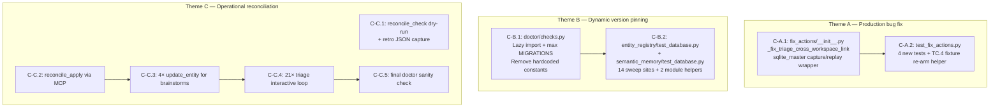
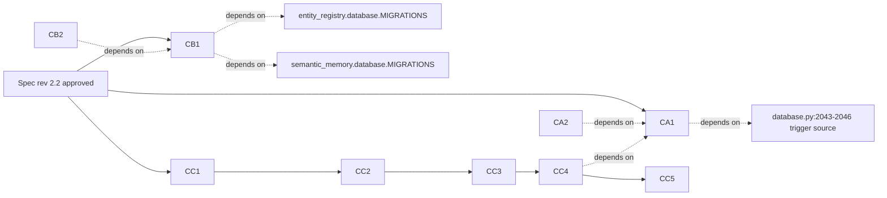

# Design: F117 — pd Post-F116 Production Hygiene

## Status

- Created: 2026-05-18
- Branch: `feature/117-post-f116-hygiene`
- Mode: standard (YOLO autonomous)
- Spec: `docs/features/117-post-f116-hygiene/spec.md` (rev 2.2 approved)
- PRD: `docs/features/117-post-f116-hygiene/prd.md`

## Prior Art Research

*Research compressed per F114/F115/F116 compress-iterations strategy — prior art for all 3 themes is already pinned + empirically verified in the specify phase.*

### F117-relevant prior art

| Pattern | Source | F117 application |
|---------|--------|------------------|
| Trigger drop/recreate via inline hardcoded SQL | `entity_registry/database.py:7956-7975` (`claim_unknown_entities`) | F117 strengthens to sqlite_master capture/replay (FR-A.1). |
| Canonical trigger SQL definition | `entity_registry/database.py:2043-2046` | F117 captures this SQL at runtime via `sqlite_master`. |
| Sqlite3 connection context manager rollback (DML only in legacy autocommit mode) | Python 3.6+ stdlib (bpo-27334 — commit-failure rollback semantics) | F117 uses `with ctx.entities_conn:` for DML rollback of the UPDATE; `finally` block separately restores trigger DDL. See TD-A.1 for two-layer atomicity explanation. |
| Dynamic schema version via `max(MIGRATIONS.keys())` | F115 retro KB candidate #6 | F117 lands this in doctor checks (FR-B.1) + 14 test sweep sites (FR-B.2a). |
| F115 cross-workspace triage UX | F115 design rev 2 C13/C14 | F117 reuses operator-interactive flow for FR-C.4. |
| F116 fixture polarity inversion (TC.4 dropped trigger) | F116 retro production-gap appendix | F117 inverts polarity: fixture re-arms trigger between seed + fix-call (FR-A.5). |
| reconcile_apply MCP tool | workflow-engine MCP server | F117 uses for FR-C.2 state flush. |
| `update_entity` MCP for status transitions | entity-registry MCP server | F117 uses for FR-C.3 brainstorm transitions. |

### Knowledge bank entries injected by complete_phase

- **Cross-Phase Spec Patch in Lieu of Backward-Travel** — applied: any one-line spec defects discovered during design get inline-patched and logged, no backward-travel.
- **Pseudocode-Depth Design for Infrastructure Modules** — applied: this design includes function signatures, execution order, error handling for C-A.1 (FR-A.1 is critical infrastructure).
- **Prior-art research as first step of design prevents pattern duplication** — addressed above.
- **Design Handoff Pre-Flight Checklist** — applied at end of this document.

## Architecture Overview

F117 has **two code-surface deltas** (C-A.1, C-B.1) and **two test-surface deltas** (C-B.2, C-A.2) plus **operational invocations** (C-C.*). The architecture is intentionally minimal — no new modules, no new MCP tools, no new exception classes (per NFR-6).

### Component map



**Sequencing:** Theme A precedes Theme C (because C-C.4's triage tool depends on C-A.1's fix). Theme B is independent and may run in parallel with Theme A. Theme C is operational-only and runs last.

### Technical decisions

**TD-A.1 — Two-layer atomicity: `finally` for DDL restore + `with conn:` for DML rollback** *(Chosen: composite pattern)*

CPython's default sqlite3 module (`LEGACY_TRANSACTION_CONTROL` autocommit mode) only opens implicit transactions for DML statements (INSERT/UPDATE/DELETE/REPLACE) via textual prefix match. **DDL (DROP, CREATE) executes in autocommit and commits immediately.** Concretely for our sequence:

1. `with ctx.entities_conn:` opens (no implicit tx yet — no DML executed).
2. `conn.execute("DROP TRIGGER ...")` — DDL → autocommit → DROP committed immediately. `with conn:` does NOT cover this.
3. `try:` block → `conn.execute("UPDATE ...")` — DML → sqlite3 opens implicit tx → UPDATE staged but not yet committed.
4a. If UPDATE succeeds: `try` exits → `finally` re-issues `captured_sql` (DDL, autocommits the recreate) → `with conn:` clean exit commits the UPDATE's implicit tx.
4b. If UPDATE fails: `try` raises → `finally` re-issues `captured_sql` (DDL, autocommits the recreate) → `with conn:` __exit__ sees exception → rollback of the UPDATE's implicit tx (workspace_uuid unchanged).

**Net behavior, both paths:** trigger present + correct, workspace_uuid correctly updated or correctly preserved.

**Load-bearing roles:**
- `finally` is the **sole restoration mechanism** for the trigger DDL. NOT defense-in-depth — it is the only path that re-creates the trigger after DROP, regardless of UPDATE success.
- `with conn:` is the rollback mechanism for the UPDATE's DML transaction only. It protects the row value, not the trigger.

Three candidate atomicity mechanisms were considered:

| Option | Pros | Cons | Decision |
|--------|------|------|----------|
| (a) Bare DROP/UPDATE/recreate without atomicity wrapper | Minimal LOC | If recreate fails after successful UPDATE, partial state: workspace_uuid updated but trigger missing | REJECTED — UPDATE-failure path leaves workspace_uuid mutated without rollback |
| (b) Explicit `BEGIN IMMEDIATE` / `COMMIT` / `ROLLBACK` with `isolation_level=None` | Wraps DDL + DML in a single explicit transaction → true atomicity across DROP+UPDATE+CREATE | Requires temporarily mutating connection-level `isolation_level`; conflicts with existing F116 helper expectations; more LOC | REJECTED — overkill for single-call site; existing connection state shared with other call paths |
| (c) `with ctx.entities_conn:` + `try/finally` composite (CHOSEN) | Idiomatic; `finally` reliably restores trigger; `with conn:` rolls back UPDATE on failure; minimal LOC; works with existing connection state | DDL not transactionally bundled with DML — relies on `finally` for restoration, not on `with conn:` | **CHOSEN** |

**Honest framing:** Option (c) achieves the spec invariants (trigger always restored, workspace_uuid always rolled back on UPDATE failure) via two complementary mechanisms with different scopes. The `finally` is not optional — it is the trigger-restoration path. If `finally` is removed, a UPDATE failure would leave the entities table without the immutability trigger active, a worse state than the original production bug.

**TD-A.2 — Trigger SQL source: `sqlite_master` capture vs inline literal** *(Chosen: `sqlite_master`)*

The reference function `claim_unknown_entities:7956-7975` uses an inline `CREATE TRIGGER IF NOT EXISTS` with hardcoded SQL. F117 strengthens this by capturing the live trigger SQL from `sqlite_master` at call time. Rationale (mirroring PRD rev 2.1 framing):

- Hardcoded literal: silently diverges if `database.py:2043-2046` is ever edited (e.g., message change, new trigger body, additional column constraint).
- Capture/replay: guarantees byte-identity to whatever the DB actually has, regardless of source-code drift.

**Trade-off accepted:** capture/replay assumes the trigger exists at call time. FR-A.6's `RuntimeError` guard explicitly handles trigger-absent state. This is safer than silently degrading to a bare UPDATE.

**TD-B.1 — Lazy import in doctor check function bodies** *(Chosen: function-body import)*

`doctor/checks.py` imports `entity_registry.database` and `semantic_memory.database` lazily inside `_get_expected_entity_version()` / `_get_expected_memory_version()` rather than at module-load time.

Rationale (defensive — no empirically observed cycle today): doctor checks run very early in session start, and `entity_registry.database` has heavy initialization (FTS5 setup, trigger DDL constants, ~17 migration registrations). Module-load coupling between `doctor.checks` and `entity_registry.database` would tighten the import graph in both directions. Lazy import scopes the cost to actual check execution and forecloses on any future circular-import risk if doctor's API surface ever expands (e.g., if `entity_registry.database` ever needs to call AST validators from `doctor` for trigger/migration checks). The pattern is purely preventive; no cycle is observed today.

**TD-B.2 — Test helper placement: module-level functions in test_database.py** *(Chosen)*

Helpers `_latest_entity_version()` / `_latest_memory_version()` live at the top of their respective test_database.py files (one per test file). Considered alternatives:

| Option | Pros | Cons | Decision |
|--------|------|------|----------|
| Conftest.py shared fixture | Reusable across test files | Adds indirection; pytest fixture would need session-scope for performance | REJECTED — overkill for 6+8 sites in two files |
| Module-level function (one per test file) | Minimal indirection; clear ownership | Slight duplication (~3 LOC each) | **CHOSEN** |
| Inline `max(MIGRATIONS.keys())` at each call site | No helper at all | 14× repetition; future migration adds noise | REJECTED |

**TD-A.3 — Test trigger re-arm: inline CREATE TRIGGER vs helper function** *(Chosen: helper function `_recreate_workspace_uuid_trigger`)*

Per FR-A.5, the F116 TC.4 fixture flow becomes: drop-trigger (seed phase) → INSERTs (seed phase) → re-arm-trigger (new step) → invoke fix. The re-arm step is added 4× across TC.4's existing tests (4 test functions use `_seed_cross_workspace_pair`). A helper function `_recreate_workspace_uuid_trigger(conn)` centralizes the canonical SQL literal:

```python
_CANONICAL_TRIGGER_SQL = """
    CREATE TRIGGER enforce_immutable_workspace_uuid
    BEFORE UPDATE OF workspace_uuid ON entities
    BEGIN SELECT RAISE(ABORT,
        'workspace_uuid is immutable — use re-attribution API'
    ); END
"""

def _recreate_workspace_uuid_trigger(conn: sqlite3.Connection) -> None:
    """Re-arm the trigger that _seed_cross_workspace_pair dropped.

    Mirrors entity_registry/database.py:2043-2046 byte-identical.
    If database.py's trigger SQL changes, update this literal to match.
    """
    conn.execute(_CANONICAL_TRIGGER_SQL)
```

The canonicality coupling is intentional per FR-A.5 (forces test/source sync).

### Risks

**R-1 (HIGH) — Production trigger SQL drift undetected by tests**

If `database.py:2043-2046`'s `CREATE TRIGGER enforce_immutable_workspace_uuid` body changes (e.g., new error message) but `_CANONICAL_TRIGGER_SQL` in test_fix_actions.py is not updated, the TC.4 fixture's re-arm step would create a different trigger than production has. The `sqlite_master` capture in `_fix_triage_cross_workspace_link` would then capture the TEST's version, not production's.

**Mitigation:** Add a sanity check test `test_canonical_trigger_sql_matches_production_source` with the following precise extraction strategy (no `inspect.getsource` — the trigger SQL is inside `_migration_11_workspace_identity` function body, verified at `database.py:1772`, and inspecting that function captures the entire 250+ line migration. Substring scan is simpler):

```python
def test_canonical_trigger_sql_matches_production_source():
    """R-1 mitigation: prevent silent trigger SQL drift between
    database.py source and test_fix_actions.py _CANONICAL_TRIGGER_SQL.

    Approach: substring-scan database.py source for the
    CREATE TRIGGER enforce_immutable_workspace_uuid ... END block;
    normalize whitespace (collapse runs of \\s+ → single space, strip);
    compare against same-normalized form of _CANONICAL_TRIGGER_SQL.
    """
    import re
    from pathlib import Path

    db_source = (
        Path(__file__).parent.parent / "entity_registry" / "database.py"
    ).read_text(encoding="utf-8")

    # Find the migration-11 instance (line ~2043). Other instances exist
    # at lines 7637 (claim_unknown_entities) and 7739 — those use a
    # different inline literal form (string concatenation, no leading
    # newline). We pin to the migration-11 multi-line form which is
    # the canonical source for `sqlite_master` storage.
    pattern = re.compile(
        r"CREATE TRIGGER enforce_immutable_workspace_uuid\s+"
        r"BEFORE UPDATE OF workspace_uuid ON entities\s+"
        r"BEGIN SELECT RAISE\(ABORT,\s*"
        r"'workspace_uuid is immutable — use re-attribution API'\s*"
        r"\); END",
        re.MULTILINE | re.DOTALL,
    )
    match = pattern.search(db_source)
    assert match is not None, (
        "Migration-11 CREATE TRIGGER enforce_immutable_workspace_uuid "
        "not found in database.py — has the canonical source moved?"
    )

    def _normalize(s: str) -> str:
        return re.sub(r"\s+", " ", s).strip()

    assert _normalize(match.group(0)) == _normalize(_CANONICAL_TRIGGER_SQL), (
        "Canonical trigger SQL in test_fix_actions.py drifted from "
        "production source at database.py. Re-sync _CANONICAL_TRIGGER_SQL "
        "to match the CREATE TRIGGER block in _migration_11_workspace_identity."
    )
```

**Load-bearing characters:** The em-dash ('—', U+2014) at position ~57 of the error message is byte-significant — both `_CANONICAL_TRIGGER_SQL` in test_fix_actions.py and the regex above MUST use the U+2014 character, NOT an ASCII hyphen `-` (U+002D) or two hyphens `--`. The test will fail if an editor silently converts the em-dash on save.

**Containing function for trigger SQL:** `_migration_11_workspace_identity` (module-level function at `database.py:1772`). Trigger creation block at lines 2042-2046 inside that function's body.

This mitigation shifts F117's coupling brittleness into a fast-failing test.

**R-2 (MED) — sqlite3 connection context-manager assumption wrong on PyPy / non-CPython**

The `with conn:` rollback semantics are Python stdlib documented but PyPy's sqlite3 module may diverge. Project uses CPython per `pyproject.toml`, so risk is theoretical.

**Mitigation:** Document the CPython assumption in FR-A.1's implementation note. No test added — non-CPython is out of scope.

**R-3 (MED) — FK enforcement not enabled in project's connection wrapper**

FR-A.4's primary failure-injection relies on `PRAGMA foreign_keys=ON`. If `_make_fix_ctx` test helper or production connection wrapper has FK off by default, the FK violation injection won't fire. The spec calls this out as a design-time verification step.

**Mitigation:** Design-time check: run a quick `pragma_foreign_keys` query against a test fixture before writing the test; if OFF, prepend `conn.execute("PRAGMA foreign_keys=ON")` to the test fixture explicitly. Document the chosen path in the test docstring.

**R-4 (LOW) — Theme C reconcile_apply produces unexpected writes**

3 sessions of accumulated drift means the reconcile output could include surprising entries.

**Mitigation:** FR-C.1 mandates dry-run via `reconcile_check` first; output captured to `reconcile-dry-run.json` for review before apply.

**R-5 (LOW) — Theme C operator unavailability defers FR-C.4**

Triage requires 21 interactive decisions. If operator pauses, F117 lands without FR-C.4.

**Mitigation:** AC-C.5 has conditional reduction targets (≥280 if completed, ≥259 if deferred). Deferral documented in retro.

## Components

### C-A.1: `fix_actions/__init__.py` — `_fix_triage_cross_workspace_link` re-attribute wrapper

**File:** `plugins/pd/hooks/lib/doctor/fix_actions/__init__.py`
**Function:** `_fix_triage_cross_workspace_link(ctx, issue) -> str` (lines 488-561)

**Delta:** Replace the bare `UPDATE entities SET workspace_uuid = ? WHERE uuid = ?` statements in the `re-attribute parent` (lines 532-535) and `re-attribute child` (lines 538-541) branches with the sqlite_master capture/replay wrapper.

**Pseudocode (preserving function-level structure):**

```python
def _fix_triage_cross_workspace_link(ctx: FixContext, issue: Issue) -> str:
    # ... (existing preamble unchanged: lines 488-529 — validation,
    #      normalize, parse choice, query parent_ws / child_ws) ...

    if choice == "re-attribute parent":
        _execute_re_attribute_with_trigger_dance(
            ctx.entities_conn, parent_uuid, child_ws
        )
        action = f"re-attributed parent {parent_uuid} → workspace {child_ws}"
    elif choice == "re-attribute child":
        _execute_re_attribute_with_trigger_dance(
            ctx.entities_conn, child_uuid, parent_ws
        )
        action = f"re-attributed child {child_uuid} → workspace {parent_ws}"
    elif choice == "delete relation":
        # ... existing (lines 543-548) — no change ...
    elif choice == "grandfather":
        # ... existing (lines 549-556) — no change ...
    else:
        raise ValueError(f"Unknown triage choice: {choice!r}")

    ctx.entities_conn.commit()  # preserved at line 560 — applies to non-re-attribute branches
    return action


def _execute_re_attribute_with_trigger_dance(
    conn: sqlite3.Connection,
    target_entity_uuid: str,
    target_workspace_uuid: str,
) -> None:
    """F117 FR-A.1: drop+recreate enforce_immutable_workspace_uuid trigger
    around an UPDATE entities SET workspace_uuid = ? statement.

    Uses sqlite_master capture/replay to guarantee byte-identity against
    the live trigger definition. Two-layer atomicity (TD-A.1):
      - `finally` is the SOLE restoration path for the trigger DDL
        (DROP/CREATE autocommit immediately in CPython legacy mode).
      - `with conn:` rolls back the UPDATE's implicit DML transaction
        on exception, preserving workspace_uuid.
    Both layers are load-bearing — neither is optional.
    """
    trigger_sql_row = conn.execute(
        "SELECT sql FROM sqlite_master "
        "WHERE name='enforce_immutable_workspace_uuid'"
    ).fetchone()
    if trigger_sql_row is None or not trigger_sql_row[0]:
        raise RuntimeError(
            "F117 FR-A.1: enforce_immutable_workspace_uuid trigger not "
            "found in sqlite_master; cannot safely drop/recreate. "
            "Aborting re-attribute."
        )
    captured_sql = trigger_sql_row[0]

    with conn:
        conn.execute("DROP TRIGGER IF EXISTS enforce_immutable_workspace_uuid")
        try:
            conn.execute(
                "UPDATE entities SET workspace_uuid = ? WHERE uuid = ?",
                (target_workspace_uuid, target_entity_uuid),
            )
        finally:
            conn.execute(captured_sql)
```

**Notes:**
- The new helper function `_execute_re_attribute_with_trigger_dance` is module-private (leading underscore).
- The existing `ctx.entities_conn.commit()` at line 560 is preserved — it covers the `delete relation` and `grandfather` branches. The re-attribute branches now have their commits handled by the `with conn:` block in the helper.
- **Dual-commit benignness:** For re-attribute branches, the helper's `with conn:` commits the UPDATE before returning, then the trailing `ctx.entities_conn.commit()` at line 560 fires again. SQLite's `.commit()` on a connection with no open transaction is a documented no-op (silently returns), so this dual-commit pattern is benign. Implementer MAY optionally guard with `if choice not in ("re-attribute parent", "re-attribute child"): ctx.entities_conn.commit()` for cosmetic clarity, but not required.
- Verification: `git diff` on `_fix_triage_cross_workspace_link` should show: two bare UPDATE blocks replaced with calls to `_execute_re_attribute_with_trigger_dance` (action message construction preserved), plus the new helper function appended to the module. Exact line counts intentionally unspecified — implementer's diff shape may vary; structural change is the binding constraint.

### C-A.2: `test_fix_actions.py` — Theme A regression tests + TC.4 fixture re-arm

**File:** `plugins/pd/hooks/lib/doctor/test_fix_actions.py`

**Additions:**

1. **Module-level constant + helper** (top of file):
   ```python
   _CANONICAL_TRIGGER_SQL = """
       CREATE TRIGGER enforce_immutable_workspace_uuid
       BEFORE UPDATE OF workspace_uuid ON entities
       BEGIN SELECT RAISE(ABORT,
           'workspace_uuid is immutable — use re-attribution API'
       ); END
   """

   def _recreate_workspace_uuid_trigger(conn: sqlite3.Connection) -> None:
       conn.execute(_CANONICAL_TRIGGER_SQL)
   ```

2. **F116 TC.4 fixture re-arm call sites** (4 existing `_seed_cross_workspace_pair` sites — verified test names from grep 2026-05-18):
   Add `_recreate_workspace_uuid_trigger(entities_db_session)` immediately after `_seed_cross_workspace_pair(entities_db_session)` in each of:
   - `test_t2a_7_triage_branch` (parametrized — line 195; covers all 4 TRIAGE_CASES including re-attribute parent/child + delete relation + grandfather. Single re-arm call suffices across all parameter values since pytest re-runs the test function body per parameter.)
   - `test_t2a_7_triage_grandfather_without_reason_uses_fallback` (line 215)
   - `test_t2a_7_triage_unknown_choice_raises_value_error` (line 242)
   - `test_fr9_legitimate_grandfather_with_reason_preserves_behavior` (line 297)

   **Re-arm is harmless for non-re-attribute branches:** The `enforce_immutable_workspace_uuid` trigger is scoped to `BEFORE UPDATE OF workspace_uuid` only (verified at `database.py:2044`). The `delete relation` branch (`UPDATE entities SET parent_uuid = NULL`) and `grandfather` branch (`INSERT INTO cross_workspace_allowlist`) do not match the trigger's WHEN clause and are unaffected by trigger presence. Re-arming uniformly across all 4 sites is intentionally simple (no conditional logic in test fixture).

3. **New test 1: `test_re_attribute_against_trigger_active_db`** (FR-A.3)
   - Setup: seed cross-workspace pair, re-arm trigger.
   - Action: invoke `_fix_triage_cross_workspace_link` with `choice="re-attribute parent"`.
   - Assertions:
     - parent's workspace_uuid changed to child's workspace_uuid.
     - `SELECT sql FROM sqlite_master WHERE name='enforce_immutable_workspace_uuid'` post-call equals pre-call byte-identical.
     - Subsequent bare `UPDATE entities SET workspace_uuid = ? WHERE uuid = ?` against a non-target entity raises `sqlite3.IntegrityError` whose message contains substring `"workspace_uuid is immutable"`.
   - Repeat for `choice="re-attribute child"`.

4. **New test 2: `test_re_attribute_restores_trigger_on_update_failure`** (FR-A.4)
   - Setup: seed cross-workspace pair, re-arm trigger.
   - **Chosen failure-injection mechanism: SQL-prefix-matching execute wrapper** (preferred over both FK and naive monkey-patch — both alternatives are brittle as documented below):
     ```python
     class _FailingUpdateConn:
         """Proxy that wraps a sqlite3.Connection and raises on the
         UPDATE entities SET workspace_uuid statement specifically.
         Other statements (SELECT, DROP, CREATE) pass through untouched.

         NOTE on Python data model: __enter__/__exit__ MUST be defined
         on the class (not delegated via __getattr__). Special-method
         lookup in CPython uses type(obj).__enter__, bypassing instance
         __getattr__ entirely (see Python docs §3.3.10 "Special method
         lookup"). Without explicit __enter__/__exit__, the `with conn:`
         inside _execute_re_attribute_with_trigger_dance would raise
         AttributeError before the UPDATE ever fires.
         """
         def __init__(self, real_conn):
             self._real = real_conn
         def execute(self, sql, params=()):
             if sql.lstrip().upper().startswith("UPDATE ENTITIES SET WORKSPACE_UUID"):
                 raise sqlite3.OperationalError("simulated UPDATE failure (F117 FR-A.4)")
             return self._real.execute(sql, params)
         def commit(self):
             return self._real.commit()
         def __enter__(self):
             # Delegate to real connection so `with conn:` opens an
             # implicit transaction on _real (not on the proxy itself).
             return self._real.__enter__()
         def __exit__(self, exc_type, exc_val, exc_tb):
             # Delegate __exit__ so commit/rollback fires on _real
             # per the real sqlite3.Connection's context-manager semantics.
             return self._real.__exit__(exc_type, exc_val, exc_tb)
         # __getattr__ delegates other attributes (fetchone, etc.) —
         # NOT used for special-method lookup.
         def __getattr__(self, name):
             return getattr(self._real, name)

     ctx = _make_fix_ctx(entities_db_session)
     ctx.entities_conn = _FailingUpdateConn(ctx.entities_conn)
     ```
   - Why this mechanism: the production function executes `entities_conn.execute()` 4 times: (a) SELECT child_ws/parent_ws preamble (line 520-525), (b) `SELECT sql FROM sqlite_master` (FR-A.1), (c) `DROP TRIGGER` (FR-A.1), (d) `UPDATE entities SET workspace_uuid` (FR-A.1). A call-counter monkey-patch ("raise on 4th call") is fragile against reordering. A prefix-matching wrapper is robust to call-order changes and targets the specific statement under test. The proxy preserves real semantics for other statements (preamble SELECT continues; trigger SELECT/DROP/CREATE pass through to real connection).
   - Why FK injection rejected: the production function reads `child_ws`/`parent_ws` from the entities table (line 528) before invoking `_execute_re_attribute_with_trigger_dance`. The test cannot inject a fake workspace_uuid into the function's input — the workspace values are pulled from `entities.workspace_uuid` which were INSERTed at seed time. Inserting an entity whose `workspace_uuid` does not exist in `workspaces.uuid` requires PRAGMA foreign_keys=OFF during seed (defeating the test). The proxy approach sidesteps this.
   - Action: invoke `_fix_triage_cross_workspace_link` with `choice="re-attribute parent"`; `pytest.raises(sqlite3.OperationalError, match="simulated UPDATE failure")`.
   - Assertions inside `pytest.raises`:
     - `SELECT sql FROM sqlite_master WHERE name='enforce_immutable_workspace_uuid'` post-exception equals pre-call SELECT result byte-identical (`finally` re-issued captured_sql).
     - Original parent workspace_uuid unchanged on the underlying `entities_db_session` connection — verified via direct `entities_db_session.execute("SELECT workspace_uuid FROM entities WHERE uuid=?", (parent_uuid,)).fetchone()[0]` — should equal the seed-time value (proves `with conn:` rolled back the UPDATE's implicit tx).

5. **New test 3: `test_re_attribute_aborts_when_trigger_absent`** (FR-A.6)
   - Setup: seed cross-workspace pair, DO NOT re-arm trigger (trigger remains dropped from seed).
   - Action: invoke `_fix_triage_cross_workspace_link` with `choice="re-attribute parent"`.
   - Assertions:
     - `pytest.raises(RuntimeError, match="enforce_immutable_workspace_uuid trigger not found")`.
     - parent's workspace_uuid unchanged (function aborted before UPDATE).

6. **New test 4: `test_canonical_trigger_sql_matches_production_source`** (R-1 mitigation)
   - Setup: import `entity_registry.database` source.
   - Action: extract the `CREATE TRIGGER enforce_immutable_workspace_uuid` block from the source string.
   - Assertion: normalized (whitespace-collapsed) source block equals normalized `_CANONICAL_TRIGGER_SQL` constant.

### C-B.1: `doctor/checks.py` — Dynamic version constants

**File:** `plugins/pd/hooks/lib/doctor/checks.py`

**Delta:**

1. **Remove** module-level constants:
   ```python
   # DELETED (lines 14-15):
   # ENTITY_SCHEMA_VERSION = 11
   # MEMORY_SCHEMA_VERSION = 4
   ```

2. **Add** lazy-import helpers (anywhere in the module — recommended near the top after imports):
   ```python
   def _get_expected_entity_version() -> int:
       from entity_registry.database import MIGRATIONS as ENTITY_MIGRATIONS
       return max(ENTITY_MIGRATIONS.keys())

   def _get_expected_memory_version() -> int:
       from semantic_memory.database import MIGRATIONS as MEMORY_MIGRATIONS
       return max(MEMORY_MIGRATIONS.keys())
   ```

3. **Update** `db_readiness` check body to call `_get_expected_entity_version()` wherever `ENTITY_SCHEMA_VERSION` was referenced.

4. **Update** `memory_health` check body to call `_get_expected_memory_version()` wherever `MEMORY_SCHEMA_VERSION` was referenced.

5. **Verification post-edit:**
   - `grep -n 'ENTITY_SCHEMA_VERSION\|MEMORY_SCHEMA_VERSION' plugins/pd/hooks/lib/doctor/checks.py` returns 0 matches.
   - `python -c "from doctor.checks import _get_expected_entity_version, _get_expected_memory_version; print(_get_expected_entity_version(), _get_expected_memory_version())"` prints `17 7`.

### C-B.2: Test sweep (entity_registry + semantic_memory)

**Files:**
- `plugins/pd/hooks/lib/entity_registry/test_database.py`
- `plugins/pd/hooks/lib/semantic_memory/test_database.py`

**Delta (entity_registry — 6 sites):**

1. **Add** module-level helper near top of `test_database.py` (after imports):
   ```python
   def _latest_entity_version() -> int:
       from entity_registry.database import MIGRATIONS
       return max(MIGRATIONS.keys())
   ```

2. **Replace** at lines 370, 678, 2688, 2890, 3081:
   ```python
   # Before:
   assert db.get_metadata("schema_version") == "17"
   # After:
   assert db.get_metadata("schema_version") == str(_latest_entity_version())
   ```

3. **Replace** at line 4673:
   ```python
   # Before:
   assert db.get_schema_version() == 17
   # After:
   assert db.get_schema_version() == _latest_entity_version()
   ```

**Delta (semantic_memory — 8 sites):**

1. **Add** module-level helper near top of `test_database.py`:
   ```python
   def _latest_memory_version() -> int:
       from semantic_memory.database import MIGRATIONS
       return max(MIGRATIONS.keys())
   ```

2. **Replace** at lines 91, 116, 123, 127, 191, 1266, 1306, 1310:
   ```python
   # Before:
   assert dbN.get_schema_version() == 7
   # After:
   assert dbN.get_schema_version() == _latest_memory_version()
   ```

**Verification post-sweep (FR-B.2c regex):**
```bash
grep -nE 'get_metadata\("schema_version"\)\s*==\s*"\d+"|get_schema_version\(\)\s*==\s*\d+' \
    plugins/pd/hooks/lib/entity_registry/test_database.py
# Expected: 0 matches (all 6 sites converted)

grep -nE 'get_schema_version\(\)\s*==\s*\d+' \
    plugins/pd/hooks/lib/semantic_memory/test_database.py
# Expected: 0 matches (all 8 sites converted)
```

**Verification of preserved migration-safety pins:**
```bash
grep -nE '_latest_entity_version|_latest_memory_version' \
    plugins/pd/hooks/lib/entity_registry/test_migration_13_safety.py \
    plugins/pd/hooks/lib/entity_registry/test_migration_14_safety.py \
    plugins/pd/hooks/lib/entity_registry/test_migration_safety.py
# Expected: 0 matches (helpers NOT introduced into migration-safety files)

grep -nE '"5"' plugins/pd/hooks/lib/semantic_memory/test_database.py | grep '2857:'
# Expected: 1 match (line 2857 remains hardcoded)
```

### C-C.1 to C-C.5: Operational reconciliation (Theme C)

These are not code changes — they are MCP tool invocations recorded in `retro.md` and `reconcile-dry-run.json`.

**C-C.1: `reconcile_check` dry-run**
- Call: `reconcile_check()` via workflow-engine MCP.
- Output: capture full JSON response to `docs/features/117-post-f116-hygiene/reconcile-dry-run.json`.
- Review: visual diff against `.meta.json` source-of-truth for each affected feature.

**C-C.2: `reconcile_apply`**
- Call: `reconcile_apply()` via workflow-engine MCP.
- Capture: post-apply doctor count for `feature_status` + `workflow_phase` warnings.

**C-C.3: Brainstorm status transitions**
- 4 sequential `update_entity` MCP calls:
  - `update_entity(type_id="brainstorm:20260516-210137-pd-followups", status="promoted")`
  - `update_entity(type_id="brainstorm:20260516-184258-pd-data-model-hardening", status="promoted")`
  - `update_entity(type_id="brainstorm:20260517-053927-f115-qa-deferred", status="promoted")`
  - `update_entity(type_id="brainstorm:20260327-050000-phase-transition-summary", status="promoted")`
- Verification: post-call SQL query returns 0 active brainstorms.

**C-C.4: Interactive cross-workspace link triage**
- 21 invocations of `_fix_triage_cross_workspace_link` via `pd doctor --fix` harness.
- Per-link: operator selects one of `re-attribute parent | re-attribute child | delete relation | grandfather`.
- YOLO break per PRD's YOLO Mode Exceptions.

**Deferral semantics (mirrors AC-C.5 conditional):**
- **Trigger:** If the implement-phase operator pauses or is unavailable mid-loop (after 0 to 20 links processed), the implementer may invoke the deferral path.
- **Decision authority:** The user (operator) explicitly signals deferral via interactive choice or absence-of-response. Implementer does NOT defer autonomously — partial completion without explicit operator deferral is treated as "in-progress" and the implement phase awaits operator return.
- **Deferral artifact:** `retro.md` MUST include a "Deferred triage links" section listing the unprocessed `(parent_uuid, child_uuid)` pairs as a markdown table. Format:
  ```
  ## Deferred Triage Links (FR-C.4 partial)
  | Parent UUID | Child UUID | Doctor severity |
  |-------------|------------|-----------------|
  | <uuid> | <uuid> | warning |
  ...
  ```
- **Reduction accounting:** Per AC-C.5, deferred case uses ≥ 259 reduction target (= 280 − 21). Partial-processing (e.g., 7 of 21 processed) is treated as "deferred for the remaining 14" — the 7 reduce the warning count proportionally, but the AC-C.5 branch chosen is "deferred" unless ALL 21 processed.
- **Follow-up:** Deferred case schedules a follow-up issue (or backlog entry) for re-invocation in a future session. Implementer adds a TODO marker to `retro.md` Tune section.

**C-C.5: Final doctor sanity check**
- Run `python -m doctor` JSON output.
- Verify: 0 errors, `severity_summary` present, reduction ≥ 280 (or ≥ 259 if C-C.4 deferred).
- Capture to retro.

## Interfaces

### Interface IF-117-1: `_execute_re_attribute_with_trigger_dance`

**Signature:**
```python
def _execute_re_attribute_with_trigger_dance(
    conn: sqlite3.Connection,
    target_entity_uuid: str,
    target_workspace_uuid: str,
) -> None
```

**Inputs:**
- `conn`: open sqlite3.Connection to entities DB. Caller is responsible for connection lifecycle.
- `target_entity_uuid`: UUID of the entity whose `workspace_uuid` will be mutated.
- `target_workspace_uuid`: new workspace_uuid value. MUST reference an existing row in `workspaces.uuid` (FK constraint applies if foreign_keys pragma is ON).

**Outputs:**
- None on success.
- Raises `RuntimeError` if trigger not found in `sqlite_master` (FR-A.6).
- Re-raises any `sqlite3.IntegrityError` / `sqlite3.OperationalError` from the UPDATE (transparent error propagation per FR-A.4).

**Side effects:**
- On success: target entity's `workspace_uuid` updated; trigger remains active.
- On failure (within `with conn:`): connection rollback discards DROP TRIGGER + any partial UPDATE; `finally` block re-issues captured trigger SQL as defense-in-depth.

**Concurrency:**
- Not safe for concurrent writers on the same row — relies on connection-level transactions, not row-level locks. (Existing F116 invariant; F117 inherits.)

**Visibility:** Module-private (`_`-prefix). Called only from `_fix_triage_cross_workspace_link`. Not exported.

### Interface IF-117-2: `_get_expected_entity_version` / `_get_expected_memory_version`

**Signature:**
```python
def _get_expected_entity_version() -> int
def _get_expected_memory_version() -> int
```

**Inputs:** None.

**Outputs:** `int` — the latest migration version number from the respective MIGRATIONS dict.

**Side effects:** Triggers lazy module import of `entity_registry.database` / `semantic_memory.database` on first call.

**Visibility:** Module-private. Called only from `db_readiness` and `memory_health` check bodies.

### Interface IF-117-3: `_latest_entity_version` / `_latest_memory_version` (test helpers)

**Signature:**
```python
def _latest_entity_version() -> int  # in entity_registry/test_database.py
def _latest_memory_version() -> int  # in semantic_memory/test_database.py
```

**Inputs:** None.

**Outputs:** `int` — same as production helpers (IF-117-2), but defined per-file in test modules.

**Visibility:** Module-private to each test file.

### Interface IF-117-4: `_recreate_workspace_uuid_trigger` (test helper)

**Signature:**
```python
def _recreate_workspace_uuid_trigger(conn: sqlite3.Connection) -> None
```

**Inputs:** `conn` — sqlite3.Connection with `enforce_immutable_workspace_uuid` trigger absent.

**Outputs:** None.

**Side effects:** Executes canonical CREATE TRIGGER SQL byte-identical to `entity_registry/database.py:2043-2046`.

**Visibility:** Module-private to `test_fix_actions.py`.

## Test Strategy

### Theme A (4 new tests + 4 fixture additions)

| Test | File | Coverage |
|------|------|----------|
| `test_re_attribute_against_trigger_active_db` | `test_fix_actions.py` | FR-A.3 (golden path with trigger active) |
| `test_re_attribute_restores_trigger_on_update_failure` | `test_fix_actions.py` | FR-A.4 (mid-UPDATE rollback + restore) |
| `test_re_attribute_aborts_when_trigger_absent` | `test_fix_actions.py` | FR-A.6 (RuntimeError guard) |
| `test_canonical_trigger_sql_matches_production_source` | `test_fix_actions.py` | R-1 mitigation (trigger SQL drift detector) |
| F116 TC.4 fixtures (4 existing tests) | `test_fix_actions.py` | FR-A.5 (re-arm helper called between seed + fix) |

### Theme B (no new tests, 14 mechanical replacements)

The sweep is mechanical — same assertion semantics, just dynamic versioning. Existing test coverage validates the change indirectly.

Verification:
- `pytest plugins/pd/hooks/lib/entity_registry/test_database.py` → 0 new failures.
- `pytest plugins/pd/hooks/lib/semantic_memory/test_database.py` → 0 new failures.
- `pytest plugins/pd/hooks/lib/doctor/` → 0 new failures.

### Theme C (operational, not pytest)

| Step | Verification method |
|------|---------------------|
| C-C.1 | `test -f reconcile-dry-run.json && jq . reconcile-dry-run.json` |
| C-C.2 | Pre/post doctor JSON diff: `feature_status + workflow_phase` count reduced ≥ 261 |
| C-C.3 | `sqlite3 ~/.claude/pd/entities/entities.db "SELECT COUNT(*) FROM entities WHERE kind='brainstorm' AND status='active'"` returns 0 |
| C-C.4 | Pre/post doctor `cross_workspace_parent_uuid` count: post == allowlist_size (or unchanged if deferred) |
| C-C.5 | Total reduction ≥ 280 (completed) or ≥ 259 (deferred) per AC-C.5 |

## Dependency Graph



## Acceptance Criteria — Design-level

All spec-level AC-A.*, AC-B.*, AC-C.*, AC-D.* are inherited unchanged.

Design-specific:
- **AC-D-A.1** All FRs (FR-A.* + FR-B.* + FR-C.*) map to a named component delta (C-A.1, C-A.2, C-B.1, C-B.2, C-C.1 through C-C.5).
- **AC-D-A.2** All technical decisions (TD-A.1, TD-A.2, TD-B.1, TD-B.2, TD-A.3) have rejected alternatives documented.
- **AC-D-A.3** All risks (R-1 through R-5) have explicit mitigations.

## Review History

### Design-Reviewer Iteration 1 (2026-05-18)

**Result:** Needs Revision. 2 blockers + 5 warnings + 2 suggestions.

| # | Severity | Issue | Resolution (rev 2) |
|---|----------|-------|-------------------|
| 1 | blocker | TD-A.1 claimed `with conn:` rollback covers DDL — but CPython legacy mode autocommits DDL; `with conn:` rolls back DML only. The `finally` is the SOLE trigger-restoration mechanism, not defense-in-depth. | Rewrote TD-A.1 with two-layer atomicity explanation (DDL autocommit + DML implicit-tx-rollback). Updated Prior Art row 3 + inline docstring comment in C-A.1 pseudocode. Honest framing: `finally` is load-bearing, `with conn:` protects workspace_uuid row value only. |
| 2 | blocker | C-A.2 listed 4 fabricated test names (`test_fix_triage_re_attribute_parent`, etc.) — actual tests use `test_t2a_7_*` parametrized naming. | Replaced with verified names from grep: `test_t2a_7_triage_branch` (parametrized 4-way at line 195), `test_t2a_7_triage_grandfather_without_reason_uses_fallback` (215), `test_t2a_7_triage_unknown_choice_raises_value_error` (242), `test_fr9_legitimate_grandfather_with_reason_preserves_behavior` (297). |
| 3 | warning | FR-A.4 monkey-patch "raise on second call" would fire on preamble SELECT, not UPDATE. | Replaced with `_FailingUpdateConn` proxy that selectively raises on `UPDATE entities SET workspace_uuid` prefix match. Robust to call-order changes. FK injection rejected with rationale. |
| 4 | warning | R-1 mitigation under-specified (`inspect.getsource(EntityDatabase._create_triggers)` — no such method exists). | Replaced with regex substring-scan of `database.py` source. Pinned containing function as `_migration_11_workspace_identity` (line 1772). Em-dash (U+2014) flagged as load-bearing character. |
| 5 | warning | Trigger-scope rationale ("re-arming harmless for delete_relation") unstated. | Added explicit reference to `database.py:2044` showing trigger is scoped to `BEFORE UPDATE OF workspace_uuid` only; other branches don't match the WHEN clause. |
| 6 | warning | TD-B.1 circular-import framing presented as observed risk; actually speculative. | Reframed as "defensive — no empirically observed cycle today" with motivation (preventive against future API expansion). |
| 7 | warning | C-C.4 deferral semantics thin compared to spec. | Added "Deferral semantics" section to C-C.4: trigger, decision authority, deferral artifact format (retro.md markdown table), reduction accounting per AC-C.5 conditional, follow-up scheduling. |
| 8 | suggestion | Dual-commit pattern (helper's `with conn:` + line 560 commit) unexplained. | Added "Dual-commit benignness" Note: sqlite3 commit on no-open-tx is documented no-op. Optional guard documented but not required. |
| 9 | suggestion | LOC counts in C-A.1 verification load-bearing? | Replaced with structural description; "exact line counts intentionally unspecified". |

**Rev 2 summary:** Both blockers (DDL/DML semantics + fabricated test names) resolved with honest framing and verified names. 5 warnings resolved with concrete mechanisms (proxy class for failure injection, regex scan for trigger SQL drift detection, conditional deferral artifacts). 2 suggestions absorbed.

### Design-Reviewer Iteration 2 (2026-05-18)

**Result:** Needs Revision. 1 NEW blocker introduced by rev 2 fix.

**Findings:**

| # | Severity | Issue | Resolution (rev 2.1) |
|---|----------|-------|-------------------|
| 1 | blocker | `_FailingUpdateConn` proxy class missing `__enter__`/`__exit__`. Python's `with conn:` uses type-level dunder lookup (datamodel.html §3.3.10) which bypasses `__getattr__`. Without explicit `__enter__`/`__exit__`, the proxy raises `AttributeError` before reaching the UPDATE — defeating the test. | Added explicit `__enter__` and `__exit__` methods delegating to `self._real.__enter__()` / `self._real.__exit__(...)`. Added inline docstring NOTE explaining the special-method-lookup gotcha. |

**Rev 2.1 summary:** Single targeted fix to the proxy class. Empirically verified all 9 iter-1 findings remained resolved per iter-2 reviewer's verification table (8 of 9 cleanly, with the proxy class adjustment closing the 9th).

## Open Questions

*None — all resolved in spec phase or via this design.*

## Design Handoff Pre-Flight Checklist

(Per "Design Handoff Pre-Flight Checklist" KB heuristic.)

- [x] Test strategy section exists (Theme A: 4 tests, Theme B: mechanical, Theme C: operational verification).
- [x] All TD alternatives documented (TD-A.1, TD-A.2, TD-B.1, TD-B.2, TD-A.3 each enumerate rejected alternatives).
- [x] Dependency sets enumerated per component (component map + dependency graph).
- [x] Merge/conflict semantics specified (TD-A.1: connection-level rollback semantics).
- [x] Test scenarios in TDs promoted to ACs or tasks (TD-A.3 → `_recreate_workspace_uuid_trigger` helper task; R-1 mitigation → `test_canonical_trigger_sql_matches_production_source` task).

## Implementation Phase Coordination Notes

Tasks in plan phase will follow TDD ordering anchored to:

1. **TA.1**: Write `test_re_attribute_against_trigger_active_db` (red) before any fix_actions/__init__.py changes — verify production bug reproduces.
2. **TA.2**: Add `_recreate_workspace_uuid_trigger` helper + `_CANONICAL_TRIGGER_SQL` constant to test_fix_actions.py.
3. **TA.3**: Add `_execute_re_attribute_with_trigger_dance` helper + replace bare UPDATEs in `_fix_triage_cross_workspace_link` (green for TA.1).
4. **TA.4**: Write `test_re_attribute_restores_trigger_on_update_failure` + `test_re_attribute_aborts_when_trigger_absent` + `test_canonical_trigger_sql_matches_production_source` (additional green).
5. **TA.5**: Add re-arm calls to 4 existing TC.4 tests (FR-A.5 fixture flow); verify all pass.
6. **TB.1**: Add `_get_expected_*_version` helpers to checks.py + remove `ENTITY_SCHEMA_VERSION` / `MEMORY_SCHEMA_VERSION` constants.
7. **TB.2**: Update `db_readiness` + `memory_health` check bodies to call helpers.
8. **TB.3**: Add `_latest_entity_version` helper to entity_registry/test_database.py + sweep 6 sites.
9. **TB.4**: Add `_latest_memory_version` helper to semantic_memory/test_database.py + sweep 8 sites.
10. **TB.5**: Run full pytest + `./validate.sh`; verify 0 regressions.
11. **TC.1**: `reconcile_check` dry-run + capture JSON.
12. **TC.2**: `reconcile_apply` + verify post-apply doctor count.
13. **TC.3**: 4 `update_entity` calls.
14. **TC.4**: 21-link interactive triage (YOLO break).
15. **TC.5**: Final doctor sanity check + retro entry.
