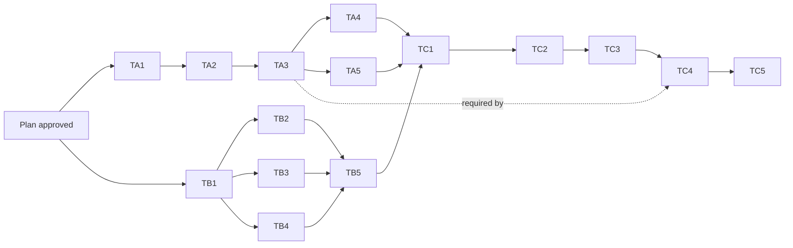

# Plan: F117 — pd Post-F116 Production Hygiene

## Status

- Created: 2026-05-18
- Branch: `feature/117-post-f116-hygiene`
- Mode: standard (YOLO autonomous)
- Design: `docs/features/117-post-f116-hygiene/design.md` (rev 2.1 approved — 4 reviewer iterations)
- Spec: `docs/features/117-post-f116-hygiene/spec.md` (rev 2.2)

## Authoritative Ordering

Per phase-reviewer suggestion at design phase: **the design's 15-step TDD ordering (TA.1 through TC.5) is canonical.** Spec's 13-step Implementation Phase Coordination Notes were a less-granular split of the same work. Tasks below mirror the design's 15-step sequence.

## Execution Roadmap

### Phase A — Theme A (Production trigger drop/recreate fix)

**Goal:** Fix the production bug at `fix_actions/__init__.py:488-561` where re-attribute branches issue bare UPDATEs against the `enforce_immutable_workspace_uuid` trigger.

**TDD ordering (rev 2 — TA.1/TA.2 swapped so helper exists before red test can use it):**

| Step | Action | Verifies | Why this order |
|------|--------|----------|----------------|
| TA.1 | Add `_CANONICAL_TRIGGER_SQL` + `_recreate_workspace_uuid_trigger` test-helper scaffolding | C-A.2 fixture-arm scaffolding | Helper needed by TA.2's red test fixture before TA.2 can be authored. Test-file only — no production code. |
| TA.2 | Write `test_re_attribute_against_trigger_active_db` (TDD red) using helper from TA.1 | FR-A.3 — production bug reproduces | Red test must precede the production fix (TA.3) to validate the bug is reproduced. |
| TA.3 | Add `_execute_re_attribute_with_trigger_dance` helper + replace bare UPDATEs (TDD green for TA.2) | FR-A.1, FR-A.2, C-A.1 | Apply the fix; TA.2 now passes. R-2 docstring note embedded here per design TD-A.1 (CPython sqlite3 legacy autocommit assumption). |
| TA.4 | Write FR-A.4, FR-A.6, R-1 tests (additional green — these test LANDED safety code) | FR-A.4 (proxy injection) + FR-A.6 (RuntimeError) + R-1 (canonical SQL drift) | These test new safety code that doesn't exist pre-fix; cannot be red-first. May run in parallel with TA.5. |
| TA.5 | Add re-arm calls to 4 existing TC.4 sites | FR-A.5 (TC.4 compatibility) | Independent of TA.4 (different file regions). May run in parallel with TA.4. |

**Acceptance gate (Phase A complete):**
- `pytest plugins/pd/hooks/lib/doctor/test_fix_actions.py` — all tests pass (existing F116 TC.4 + 4 new F117 tests).
- `grep -cE '^def _execute_re_attribute_with_trigger_dance' plugins/pd/hooks/lib/doctor/fix_actions/__init__.py` → 1 (definition).
- `grep -cE '_execute_re_attribute_with_trigger_dance\(' plugins/pd/hooks/lib/doctor/fix_actions/__init__.py` → 3 (1 def line with paren + 2 call sites: parent + child branches).

### Phase B — Theme B (Dynamic doctor version + 14-site test sweep)

**Goal:** Eliminate the 2 stale-version doctor "errors" + mechanical sweep of 14 hardcoded test sites. F115 retro KB candidate #6 finally lands.

**TDD ordering:**

| Step | Action | Verifies | Why this order |
|------|--------|----------|----------------|
| TB.1 | Add `_get_expected_entity_version` + `_get_expected_memory_version` helpers to `checks.py`; remove hardcoded constants | FR-B.1, C-B.1 | Constants must exist before TB.2 can use them; deletion of hardcoded versions can run together. |
| TB.2 | Update `db_readiness` + `memory_health` check bodies to call helpers | FR-B.1 | Sequential dependency on TB.1's helper definitions. |
| TB.3 | Add `_latest_entity_version` helper + sweep 6 entity_registry sites | FR-B.2a (entity portion), FR-B.2c regex verification | Independent of TB.4 (different file). May run in parallel with TB.4 and with TB.2. |
| TB.4 | Add `_latest_memory_version` helper + sweep 8 semantic_memory sites | FR-B.2a (memory portion) | Independent of TB.3 (different file). May run in parallel with TB.3 and with TB.2. |
| TB.5 | Full pytest + `./validate.sh` — 0 regressions | FR-B.5, NFR-2 | Must run after TB.2/TB.3/TB.4 all land (regression gate). |

**Acceptance gate (Phase B complete):**
- `grep -n 'ENTITY_SCHEMA_VERSION\|MEMORY_SCHEMA_VERSION' plugins/pd/hooks/lib/doctor/checks.py` → 0 matches.
- `grep -nE 'get_metadata\("schema_version"\)\s*==\s*"\d+"|get_schema_version\(\)\s*==\s*\d+' plugins/pd/hooks/lib/entity_registry/test_database.py` → 0 matches (all 6 converted).
- `grep -nE 'get_schema_version\(\)\s*==\s*\d+' plugins/pd/hooks/lib/semantic_memory/test_database.py` → 0 matches (all 8 converted).
- `grep -nE '_latest_entity_version|_latest_memory_version' plugins/pd/hooks/lib/entity_registry/test_migration_*.py` → 0 matches (FR-B.2b pins preserved).
- `python -m doctor` → 0 errors (down from 2 stale-version errors).
- `pytest plugins/pd/hooks/lib/{entity_registry,semantic_memory,doctor}/` → 0 new failures.

### Phase C — Theme C (Operational reconciliation)

**Goal:** Flush 261 doctor warnings via reconcile + transition 4 brainstorms + triage 21 cross-workspace links.

**Sequencing (strict — TC.4 depends on Phase A completion):**

| Step | Action | Verifies | Why this order |
|------|--------|----------|----------------|
| TC.1 | `reconcile_check` dry-run; capture JSON | FR-C.1, C-C.1 | Dry-run before destructive apply (R-4 mitigation). |
| TC.2 | `reconcile_apply`; verify warning reduction | FR-C.2, AC-C.2 | Apply after dry-run validates safety. |
| TC.3 | 4 `update_entity` calls for brainstorm transitions | FR-C.3, AC-C.3 | After reconcile cleans phase state; brainstorm transitions are independent of reconcile output. |
| TC.4 | 21-link interactive triage (operator YOLO break) — DEPENDS ON TA.3 | FR-C.4, AC-C.4 | After TC.3 (operator-cognitive-load: mechanical first, interactive last). Triage tool requires Theme A fix landed. |
| TC.5 | Final doctor sanity check + retro entry | FR-C.5, AC-C.5 | Last step — captures final reduction count for AC-C.5 conditional. |

**Acceptance gate (Phase C complete):**
- `docs/features/117-post-f116-hygiene/reconcile-dry-run.json` exists + valid JSON.
- `sqlite3 ~/.claude/pd/entities/entities.db "SELECT COUNT(*) FROM entities WHERE kind='brainstorm' AND status='active'"` → 0.
- Final doctor JSON: 0 errors; reduction ≥ 280 (if TC.4 complete) or ≥ 259 (if TC.4 deferred per AC-C.5 conditional).

## Dependency Graph

**Parallelism:**
- Phase A and Phase B may run concurrently after plan approval (no shared files; entirely independent code paths).
- Within Phase A: TA.4 and TA.5 may run in parallel after TA.3 (different file regions of the same test file; no logical dependency).
- Within Phase B: TB.2, TB.3, TB.4 may run in parallel after TB.1 (three different files).
- Phase C must run after BOTH Phase A and Phase B complete (TC.4 depends on TA.3's fix; TC.5 final doctor check needs Phase B's clean error state).

**Critical path:** TA.1 → TA.2 → TA.3 → (TA.4 || TA.5) → TC.1 → TC.2 → TC.3 → TC.4 → TC.5 (= 9 steps end-to-end, with TA.4 || TA.5 as parallel sibling steps counted as one).

## Risk Re-statement

Inherits all design-level risks:

- **R-1 (HIGH):** Production trigger SQL drift undetected. Mitigation: `test_canonical_trigger_sql_matches_production_source` (TA.4).
- **R-2 (MED):** PyPy `with conn:` semantics. Mitigation: TA.3 adds a docstring note on the new `_execute_re_attribute_with_trigger_dance` helper referencing CPython sqlite3 legacy autocommit semantics per design TD-A.1 (the docstring is the mitigation artifact — future PyPy users see the assumption explicitly).
- **R-3 (MED):** FK enforcement off in test fixture. Mitigation: TA.4 uses `_FailingUpdateConn` proxy (FK-injection rejected at design phase).
- **R-4 (LOW):** reconcile_apply unexpected writes. Mitigation: TC.1 dry-run before TC.2.
- **R-5 (LOW):** Operator unavailable mid-triage. Mitigation: TC.4 deferral artifact format per design C-C.4.

## Plan Acceptance Criteria

- **AC-P.1** All 15 TDD steps map to discrete tasks in tasks.md with named DoD.
- **AC-P.2** Each task is sized at one of three complexity levels (no time estimates):
    - **Simple** = single-file mechanical change (e.g., TB.3, TB.4 sweeps; TA.5 fixture re-arm).
    - **Medium** = new logic + tests OR multi-file change (e.g., TA.3 production fix, TA.4 three new tests, TB.1/TB.2 dynamic constants).
    - **Complex** = cross-component or operator-interactive (e.g., TC.4 21-link interactive triage).
    Most F117 tasks are Simple or Medium; only TC.4 is Complex.
- **AC-P.3** Parallel groups documented (Phase A || Phase B; TA.4 || TA.5; TB.2 || TB.3 || TB.4).
- **AC-P.4** Critical path identified.
- **AC-P.5** All risks (R-1 through R-5) carry mitigation tasks in tasks.md (or documented mitigation artifact for R-2).

## Reviewer Iteration Strategy

Compress-iterations per F114/F115/F116. Target: 1-2 iterations per reviewer.
