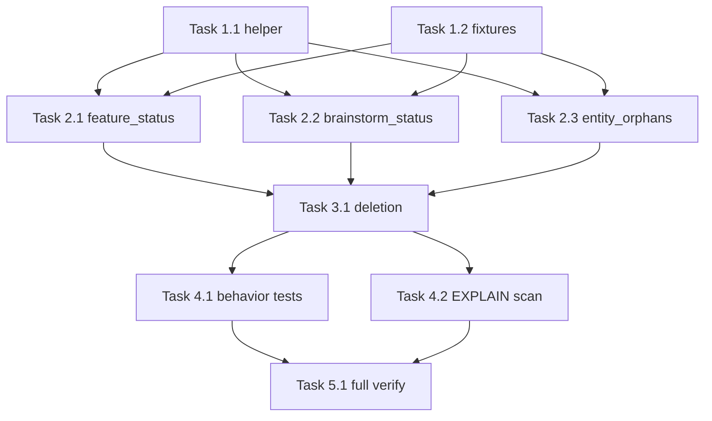

# Tasks: Rotted Doctor-Check Fix

## Global Subagent Context
> All work happens under `plugins/pd/hooks/lib/doctor/` against the LIVE entities schema (v17: columns `uuid, workspace_uuid, type_id, entity_id, name, status, parent_uuid, artifact_path, created_at, updated_at, metadata, type, kind, lifecycle_class` — `entity_type` and `project_id` are DROPPED). The authoritative contracts live in `docs/features/131-rotted-doctor-check-fix/design.md`: helper `_run_live_schema_query(...) -> tuple[list[tuple], bool]` (rows, tolerated) with EMIT-ONCE dedupe; steps 2/4 of `check_entity_orphans` gated on tolerated flags; scoped step-1 uses the two-arm workspace predicate and bypasses `local_entity_ids`. Test with `plugins/pd/.venv/bin/python -m pytest plugins/pd/hooks/lib/doctor/<file>` — never bare `pytest`. Line numbers are as-of-authoring (verified byte-exact by three reviewers); re-locate by content if drifted.

## Dependency Graph

## Execution Strategy

**Same-file serialization rule:** every task below touches `checks.py` and/or `test_checks.py`. Groups mark DEPENDENCY readiness, not safe concurrency — dispatch tasks within a group SEQUENTIALLY (no concurrent worktrees on shared files). The graph's value is ordering and early-failure isolation, not parallel wall-clock.

### Group 1 (No dependencies - dispatch sequentially, shared test_checks.py)
- Task 1.1: Add _run_live_schema_query helper with TDD
- Task 1.2: Add live-schema test fixtures

### Group 2 (After Group 1 completes - dispatch sequentially, shared checks.py + test_checks.py)
- Task 2.1: Rewrite check_feature_status query (needs: 1.1, 1.2)
- Task 2.2: Rewrite check_brainstorm_status queries (needs: 1.1, 1.2)
- Task 2.3: Rewrite check_entity_orphans control flow (needs: 1.1, 1.2)

### Group 3 (After Group 2 completes)
- Task 3.1: Delete check_project_attribution full surface (needs: 2.1, 2.2, 2.3)

### Group 4 (After Group 3 completes - dispatch sequentially, shared test_checks.py)
- Task 4.1: Add scoping/tolerate/surface/empty-DB behavior tests (needs: 3.1)
- Task 4.2: Add committed EXPLAIN scan test (needs: 3.1)

### Group 5 (After Group 4 completes)
- Task 5.1: Full-suite and live doctor verification (needs: 4.1, 4.2)

## Task Details

### Stage 1: Foundation

#### Task 1.1: Add _run_live_schema_query helper to doctor/checks.py with TDD
- **Why:** Implements Plan S1.1 / Design Component [A]
- **Depends on:** None (can start immediately)
- **Blocks:** Task 2.1, Task 2.2, Task 2.3
- **Files:** `plugins/pd/hooks/lib/doctor/checks.py`, `plugins/pd/hooks/lib/doctor/test_checks.py`
- **Do:**
  1. Write failing tests first in `test_checks.py` (new class `TestRunLiveSchemaQuery`): (a) happy path — live-schema in-memory DB, query returns rows, `tolerated is False`, `issues` unchanged; (b) surface branch — DB WITH a `kind` column but a query against a nonexistent OTHER column → one `error`-severity Issue whose message contains the check name and the sqlite error, returns `([], False)`; (c) tolerate branch — DB WITHOUT the `kind` column, query referencing `kind`, `required_columns=("kind",)` → returns `([], True)`, zero Issues; (d) EMIT-ONCE — call the failing (b) case twice with the same `issues` list → still exactly one Issue.
  2. Implement `_run_live_schema_query(conn, sql, params, check_name, issues, required_columns) -> tuple[list[tuple], bool]` in `checks.py` per the design docstring: try `conn.execute(sql, params)` → `(list(cursor), False)`; on `sqlite3.Error`, run `PRAGMA table_info(entities)` and collect column names; if every name in `required_columns` is present → append Issue(check=check_name, severity="error", entity=None, message=f"{check_name}: schema query failed: {exc}", fix_hint=None) UNLESS an identical (check, message) Issue already exists in `issues`, return `([], False)`; if any required column absent → return `([], True)`.
  3. Place the helper near the other module-level helpers (after `_build_local_entity_set`).
- **Test:** `plugins/pd/.venv/bin/python -m pytest plugins/pd/hooks/lib/doctor/test_checks.py -k RunLiveSchemaQuery`
- **Done when:** All four new tests pass; no other test file touched.

#### Task 1.2: Add live-schema fixtures to test_checks.py
- **Why:** Implements Plan S1.2 / Design Component [D] fixture-migration plan
- **Depends on:** None (can start immediately)
- **Blocks:** Task 2.1, Task 2.2, Task 2.3
- **Files:** `plugins/pd/hooks/lib/doctor/test_checks.py`
- **Do:**
  1. Add `_make_live_db(tmp_path)` → constructs `EntityDatabase(tmp_path / "entities.db")` (import from `entity_registry.database`), returns the raw `sqlite3` connection (or the db object plus connection) so checks receive a live-schema `entities_conn`. Precedent: `entity_registry/test_database.py:74` (`database = EntityDatabase(db_path)`) — do NOT copy `test_polymorphic_taxonomy.py`'s `make_v11_db`/`make_v12_db` raw-SQL fixtures (those pin historical migration schemas; that file is cited only for the EXPLAIN QUERY PLAN precedent used by Task 4.2).
  2. Add `_register_live_feature(db_or_conn, entity_id, name=..., artifact_path=..., status=..., workspace_uuid=...)` inserting a `kind='feature'` row under the given workspace (use the EntityDatabase API — never raw INSERT, per the uuid-PK gotcha in CLAUDE.md; `_strict_id_format=False` if ids are not seq-slug shaped). Add a brainstorm variant or a `kind=` parameter.
  3. Add `_insert_workspace(conn, project_root, uuid)` — INSERT a `workspaces` row with `project_root` set (raw SQL acceptable here if the API lacks a helper; satisfy NOT NULL columns discovered via `PRAGMA table_info(workspaces)`).
  4. Smoke test: `_make_live_db` + `_register_live_feature` then `SELECT entity_id FROM entities WHERE kind='feature'` returns the row. Leave legacy `_make_db`/`_register_feature` untouched.
  5. Workspace round-trip smoke (guards the silent-INSERT gotcha): `_insert_workspace(conn, root, uuid)` then `SELECT uuid FROM workspaces WHERE project_root IS NOT NULL AND project_root = ?` with `os.path.abspath(root)` returns exactly `[uuid]` — proves `scoped=True` is reachable before any scoping test relies on it.
- **Test:** `plugins/pd/.venv/bin/python -m pytest plugins/pd/hooks/lib/doctor/test_checks.py -k live_fixture_smoke`
- **Done when:** Both smoke tests pass; legacy helpers unmodified (git diff shows only additions).

### Stage 2: Core Implementation

#### Task 2.1: Rewrite check_feature_status query to kind column
- **Why:** Implements Plan S2.1 / Design Component [B] row 1 (site :709)
- **Depends on:** Task 1.1, Task 1.2
- **Blocks:** Task 3.1
- **Files:** `plugins/pd/hooks/lib/doctor/checks.py`, `plugins/pd/hooks/lib/doctor/test_checks.py`
- **Do:**
  1. In `check_feature_status`, replace the try/except block around `SELECT entity_id, status FROM entities WHERE entity_type = 'feature'` (:707-714) with: `rows, _tolerated = _run_live_schema_query(entities_conn, "SELECT entity_id, status FROM entities WHERE kind = 'feature'", (), "feature_status", issues, ("kind",))` then `db_statuses = {row[0]: row[1] or "" for row in rows}`. Remove that site's own try/except (the helper owns the error path).
  2. Repoint the `check_feature_status` behavioral tests in `test_checks.py` from `_make_db`/`_register_feature` to `_make_live_db`/`_register_live_feature`, preserving every assertion (message strings, counts, severities) unchanged.
  3. Non-vacuity guard (design [D].1 / spec SC#3): add an assertion that with registered live rows, the check's candidate set is NON-EMPTY (e.g., a status-divergent feature IS reported) — a tolerate-branch no-op cannot pass this suite.
- **Test:** `plugins/pd/.venv/bin/python -m pytest plugins/pd/hooks/lib/doctor/test_checks.py -k feature_status`
- **Done when:** Suite passes incl. the non-vacuity assertion; function-scoped check clean: `sed -n '/^def check_feature_status/,/^def /p' plugins/pd/hooks/lib/doctor/checks.py | grep entity_type` → no output.

#### Task 2.2: Rewrite check_brainstorm_status queries to kind column
- **Why:** Implements Plan S2.1 / Design Component [B] rows 2-3 (sites :988, :1083)
- **Depends on:** Task 1.1, Task 1.2
- **Blocks:** Task 3.1
- **Files:** `plugins/pd/hooks/lib/doctor/checks.py`, `plugins/pd/hooks/lib/doctor/test_checks.py`
- **Do:**
  1. Site :988: inside the existing try/except (:985-993, RETAIN the wrapper — harmless dead guard, per design), replace the execute with `rows, _tolerated = _run_live_schema_query(entities_conn, "SELECT type_id, entity_id, status FROM entities WHERE kind = 'brainstorm' AND (status IS NULL OR status != 'promoted')", (), "brainstorm_status", issues, ("kind",))` then `brainstorms = [(r[0], r[1], r[2] or "") for r in rows]`.
  2. Site :1083: inside the dependency-fallback loop (wrapper :1066-1099 RETAINED for its EXPLAIN-clean siblings), replace `cursor.fetchone()` usage: `rows, _tolerated = _run_live_schema_query(entities_conn, "SELECT type_id, status FROM entities WHERE uuid = ? AND kind = 'feature'", (dep_uuid,), "brainstorm_status", issues, ("kind",))` then `row = rows[0] if rows else None` (keep the parameter the site currently binds).
  3. Repoint the `check_brainstorm_status` behavioral tests to live fixtures, assertions unchanged, plus a [D].1 non-vacuity assertion (a registered stale brainstorm IS reported).
- **Test:** `plugins/pd/.venv/bin/python -m pytest plugins/pd/hooks/lib/doctor/test_checks.py -k brainstorm_status`
- **Done when:** Suite passes incl. the non-vacuity assertion; function-scoped check clean: `sed -n '/^def check_brainstorm_status/,/^def /p' plugins/pd/hooks/lib/doctor/checks.py | grep entity_type` → no output.

#### Task 2.3: Rewrite check_entity_orphans control flow with workspace scoping and tolerate gates
- **Why:** Implements Plan S2.2 / Design Component [B] rows 4-6 + reconciliation section (sites :1391, :1398, :1488)
- **Depends on:** Task 1.1, Task 1.2
- **Blocks:** Task 3.1
- **Files:** `plugins/pd/hooks/lib/doctor/checks.py`, `plugins/pd/hooks/lib/doctor/test_checks.py`
- **Do:**
  1. Delete the `project_id = kwargs.get("project_id")` read and the :1388-1399 if/else. Replace per the design's pinned control-flow block: ALWAYS run `db_features_all, features_tolerated = _run_live_schema_query(entities_conn, "SELECT type_id, entity_id, artifact_path FROM entities WHERE kind = 'feature'", (), "entity_orphans", issues, ("kind",))`; `db_feature_ids = {row[1] for row in db_features_all}`.
  2. Workspace resolution (mirror `checks.py:582-592` exactly): `try: root_uuids = [r[0] for r in entities_conn.execute("SELECT uuid FROM workspaces WHERE project_root IS NOT NULL AND project_root = ?", (os.path.abspath(project_root),))] except sqlite3.Error: root_uuids = []`; `scoped = len(root_uuids) == 1`.
  3. When `scoped`: `db_features_step1, _ = _run_live_schema_query(entities_conn, "SELECT type_id, entity_id, artifact_path FROM entities WHERE kind = 'feature' AND (workspace_uuid = ? OR workspace_uuid = ?)", (root_uuids[0], _UNKNOWN_WORKSPACE_UUID), "entity_orphans", issues, ("kind", "workspace_uuid"))` (import `_UNKNOWN_WORKSPACE_UUID` from `entity_registry.database` — module already imports from there at :564). Else `db_features_step1 = db_features_all`.
  4. Replace the step-1 loop (:1405-1421) with the design's merged loop: iterate `db_features_all`; missing-dir rows → if `scoped`: warning when `entity_id in step1_ids` else `cross_project_count += 1`; if not scoped: legacy `entity_id in local_entity_ids or not local_entity_ids` branching verbatim.
  5. Gate step 2 (:1438-1454): run only `if not features_tolerated`.
  6. Site :1488: `db_brainstorms, brainstorms_tolerated = _run_live_schema_query(entities_conn, "SELECT entity_id FROM entities WHERE kind = 'brainstorm'", (), "entity_orphans", issues, ("kind",))`; `db_brainstorm_ids = {r[0] for r in db_brainstorms}`; gate step 4 (:1494-1522) on `not brainstorms_tolerated`.
  7. TDD front-load (write FAILING FIRST, before steps 1-6 implementation), placed in class `TestEntityOrphansScoping` (Task 4.1 EXTENDS this same class — do not duplicate): [D].5(a) foreign-workspace exclusion — `_insert_workspace(root_A, uuid_A)` + feature under foreign `uuid_B`, no dir, empty features dir → info bucket not warning; [D].5(b) unknown-bucket inclusion — feature under `_UNKNOWN_WORKSPACE_UUID`, no dir, scoped → warning. Implement steps 1-6 to turn them green.
  8. Repoint `test_check7_*` suites to live fixtures (register features with `workspace_uuid` via `_register_live_feature`; where a test needs scoping OFF, simply do not insert a matching `workspaces` row), preserving assertions, plus a [D].1 non-vacuity assertion (registered+deleted-dir feature IS flagged).
- **Test:** `plugins/pd/.venv/bin/python -m pytest plugins/pd/hooks/lib/doctor/test_checks.py -k "check7 or EntityOrphansScoping"`
- **Done when:** Suite passes; function-scoped check clean: `sed -n '/^def check_entity_orphans/,/^def /p' plugins/pd/hooks/lib/doctor/checks.py | grep -E "entity_type|project_id"` → no output; steps 2 and 4 visibly gated on tolerated flags; front-loaded (a)/(b) green.

### Stage 3: Deletion

#### Task 3.1: Delete check_project_attribution and its full deregistration surface
- **Why:** Implements Plan S3.1 / Design Component [C] / spec DELETE decision
- **Depends on:** Task 2.1, Task 2.2, Task 2.3
- **Blocks:** Task 4.1, Task 4.2
- **Files:** `plugins/pd/hooks/lib/doctor/checks.py`, `plugins/pd/hooks/lib/doctor/__init__.py`, `plugins/pd/hooks/lib/doctor/fixer.py`, `plugins/pd/hooks/lib/doctor/fix_actions/__init__.py`, `plugins/pd/hooks/lib/doctor/test_doctor.py`, `plugins/pd/hooks/lib/doctor/test_checks.py`, `plugins/pd/hooks/lib/doctor/test_fix_actions.py`, `plugins/pd/hooks/lib/doctor/test_fixer.py`
- **Do:**
  1. `checks.py`: delete the `check_project_attribution` function (region around :1539-1600; locate by `def check_project_attribution`).
  2. `doctor/__init__.py`: remove its import (:32), `CHECK_ORDER` entry (:55), `_ENTITY_DB_CHECKS` entry (:97).
  3. `doctor/fix_actions/__init__.py`: delete `_fix_project_attribution` (:348-359). KEEP `EntityDatabase.backfill_project_ids` (live workspace_uuid writer).
  4. `doctor/fixer.py`: remove the `_fix_project_attribution` import (:21) and the `_SAFE_PATTERNS` "Backfill project_id for" entry (:52).
  5. `test_doctor.py`: remove `'check_project_attribution'` from `expected_names` (:24).
  6. Delete its test cases in `test_checks.py`, `test_fix_actions.py`, `test_fixer.py` (locate by `project_attribution` grep).
  7. Verify: `grep -rn "check_project_attribution\|_fix_project_attribution" plugins/pd/hooks/lib/` returns nothing.
  8. Spec SC#6 fixer-net check: `grep -n "entity_type\|project_id" plugins/pd/hooks/lib/doctor/fix_actions/__init__.py plugins/pd/hooks/lib/doctor/fixer.py` — assert only allowed matches remain (live `workspaces.project_id_legacy` usage, message text; NO dropped-column SQL against entities).
- **Test:** `plugins/pd/.venv/bin/python -m pytest plugins/pd/hooks/lib/doctor/test_doctor.py plugins/pd/hooks/lib/doctor/test_fixer.py plugins/pd/hooks/lib/doctor/test_fix_actions.py`
- **Done when:** Grep returns zero hits; fixer-net grep shows only allowed matches; all three test files pass incl. the CHECK_ORDER assertion.

### Stage 4: Behavioral Test Coverage

#### Task 4.1: Add scoping, tolerate, surface, and empty-DB behavior tests
- **Why:** Implements Plan S4.1 / Design [D].3-[D].5, [D].7 / spec ACs
- **Depends on:** Task 3.1
- **Blocks:** Task 5.1
- **Files:** `plugins/pd/hooks/lib/doctor/test_checks.py`
- **Do:** Extend `TestEntityOrphansScoping` (created by Task 2.3 with the base (a)/(b) tests — EXTEND, do not restate) plus boundary tests, each constructing state via Task 1.2 fixtures with an EMPTY on-disk features dir unless stated:
  1. (a-inverse, extends Task 2.3's (a)): same foreign-workspace setup WITHOUT the workspaces row (unscoped) → legacy branch warns (empty `local_entity_ids` → warning arm) — the scoped/unscoped pair proves the predicate does the work.
  2. (b) already covered by Task 2.3 — verify it still passes; add assertions only if gaps found.
  3. (c) Foreign on-disk: register feature under `uuid_B` AND create its dir + `.meta.json` → scoped run → assert NOT flagged "has .meta.json but no entity in DB".
  4. (d) Ambiguity fallback: two workspaces rows with the same `project_root` → assert legacy `local_entity_ids` branching (same outcome as the unscoped variant of (a)).
  5. Tolerate whole-check: LEGACY `_make_db` fixture + `_register_feature` + create the feature's dir with `.meta.json` → `check_entity_orphans` emits ZERO Issues (steps 2/4 skipped via tolerated flags).
  6. Empty-DB boundary ([D].7): `_make_live_db` with zero rows → `check_feature_status`, `check_brainstorm_status`, `check_entity_orphans` all pass with zero Issues, no exception.
  7. Check-level surface-branch test ([D].3 / spec SC#4 surface AC): live-schema DB with a registered feature (`kind`/`workspace_uuid` columns present); monkeypatch the connection or one rewritten query inside a real check to raise `sqlite3.Error` (e.g., patch `entities_conn.execute` to fail only for the feature-membership SELECT); invoke `check_entity_orphans` directly → assert its CheckResult contains exactly ONE `error`-severity Issue whose message contains "entity_orphans" and the sqlite error text (end-to-end proof, distinct from Task 1.1's helper-level unit test).
- **Test:** `plugins/pd/.venv/bin/python -m pytest plugins/pd/hooks/lib/doctor/test_checks.py -k "Scoping or tolerate or empty_db or surface"`
- **Done when:** All new tests pass; test (a)'s scoped and unscoped variants assert DIFFERENT outcomes; the surface-branch test asserts exactly one error Issue.

#### Task 4.2: Add committed EXPLAIN scan test over checks.py SQL sites
- **Why:** Implements Plan S4.2 / Design [D].2 / spec SC#1+SC#5 durable scan
- **Depends on:** Task 3.1
- **Blocks:** Task 5.1
- **Files:** `plugins/pd/hooks/lib/doctor/test_checks.py`
- **Do:**
  1. Add `test_all_checks_sql_explains_against_live_schema`: parse `plugins/pd/hooks/lib/doctor/checks.py` with `ast`; collect every `ast.Constant` string first-argument of `.execute(...)` calls whose text starts with SELECT/PRAGMA (case-insensitive, strip whitespace) — constants only, skip f-strings/names (matching the authoring harness).
  2. For each collected SQL, run `conn.execute("EXPLAIN " + sql, ("x",) * sql.count("?"))` against a `_make_live_db` connection; collect failures.
  3. Assert failures list is empty with a message listing (line, error, sql-prefix) for any hit.
- **Test:** `plugins/pd/.venv/bin/python -m pytest plugins/pd/hooks/lib/doctor/test_checks.py -k explains_against_live_schema`
- **Done when:** Scan passes on the final code and collects a non-trivial number of sites (assert count >= 20 to prove the walker works).

### Stage 5: Integration Verification

#### Task 5.1: Run full doctor suite and live doctor verification
- **Why:** Implements Plan S5.1 / spec success criteria (all tests pass; live false positives gone)
- **Depends on:** Task 4.1, Task 4.2
- **Blocks:** None (terminal)
- **Files:** none (verification only)
- **Do:**
  1. `plugins/pd/.venv/bin/python -m pytest plugins/pd/hooks/lib/doctor/` → must be fully green.
  2. Run the live doctor entity checks against this repo's real DB: `PYTHONPATH=plugins/pd/hooks/lib plugins/pd/.venv/bin/python -m doctor --entities-db ~/.claude/pd/entities/entities.db --project-root . 2>/dev/null` (canonical invocation per `plugins/pd/commands/doctor.md:36-41`, the fallback/dev-workspace block; the PYTHONPATH prefix is required for the doctor package import) and capture output.
  3. Assert observations with an explicit false-positive discrimination step: for EVERY remaining "in DB but feature directory not found" or "has .meta.json but no entity in DB" flag, cross-reference the entity_id against actual `docs/features/` directory existence AND DB membership (`SELECT 1 FROM entities WHERE kind='feature' AND entity_id=?`) — only genuinely-both-present entities count as false positives (a truly-deleted directory is a TRUE positive, not a failure). Also assert: zero `project_attribution` issues; `feature_status`/`brainstorm_status` candidate sets non-empty (census guarantees features exist).
  4. Record the before/after doctor issue counts in the task output for the retro.
- **Test:** `plugins/pd/.venv/bin/python -m pytest plugins/pd/hooks/lib/doctor/ -q`
- **Done when:** Pytest exit 0; live run output shows the three observations; counts recorded.

## Summary

- Total tasks: 9
- Concurrency: NONE — every group edits `checks.py` and/or `test_checks.py`; ALL tasks dispatch sequentially per the same-file serialization rule. Groups are DEPENDENCY groups (ordering + early-failure isolation), not concurrency permissions. Tasks per group: G1: 2, G2: 3, G3: 1, G4: 2, G5: 1.
- Critical path (= total path, sequential): 1.1 → 1.2 → 2.1 → 2.2 → 2.3 → 3.1 → 4.1 → 4.2 → 5.1
