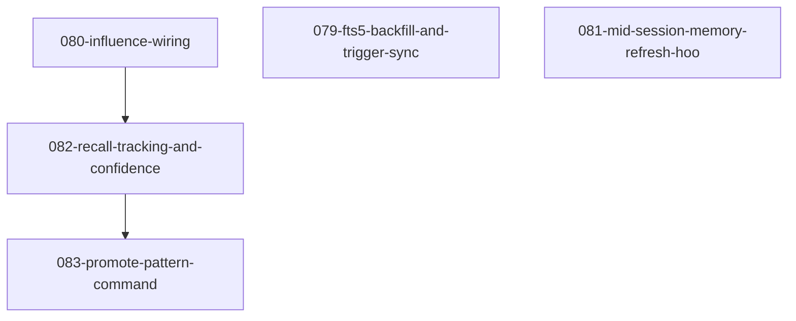

# Roadmap: Memory Flywheel

<!-- Arrow: prerequisite (A before B) -->

## Dependency Graph

## Execution Order

1. **079-fts5-backfill-and-trigger-sync** — Populates `entries_fts` virtual table from existing 964 entries and adds INSERT/UPDATE triggers to keep FTS5 in sync (depends on: none)
2. **080-influence-wiring** — Wires `record_influence_by_content` into Task return-handlers in implement/create-plan/design; activates `_influence_score()` in `rank()` (depends on: none)
3. **081-mid-session-memory-refresh-hoo** — PostToolUse or PreToolUse hook that re-queries semantic_memory on phase boundaries without SessionStart restart (depends on: none)
4. **082-recall-tracking-and-confidence** — Increments `recall_count` on every `search_memory`; confidence decay function; promotion path low→medium→high based on `observation_count × influence_count` (depends on: 080-influence-wiring)
5. **083-promote-pattern-command** — `/pd:promote-pattern` classifies high-confidence patterns into skill content / hook scripts / CLAUDE.md entries; diff-preview + apply-on-approval (depends on: 082-recall-tracking-and-confidence)

## Milestones

### M1: Foundation
- 079-fts5-backfill-and-trigger-sync
- 080-influence-wiring
- 081-mid-session-memory-refresh-hoo

*Rationale:* All three are independent and unblock downstream features; shipping them in parallel maximises throughput and delivers immediate retrieval improvements.

### M2: Signal Accumulation
- 082-recall-tracking-and-confidence

*Rationale:* Depends on 080-influence-wiring being live so `influence_count` is a meaningful upgrade signal; completes the feedback loop.

### M3: Codification
- 083-promote-pattern-command

*Rationale:* Depends on confidence elevation from 082 being operational so the command has a reliable signal for what is worth promoting to a deployed rule.

## Cross-Cutting Concerns

- **Schema coordination:** `semantic_memory` Python module is shared by FTS5 backfill (079), recall tracking (082), and influence wiring (080) — schema migrations must be coordinated via additive-only changes.
- **ranking.py sequencing:** The `rank()` function is touched by both influence wiring (080) and recall/decay changes (082) — M2 gating on 080 merge (not just implementation) prevents edit conflicts.
- **MCP API stability:** `record_influence_by_content` and `search_memory` signatures are consumed by multiple features — API must remain stable across the project (NFR1).
- **Performance verification (NFR2 deferred to per-feature spec):** FTS5 backfill <30s for 964 entries; `rank()` latency ≤10% regression after influence wiring. Each feature spec must include a benchmark AC.
- **Backward compatibility (NFR3 deferred to per-feature spec):** Existing `search_memory` call sites must not require changes. Additive-only changes to `semantic_memory` module. Each feature spec must declare additive-only status.
