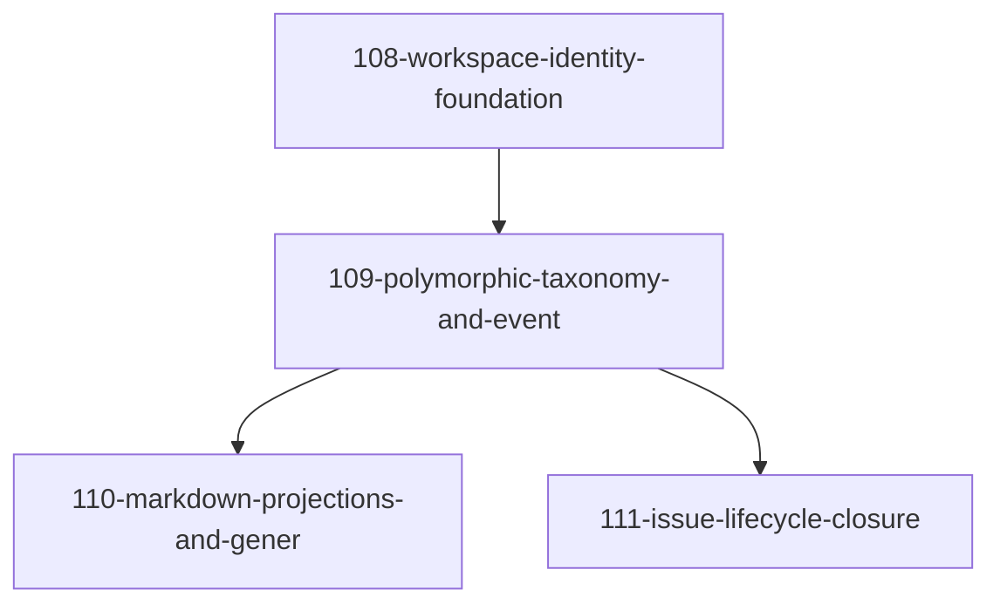

# Roadmap: Entity System Redesign

<!-- Arrow: prerequisite (A before B) -->

## Dependency Graph

## Execution Order

1. **108-workspace-identity-foundation** — Introduce workspace-scoped entity IDs using UUIDv7, migrate global entity registry to per-workspace storage, replace hardcoded project-root assumptions with workspace context injection throughout hooks and skills (depends on: none)
2. **109-polymorphic-taxonomy-and-event** — Replace single-table entity model with polymorphic type registry and append-only event log; drop enforce_immutable_entity_type trigger; split register_entity into raise-on-conflict + upsert_entity variants and audit all 14+ INSERT OR IGNORE call sites (depends on: 108-workspace-identity-foundation)
3. **110-markdown-projections-and-gener** — Generate markdown artifact files as read-only projections of event-sourced state, including pd-state.diff.md generator; add entity_display table separating identity from display metadata; generalize phase-gate guard system for cross-entity invariants (depends on: 109-polymorphic-taxonomy-and-event)
4. **111-issue-lifecycle-closure** — Implement terminal state transitions (resolve, close, wont-fix), cascading child-issue handling, backlog archival, bulk closure CLI; MCP callers (issue_spawn, complete_phase closes=) write events directly to event log (depends on: 109-polymorphic-taxonomy-and-event)

Note: 110 and 111 both depend on 109 only; once 109 lands they may proceed in parallel.

## Milestones

### M1: Phase 0-1 — Identity and Storage
- 108-workspace-identity-foundation

### M2: Phase 2 — Taxonomy and State Model
- 109-polymorphic-taxonomy-and-event

### M3: Phase 3 — Projections and Guards
- 110-markdown-projections-and-gener

### M4: Phase 4 — Lifecycle Closure
- 111-issue-lifecycle-closure

## Cross-Cutting Concerns

- All schema migrations must be reversible and testable in isolation (down-migration scripts required for every up-migration)
- Bash 3.2 / macOS BSD portability: use POSIX `[[:space:]]` in `grep -E`, avoid GNU-only flags, test on zsh and bash 3.2
- Hook EPIPE safety: all hooks emitting structured output must use `safe_emit_hook_json` with `trap '' PIPE` and `2>/dev/null || true` wrappers
- Test coverage for every schema change must include both bad-state-rejection cases and projection-determinism cases (same events always produce same projection)
- Workspace context must never be inferred from CWD at call time; must be injected explicitly into every agent, skill, and hook invocation
- SQLite WAL mode and lock recovery patterns must be preserved and extended to new event-log tables
- Entity `type_id` colon-separator convention (`entity_type:entity_id`) must be enforced consistently across all new entity types
- No hardcoded `plugins/pd/` paths; all plugin-root resolution must use the two-location Glob pattern with primary cache path and dev-workspace fallback

## Persistent Decomposition Warning (acknowledged, non-blocking)

Feature 110 (Markdown Projections and Generalized Guards) bundles two distinct responsibilities — projection generation (read-path) and guard enforcement (write-path). These have different change axes and could diverge under change pressure. Reviewer flagged this in iterations 1 and 2 as a warning, not a blocker. Splitting would require a third feature without changing aggregate scope; deferred unless 110 grows >800 LOC during create-plan.
