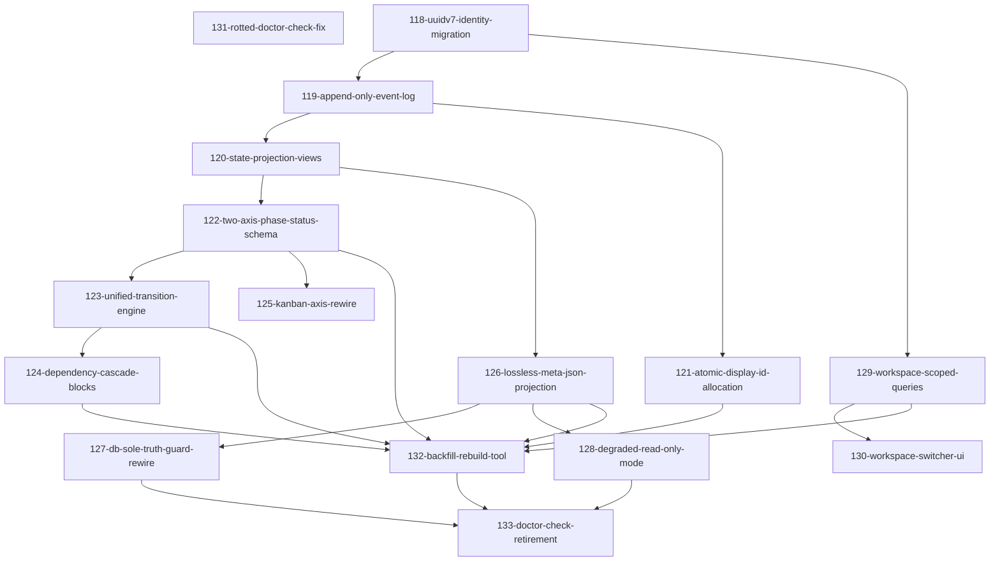

# Roadmap: Entity DB Redesign

<!-- Arrow: prerequisite (A before B) -->

## Dependency Graph

## Execution Order

1. **131-rotted-doctor-check-fix** -- Fix or delete existing doctor checks that query columns already dropped from the schema. Independent pre-work with no dependency on the rest of the redesign. (depends on: none)
2. **118-uuidv7-identity-migration** -- Migrate every table, including workflow-state and events, to UUIDv7 as the sole identity column and drop uniqueness constraints on human-readable fields like type_id and slug. Bump the Python floor to 3.14 for stdlib uuid.uuid7 support. (depends on: none)
3. **129-workspace-scoped-queries** -- Retain the workspaces table and existing resolution precedence with split-brain failing loud. Replace the cross-workspace allowlist (and its doctor checks) with plain UUID refs, and scope all queries to workspace. (depends on: 118)
4. **119-append-only-event-log** -- Create the append-only events table (entity_uuid FK, event_type, axis, from_value, to_value, actor, timestamp, payload) as the sole write path for entity state, generalizing the existing phase_events table. Enforce row immutability and wrap writes in a shared BEGIN IMMEDIATE transaction. (depends on: 118)
5. **130-workspace-switcher-ui** -- Add a workspace switcher to the UI so users can move between workspace-scoped views. (depends on: 129)
6. **121-atomic-display-id-allocation** -- Extend the existing atomic next_sequence_value allocator to every entity kind for display IDs (e.g. F-1042), replacing the racy unlocked filesystem scan currently used for features. Rename operations update display metadata and record an event; registration validates non-empty name/slug. (depends on: 119)
7. **120-state-projection-views** -- Derive current entity state as a VIEW over the latest event per axis so raw SQL cannot bypass the event write path, validated by a replay(events)==projection property test. Capture the current session-start read-latency baseline for later comparison. (depends on: 119)
8. **126-lossless-meta-json-projection** -- Derive .meta.json content losslessly from event payloads, including per-phase started/completed/iterations/reviewerNotes, skippedPhases, branch, mode, and brainstorm_source/backlog_source. (depends on: 120)
9. **122-two-axis-phase-status-schema** -- Split the conflated status field into pipeline_phase and execution_status as separate columns with separate CHECK constraints. Delete the derive_kanban translation function and its 4-vocabulary conflation. (depends on: 120)
10. **128-degraded-read-only-mode** -- When the DB is unavailable, mutations fail loud and reads fall back to the last known projection. Delete _write_meta_json_fallback so no fallback state-file writer survives. (depends on: 126)
11. **127-db-sole-truth-guard-rewire** -- Make the DB the sole source of truth for workflow management via MCP; .meta.json becomes a read-only projection written only by the DB layer, and data-file-guard is rewired to recognize that writer. Verify DB-direct read latency does not exceed the session-start baseline. (depends on: 126)
12. **125-kanban-axis-rewire** -- Rewire the kanban board to render execution_status and the status badge to render pipeline_phase, replacing the deleted derive_kanban translation. (depends on: 122)
13. **123-unified-transition-engine** -- Replace ENTITY_MACHINES and WorkflowStateEngine with a single per-kind transition-machine router. Port the previously-unowned project-kind transitions and projections into the unified router. (depends on: 122)
14. **124-dependency-cascade-blocks** -- Expand entity_relations.kind to include 'blocks', migrating existing blocked_by metadata JSON into real relation rows. On completion events, flip downstream entities with all blockers resolved from blocked to ready via a follow-on event. (depends on: 123)
15. **132-backfill-rebuild-tool** -- Stand up a new DB file with a reset schema counter in one version location, then backfill all entities by replaying old data into the new schema with a checksum/anomaly report against the pre-rebuild census (533 entities, 7 workspaces). Keep the old DB read-only for 30 days and delete the Migration-11 shims (database.py:5902, entity_server.py:551 project_id kwarg). (depends on: 121, 122, 123, 124, 126, 129)
16. **133-doctor-check-retirement** -- Remove the 12 identity/workspace/sync doctor checks whose underlying surfaces no longer exist, driving doctor warnings to zero on a healthy workspace. (depends on: 127, 128, 132)

## Milestones

### M1: Foundation: Identity & Event Log

Establishes the event-sourced schema and identity core that every downstream feature depends on; the doctor-check fix is independent pre-work that ships in parallel with no dependency on the redesign.

- 118-uuidv7-identity-migration
- 119-append-only-event-log
- 120-state-projection-views
- 121-atomic-display-id-allocation
- 131-rotted-doctor-check-fix

### M2: Workflow State & Cascade

Builds the two-axis state model, the engine that transitions entities along it, the blocked-to-ready cascade, and the UI surface, all gated on the foundation milestone.

- 122-two-axis-phase-status-schema
- 123-unified-transition-engine
- 124-dependency-cascade-blocks
- 125-kanban-axis-rewire

### M3: Persistence Compatibility & Multi-Workspace

Resolves the dual-source-of-truth problem by making .meta.json a read-only projection with a degraded-mode fallback, and completes workspace isolation, both gated on the event/view foundation.

- 126-lossless-meta-json-projection
- 127-db-sole-truth-guard-rewire
- 128-degraded-read-only-mode
- 129-workspace-scoped-queries
- 130-workspace-switcher-ui

### M4: Migration & Cleanup

Final cutover: replay old data into the new schema behind a completeness gate, then retire the doctor checks whose defended surfaces no longer exist.

- 132-backfill-rebuild-tool
- 133-doctor-check-retirement

## Cross-Cutting Concerns

- Structural enforcement over convention: no trigger-guards or grep-based checks, enforced consistently across event writes, views, the transition engine, and the dependency cascade.
- Shared sqlite_retry plus BEGIN IMMEDIATE transaction pattern reused for every atomic write: event-append, display-ID allocation, and backfill.
- OQ-1 (whether .meta.json is retained at all) is unresolved in this PRD; this decomposition assumes retention per FR-1's conditional language. If dropped, the guard-rewire portion of DB-sole-truth enforcement is void.
- Session-start read-latency baseline (NFR-3) is captured during the foundation milestone and re-validated once DB-direct reads replace .meta.json reads.
- Actor attribution is recorded on every state-changing event (NFR-4), consistently across engine transitions, the dependency cascade, and workspace operations.
- This PRD is inherently sequential: most features gate on the event-sourced schema core, so the high proportion of cross-feature dependencies reflects the requirements' own layering (per the Constraints section) rather than a module-boundary flaw.
