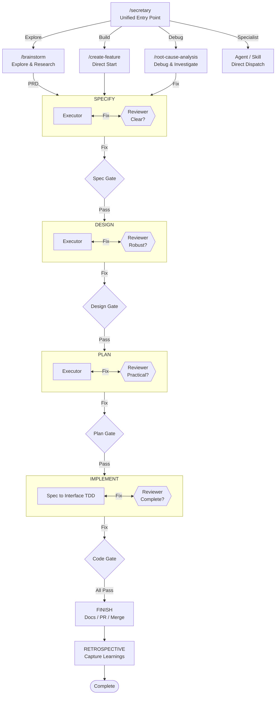

# pd Plugin

Structured feature development workflow with skills, agents, and commands for methodical development from ideation to implementation.




## Components

| Type | Count |
|------|-------|
| Skills | 29 |
| Agents | 29 |
| Commands | 33 |
| MCP Servers | 2 |

## Commands

**Start:**
| Command | Description |
|---------|-------------|
| `/pd:brainstorm [topic]` | 6-stage PRD creation with research subagents and domain enrichment |
| `/pd:create-feature <desc>` | Start building (creates folder + branch) |

**Build phases** (run in order):
| Command | Output |
|---------|--------|
| `/pd:specify [--feature=ID]` | spec.md |
| `/pd:design` | design.md (5-stage workflow) |
| `/pd:create-plan` | plan.md |
| `/pd:create-tasks` | _(deprecated — merged into create-plan)_ |
| `/pd:taskify` | Break any existing plan into tasks (standalone regeneration) |
| `/pd:implement` | Code changes |
| `/pd:abandon-feature` | Transition a feature to abandoned status |
| `/pd:finish-feature` | Merge, retro, cleanup (pd features) |
| `/pd:wrap-up` | Wrap up implementation - review, retro, merge or PR |

**Anytime:**
| Command | Purpose |
|---------|---------|
| `/pd:show-lineage` | Display entity lineage tree for the current feature branch or a specified entity |
| `/pd:show-status` | See current feature state |
| `/pd:list-features` | See all active features |
| `/pd:retrospect` | Capture learnings |
| `/pd:add-to-backlog <idea>` | Capture ideas for later |
| `/pd:cleanup-brainstorms` | Delete old scratch files |
| `/pd:doctor` | Run 21 diagnostic checks on pd workspace health (incl. security-review command, stale worktrees, status-parser regression, and severity vocabulary) |
| `/pd:sync-cache` | Reload plugin after changes |
| `/pd:secretary` | Intelligent task routing to commands, agents, and skills |
| `/pd:root-cause-analysis` | Investigate bugs and failures to find all root causes |
| `/pd:create-project <prd>` | Create project from PRD with AI-driven decomposition |
| `/pd:create-specialist-team` | Create ephemeral specialist teams for complex tasks |
| `/pd:init-ds-project <name>` | Scaffold a new data science project |
| `/pd:promptimize [file-path or inline text]` | Review a prompt against best practices and return an improved version |
| `/pd:refresh-prompt-guidelines` | Scout latest prompt engineering best practices and update the guidelines document |
| `/pd:review-ds-analysis <file>` | Review data analysis for statistical pitfalls |
| `/pd:review-ds-code <file>` | Review DS Python code for anti-patterns |
| `/pd:generate-docs` | Generate three-tier documentation scaffold or update existing docs |
| `/pd:subagent-ras` | Research, analyze, and summarize any topic using parallel agents |
| `/pd:yolo [on\|off]` | Toggle YOLO autonomous mode |

## Review System

The pd workflow uses a two-tier review pattern for quality assurance:

### Two-Tier Review Pattern

| Component | Role | Question |
|-----------|------|----------|
| **Phase Skeptic** | Challenges artifact quality | "Is this artifact robust?" |
| **Phase Reviewer** | Validates handoff completeness | "Can the next phase proceed?" |

### Specify Phase Workflow

```
spec-reviewer (Skeptic) → "Is spec testable and bounded?"
    ↓
phase-reviewer (Gatekeeper) → "Has what design needs?"
```

### Design Phase Workflow

The `/pd:design` command uses a 5-stage workflow for robust design artifacts:

```
Stage 0: PRIOR ART RESEARCH → Existing solutions, patterns, standards, evidence gathering
    ↓
Stage 1: ARCHITECTURE DESIGN → High-level structure, components, evidence-grounded decisions, risks
    ↓
Stage 2: INTERFACE DESIGN → Precise contracts between components
    ↓
Stage 3: DESIGN REVIEW LOOP → design-reviewer challenges assumptions using independent verification (1-3 iterations)
    ↓
Stage 4: HANDOFF REVIEW → phase-reviewer ensures plan phase readiness
```

### Create Plan Phase Workflow

The `/pd:create-plan` command uses a 2-stage review workflow:

```
Stage 1: PLAN-REVIEWER (Skeptical Review)
    │   • Failure modes - What could go wrong?
    │   • Untested assumptions - What's assumed but not validated?
    │   • Dependency accuracy - Are dependencies correct and complete?
    │   • TDD order - Interface → Tests → Implementation sequence?
    ↓
Stage 2: PHASE-REVIEWER (Execution Readiness)
    │   • Can an engineer break this into tasks?
    │   • Are all design items covered?
    ↓
[User Prompt: Run /implement?]
```

### Implementation Review

The `/pd:implement` command uses four reviewers in an iterative loop (up to 3 iterations). Only reviewers that failed re-run in intermediate iterations — passing reviewers are skipped. When all four have individually passed, a mandatory final validation round runs all four regardless to confirm end-to-end correctness.

| Reviewer | Focus | Validation |
|----------|-------|------------|
| implementation-reviewer | Requirements compliance | 4-level: Tasks→Spec→Design→PRD |
| relevance-verifier | Artifact chain coherence | Coverage, completeness, testability, coherence |
| code-quality-reviewer | Maintainability | SOLID, readability, testing |
| security-reviewer | Vulnerabilities | OWASP Top 10, injection, auth |

## Agents

| Agent | Purpose |
|-------|---------|
| advisor | Applies strategic/domain advisory lens to brainstorm problems |
| ds-analysis-reviewer | Reviews data analysis for statistical pitfalls and methodology |
| brainstorm-reviewer | Reviews brainstorm artifacts for completeness before promotion |
| code-quality-reviewer | Reviews implementation quality by severity |
| codebase-explorer | Analyzes codebase for patterns and constraints |
| design-reviewer | Challenges design assumptions and finds gaps (skeptic) |
| documentation-researcher | Researches documentation state and identifies update needs |
| documentation-writer | Writes and updates documentation |
| ds-code-reviewer | Reviews DS Python code for anti-patterns and best practices |
| generic-worker | General-purpose implementation agent |
| implementation-reviewer | Validates implementation against full requirements chain (4-level) |
| implementer | Task implementation with TDD and self-review |
| internet-researcher | Searches web for best practices and standards |
| investigation-agent | Read-only research before implementation |
| phase-reviewer | Validates artifacts have what next phase needs (gatekeeper) |
| plan-reviewer | Skeptical plan reviewer for failure modes and TDD compliance |
| prd-reviewer | Critical review of PRD drafts |
| project-decomposer | Decomposes project PRD into ordered features with dependencies |
| project-decomposition-reviewer | Validates project decomposition quality |
| ras-synthesizer | Synthesizes multi-source research findings into thematic analysis with confidence calibration |
| rca-investigator | Finds all root causes through 6-phase systematic investigation |
| relevance-verifier | Verifies full artifact chain coherence (spec→design→plan→tasks) |
| retro-facilitator | Runs data-driven AORTA retrospective with full intermediate context |
| secretary-reviewer | Validates secretary routing recommendations |
| security-reviewer | Reviews implementation for security vulnerabilities |
| skill-searcher | Finds relevant existing skills |
| spec-reviewer | Skeptically reviews spec.md for testability and assumptions |
| task-reviewer | Validates task breakdown quality and executability |
| test-deepener | Systematically deepens test coverage with spec-driven adversarial testing |

## MCP Tools

Both MCP servers (entity registry, workflow engine) share a common lifecycle layer (`mcp/server_lifecycle.py`) that manages PID files, parent-PID watchdog, and session-lifetime watchdog. Orphaned server processes from previous sessions are cleaned up at session start.

### Entity Registry Server

The entity registry server (`mcp/entity_server.py`) exposes 19 tools for entity lineage tracking:

| Tool | Purpose |
|------|---------|
| `register_entity` | Register a new entity (feature, project, brainstorm) with type and status; raises `EntityExistsError` on `(workspace_uuid, type_id)` conflict |
| `issue_spawn` | Capture a mid-flight bug or task as a child entity linked to a parent; appends `spawned_child` phase event without modifying parent workflow state |
| `set_parent` | Set a parent-child relationship between two entities |
| `get_entity` | Retrieve entity details by type_id |
| `get_lineage` | Get the full lineage tree for an entity (ancestors and descendants) |
| `update_entity` | Update entity name, status, or metadata |
| `export_lineage_markdown` | Export lineage tree as a markdown file |
| `export_entities` | Export all entities as structured data |
| `delete_entity` | Delete an entity by type_id or UUID |
| `add_entity_tag` | Add a tag to an entity |
| `get_entity_tags` | Get all tags for an entity |
| `add_dependency` | Add a dependency relationship between two entities |
| `remove_dependency` | Remove a dependency relationship |
| `search_entities` | Search entities by name, type, status, or metadata |
| `add_okr_alignment` | Align an entity to a key result |
| `get_okr_alignments` | Get OKR alignments for an entity |
| `create_key_result` | Create a key result under a project |
| `update_kr_score` | Update the score for a key result |
| `list_projects` | List all registered projects |

The server is bootstrapped by `mcp/run-entity-server.sh` and declared in `plugin.json` via `mcpServers`. If the entity DB is locked at startup, the server starts in degraded mode and recovers automatically once the lock is released.

### Workflow Engine Server

The workflow engine server (`mcp/workflow_state_server.py`) exposes 21 tools for workflow state management:

| Tool | Purpose |
|------|---------|
| `get_phase` | Get current workflow phase for a feature |
| `transition_phase` | Transition a feature to the next workflow phase |
| `complete_phase` | Mark the current phase as complete; optional `closes=[uuid...]` atomically transitions each referenced issue to its terminal status and writes `entity_relations(kind='fixes')` rows |
| `validate_prerequisites` | Check if prerequisites are met for a target phase |
| `list_features_by_phase` | List all features currently in a given phase |
| `list_features_by_status` | List all features with a given status |
| `reconcile_check` | Check for drift between state file and artifacts |
| `reconcile_apply` | Apply reconciliation fixes for detected drift |
| `reconcile_frontmatter` | Sync frontmatter metadata across feature artifacts |
| `reconcile_status` | Get overall reconciliation status summary |
| `init_feature_state` | Initialize workflow state for a new feature |
| `init_project_state` | Initialize workflow state for a new project |
| `activate_feature` | Activate a planned feature for development |
| `init_entity_workflow` | Initialize entity workflow tracking |
| `transition_entity_phase` | Transition an entity to a new workflow phase |
| `get_notifications` | Drain pending notifications for the current project |
| `promote_task` | Promote a task from tasks.md to a tracked task entity |
| `query_ready_tasks` | List task entities ready for execution |
| `get_progress_view` | Get cross-level progress view for an entity's ancestor chain |
| `record_backward_event` | Record a backward phase transition event for analytics |
| `query_phase_analytics` | Query structured phase execution data for analytics |

The server is bootstrapped by `mcp/run-workflow-server.sh` and declared in `plugin.json` via `mcpServers`. Like the entity server, it starts in degraded mode if the workflow state DB is locked and recovers automatically.

## Setup

After installing, run the setup script to configure the plugin environment:

```bash
# Check system health (read-only diagnostics)
bash plugins/pd/scripts/doctor.sh

# Interactive setup (venv, project init)
bash plugins/pd/scripts/setup.sh
```

The setup script:
1. Runs diagnostics to check prerequisites (python3, git, rsync)
2. Creates/verifies the Python venv with core dependencies
3. Initializes project directories and config

Run `doctor.sh` anytime to troubleshoot issues — it provides OS-specific fix instructions.

## Installation

```bash
/plugin marketplace add .
/plugin install pd@pedantic-drip-marketplace
```
